# RK3588 Android OpenGL 播放链路方案（YuvGlAndroidVideoPlayerActivity）

> 关联入口：`demo/flutter/flutteraar/app/src/main/java/com/example/flutteraar/ui/activity/YuvGlAndroidVideoPlayerActivity.java`  
> 姊妹文档（C++ 路径总览）：[`OpenGL.md`](./OpenGL.md)

---

## 1. 背景与问题

在 RK3588 设备上，系统 `MediaPlayer` / `VideoView` 对 **AVI + 非标准编码（如裸 YUV422/YUV444）** 经常不稳定或直接失败。根因通常不在应用 UI，而在：

- 容器解封装层（`MediaExtractor` 可能只识别出音频轨）
- 硬解 codec 能力矩阵（RK MPP 不覆盖裸 YUV 平面格式）
- 系统渲染链路黑盒，无法自定义像素格式处理

因此本仓库落地了 **Android 入口 Demo**，并规划 **「FFmpeg 预检 → 硬解 / 软解」双路径框架**。

### 1.1 当前实现状态（重要）

| 维度 | 现状 |
|------|------|
| `YuvGlAndroidVideoPlayerActivity` | **已回退**：与 C++ Demo 共用 `FfmpegYuvPlaybackController` |
| 实际播放链路 | `FFmpeg 软解码 + C++ native OpenGL（EGL/GLES2）` |
| 原计划 Android 专线 | `MediaExtractor + MediaCodec + GLES20`（实测失败，见 §8） |
| 目标架构 | FFmpeg 预检 → 符合 RK 规格走 **MPP 硬解 + MediaPlayer**，否则走 **FFmpeg 软解 + OpenGL** |

---

## 2. 当前代码梳理（已实现）

### 2.1 分层架构

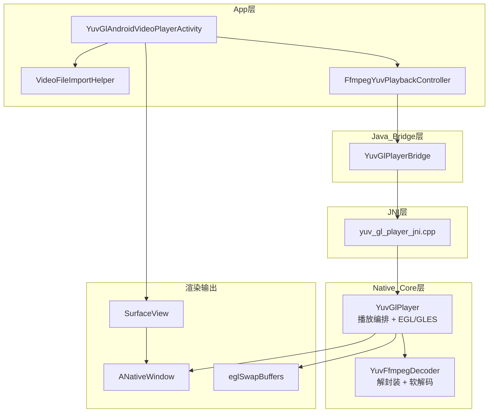

### 2.2 各层职责与文件

| 层级 | 文件 | 职责 |
|------|------|------|
| **App UI** | `YuvGlAndroidVideoPlayerActivity.java` | 文件选择、播放控制、生命周期、错误展示 |
| **App UI 布局** | `activity_yuv_gl_android_video_player.xml` | `SurfaceView` + 控制按钮 + 信息区 |
| **文件导入** | `VideoFileImportHelper.java` | `Uri → cache 本地文件`，获得稳定路径 |
| **播放控制器** | `FfmpegYuvPlaybackController.java` | 封装 `setDataSource → setSurface → prepare → play` 流程 |
| **Java Bridge** | `YuvGlPlayerBridge.java` | JNI 生命周期、`VideoInfo` 查询、`aar_live` so 加载 |
| **JNI** | `yuv_gl_player_jni.cpp` | `Surface → ANativeWindow`，native 指针绑定 |
| **播放编排** | `yuv_gl_player.cpp/.h` | EGL 上下文、YUV 纹理上传、Shader 渲染、PTS 同步 |
| **FFmpeg 解码** | `yuv_ffmpeg_decoder.cpp/.h` | `avformat/avcodec` 软解、`sws_scale` 格式归一化 |

### 2.3 Activity 核心调用链

`YuvGlAndroidVideoPlayerActivity` 本身**不直接碰 FFmpeg/OpenGL**，只负责 UI 与 `FfmpegYuvPlaybackController` 调度：

```java
// 选文件 → 后台导入 cache
File target = VideoFileImportHelper.importToCache(resolver, uri, cacheDir, "selected_android");

// 播放 → 传入 SurfaceView 的 Surface
playbackController.start(currentVideoFile, surfaceView.getHolder().getSurface(), listener);
```

`FfmpegYuvPlaybackController.start()` 内部顺序：

1. `new YuvGlPlayerBridge()`
2. `setDataSource(path)`
3. `setSurface(surface)` — JNI 转 `ANativeWindow`
4. `prepare()` — 打开 FFmpeg 解码器，可读宽高/FPS
5. `play()` — 启动 native 播放线程
6. 回调 `onVideoInfo(VideoInfo)`

### 2.4 Native 数据流（软解 + OpenGL）

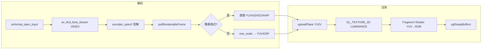

**直接支持的平面格式**（`YuvFfmpegDecoder::isPreferredYuv`）：

- `YUV420P` / `YUVJ420P`
- `YUV422P` / `YUVJ422P`
- `YUV444P` / `YUVJ444P`

其余格式经 `sws_getCachedContext + sws_scale` 转为 `YUV420P` 后统一走 GL Shader。

### 2.5 播放器状态机

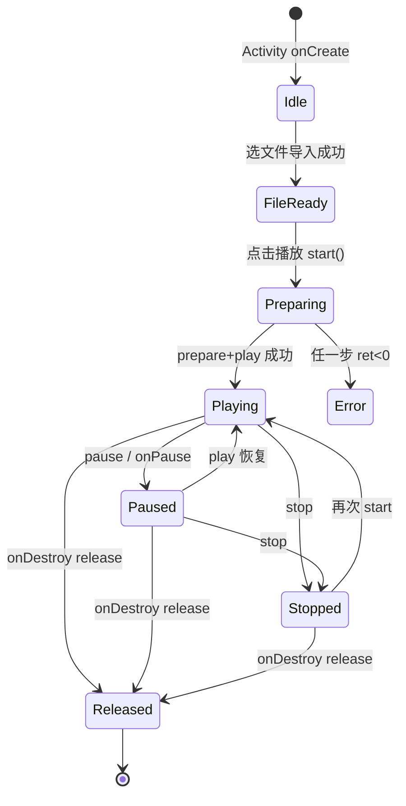

---

## 3. 活动图（当前已实现链路）

### 3.1 用户选文件到可播放

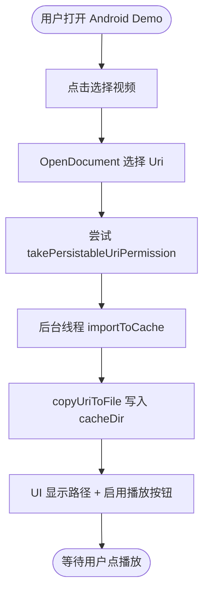

### 3.2 点击播放到首帧上屏

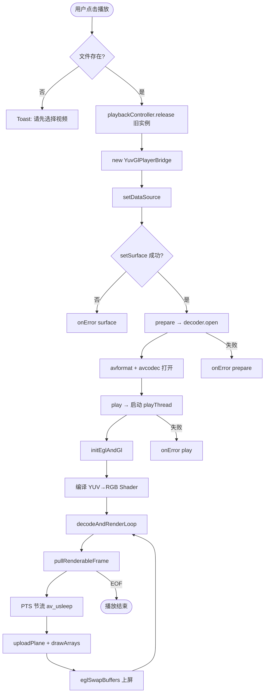

### 3.3 生命周期与资源释放

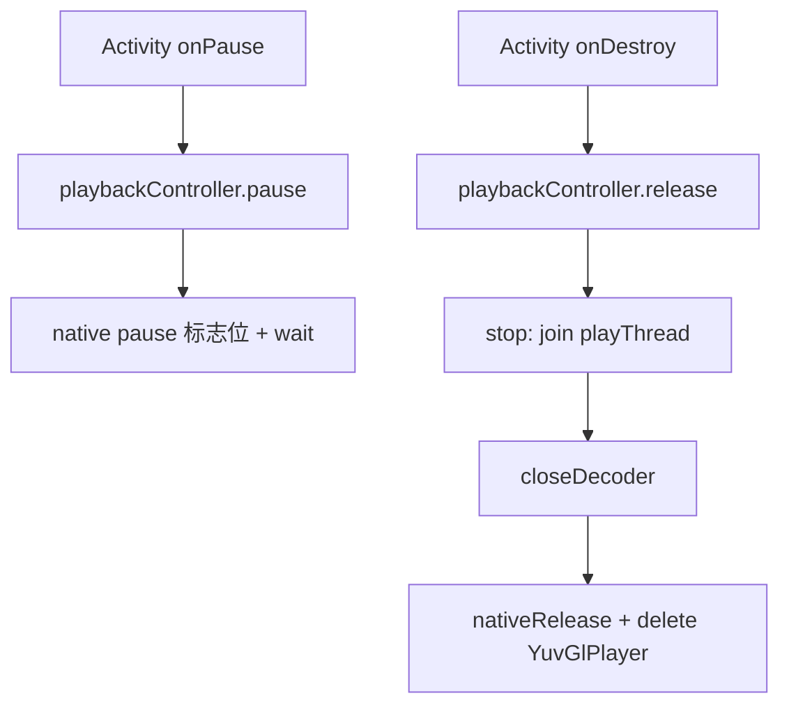

---

## 4. 目标架构：FFmpeg 预检 + 双路径播放框架

### 4.1 设计目标

在 RK3588 上实现 **「能硬解就硬解，不能硬解就软解 + OpenGL」** 的统一播放入口：

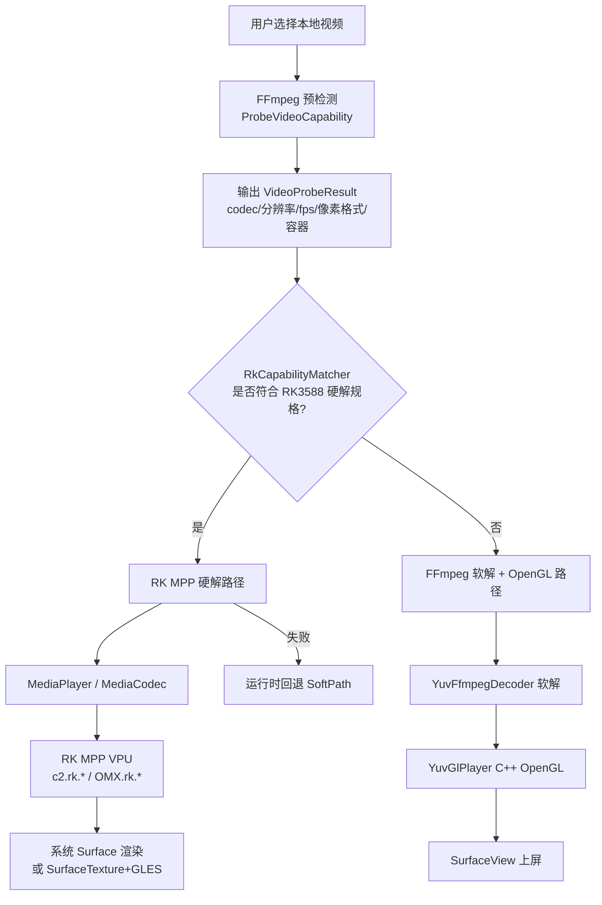

### 4.2 路径选择活动图（规划）

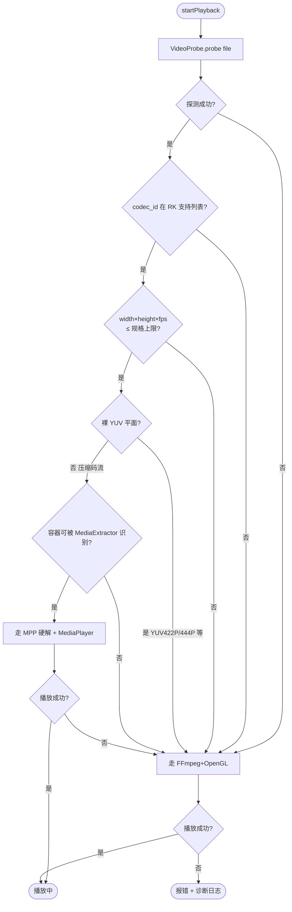

### 4.3 建议新增模块（待实现）

| 模块 | 建议路径 | 职责 |
|------|----------|------|
| `VideoProbe` | `app/.../media/VideoProbe.java` 或 native | FFmpeg `avformat_open_input` + `av_find_stream_info`，只读元数据不解码 |
| `Rk3588CapabilityTable` | `app/.../media/Rk3588CapabilityTable.java` | 固化 RK3588 规格书能力表（§5） |
| `RkCapabilityMatcher` | `app/.../media/RkCapabilityMatcher.java` | `VideoProbeResult` vs 能力表 → `HARD / SOFT` |
| `UnifiedPlaybackController` | `app/.../media/UnifiedPlaybackController.java` | 策略分发：硬解 / 软解 / 回退 |
| `RkMediaPlayerController` | `app/.../media/RkMediaPlayerController.java` | `MediaPlayer` 或 `MediaCodec` 硬解播放 |
| `FfmpegYuvPlaybackController` | 已有 | 软解 + OpenGL（当前 Android Demo 实际路径） |

### 4.4 硬解路径实现要点（MPP + MediaPlayer）

RK 平台上 Android 硬解栈分层（参考 [Radxa RK MPP 文档](https://docs.radxa.com/en/rock5/rock5b/other-os/android/app-development/mediacodec)）：

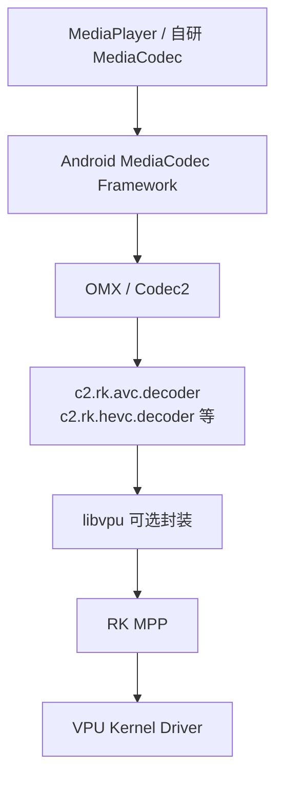

**实现注意：**

1. **MediaPlayer 路径（简单场景）**  
   - 适合标准 MP4/MKV + H.264/H.265/VP9 等 RK 已覆盖的压缩格式  
   - `setDataSource` → `prepare` → `start`，输出到 `SurfaceView`/`TextureView`  
   - 需确认固件未过滤 `c2.rk.*` 解码器（否则退化为软解或失败）

2. **MediaCodec 路径（可控场景）**  
   - `MediaExtractor` 选轨 → `MediaCodec.createDecoderByType(mime)`  
   - 优先按名称选择 `c2.rk.hevc.decoder` 等 RK 硬解实例  
   - 输出 `Surface` / `SurfaceTexture(OES)` + GLES20 自绘（可选）

3. **MPP 直连路径（高性能/特殊场景）**  
   - 需引入 `libmpp.so`、头文件、NDK 构建  
   - 解码输出 NV12 → `EGLImage` / `AHardwareBuffer` → GL 纹理  
   - 当前仓库**尚未接入** MPP 运行库（见 §8）

### 4.5 软解路径（已实现，作为兜底）

保持现有链路不变：

- `YuvFfmpegDecoder`：兼容 AVI、裸 YUV、非主流 codec
- `YuvGlPlayer`：三平面纹理 + BT.601 Shader + `eglSwapBuffers`
- CPU 占用较高，但**格式兼容性可控**

### 4.6 统一 API 草案

```java
public final class UnifiedPlaybackController {
    public enum PlaybackPath { RK_HARDWARE, FFMPEG_OPENGL, AUTO }

    public int start(File file, Surface surface, PlaybackPath path, Listener listener) {
        VideoProbeResult probe = VideoProbe.probe(file);
        PlaybackPath chosen = (path == PlaybackPath.AUTO)
                ? RkCapabilityMatcher.match(probe)
                : path;
        if (chosen == PlaybackPath.RK_HARDWARE) {
            int ret = rkController.start(file, surface, listener);
            if (ret >= 0) return ret;
            // 硬解失败自动回退
        }
        return ffmpegController.start(file, surface, listener);
    }
}
```

---

## 5. RK3588 多媒体硬解规格（规格书整理）

> 主要参考：Rockchip **RK3588 Datasheet**、Radxa **RK MPP Codec Specifications**（内容与 *RK3588 Multimedia Codec Benchmark v1.0* 同类指标表一致；该 PDF 多为 Rockchip 内部/厂商分发文档，公开网络上以 Datasheet + Radxa 文档交叉印证）。

### 5.1 视频解码能力总览

| 编码格式 | RK3588 上限规格 | 备注 |
|----------|-----------------|------|
| **H.264 (AVC)** | 8K@30fps (7680×4320)，Main10 L6.0 | 1080p 可达 ~280fps（JPEG 子系统并行语境下） |
| **H.265 (HEVC)** | 8K@60fps (7680×4320)，Main10 L6.1 | MPP 表：7680×4320@60f |
| **VP9** | 8K@60fps (7680×4320)，Profile0/2 L6.1 | |
| **AVS2** | 8K@60fps (7680×4320) | |
| **AV1** | 4K@60fps (3840×2160)，8/10bit Main L5.3 | 宽度需为 64 对齐（AFBC 场景） |
| **MPEG-1/2/4** | 1080p@60fps | |
| **H.263 / VP8 / VC-1** | 1080p@60fps | |
| **MJPEG / JPEG** | 解码最大 65536×65536；1080p@280fps | 支持 YUV400/411/420/422/440/444 |

### 5.2 硬解输出像素格式（VPU/MPP 侧）

RK3588 硬解**输出侧**典型为 **semi-planar / tiled**，而非 FFmpeg 软解的 **planar YUV422/YUV444**：

| 格式 | 说明 | 典型用途 |
|------|------|----------|
| **NV12** | Y + 交错 UV，8bit | H.264/H.265/VP9 硬解默认输出 |
| **NV15_4L4 / NV12_4L4** | 4x4 tiled NV12 变体 | AV1 等高性能路径 |
| **P010** | 10bit semi-planar | HEVC/AV1 10bit |
| **NV16 / NV20** | 422/更高位宽 semi-planar | VDPU381 H.264 扩展 |

**关键结论：** 若源视频是 **未压缩的 YUV422P/YUV444P 平面帧**（常见于特殊 AVI），**不在 RK MPP 硬解覆盖范围**，预检应直接走 FFmpeg 软解 + OpenGL。

### 5.3 视频编码能力（参考）

| 格式 | RK3588 上限 |
|------|-------------|
| H.264 | 8K@30fps |
| H.265 | 8K@30fps |
| VP8 | 1080p@30fps |
| JPEG | 4K@30fps |

### 5.4 FFmpeg 预检 → 硬解匹配规则（建议表）

| 探测字段 | 走硬解条件 | 走软解条件 |
|----------|------------|------------|
| `codec_id` | H.264/H.265/VP9/VP8/MPEG4/AV1 等且在 §5.1 表内 | 未知 codec、裸 YUV、未压缩格式 |
| `width × height` | 不超过对应格式上限（如 AV1 ≤ 3840×2160） | 超规格、奇数宽高不符合对齐 |
| `fps` | 不超过规格书 fps 上限 | 超高帧率 |
| `pix_fmt`（若已暴露） | 压缩码流（无裸平面） | `yuv422p`/`yuv444p` 等平面像素 |
| 容器 | MP4/MKV/TS 等 `MediaExtractor` 可识别 | AVI 仅识别音频轨、特殊封装 |

### 5.5 Android MediaCodec 解码器命名（RK 硬解）

在 RK 固件上应确认选中如下 Codec2 组件（而非 `c2.android.*` 软解）：

- `c2.rk.avc.decoder` — H.264
- `c2.rk.hevc.decoder` — H.265
- `c2.rk.vp9.decoder` — VP9
- 旧平台可能为 `OMX.rk.*` 前缀

---

## 6. 时序图

### 6.1 当前实现（FFmpeg + C++ OpenGL）

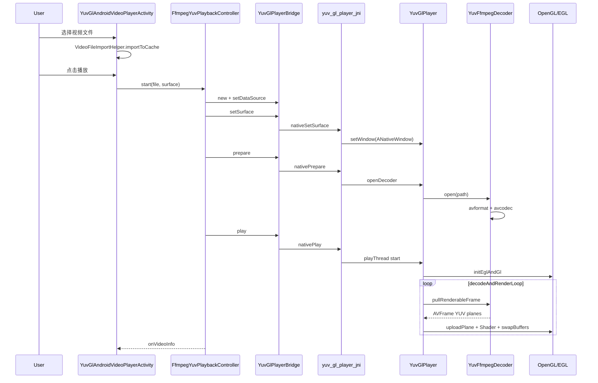

### 6.2 目标实现（预检 + 双路径）

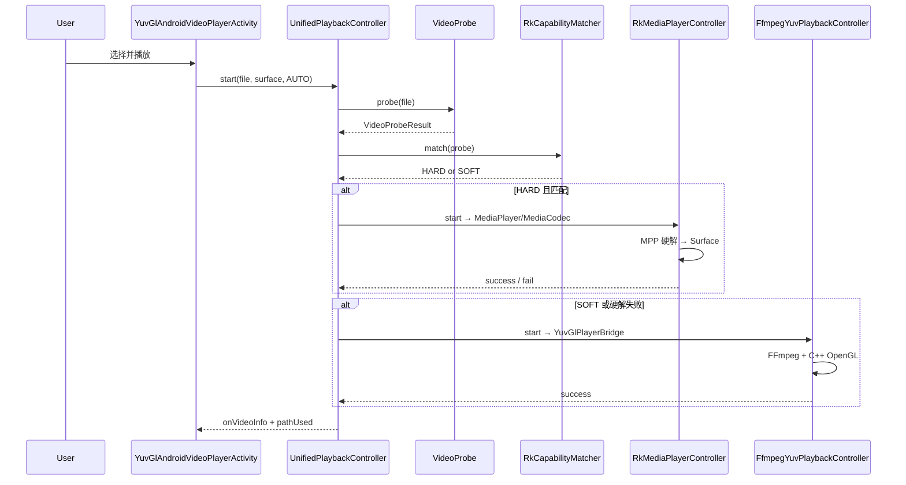

---

## 7. 与 C++ Demo 的差异

| 项目 | `YuvGlVideoPlayerActivity` (C++) | `YuvGlAndroidVideoPlayerActivity` (Android) |
|------|----------------------------------|---------------------------------------------|
| 播放内核 | 相同：`FfmpegYuvPlaybackController` | 相同 |
| cache 前缀 | `selected_cpp` | `selected_android` |
| 定位 | C++ native 链路验证 | Android 入口 + 未来硬解策略实验台 |
| 布局 ID | `svYuvPlayer` | `svYuvAndroidPlayer` |
| 标题文案 | `YUV OpenGL 播放 (C++)` | `YUV OpenGL 播放 (Android入口, FFmpeg回退)` |

两者当前**播放能力完全一致**；Android 入口的价值在于后续接入 `UnifiedPlaybackController` 而不改动 C++ 参考实现。

---

## 8. 历史失败复盘：MediaCodec 专线

曾尝试在 Android 入口实现 `MediaExtractor + MediaCodec + GLES20`，实测同一 AVI 素材失败：

```text
extractor tracks: trackCount=1, [{mime=audio/mpeg, file-format=video/avi}]
decodeLoop failed: 未找到视频轨道
```

| 链路 | 结果 |
|------|------|
| FFmpeg + C++ OpenGL | ✅ 可播 |
| MediaExtractor + MediaCodec | ❌ 无视频轨 |

**结论：** 该素材在系统解封装层无法建立视频解码通道，因此 Android Demo 回退到 FFmpeg 软解路径。这也印证了 §4 中「预检 → 不符合走软解」的必要性。

### 8.1 MPP 直连尚未落地的原因

- 无 `libmpp` 运行库与头文件
- 无 MPP → `EGLImage`/纹理 的渲染通路
- 无 CMake/Gradle 依赖接入与 ABI 验证

---

## 9. 实施路线图

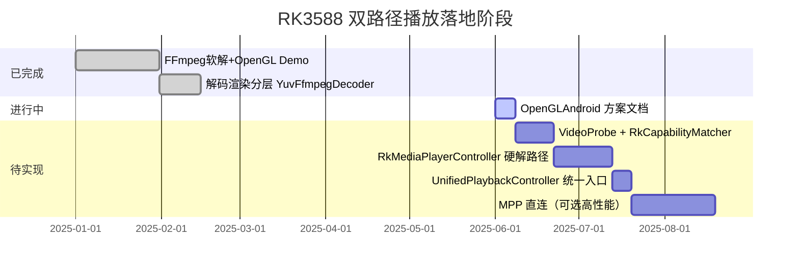

### 阶段任务清单

| 阶段 | 任务 | 产出 |
|------|------|------|
| **P0（已完成）** | `YuvGlAndroidVideoPlayerActivity` + `FfmpegYuvPlaybackController` | 可播 AVI/YUV 兜底链路 |
| **P1** | `VideoProbe`：FFmpeg 只读探测 | `VideoProbeResult` 结构体 |
| **P2** | `Rk3588CapabilityTable` + `RkCapabilityMatcher` | 规格表驱动的 HARD/SOFT 决策 |
| **P3** | `RkMediaPlayerController` | 标准压缩格式走 MediaPlayer/MPP |
| **P4** | `UnifiedPlaybackController` + Activity 改造 | 单入口自动选路 + 硬解失败回退 |
| **P5（可选）** | MPP NDK 直连 + NV12 GL 着色器 | 绕过 MediaExtractor 限制的特殊场景 |

---

## 10. 关键代码索引

### 10.1 Activity 播放入口

```82:106:demo/flutter/flutteraar/app/src/main/java/com/example/flutteraar/ui/activity/YuvGlAndroidVideoPlayerActivity.java
    private void startPlayback() {
        if (currentVideoFile == null || !currentVideoFile.exists()) {
            Toast.makeText(this, "请先选择视频文件", Toast.LENGTH_SHORT).show();
            return;
        }
        int ret = playbackController.start(
                currentVideoFile,
                surfaceView.getHolder().getSurface(),
                new FfmpegYuvPlaybackController.Listener() {
                    @Override
                    public void onVideoInfo(com.demo.aarlib.live.yuv.YuvGlPlayerBridge.VideoInfo info) {
                        tvVideoInfo.setText("视频信息: " + info.toString());
                    }
                    // ...
                });
        // ...
    }
```

### 10.2 播放控制器

```19:59:demo/flutter/flutteraar/app/src/main/java/com/example/flutteraar/media/FfmpegYuvPlaybackController.java
    public int start(File videoFile, Surface surface, Listener listener) {
        // ...
        playerBridge = new YuvGlPlayerBridge();
        int ret = playerBridge.setDataSource(videoFile.getAbsolutePath());
        ret = playerBridge.setSurface(surface);
        ret = playerBridge.prepare();
        ret = playerBridge.play();
        if (listener != null) {
            listener.onVideoInfo(playerBridge.getVideoInfo());
        }
        return 0;
    }
```

### 10.3 Native 播放线程

```185:198:demo/flutter/flutteraar/aarlib/src/main/cpp/player/yuv_gl_player.cpp
    playThread_ = std::thread([this]() {
        int ret = initEglAndGl();
        if (ret >= 0) {
            ret = decodeAndRenderLoop();
        }
        releaseEglAndGl();
        // ...
    });
```

### 10.4 像素格式归一化

```254:261:demo/flutter/flutteraar/aarlib/src/main/cpp/player/yuv_ffmpeg_decoder.cpp
int YuvFfmpegDecoder::convertToRenderableFormat(AVFrame *srcFrame, AVFrame **outFrame, FrameFormat *outFormat) {
    FrameFormat preferredFormat;
    if (isPreferredYuv(static_cast<AVPixelFormat>(srcFrame->format), &preferredFormat)) {
        *outFrame = srcFrame;
        *outFormat = preferredFormat;
        // ...
    }
    // 否则 sws_scale → YUV420P
}
```

---

## 11. 参考资料

- [Radxa RK MPP / MediaCodec 规格](https://docs.radxa.com/en/rock5/rock5b/other-os/android/app-development/mediacodec)
- [Rockchip RK3588 Datasheet](https://rockchips.net/wp-content/uploads/2025/03/Rockchip-RK3588-Datasheet-V1.9-20241212.pdf) — Video CODEC 章节
- RK3588 AV1 内核驱动说明（NV12/P010 输出格式）：[LWN — AV1 stateless decoder for RK3588](https://lwn.net/Articles/930790/)
- 仓库姊妹文档：[`cursor/media/OpenGL.md`](./OpenGL.md)

---

## 12. 一句话总结

**当前**：`YuvGlAndroidVideoPlayerActivity` 是 Android 侧入口，实际走 **FFmpeg 软解 + C++ OpenGL** 保证 AVI/YUV 可播。  
**目标**：用 **FFmpeg 预检** 对照 **RK3588 MPP 规格表** 自动选择 **MPP 硬解 + MediaPlayer** 或 **FFmpeg 软解 + OpenGL**，硬解失败时无缝回退，在 RK3588 上同时拿到性能与兼容性。
