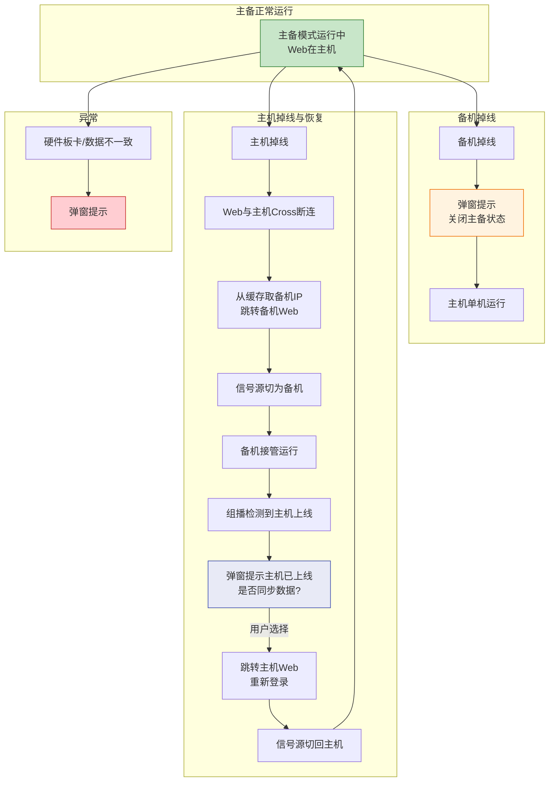
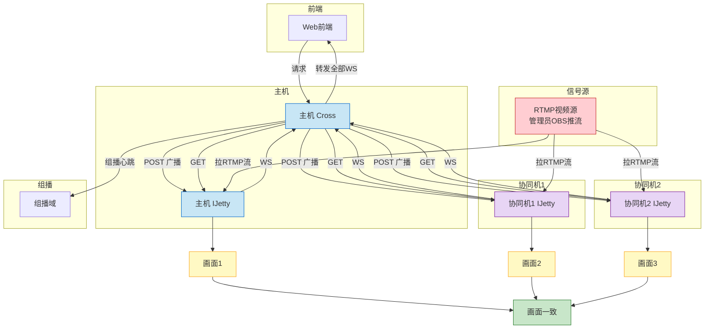
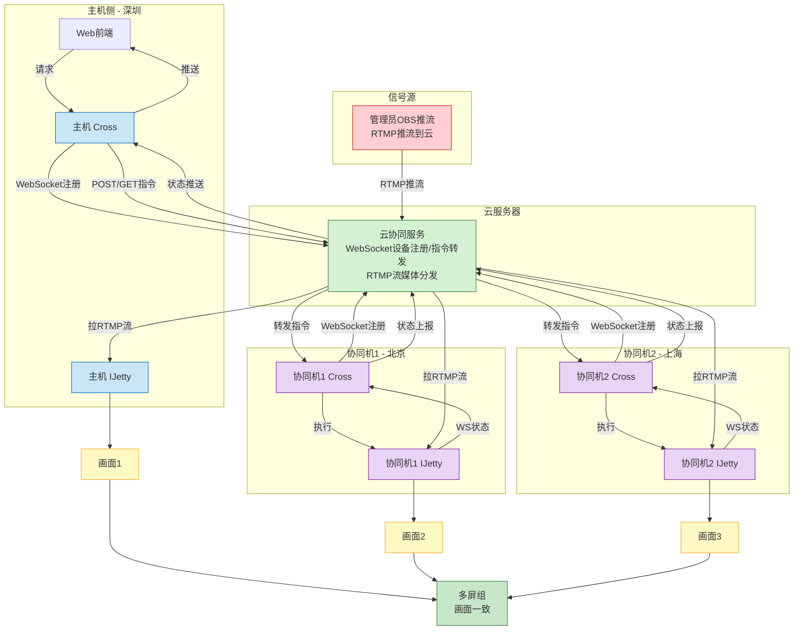
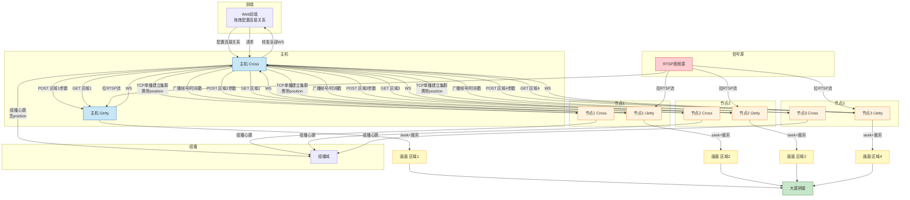
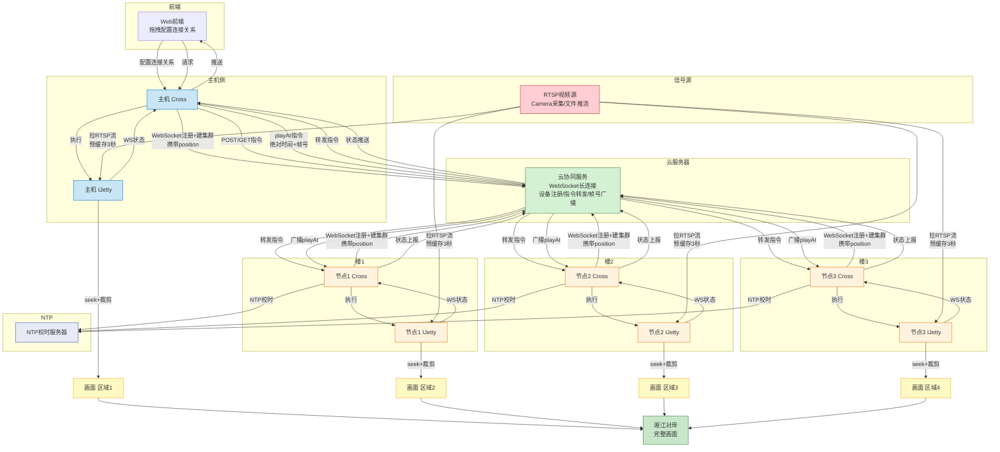

# 基本功能

## 双机备份

主备配置必须完全一致；

* 画面源：单屏幕，数据源为主机

* 系统鲁棒性
    - 备机掉线：弹窗提示并关闭主备状态，重新登录。
    - 主机掉线：主机的Web（eg：192.168.1.10）页面与主机的Cross长连接通讯丢失，从缓存获取到缓存的双机备份组，拿到备机IP（eg：192.168.1.11）并跳转到备机Web页面。
      同时屏幕的信号源也切换为备机的信号源。
      如果组播检测到主机上线则切回主备模式，切回主机Web（192.168.1.10）

* 异常情况：
    - 主备机硬件板卡布局，数据不一致：弹窗提示

活动图：

## 多机协同
主机和协同组的配置不必要一致。

* 画面源：多屏组，数据源为协同组所有机器
* 画面职责：协同组画面一致

* 多机协同方案：

  - 局域网方案：
    - 基于UDP组播发现设备
    - 主机通过TCP Socket单播建立协同组
    - 指令通过HTTP转发，WS长连接推送状态
    - 适用场景：同一局域网内多台设备

  - 云上方案：
    - 基于云服务器中转，解决跨网段远距离协同
    - 设备通过WebSocket长连接注册到云服务器
    - 主机指令经云服务器转发到各协同机
    - 适用场景：异地多屏，无法组建局域网

* 流媒体传输：
  - 实时直播场景：管理员通过OBS/FFmpeg推送RTMP流到云服务器
  - 各协同机从云服务器拉取同一路RTMP流播放
  - 画面大致同步，无需帧级精确对齐
  - 控制指令（切换源、音量等）通过Cross的WS长连接下发
  - RTMP优势：推流生态成熟，OBS/FFmpeg直接可用，延迟1-3秒

本地局域网活动图：

云上活动图：

## 分布式集群

主机和分布式集群配置无需一致。

* 画面源：多屏组，数据源为分布式集群所有机器。
* 画面职责：各设备负责大屏不同区域，需配置连接关系（主机Web通过拖拽的方式配置）。
* 建立方式：主机通过TCP Socket单播/云WebSocket向各节点发起建立请求，
  请求中携带该节点在大屏的position信息。
* 位置配置：组播心跳/云注册信息中deviceGroup扩展position字段，
  描述每台设备在大屏的行列位置。
* 指令分发：主机根据各节点position下发不同区域画面参数。

* 部署方案：
  - 局域网方案：同一机房/展厅，交换机直连，低延迟
  - 云上方案：跨楼宇/跨江，每栋楼RK设备通过4G/5G/光纤注册到云服务器

* 云上分布式集群：
  - 各节点通过WebSocket长连接注册到云服务器
  - 主机通过云服务器下发position + 同步指令
  - 各节点独立拉流 → 按position裁剪 → HDMI输出LED屏

* 流媒体传输：
  - 信号源：
    - 单一信号源：所有节点拉取同一路视频流（RTSP/HLS）
    - 多信号源：各节点根据配置拉取不同视频流（RTSP/HLS）
  - 主机通过云服务器广播当前播放帧号/时间戳
  - 各节点seek到对应帧后裁剪输出，保证拼接后画面完整同步
  - 帧同步方案：
    - 各节点NTP校时，保证时间基准一致
    - 主机下发playAt指令（绝对时间+帧号）
    - 各节点提前缓存2-3秒视频帧，按playAt时间点统一播放

* 画面裁剪：
  - 节点根据layout.rows/cols和自身position计算裁剪区域
  - 裁剪后缩放至HDMI输出分辨率

  
局域网方案活动图

云上方案活动图

