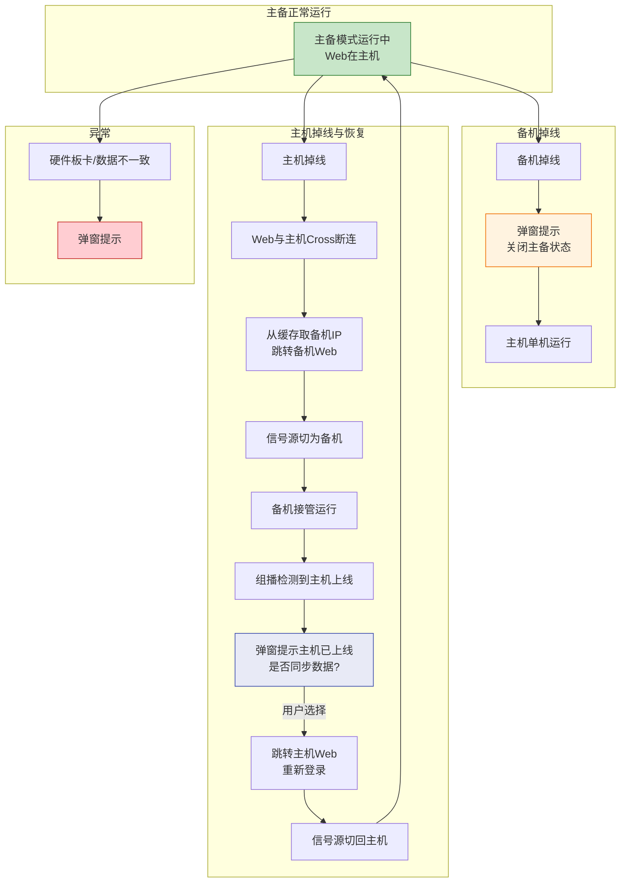
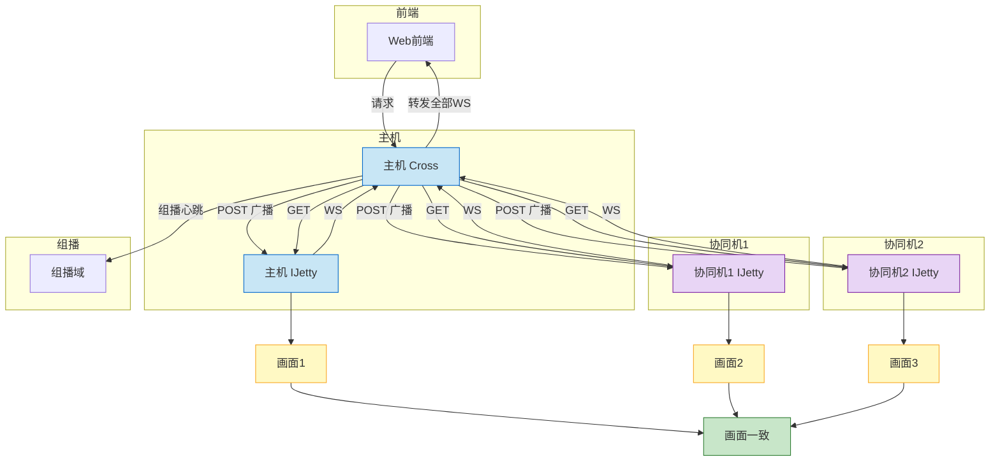
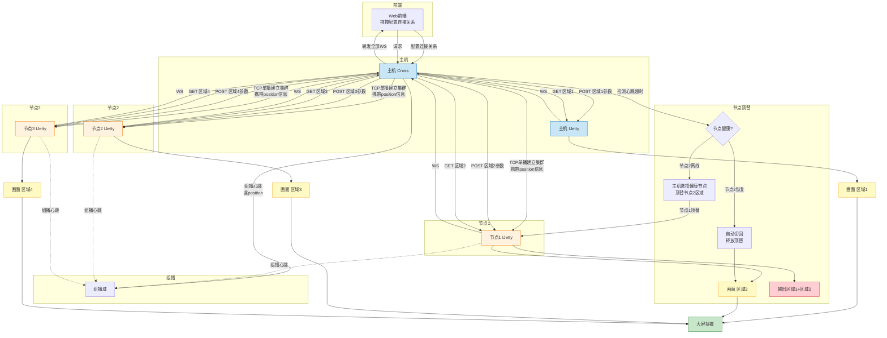

# 基本功能

## 双机备份

主备配置必须完全一致；

* 画面源：单屏幕，数据源为主机

* 系统鲁棒性
    - 备机掉线：弹窗提示并关闭主备状态，重新登录。
    - 主机掉线：主机的Web（eg：192.168.1.10）页面与主机的Cross长连接通讯丢失，从缓存获取到缓存的双机备份组，拿到备机IP（eg：192.168.1.11）并跳转到备机Web页面。
      同时屏幕的信号源也切换为备机的信号源。
      如果组播检测到主机上线则切回主备模式，切回主机Web（192.168.1.10）

* 异常情况：
    - 主备机硬件板卡布局，数据不一致：弹窗提示

活动图：

## 多机协同
主机和协同组的配置不必要一致。

* 画面源：多屏组，数据源为协同组所有机器
* 画面职责：协同组画面一致

## 分布式集群

主机和分布式集群配置无需一致。

* 画面源：多屏组，数据源为分布式集群所有机器。
* 画面职责：各设备负责大屏不同区域，需配置连接关系（主机Web通过拖拽的方式配置）。
* 建立方式：主机通过TCP Socket单播向各节点发起建立请求，
  请求中携带该节点在大屏的position信息。
* 位置配置：组播心跳deviceGroup中扩展position字段，
  描述每台设备在大屏的行列位置。
* 指令分发：主机根据各节点position下发不同区域画面参数。

* 节点健康检测：
    - 心跳超时判定节点不健康（复用现有3秒/10秒/3次重试逻辑）

* 节点顶替：
    - 节点离线后，主机选择集群内其他健康节点顶替
    - 顶替节点接管离线节点的画面区域，同时输出原区域 + 顶替区域

