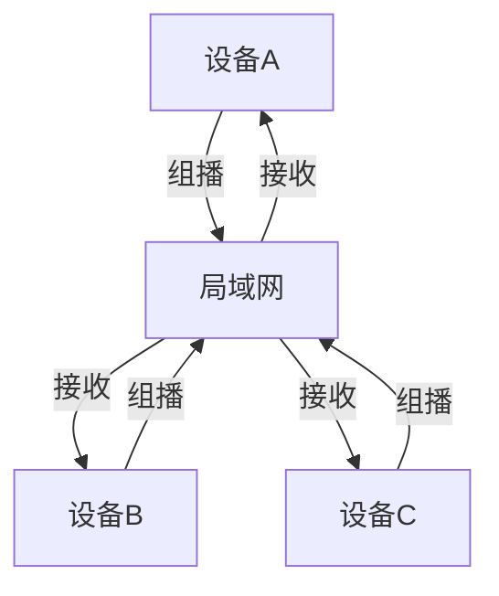
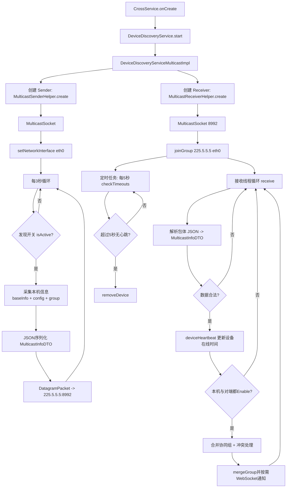
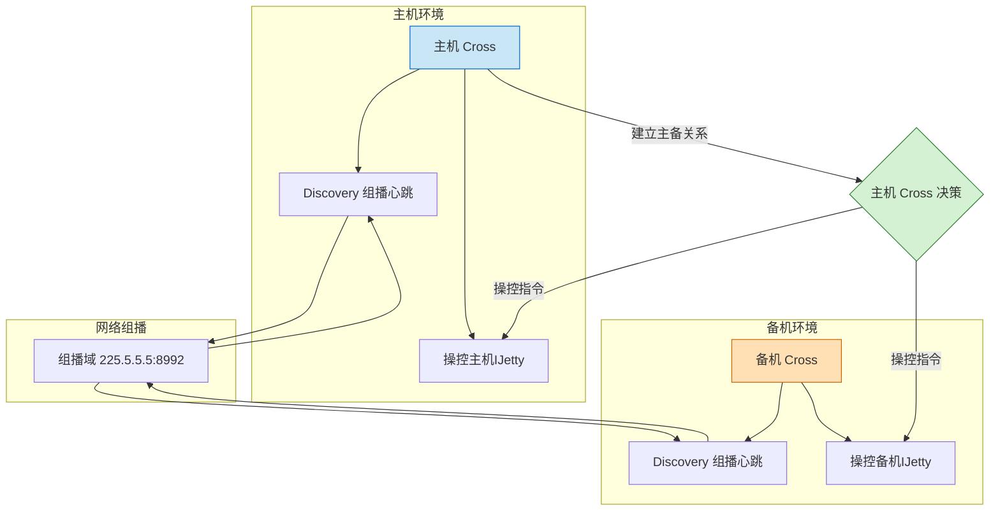

# Cross功能


## 局域网设备发现

基于UDP组播的设备发现

组播（Multicast）是一种网络通信技术，一个发送者向多个接收者发送相同的数据包，而不需要为每个接收者单独发送。

### 基本流程
Cross采用的是 对等发现模式

3秒心跳：每台设备 都会定期（每3秒）发送组播心跳包。
5秒超时：5秒没收到心跳包则认为设备离线。
UI展示：收到的数据会被Cross收集并交给Web展示在前端页面List中。

组播数据结构：
核心基本信息：ip，mac地址，主备角色
核心配置信息：ip，端口号，组播地址，组播端口
设备组信息：组ID，组名称，组类型，组创建时间，组设备列表
```json
{
    "basicInfo": {
        "ip": "192.168.1.100",
        "mac": "00:11:22:33:44:55",
        "name": "Device-001",
        "version": "V1.3.2",
        "isBackupDevice": false,
        "boardType": "CLT-1000"
    },
    "configInfo": {
      "enable": true,
      "ip": "192.168.1.100",
      "port": 8080,
      "multicastAddress": "224.0.0.1",
      "multicastPort": 5000,
      "syncParamHash": "1234567890abcdef"
    },
    "deviceGroup": {
      "id": "group-123",
      "name": "Production Line A",
      "type": "primary_backup",
      "createTime": 1620000000000,
      "deviceArr": [
        {
          "ip": "192.168.1.100",
          "mac": "00:11:22:33:44:55",
          "name": "Device-001",
          "role": "primary"
        },
        {
          "ip": "192.168.1.101",
          "mac": "00:11:22:33:44:56",
          "name": "Device-002",
          "role": "backup"
        }
      ]
    }
}
```


组播活动图：


组播技术依托与核心代码
[discovery.md](discovery/discovery.md)


## 双机备份

建立之前两台设备的硬件环境和软件版本必须全部一致。

OKHttp实现消息转发

### 建立双机备份之后的逻辑


### 保证主备数据一致
* 设置的Post请求同时发送给主机和备机。
* 获取的Get请求只发给主机，从主机获取数据。

### 同步参数
* 使用设备的备份功能，生成同步参数文件。

### 主备机参数一致判断
* 同步参数之后底层的RK给出当前设备文件参数的Hash值，心跳请求的时候比对两个设备的参数Hash值。


### 长连WS接转发
* 建立主备关系之后Web取消直接跟IJetty进行WS通信，而是与Cross进行通信。
* Cross作为WSClient接收IJetty的长连接消息
* Cross作为WSServer向Web转发长连接消息
* 意图：进度等信息需要等待主机和备机同时完成，有些进度需要合并，有些进度需要分别展示。
* 大部分更新消息取自主机的IJetty，屏蔽备机IJetty的上推。

### 异常情况
* 主备机数据不一致：弹窗提示
* 备机掉线：弹窗提示并关闭主备状态，重新登录
* 主机掉线：Web页面与主机的Cross长连接通讯丢失，从缓存获取到缓存的双机备份组，拿到备机IP并跳转到备机Web页面。


## 多机协同

建立多机协同的设备不需要硬件和软件一致，如果主机执行操作，备机失败，直接不执行并报错就好。

* 主设备执行操作，发送POST给协同组，让协同组做同样的操作
* 主设备获取GET请求，要异步从所有协同组获取数据，并组成分布式数据给Web前端，主Cross只等待备机3秒，超时则在Web页面显示超时。
