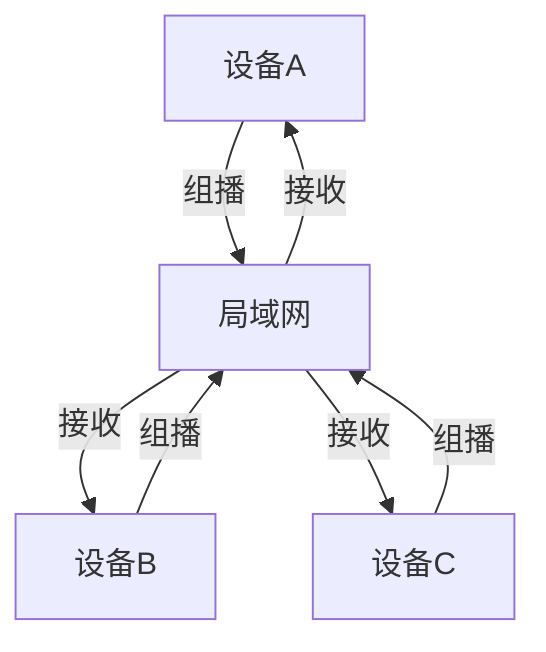
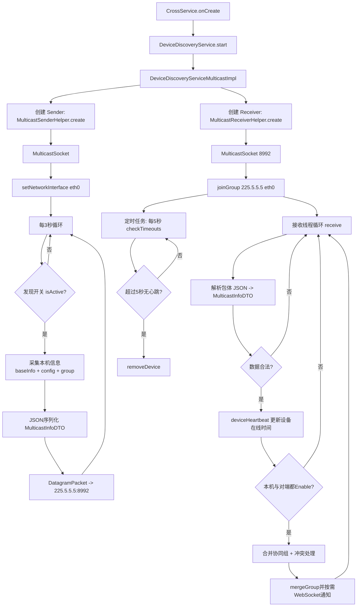
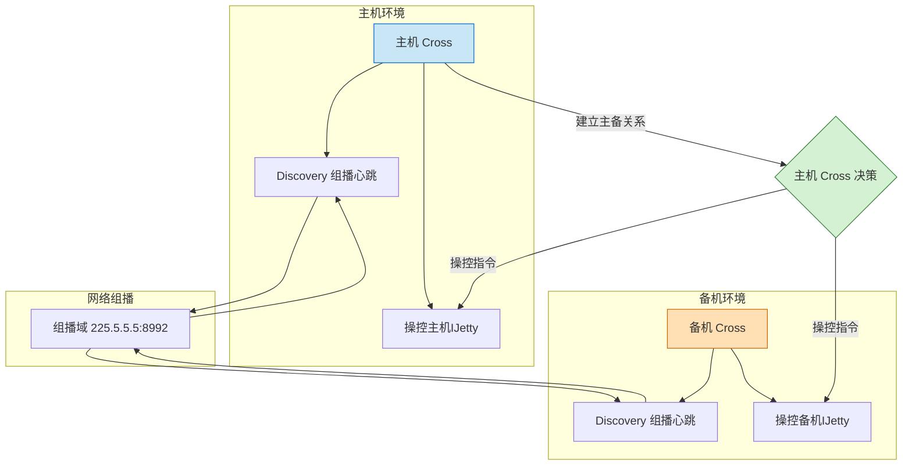

# Cross功能


## 设计

双机备份：两台设备配置，数据完全一致，主机挂掉备机顶上。
多机协同：多态设备配置不一致，数据可以不一致，所有设备执行主机的操作，失败则抛异常。
分布式集群：多设备组成设备集群，每个这杯负责不同的画面，整体组成一个大画面集群。

### 1. 局域网发现
采用UDP组播进行局域网发现
在启用**多机协同**功能之后，本设备的Cross开始发送组播。
局域网内全部的设备开启**多机协同**功能之后，设备会发送和接收组播。
3秒心跳发送，5秒超时删除。
Cross会收集信息主动上推展示在对应的web上。

### 2. 建立双机备份/协同组/集群
一个设备的Cross向另一个设备的Cross发送原生Java的**TCP Socket**单播请求建立主备关系的请求。
建立主备关系成功之后两者的组播配置变化，其他设备看到两台设备是建立好协同关系的。
超时逻辑：
 - 心跳间隔：3
 - 心跳超时：10
 - 心跳重试次数：3
心跳只要3秒中没收到就会标注设备延迟，并提示用户。
然后如果10秒都收不到心跳才会提示用户设备离线。
然后充实3次还是无法重连就提示用户设备异常。
心跳发送和检测都是用的是定时线程池而不是线程sleep。
写入和读取超时也会提示用户设备延迟高。

### 3. 数据同步
数据同步检测：同时请求双机的IJetty的接口，IJetty请求RK提供的参数配置文件的当前Hash值。
Cross比对两者的Hash值，如果一样就提示设备数据一致。不一样则提示主备数据不一致，需要进行数据同步。
同步方法，利用RK提供的备份数据功能，主机Cross将本机的数据导出为备份文件，
导出成功之后通知备机进行参数同步并告知备机的Cross文件路径进行下载。
备机下载成功同步文件之后调用RK的导入备份文件，并上推当前状态。链路执行完成则提示数据同步完成。

### 4. 数据同步机制

#### 双机备份
1. POST请求同时发送给主机和备机，需要同步等待主备机都回复相同的成功结果，否则报错提示主备不一致。
2. GET请求只从主机获取。
3. WS长连接：接收主备的WS，但是只向前端转发主机的WS

#### 多机协同
1. POST请求同时发送给协同组，无需检查。
2. GET请求从所有设备获取。
3. WS长连接：接收并转发所有设备的WS

#### 分布式集群
1. POST请求按照不同的参数分别发送给不同的设备，需要异步上推结果，在Web页面展示哪个设备完成了。
2. GET请求分别从不同的设备获取，异步收集并展示在前端Web。
3. 接收并转发所有设备的WS。

#### WS长连接介绍
进度等信息需要等待主机和备机同时完成，有些进度需要合并，有些进度需要分别展示。

### 5. 双机备份
主备配置必须完全一致；

* 画面源：单屏幕，数据源为主机

* 系统鲁棒性
  - 备机掉线：弹窗提示并关闭主备状态，重新登录。
  - 主机掉线：Web页面与主机的Cross长连接通讯丢失，从缓存获取到缓存的双机备份组，拿到备机IP并跳转到备机Web页面。
            同时屏幕的信号源也切换为备机的信号源。

* 异常情况：
  - 主备机硬件板卡布局，数据不一致：弹窗提示


### 6. 多机协同
主机和协同组的配置不必要一致。

* 画面源：多屏组，数据源为协同组所有机器
* 画面职责：协同组画面一致


### 7. 分布式集群
主机和分布式集群配置无需一致。

* 画面源：多屏组，数据源为分布式集群所有机器。
* 画面职责：分布式集群各个设备负责大屏各个区域的画面；需要配置配置连接关系。


## 局域网设备发现

基于UDP组播的设备发现

组播（Multicast）是一种网络通信技术，一个发送者向多个接收者发送相同的数据包，而不需要为每个接收者单独发送。

### 基本流程
Cross采用的是 对等发现模式

3秒心跳：每台设备 都会定期（每3秒）发送组播心跳包。
5秒超时：5秒没收到心跳包则认为设备离线。
UI展示：收到的数据会被Cross收集并交给Web展示在前端页面List中。

组播数据结构：
核心基本信息：ip，mac地址，主备角色
核心配置信息：ip，端口号，组播地址，组播端口
设备组信息：组ID，组名称，组类型，组创建时间，组设备列表
```json
{
    "basicInfo": {
        "ip": "192.168.1.100",
        "mac": "00:11:22:33:44:55",
        "name": "Device-001",
        "version": "V1.3.2",
        "isBackupDevice": false,
        "boardType": "CLT-1000"
    },
    "configInfo": {
      "enable": true,
      "ip": "192.168.1.100",
      "port": 8080,
      "multicastAddress": "224.0.0.1",
      "multicastPort": 5000,
      "syncParamHash": "1234567890abcdef"
    },
    "deviceGroup": {
      "id": "group-123",
      "name": "Production Line A",
      "type": "primary_backup",
      "createTime": 1620000000000,
      "deviceArr": [
        {
          "ip": "192.168.1.100",
          "mac": "00:11:22:33:44:55",
          "name": "Device-001",
          "role": "primary"
        },
        {
          "ip": "192.168.1.101",
          "mac": "00:11:22:33:44:56",
          "name": "Device-002",
          "role": "backup"
        }
      ]
    }
}
```


组播活动图：


组播技术依托与核心代码
[discovery.md](discovery/discovery.md)


## 双机备份

建立之前两台设备的硬件环境和软件版本必须全部一致。

OKHttp实现消息转发

### 建立双机备份之后的逻辑

