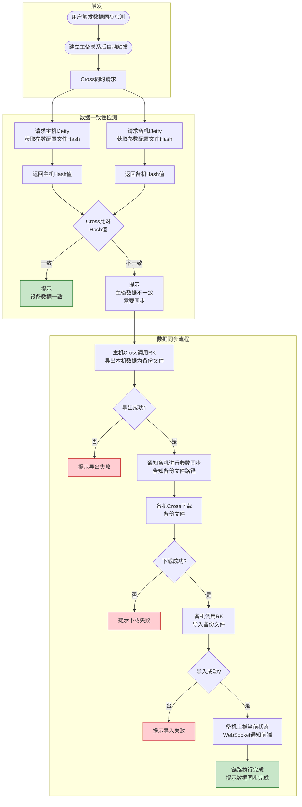
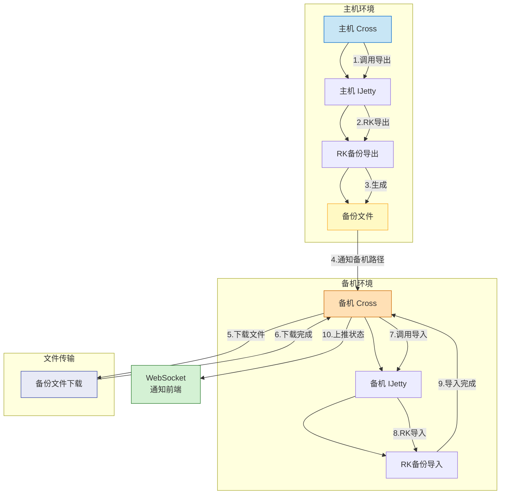

# 数据同步

## 设计方案

数据同步检测：同时请求双机的IJetty的接口，IJetty请求RK提供的参数配置文件的当前Hash值。
Cross比对两者的Hash值，如果一样就提示设备数据一致。不一样则提示主备数据不一致，需要进行数据同步。
同步方法，利用RK提供的备份数据功能，主机Cross将本机的数据导出为备份文件，
导出成功之后通知备机进行参数同步并告知备机的Cross文件路径进行下载。
备机下载成功同步文件之后调用RK的导入备份文件，并上推当前状态。链路执行完成则提示数据同步完成。

活动图

实例图

