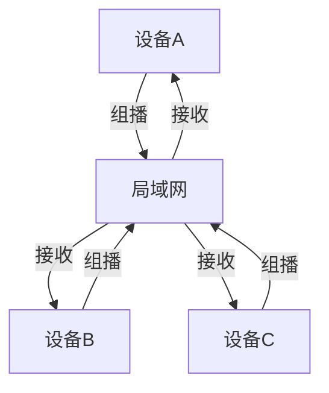
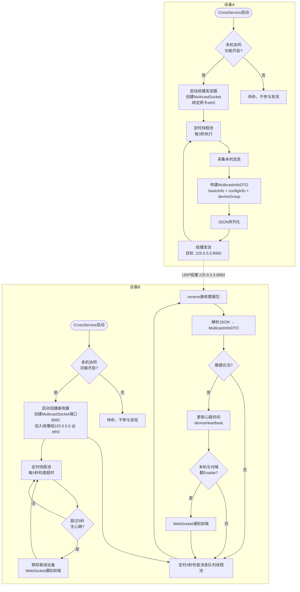
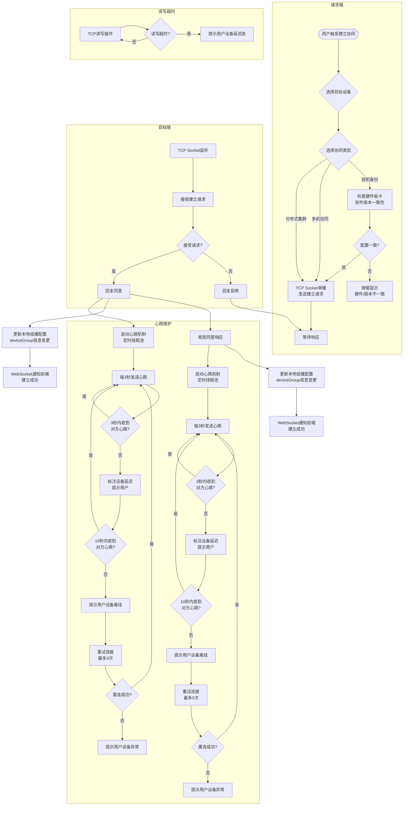
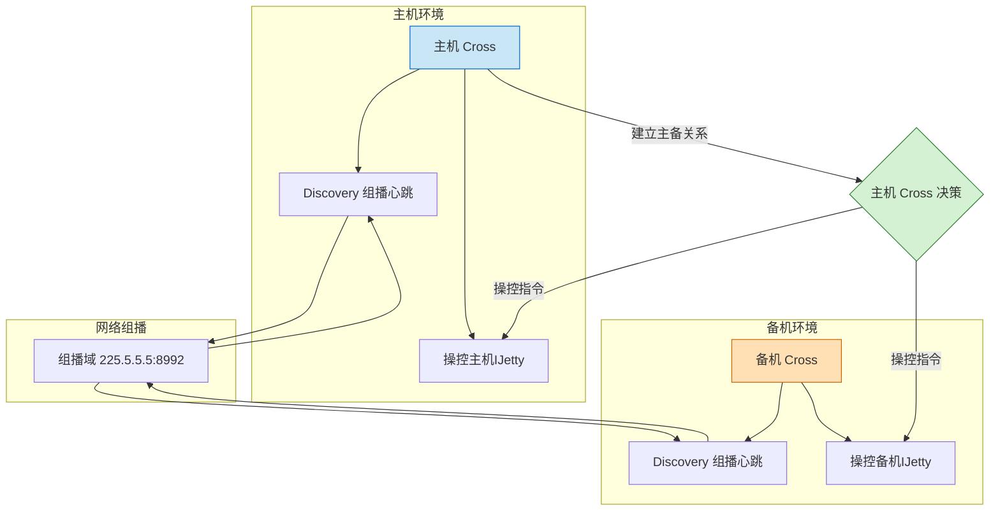
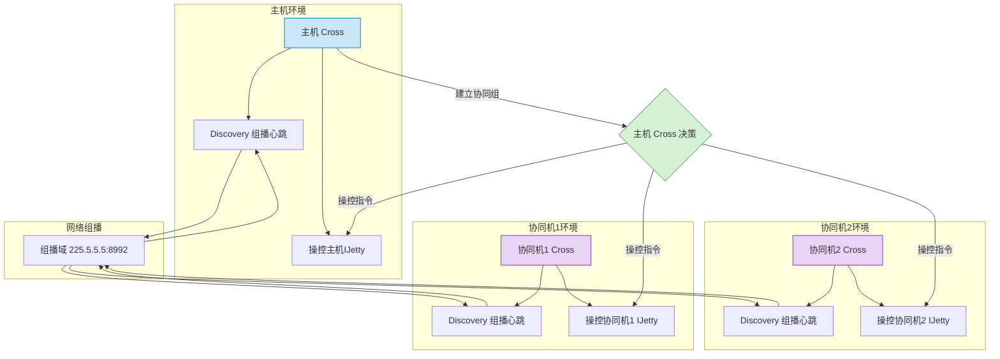
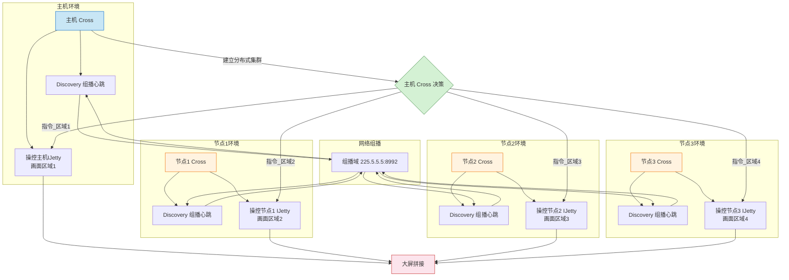

# Cross 组播发现


## 设计方案


### Discovery

采用UDP组播进行局域网发现
在启用**多机协同**功能之后，本设备的Cross开始发送组播。
局域网内全部的设备开启**多机协同**功能之后，设备会发送和接收组播。
3秒心跳发送，5秒超时删除。
Cross会收集信息主动上推展示在对应的web上。

组播对等发现实例图


组播活动图


### Connect

一个设备的Cross向另一个设备的Cross发送原生Java的**TCP Socket**单播请求建立主备关系的请求。
建立主备关系成功之后两者的组播配置变化，其他设备看到两台设备是建立好协同关系的。
超时逻辑：
- 心跳间隔：3
- 心跳超时：10
- 心跳重试次数：3
  心跳只要3秒中没收到就会标注设备延迟，并提示用户。
  然后如果10秒都收不到心跳才会提示用户设备离线。
  然后充实3次还是无法重连就提示用户设备异常。
  心跳发送和检测都是用的是定时线程池而不是线程sleep。
  写入和读取超时也会提示用户设备延迟高。




双机备份


协同组



分布式集群




## 技术依托

组播相关计算机网络知识参考：[计算机网络.md](../../../knowledge/计算机网络.md)

组播技术依托:
* MulticastSocket: Java提供的专门用于组播通信的Socket类
    - 创建组播Socket实例
    - 加入组播组
    - 发送组播数据包
    - 接收组播数据包
```java
// 创建组播Socket
MulticastSocket ms = new MulticastSocket();

// 加入组播组
ms.joinGroup(groupAddress, networkInterface);

// 发送组播数据包
ms.send(dp);

// 接收组播数据包
ms.receive(dp);

// 离开组播组
ms.leaveGroup(group);
```

* InetSocketAddress: IP地址和端口的组合
    - 表示组播地址和端口
    - 用于指定组播组的地址信息

```java
// 创建组播地址
InetAddress group = InetAddress.getByName(CommonDef.MULTICAST_ADDRESS);
InetSocketAddress groupAddress = new InetSocketAddress(group, CommonDef.NSD_SERVER_PORT);
```
* DatagramPacket: UDP数据包的封装类
    - 封装组播数据
    - 包含数据内容、地址和端口信息
    - 用于Socket发送和接收

```java
// 封装组播数据包
byte[] data = json.getBytes(StandardCharsets.UTF_8);
DatagramPacket dp = new DatagramPacket(data, data.length, group, port);

// 接收组播数据包
DatagramPacket dp = new DatagramPacket(buffer, buffer.length);
ms.receive(dp);
```

* NetworkInterface: 网络接口的抽象表示
    - 表示物理或虚拟网卡
    - 支持多网卡环境下的组播
    - 选择特定网卡进行组播通信
```java
// 获取指定网卡
NetworkInterface networkInterface = NetworkUtils.getEth0NetworkInterface();
ms.setNetworkInterface(networkInterface);
```

## 核心代码


线程池相关知识参考：[操作系统.md](../../../knowledge/操作系统.md)

```java
/// 线程池
// 核心线程数
private static final int CORE_POOL_SIZE = 2;
// 最大线程数
private static final int MAX_POOL_SIZE = 5;
// 线程空闲时间
private static final long KEEP_ALIVE_TIME = 60L;
// 时间单位
private static final TimeUnit TIME_UNIT = TimeUnit.SECONDS;
// 任务队列
private static final BlockingQueue<Runnable> WORK_QUEUE = new LinkedBlockingQueue<>(100);
// 线程工厂
private static final ThreadFactory THREAD_FACTORY = new ThreadFactory() {
    private final AtomicInteger counter = new AtomicInteger(1);
    @Override
    public Thread newThread(Runnable r) {
        return new Thread(r, "multicast-pool-" + counter.getAndIncrement());
    }
};

// 拒绝策略
private static final RejectedExecutionHandler REJECTED_HANDLER = new ThreadPoolExecutor.AbortPolicy();
// 线程池实例
private static final ExecutorService EXECUTOR_SERVICE = new ThreadPoolExecutor(
        CORE_POOL_SIZE,
        MAX_POOL_SIZE,
        KEEP_ALIVE_TIME,
        TIME_UNIT,
        WORK_QUEUE,
        THREAD_FACTORY,
        REJECTED_HANDLER
);


/// 组播服务接口
public interface DeviceDiscoveryService {
    // 开始服务，只在开机时调用一次
    void start();
    // 结束服务，只调用一次
    void stop();
}

/// 组播服务实现
class DeviceDiscoveryServiceMulticastImpl implements DeviceDiscoveryService {
    private final MulticastSenderHelper sender = new MulticastSenderHelper();
    private final MulticastReceiverHelper receiver = new MulticastReceiverHelper();
    @Override
    public void start() {
        EXECUTOR_SERVICE.execute(() -> {
            sender.create();
            receiver.create();
        });
    }

    @Override
    public void stop() {
        sender.close();
        receiver.close();
    }
}


/// 组播发送
public class MulticastSenderHelper {
    private MulticastSocket ms;
    private InetAddress group;
    private volatile boolean isActive = true;

    // 使用线程池管理定时任务 (避免Sleep让线程浪费大量CPU资源) 
    private static final ScheduledExecutorService SCHEDULER = Executors.newScheduledThreadPool(2);
    private ScheduledFuture<?> future;

    public void create() {
        if (null != ms) return;
        try {
            ms = new MulticastSocket();
            // 选择网卡 
            NetworkInterface networkInterface = NetworkUtils.getEth0NetworkInterface();
            ms.setNetworkInterface(networkInterface);
            group = InetAddress.getByName("225.5.5.5");

            // 3s 一次心跳 
            future = SCHEDULER.scheduleAtFixedRate(
                    () -> {
                        if (isActive) {
                            sendHeartbeat();
                        }
                    },
                    0, 3, TimeUnit.SECONDS
            );
        } catch (IOException e) {
            Log.e(TAG, "create: failed create multicast", e);
            ms = null;
            group = null;
        }
    }

    public void close() {
        if (null == ms || null == group) return;

        // 取消定时任务 
        if (future != null) {
            future.cancel(true);
        }

        ms.close();
    }

    private void sendHeartbeat() {
        // 心跳用来将当前设备的信息广播到网络中，不用处理其他无用信息 
        try {
            // 获取设备类型和自定义名称 
            DeviceBaseInfoDTO baseInfoDTO = IJettyClientService.getService().getBaseInfo("127.0.0.1", new HashMap<>());
            // 获取设备配置信息 
            ConfigDTO configDTO = ConfigService.getService().getConfigDTO();
            // 获取当前协同组信息 
            List<DeviceGroupDTO> deviceGroupDTOS = DeviceManagerService.getService().getGroupList();

            // 发送 
            MulticastInfoDTO multicastInfoDTO = new MulticastInfoDTO();
            multicastInfoDTO.setDeviceInfo(baseInfoDTO);
            multicastInfoDTO.setConfigInfo(configDTO);
            multicastInfoDTO.setDeviceGroupInfo(deviceGroupDTOS);

            String multicastInfoJson = new Gson().toJson(multicastInfoDTO);
            byte[] multicastInfoJsonBytes = multicastInfoJson.getBytes(StandardCharsets.UTF_8);

            DatagramPacket dp = new DatagramPacket(multicastInfoJsonBytes, multicastInfoJsonBytes.length, group, CommonDef.NSD_SERVER_PORT);
            ms.send(dp);
        } catch (Exception e) {
            Log.e(TAG, "sendHeartbeat: failed send heartbeat", e);
        }
    }
}

/// 组播接收 
public class MulticastReceiverHelper {
    private MulticastSocket ms;
    private InetAddress group;
    private final byte[] buffer = new byte[8192];

    // 使用线程池管理任务 
    private static final ExecutorService EXECUTOR_SERVICE = Executors.newFixedThreadPool(2);
    private Future<?> receiverFuture;
    private ScheduledFuture<?> checkHeartbeatFuture;

    // 超时检测时间 
    private final long timeoutMs = 5 * 1000;  // 超时检测5s 

    public void create() {
        if (null != ms) return;
        try {
            ms = new MulticastSocket(8992);

            group = InetAddress.getByName("225.5.5.5");
            InetSocketAddress groupAddress = new InetSocketAddress(group, 8992);

            // 指定组播的网卡 
            NetworkInterface networkInterface = NetworkUtils.getEth0NetworkInterface();
            ms.joinGroup(groupAddress, networkInterface);

            // 启动接收任务 
            receiverFuture = EXECUTOR_SERVICE.submit(this::receive);

            // 启动心跳检测任务 
            checkHeartbeatFuture = EXECUTOR_SERVICE.scheduleAtFixedRate(
                    this::checkTimeouts, 5, 5, TimeUnit.SECONDS
            );
        } catch (IOException e) {
            Log.e(TAG, "create: failed create multicast", e);
            ms = null;
            group = null;
        }
    }

    public void close() {
        if (null == ms || null == group) return;

        try {
            // 取消接收任务 
            if (receiverFuture != null) {
                receiverFuture.cancel(true);
            }

            // 取消心跳检测任务 
            if (checkHeartbeatFuture != null) {
                checkHeartbeatFuture.cancel(true);
            }

            MulticastSocket.leaveGroup(group);
            ms.close();
        } catch (IOException e) {
            Log.e(TAG, "close: failed close multicast", e);
        }
    }

    private void receive() {
        while (!Thread.currentThread().isInterrupted()) {
            try {
                DatagramPacket dp = new DatagramPacket(buffer, buffer.length);
                ms.receive(dp);
                String remoteIp = dp.getAddress().getHostAddress();

                // 解析名称 
                String data = new String(dp.getData(), 0, dp.getLength());
                MulticastInfoDTO dto = new Gson().fromJson(data, MulticastInfoDTO.class);
                if (null == dto ||
                        null == dto.getDeviceInfo() ||
                        null == dto.getConfigInfo()) {
                    continue;
                }

                // 处理设备信息 
                handleDeviceInfo(remoteIp, dto.getDeviceInfo(), dto.getConfigInfo());

                // 处理协同组信息 
                boolean localEnable = ConfigService.getService().getConfigDTO().isEnable();
                boolean remoteEnable = dto.getConfigInfo().isEnable();
                // 当本机或者对方协同开关关闭时，不处理协同组信息 
                if (localEnable && remoteEnable) {
                    String localIp = NetworkUtils.getEth0IpAddress();
                    // 不处理本机的协同组信息，提高性能 
                    if (!remoteIp.equals(localIp)) {
                        handleGroupInfo(localIp, remoteIp, dto.getDeviceGroupInfo());
                    }
                }
            } catch (InterruptedException e) {
                Thread.currentThread().interrupt();
                break;
            } catch (Exception e) {
                Log.e(TAG, "receive: failed receive multicast", e);
            }
        }
    }

    private void checkTimeouts() {
        long now = System.currentTimeMillis();
        DeviceListDTO deviceListDTO = DeviceManagerService.getService().getDeviceAndGroupList();

        // 检查设备列表的在线情况 
        deviceListDTO.getDeviceArr().forEach(deviceDTO -> {
            if (Math.abs(now - deviceDTO.getLastTime()) > timeoutMs) {
                Log.e(TAG, "checkTimeouts: remove ip = " + deviceDTO.getIp());
                DeviceManagerService.getService().removeDevice(deviceDTO.getIp());
            }
        });

        // 检查协同组中设备的在线情况 
        deviceListDTO.getGroupArr().forEach(groupDTO -> {
            if (!groupDTO.isDelete()) {
                groupDTO.getDeviceArr().forEach(deviceDTO -> {
                    if (Math.abs(now - deviceDTO.getLastTime()) > timeoutMs) {
                        DeviceManagerService.getService().removeDevice(deviceDTO.getIp());
                    }
                });
            }
        });
    }

    private void handleDeviceInfo(String ip, @NonNull DeviceBaseInfoDTO baseInfoDTO, @NonNull ConfigDTO configDTO) {
        DeviceManagerService.getService().deviceHeartbeat(ip, baseInfoDTO, configDTO);
    }

    private void handleGroupInfo(String localIp, String remoteIp, List<DeviceGroupDTO> deviceGroupDTOS) {
        // 将其他设备的协同组信息转为map，方便后续处理
        HashMap<String, DeviceGroupDTO> otherGroup = new HashMap<>();
        for (DeviceGroupDTO dto : deviceGroupDTOS) {
            otherGroup.put(dto.getId(), dto);
        }

        // 获取当前设备的协同组信息
        List<DeviceGroupDTO> currentDeviceGroupDTOS = DeviceManagerService.getService().getGroupList();
        HashMap<String, DeviceGroupDTO> currentGroup = new HashMap<>();
        for (DeviceGroupDTO dto : currentDeviceGroupDTOS) {
            currentGroup.put(dto.getId(), dto);
        }

        // 1.合并协同组，当两个协同组id相同时，以最新的为准 
        currentGroup.forEach((key, value) ->
                otherGroup.merge(key, value, (v1, v2) -> ((v1.compareTo(v2) > 0) ? v1 : v2))
        );

        // 2.根据设备查找存在冲突的协同组 
        HashMap<String, List<DeviceGroupDTO>> deviceInGroupMap = new HashMap<>();
        otherGroup.forEach((groupId, groupDTO) -> groupDTO.getDeviceArr().forEach((deviceDTO) -> {
            if (deviceInGroupMap.containsKey(deviceDTO.getIp())) {
                deviceInGroupMap.get(deviceDTO.getIp()).add(groupDTO);
            } else {
                List<DeviceGroupDTO> tmp = new ArrayList<>();
                tmp.add(groupDTO);
                deviceInGroupMap.put(deviceDTO.getIp(), tmp);
            }
        }));

        // 根据冲突，删除旧的协同组 
        DeviceGroupAbnormalDTO groupAbnormalDTO = new DeviceGroupAbnormalDTO();
        deviceInGroupMap.forEach((key, value) -> {
            if (value.size() <= 1) {
                return;
            }

            // 按时间升序 
            Collections.sort(value);

            // 删除旧的协同组，第一个为最新的 
            for (int i = 0; i < value.size() - 1; i++) {
                DeviceGroupDTO groupDTO = value.get(i);
                otherGroup.remove(groupDTO.getId());

                // 加入到异常信息，该协同组不是一个已经删除的协同组，并且位于当前设备的协同组列表 
                if (!groupDTO.isDelete() && currentGroup.containsKey(groupDTO.getId())) {
                    DeviceGroupAbnormalDTO.GroupAbnormalInfo abnormalInfo = new DeviceGroupAbnormalDTO.GroupAbnormalInfo();
                    abnormalInfo.setId(groupDTO.getId());
                    abnormalInfo.setName(groupDTO.getName());
                    abnormalInfo.setConflictIp(key);
                    groupAbnormalDTO.getGroupArr().add(abnormalInfo);
                }
            }
        });

        // 与现有协同组合并 
        DeviceManagerService.getService().mergeGroup(localIp, otherGroup);

        // 通知异常协同组被删除 
        if (groupAbnormalDTO.getGroupArr().size() > 0) {
            WebSocketManagerService.getService().broadcastToClient(
                    WSResponse.create(WSCommandType.Device_UpdateGroupAbnormal, groupAbnormalDTO).toString()
            );
        }
    }
}

/// 网口工具
class NetworkUtils {
    public static NetworkInterface getEth0NetworkInterface() {
        try {
            // 获取所有网络接口
            Enumeration<NetworkInterface> interfaces = NetworkInterface.getNetworkInterfaces();
            while (interfaces.hasMoreElements()) {
                NetworkInterface networkInterface = interfaces.nextElement();
                // 检查接口名称
                String interfaceName = networkInterface.getName();
                if (interfaceName.equalsIgnoreCase(CommonDef.NET_INTERFACE_NAME)) {
                    return networkInterface;
                }
            }
        } catch (SocketException ex) {
            Log.e("NetworkUtils", "获取网络接口信息失败: ", ex);
        }
        return null;
    }
}
```


