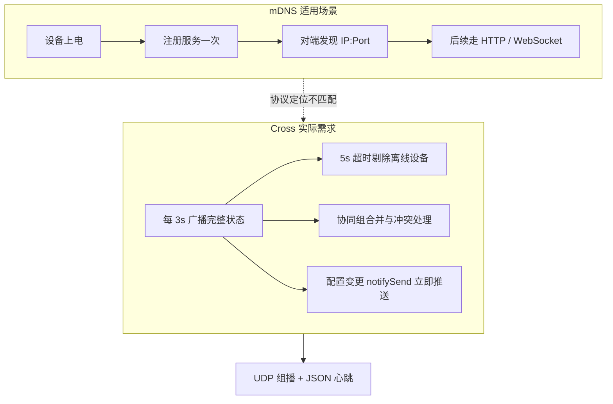
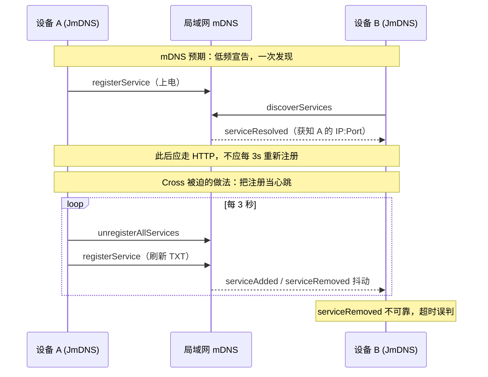
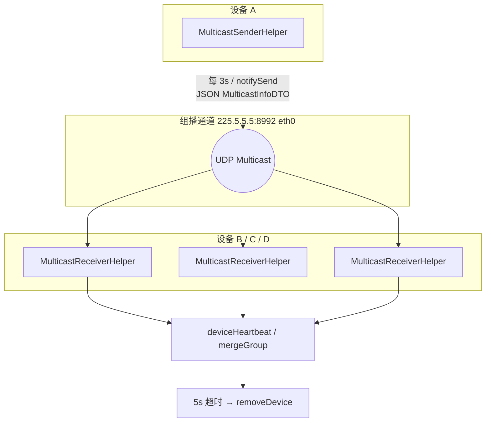
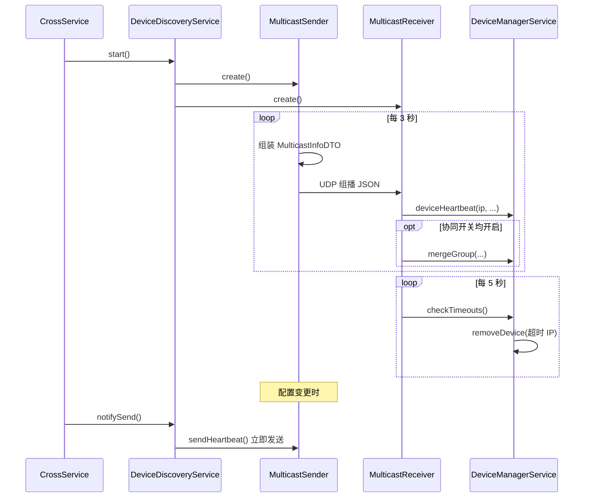

# Cross 设备发现方案演进报告

## 1. 背景

Cross 是多机管理服务，运行在 U 系列设备主板的 Android 系统上。各设备通过 **eth0 有线网口** 接入同一局域网，需要实现：

- 自动发现局域网内的其他 Cross 设备
- 维护统一的设备在线列表
- 在设备掉线时及时移除
- 在协同功能开启时，同步本机的协同组配置

设备发现是上述能力的基础。项目先后尝试过 **Android NSD**、**JmDNS（mDNS）** 两种标准服务发现方案，最终采用 **UDP 组播** 作为现行方案。

---

## 2. 方案演进概览

| 阶段 | 方案 | 状态 | 代码入口 |
| --- | --- | --- | --- |
| 第一版 | Android NSD（DNS-SD） | 已废弃 | `DeviceDiscoveryServiceNSDImpl` |
| 第二版 | JmDNS（mDNS） | 已废弃 | `DeviceDiscoveryServiceJmDNSImpl` |
| 第三版 | UDP 组播 | **现行方案** | `DeviceDiscoveryServiceMulticastImpl` |


当前工厂方法固定返回组播实现：

```15:23:cross/app/src/main/java/com/clt/cross/discovery/DeviceDiscoveryService.java
    static DeviceDiscoveryService getService() {
//        if (null == context) {
//            DeviceDiscoveryServiceJmDNSImpl.getInstance().setContext(null);
//            return DeviceDiscoveryServiceJmDNSImpl.getInstance();
//        } else {
//            DeviceDiscoveryServiceNSDImpl.getInstance().setContext(context);
//            return DeviceDiscoveryServiceNSDImpl.getInstance();
//        }
        return DeviceDiscoveryServiceMulticastImpl.getInstance();
    }
```

---

## 3. 第一版：Android NSD — 基本发现不可用

### 3.1 方案说明

NSD（Network Service Discovery）是 Android 系统提供的 DNS-SD 封装，通过 `NsdManager` 注册/发现 `_http._tcp.` 类型的 `CLTCrossServer` 服务，端口 `8992`。

### 3.2 废弃原因

源码注释明确说明：

> **废弃方案：安卓的 NSD 服务当时测试基本的发现功能都无法使用**

具体表现为：

1. **发现流程无法稳定跑通**：`discoverServices` / `resolveService` 回调不可靠，设备间互相发现失败。
2. **与目标环境不匹配**：U 系列设备以 **eth0 有线网** 为主，NSD 在部分 Android 版本/嵌入式 ROM 上对 mDNS 的处理与 WiFi 耦合较深，工业场景下表现不稳定。
3. **业务层未完成对接**：`NsdDiscoveryHelper` 中 `addDevice` 逻辑被注释，即使偶尔 resolve 成功也无法写入设备列表。

NSD 作为 Android 官方 API 在通用场景可用，但在本项目的目标硬件与网络拓扑下，**连最基本的“发现对方”都做不到**，因此未进入后续迭代。

---

## 4. 第二版：JmDNS — 无法满足掉线与协同需求

NSD 失败后，改用纯 Java 库 **JmDNS** 自行实现 mDNS，绑定 eth0 地址创建 `JmDNS` 实例，注册 `_http._tcp.local.` 服务，并通过 TXT 记录携带设备 JSON 信息。

### 4.1 废弃原因

源码注释：

> **废弃方案：无法满足设备掉线检测的需求**

结合实现细节，主要问题如下。

#### （1）掉线检测不可靠

mDNS 依赖 `serviceRemoved` 事件感知设备离线，但代码中该逻辑已被注释，注释说明改为“通过心跳超时来移除”：

```54:68:cross/app/src/main/java/com/clt/cross/discovery/jmdns/JmDnsDiscoveryHelper.java
        @Override
        public void serviceRemoved(ServiceEvent event) {
            Log.d(TAG, "service removed: " + event.getName());

            // 通过心跳超时来移除
//            if (event.getName().contains(DiscoveryCommonDef.SERVICE_NAME)) {
//                // 设备离线时，需要从缓存中获取ip
//                ServiceMonitorInfo monitorInfo = cache.get(event.getName());
//
//                // 从缓存中移除
//                cache.remove(event.getName());
//
//                deviceService.removeDevice(monitorInfo.getIp());
//            }
        }
```

JmDNS 侧虽实现了 5 秒超时扫描，但心跳更新依赖 `serviceResolved` 回调；而注册端每 3 秒执行 **`unregisterAllServices()` + `registerService()`** 刷新 TXT，会导致服务频繁上下线，discovery 端缓存刷新不稳定，**超时误判与漏判** 并存。

#### （2）TXT 载荷过小，无法承载业务数据

mDNS TXT 记录有严格长度限制（单条通常仅数百字节）。JmDNS 方案只能塞入 `DeviceBaseInfoDTO` 的 JSON：

```107:114:cross/app/src/main/java/com/clt/cross/discovery/jmdns/JmDnsRegisterHelper.java
            if (isActive) {
                // 获取设备类型和自定义名称
                DeviceBaseInfoDTO baseInfoDTO = IJettyClientService.getService().getBaseInfo("127.0.0.1", new HashMap<>());
                serviceText = new Gson().toJson(baseInfoDTO);
                serviceInfo.setText(serviceText.getBytes(StandardCharsets.UTF_8));

                jmDNS.unregisterAllServices();
                jmDNS.registerService(serviceInfo);
```

Cross 还需要广播协同开关（`ConfigDTO`）和本机协同组列表（`DeviceGroupDTO`），这些在 mDNS TXT 中 **无法完整传输**。接收端 `addDevice` / `updateDevice` 同样被注释，设备管理模块无法真正接入。

#### （3）启动时序问题

`DeviceDiscoveryServiceJmDNSImpl.start()` 延迟 **30 秒** 才创建 JmDNS，说明 eth0 / 网络栈就绪前 mDNS 初始化易失败，影响上电即发现的体验。

#### （4）架构复杂度高、行为不可控

- 依赖第三方 mDNS 协议栈，与系统 mDNS 守护进程可能冲突。
- 为“刷新心跳”而反复注销/注册服务，属于非常规用法，增加网络抖动和发现抖动。
- 无法提供 `notifySend()` 立即广播——配置变更后只能等下一轮 mDNS 注册周期。

**结论**：JmDNS 解决了“能注册服务”的问题，但 **掉线检测、状态同步、协同组广播** 等核心业务需求无法满足，因此继续演进。

---

### 4.2 为什么不用 mDNS？—— 协议定位与业务需求错配

这是从 JmDNS 切换到 UDP 组播的 **根本原因**，需要与「mDNS 协议太大太冗余」区分开：

| 常见误解 | 实际情况 |
| --- | --- |
| mDNS 报文太大，传不动 | 问题反而是 **TXT 记录太小**，装不下配置和协同组 |
| mDNS 太冗余所以慢 | mDNS 的 DNS 探测、冲突处理等机制是为 **低频服务宣告** 设计的，不适合当作 **应用层状态同步通道** |
| 需要更高频所以换组播 | Cross 实际是 **3 秒心跳 + 变更时立即推送**，频率不算极高，但已经 **超出 mDNS 的常规用法** |

**mDNS 的设计目标**是：设备上电后 **一次性（或极低频）** 向局域网宣告「这里有一个 `_http._tcp` 服务，地址和端口是多少」。其他设备 **发现一次** 即可建立连接，后续通信走 HTTP/WebSocket，不再依赖 mDNS。

**Cross 的实际需求**是：

1. **持续心跳** — 每 3 秒确认设备仍在线，5 秒无响应则剔除；
2. **状态同步** — 每次心跳携带设备信息、协同开关、协同组列表；
3. **即时推送** — 配置变更后立刻通知其他设备（`notifySend()`）。

这三点本质上是 **应用层组播心跳协议** 的需求，而不是 **DNS 服务发现** 的需求。把 mDNS 当心跳通道使用时，只能走「反复注销/注册服务」的旁路，既违反协议设计意图，也导致掉线检测和发现列表不稳定。





---

### 4.3 核心代码摘录（JmDNS vs 组播）

#### JmDNS：用「重新注册服务」模拟心跳

定时任务每 3 秒触发，且每次先注销再注册——这是在 mDNS 框架下强行实现状态刷新的 **反模式**：

```60:61:cross/app/src/main/java/com/clt/cross/discovery/jmdns/JmDnsRegisterHelper.java
            // 2s 一次心跳
            heartbeat.scheduleAtFixedRate(this::sendHeartbeat, 3,3, TimeUnit.SECONDS);
```

`DeviceDiscoveryServiceJmDNSImpl` 类注释直接点明废弃原因：

```28:29:cross/app/src/main/java/com/clt/cross/discovery/DeviceDiscoveryServiceJmDNSImpl.java
 *  @brief    : 废弃方案：无法满足设备掉线检测的需求
 *****************************************************************************/
```

#### UDP 组播：原生心跳 + 完整载荷

发送端每 3 秒组播 `MulticastInfoDTO`（设备信息 + 配置 + 协同组），配置变更时可立即发送：

```112:177:cross/app/src/main/java/com/clt/cross/discovery/multicast/MulticastSenderHelper.java
    private void send() {
        while (true) {
            // 等待三秒
            try {
                Thread.sleep(3 * 1000);
            }catch (InterruptedException e) {
                e.printStackTrace();
            }

            // 开关关闭
            if (!isActive) {
                continue;
            }

            // 发送心跳信息
            sendHeartbeat();
        }
    }

    private void sendHeartbeat() {
        // 心跳用来将当前设备的信息广播到网络中，不用处理其他无用信息
        try {
            // ...
            MulticastInfoDTO multicastInfoDTO = new MulticastInfoDTO();
            multicastInfoDTO.setDeviceInfo(baseInfoDTO);
            multicastInfoDTO.setConfigInfo(configDTO);
            multicastInfoDTO.setDeviceGroupInfo(deviceGroupDTOS);

            String multicastInfoJson = new Gson().toJson(multicastInfoDTO);
            byte[] multicastInfoJsonBytes = multicastInfoJson.getBytes(StandardCharsets.UTF_8);

            DatagramPacket dp = new DatagramPacket(multicastInfoJsonBytes, multicastInfoJsonBytes.length, group, CommonDef.NSD_SERVER_PORT);
            ms.send(dp);
```

接收端收到包即更新设备列表，并定时扫描超时设备：

```99:158:cross/app/src/main/java/com/clt/cross/discovery/multicast/MulticastReceiverHelper.java
    private void receive() {
        while (true) {
            try {
                DatagramPacket dp = new DatagramPacket(buffer, buffer.length);
                ms.receive(dp);
                String remoteIp = dp.getAddress().getHostAddress();
                // ...
                handleDeviceInfo(remoteIp, dto.getDeviceInfo(), dto.getConfigInfo());
                // ...
                if (localEnable && remoteEnable) {
                    if (!remoteIp.equals(localIp)) {
                        handleGroupInfo(localIp, remoteIp, dto.getDeviceGroupInfo());
                    }
                }
            } catch (Exception e) {
                e.printStackTrace();
            }
        }
    }

    private void checkTimeouts() {
        long now = System.currentTimeMillis();
        // ...
        deviceListDTO.getDeviceArr().forEach(deviceDTO -> {
            if (Math.abs(now - deviceDTO.getLastTime()) > timeoutMs) {
                DeviceManagerService.getService().removeDevice(deviceDTO.getIp());
            }
        });
```

组播地址与端口定义：

```36:37:cross/app/src/main/java/com/clt/cross/common/CommonDef.java
    public static final String MULTICAST_ADDRESS = "225.5.5.5";
    public static final int NSD_SERVER_PORT = 8992;
```

---

## 5. 第三版：UDP 组播 — 现行方案

### 5.1 方案说明

使用 `MulticastSocket` 在固定组播地址 **`225.5.5.5:8992`** 上通信，显式绑定 **eth0** 网卡（与 U 系列对外网络一致）。

| 组件 | 职责 |
| --- | --- |
| `MulticastSenderHelper` | 每 3 秒发送心跳；支持 `notifySend()` 立即发送 |
| `MulticastReceiverHelper` | 接收组播包；更新设备列表；合并协同组；5 秒超时剔除离线设备 |

单次组播载荷为 `MulticastInfoDTO` JSON，包含：

- `deviceInfo` — 来自 iJetty 的设备基础信息
- `configInfo` — 本机 Cross 配置（含协同开关）
- `deviceGroupInfo` — 本机协同组列表

### 5.2 相对 NSD / JmDNS 的核心优势

#### （1）可控的应用层心跳，掉线检测准确

- 发送端：固定 **3 秒** 周期广播，逻辑清晰。
- 接收端：收到包即调用 `deviceHeartbeat()` 刷新 `lastTime`。
- 检测端：每 **5 秒** 扫描，超过 5 秒未收到心跳则 `removeDevice()`。

不依赖 mDNS 的 `serviceRemoved` / `serviceLost` 等系统事件，**在线/离线判定完全由应用协议掌控**，与 Cross 设备列表模型一致。

#### （2）载荷充足，一次广播携带完整业务状态

组播包使用 **8192 字节** 缓冲区，JSON 可携带设备信息、配置、协同组。接收端在同一流程内完成：

- 设备列表心跳更新
- 协同组冲突检测与合并（`handleGroupInfo`）
- 异常协同组 WebSocket 通知

这是 mDNS TXT **无法实现** 的能力，也是多机协同功能的直接诉求。

#### （3）网卡绑定明确，适配工业有线网络

```java
NetworkInterface networkInterface = NetworkUtils.getEth0NetworkInterface();
ms.setNetworkInterface(networkInterface);   // 发送
ms.joinGroup(groupAddress, networkInterface); // 接收
```

U 系列设备对外通信固定走 eth0，组播方案 **显式指定网卡**，避免 mDNS/NSD 在 WiFi、多网卡场景下选错接口或收不到包。

#### （4）实现简单、依赖少、行为可预测

- 标准 Java `MulticastSocket`，无需 `NsdManager` Context，无需 JmDNS 第三方栈。
- 协议自定义，不受 Android 系统 mDNS 实现差异影响。
- 配置变更时可 `notifySend()` **立即** 广播，无需等待注册周期。

#### （5）上电即可工作

组播实现中已去掉 JmDNS 的 30 秒启动延迟（`Thread.sleep(30 * 1000)` 已注释），服务启动后即可建 socket 并开始收发。

---

## 6. 三种方案对比

| 维度 | Android NSD | JmDNS | UDP 组播（现行） |
| --- | --- | --- | --- |
| 协议定位 | DNS-SD 服务发现 | mDNS 服务发现 | 应用层状态广播 |
| 基本发现 | 测试不可用 | 可用但不稳定 | 稳定 |
| 掉线检测 | 依赖 `onServiceLost`，不可靠 | 超时 + 反复注册，易误判 | 应用层心跳 + 超时，可控 |
| 载荷大小 | TXT 受限 | TXT 受限（仅基础设备信息） | JSON，含配置与协同组 |
| 协同组同步 | 不支持 | 不支持 | 支持 |
| 网卡控制 | 系统决定 | 可绑 eth0 | 显式绑 eth0 |
| 立即广播 | 无 | 无 | `notifySend()` |
| 外部依赖 | Android 系统 API | jmdns 库 | JDK 标准库 |
| 启动延迟 | — | 需延迟 30s | 无 |

---

## 7. 现行方案工作流程





1. **上电**：`CrossService` 调用 `DeviceDiscoveryService.start()`，创建 Sender / Receiver。
2. **心跳**：Sender 周期性组播本机完整状态；Receiver 解析并更新设备管理模块。
3. **掉线**：5 秒内未收到某 IP 的心跳，从设备列表及协同组中移除。
4. **变更**：配置或协同组变化时调用 `notifySend()`，其他设备即时感知。

---

## 8. 结论

从 NSD → JmDNS → UDP 组播的演进，本质是在 **U 系列 Android + eth0 局域网** 这一固定场景下，逐步把发现机制从“通用 mDNS 服务发现”收敛为“面向 Cross 业务的应用层组播协议”：

1. **NSD**：在目标设备上连基本发现都不可用，第一时间淘汰。
2. **JmDNS**：mDNS 适合 **一次发现**，不适合 **高频状态心跳**；TXT 容量、掉线事件、反复注册刷新等限制导致 **无法满足掉线检测与协同组同步**，被淘汰。
3. **UDP 组播**：以自定义 JSON 心跳替代 mDNS，在容量、时序、网卡绑定、立即通知等方面与 Cross 多机管理需求对齐，成为现行且唯一启用的方案。

历史实现（`nsd/`、`jmdns/` 包及对应 `*Impl` 类）仍保留在代码库中供参考，但 **生产环境仅使用 `DeviceDiscoveryServiceMulticastImpl`**。

---

## 9. 相关代码索引

| 说明 | 路径 |
| --- | --- |
| 服务入口 | `discovery/DeviceDiscoveryService.java` |
| 组播实现 | `discovery/DeviceDiscoveryServiceMulticastImpl.java` |
| 组播发送 | `discovery/multicast/MulticastSenderHelper.java` |
| 组播接收 | `discovery/multicast/MulticastReceiverHelper.java` |
| 组播数据结构 | `discovery/dto/MulticastInfoDTO.java` |
| 组播地址/端口 | `common/CommonDef.java`（`225.5.5.5:8992`） |
| JmDNS 废弃实现 | `discovery/DeviceDiscoveryServiceJmDNSImpl.java` |
| NSD 废弃实现 | `discovery/DeviceDiscoveryServiceNSDImpl.java` |
