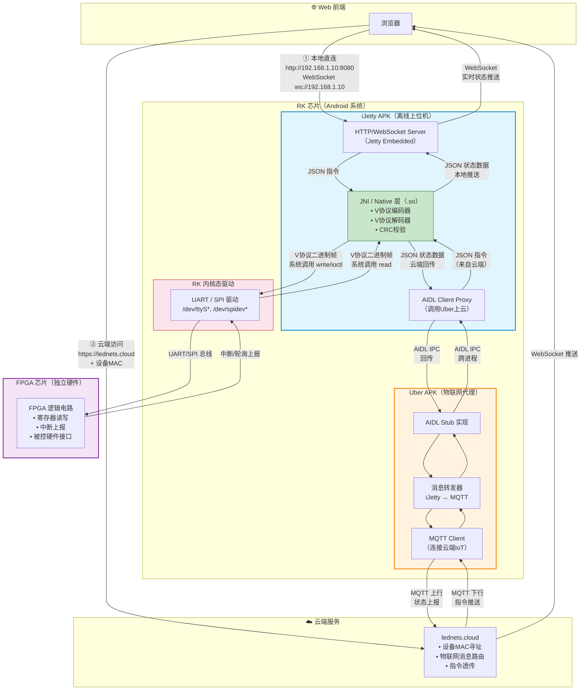
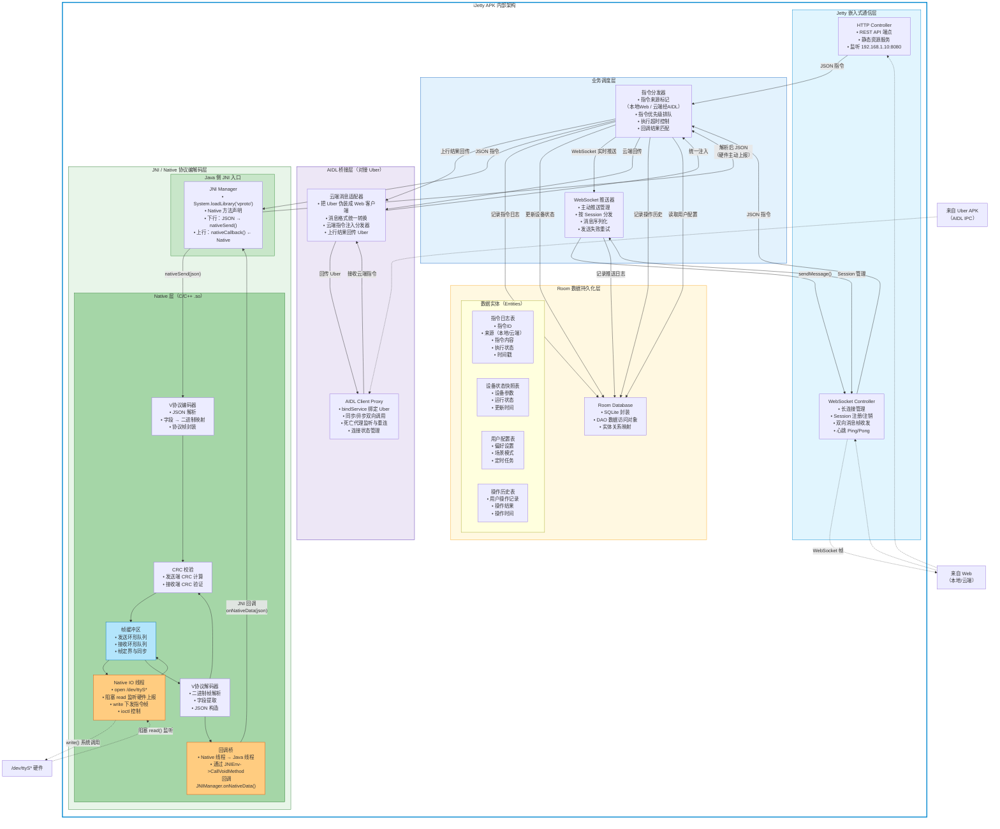

# IJetty架构

## 系统外部通信架构图

```mermaid
graph TB
    subgraph Web前端["🌐 Web 前端"]
        Browser["浏览器"]
    end

    subgraph 云端["☁️ 云端服务"]
        CloudServer["lednets.cloud<br/>• 设备MAC寻址<br/>• 物联网消息路由<br/>• 指令透传"]
    end

    subgraph RK芯片["RK 芯片（Android 系统）"]
        
        subgraph iJetty_APK["iJetty APK（离线上位机）"]
            direction TB
            通信模块["HTTP/WebSocket Server<br/>（Jetty Embedded）"]
            AIDL客户端["AIDL Client Proxy<br/>（调用Uber上云）"]
            JNI_Native["JNI / Native 层（.so）<br/>• V协议编码器<br/>• V协议解码器<br/>• CRC校验"]
        end

        subgraph Uber_APK["Uber APK（物联网代理）"]
            AIDL服务端["AIDL Stub 实现"]
            MQTT客户端["MQTT Client<br/>（连接云端IoT）"]
            转发器["消息转发器<br/>iJetty ↔ MQTT"]
        end

        subgraph RK内核["RK 内核态驱动"]
            硬件驱动["UART / SPI 驱动<br/>/dev/ttyS*, /dev/spidev*"]
        end
    end

    subgraph FPGA芯片["FPGA 芯片（独立硬件）"]
        FPGA逻辑["FPGA 逻辑电路<br/>• 寄存器读写<br/>• 中断上报<br/>• 被控硬件接口"]
    end

    %% ===== 路径1：本地直连 =====
    Browser -->|"① 本地直连<br/>http://192.168.1.10:8080<br/>WebSocket ws://192.168.1.10"| 通信模块

    %% ===== 路径2：云端远程 =====
    Browser -->|"② 云端访问<br/>https://lednets.cloud<br/>+ 设备MAC"| CloudServer
    CloudServer -->|"MQTT 下行<br/>指令推送"| MQTT客户端
    MQTT客户端 --> 转发器
    转发器 --> AIDL服务端
    AIDL服务端 -->|"AIDL IPC<br/>跨进程"| AIDL客户端

    %% ===== iJetty 内部：通信模块/AIDL → JNI/Native =====
    通信模块 -->|"JSON 指令"| JNI_Native
    AIDL客户端 -->|"JSON 指令<br/>（来自云端）"| JNI_Native

    %% ===== iJetty → RK驱动 → FPGA =====
    JNI_Native -->|"V协议二进制帧<br/>系统调用 write/ioctl"| 硬件驱动
    硬件驱动 -->|"UART/SPI 总线"| FPGA逻辑

    %% ===== FPGA → RK驱动 → iJetty（上报） =====
    FPGA逻辑 -->|"中断/轮询上报"| 硬件驱动
    硬件驱动 -->|"V协议二进制帧<br/>系统调用 read"| JNI_Native

    %% ===== 解码后回推 =====
    JNI_Native -->|"JSON 状态数据<br/>本地推送"| 通信模块
    JNI_Native -->|"JSON 状态数据<br/>云端回传"| AIDL客户端

    %% 本地 WebSocket 推送
    通信模块 -->|"WebSocket<br/>实时状态推送"| Browser

    %% 云端回传链路
    AIDL客户端 -->|"AIDL IPC<br/>回传"| AIDL服务端
    AIDL服务端 --> 转发器
    转发器 --> MQTT客户端
    MQTT客户端 -->|"MQTT 上行<br/>状态上报"| CloudServer
    CloudServer -->|"WebSocket 推送"| Browser

    %% 样式
    style iJetty_APK fill:#e1f5fe,stroke:#0288d1,stroke-width:2px
    style Uber_APK fill:#fff3e0,stroke:#f57c00,stroke-width:2px
    style JNI_Native fill:#c8e6c9,stroke:#2e7d32
    style RK内核 fill:#fce4ec,stroke:#c62828
    style FPGA芯片 fill:#f3e5f5,stroke:#7b1fa2,stroke-width:2px
```

## 架构图

```mermaid
graph TB
    subgraph iJetty["iJetty APK 内部架构"]
        
        subgraph Jetty通信层["Jetty 嵌入式通信层"]
            HTTPController["HTTP Controller<br/>• REST API 端点<br/>• 静态资源服务<br/>• 监听 192.168.1.10:8080"]
            WSController["WebSocket Controller<br/>• 长连接管理<br/>• Session 注册/注销<br/>• 双向消息帧收发<br/>• 心跳 Ping/Pong"]
        end

        subgraph 业务调度层["业务调度层"]
            CmdDispatcher["指令分发器<br/>• 指令来源标记<br/>  （本地Web / 云端经AIDL）<br/>• 指令优先级排队<br/>• 执行超时控制<br/>• 回调结果匹配"]
            WSNotifier["WebSocket 推送器<br/>• 主动推送管理<br/>• 按 Session 分发<br/>• 消息序列化<br/>• 发送失败重试"]
        end

        subgraph AIDL桥接层["AIDL 桥接层（对接 Uber）"]
            AIDLClient["AIDL Client Proxy<br/>• bindService 绑定 Uber<br/>• 同步/异步双向调用<br/>• 死亡代理监听与重连<br/>• 连接状态管理"]
            CloudMsgAdapter["云端消息适配器<br/>• 把 Uber 伪装成 Web 客户端<br/>• 消息格式统一转换<br/>• 云端指令注入分发器<br/>• 上行结果回传 Uber"]
        end

        subgraph JNI_Native层["JNI / Native 协议编解码层"]
            direction TB
            
            subgraph Java侧["Java 侧 JNI 入口"]
                JNIManager["JNI Manager<br/>• System.loadLibrary('vproto')<br/>• Native 方法声明<br/>• 下行：JSON → nativeSend()<br/>• 上行：nativeCallback() ← Native"]
            end

            subgraph Native侧["Native 层（C/C++ .so）"]
                VEncoder["V协议编码器<br/>• JSON 解析<br/>• 字段 → 二进制映射<br/>• 协议帧封装"]
                VDecoder["V协议解码器<br/>• 二进制帧解析<br/>• 字段提取<br/>• JSON 构造"]
                CRCCodec["CRC 校验<br/>• 发送端 CRC 计算<br/>• 接收端 CRC 验证"]
                FrameBuffer["帧缓冲区<br/>• 发送环形队列<br/>• 接收环形队列<br/>• 帧定界与同步"]
                NativeIO["Native IO 线程<br/>• open /dev/ttyS*<br/>• 阻塞 read 监听硬件上报<br/>• write 下发指令帧<br/>• ioctl 控制"]
                CallbackBridge["回调桥<br/>• Native 线程 → Java 线程<br/>• 通过 JNIEnv->CallVoidMethod<br/>  回调 JNIManager.onNativeData()"]
            end
        end

        subgraph 数据持久化层["Room 数据持久化层"]
            RoomDB["Room Database<br/>• SQLite 封装<br/>• DAO 数据访问对象<br/>• 实体关系映射"]
            
            subgraph 数据实体["数据实体（Entities）"]
                CmdLog["指令日志表<br/>• 指令ID<br/>• 来源（本地/云端）<br/>• 指令内容<br/>• 执行状态<br/>• 时间戳"]
                DeviceStatus["设备状态快照表<br/>• 设备参数<br/>• 运行状态<br/>• 更新时间"]
                UserConfig["用户配置表<br/>• 偏好设置<br/>• 场景模式<br/>• 定时任务"]
                OpHistory["操作历史表<br/>• 用户操作记录<br/>• 操作结果<br/>• 操作时间"]
            end
        end

    end

    %% ===== 外部入口（仅标注，不画实体） =====
    WebEntry["来自 Web<br/>（本地/云端）"] -.-> HTTPController
    WebEntry -.-> WSController
    UberEntry["来自 Uber APK<br/>（AIDL IPC）"] -.-> AIDLClient

    %% ===== Jetty 通信层 → 业务调度层 =====
    HTTPController -->|"JSON 指令"| CmdDispatcher
    WSController -->|"JSON 指令"| CmdDispatcher
    WSController <-->|"Session 管理"| WSNotifier

    %% ===== AIDL 桥接层 → 业务调度层 =====
    AIDLClient -->|"接收云端指令"| CloudMsgAdapter
    CloudMsgAdapter -->|"统一注入"| CmdDispatcher
    CmdDispatcher -->|"上行结果回传"| CloudMsgAdapter
    CloudMsgAdapter -->|"回传 Uber"| AIDLClient

    %% ===== 业务调度层 → JNI（指令下发） =====
    CmdDispatcher -->|"JSON 指令"| JNIManager

    %% ===== 指令持久化 =====
    CmdDispatcher -->|"记录指令日志"| RoomDB
    CmdDispatcher -->|"更新设备状态"| RoomDB

    %% ===== Java JNI → Native（下行） =====
    JNIManager -->|"nativeSend(json)"| VEncoder
    VEncoder --> CRCCodec
    CRCCodec --> FrameBuffer
    FrameBuffer --> NativeIO

    %% ===== Native → 硬件（下行） =====
    NativeIO -.->|"write() 系统调用"| HW["/dev/ttyS* 硬件"]

    %% ===== 硬件 → Native（上行） =====
    HW -.->|"阻塞 read() 监听"| NativeIO
    NativeIO --> FrameBuffer
    FrameBuffer --> VDecoder
    VDecoder --> CRCCodec
    VDecoder --> CallbackBridge

    %% ===== Native 回调 Java（上行） =====
    CallbackBridge -->|"JNI 回调<br/>onNativeData(json)"| JNIManager

    %% ===== JNI → 业务层分发 =====
    JNIManager -->|"解析后 JSON<br/>（硬件主动上报）"| CmdDispatcher

    %% ===== 业务层分发结果 =====
    CmdDispatcher -->|"WebSocket 实时推送"| WSNotifier
    CmdDispatcher -->|"云端回传"| CloudMsgAdapter

    %% ===== WebSocket 推送到前端 =====
    WSNotifier -->|"sendMessage()"| WSController
    WSController -.->|"WebSocket 帧"| WebEntry

    %% ===== 数据持久化 =====
    WSNotifier -->|"记录推送日志"| RoomDB
    CmdDispatcher -->|"记录操作历史"| RoomDB
    CmdDispatcher -->|"读取用户配置"| RoomDB

    %% 样式
    style iJetty fill:#ffffff,stroke:#0288d1,stroke-width:3px
    style Jetty通信层 fill:#e1f5fe,stroke:#0288d1
    style 业务调度层 fill:#e3f2fd,stroke:#1565c0
    style AIDL桥接层 fill:#ede7f6,stroke:#5e35b1
    style JNI_Native层 fill:#e8f5e9,stroke:#2e7d32
    style Java侧 fill:#c8e6c9,stroke:#388e3c
    style Native侧 fill:#a5d6a7,stroke:#2e7d32
    style 数据持久化层 fill:#fff8e1,stroke:#f9a825
    style CallbackBridge fill:#ffcc80,stroke:#e65100
    style FrameBuffer fill:#b3e5fc,stroke:#0277bd
    style NativeIO fill:#ffcc80,stroke:#e65100
```