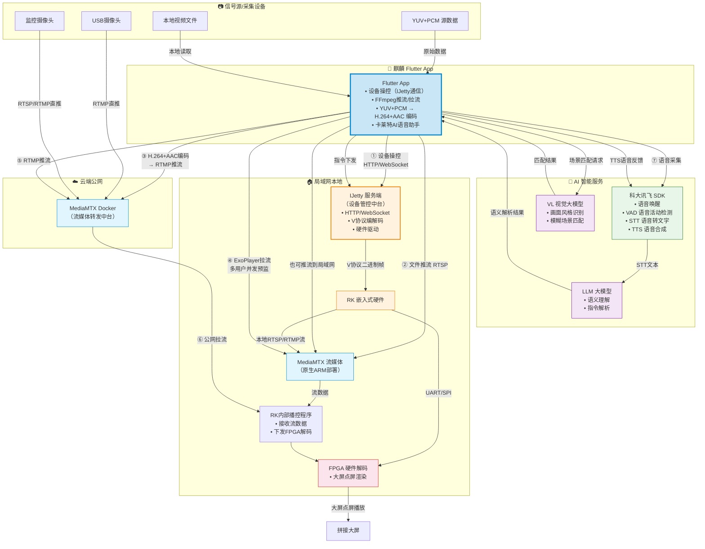
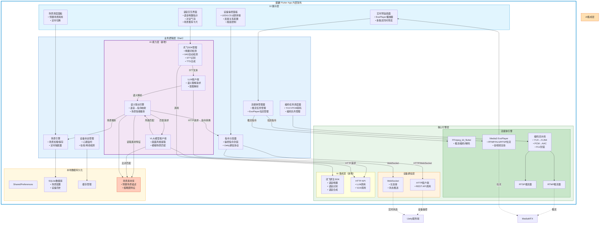

# 麒麟架构

## 系统外部通信架构图

```mermaid
graph TB
    subgraph 用户端["📱 麒麟 Flutter App"]
        FlutterApp["Flutter App<br/>• 设备操控（IJetty通信）<br/>• FFmpeg推流/拉流<br/>• YUV+PCM → H.264+AAC 编码<br/>• 卡莱特AI语音助手"]
    end

    subgraph AI服务["🧠 AI 智能服务"]
        科大讯飞["科大讯飞 SDK<br/>• 语音唤醒<br/>• VAD 语音活动检测<br/>• STT 语音转文字<br/>• TTS 语音合成"]
        LLM["LLM 大模型<br/>• 语义理解<br/>• 指令解析"]
        VLM["VL 视觉大模型<br/>• 画面风格识别<br/>• 模糊场景匹配"]
    end

    subgraph 局域网["🏠 局域网本地"]
        RK_Device["RK 嵌入式硬件"]
        IJetty["IJetty 服务端<br/>（设备管控中台）<br/>• HTTP/WebSocket<br/>• V协议编解码<br/>• 硬件驱动"]
        MediaMTX_Local["MediaMTX 流媒体<br/>（原生ARM部署）"]
        播控程序["RK内部播控程序<br/>• 接收流数据<br/>• 下发FPGA解码"]
        FPGA["FPGA 硬件解码<br/>• 大屏点屏渲染"]
    end

    subgraph 云端["☁️ 云端公网"]
        MediaMTX_Cloud["MediaMTX Docker<br/>（流媒体转发中台）"]
    end

    subgraph 采集端["📷 信号源/采集设备"]
        USB摄像头["USB摄像头"]
        监控摄像头["监控摄像头"]
        视频文件["本地视频文件"]
        YUV_PCM["YUV+PCM 源数据"]
    end

%% ===== 设备操控链路（新增IJetty）=====
    FlutterApp -->|"① 设备操控<br/>HTTP/WebSocket"| IJetty
    IJetty -->|"V协议二进制帧"| RK_Device
    RK_Device -->|"UART/SPI"| FPGA

%% ===== 局域网本地播放 =====
    FlutterApp -->|"② 文件推流 RTSP"| MediaMTX_Local
    MediaMTX_Local -->|"流数据"| 播控程序
    播控程序 --> FPGA
    FPGA -->|"大屏点屏播放"| 大屏["拼接大屏"]

%% ===== YUV+PCM 编码推流 =====
    YUV_PCM -->|"原始数据"| FlutterApp
    FlutterApp -->|"③ H.264+AAC编码<br/>→ RTMP推流"| MediaMTX_Cloud
    FlutterApp -->|"也可推流到局域网"| MediaMTX_Local

%% ===== 实时预监（ExoPlayer）=====
    RK_Device -->|"本地RTSP/RTMP流"| MediaMTX_Local
    FlutterApp -->|"④ ExoPlayer拉流<br/>多用户并发预监"| MediaMTX_Local

%% ===== 摄像头/文件推流 =====
    USB摄像头 -->|"RTMP直推"| MediaMTX_Cloud
    监控摄像头 -->|"RTSP/RTMP直推"| MediaMTX_Cloud
    视频文件 -->|"本地读取"| FlutterApp
    FlutterApp -->|"⑤ RTMP推流"| MediaMTX_Cloud

%% ===== 云端到RK =====
    MediaMTX_Cloud -->|"⑥ 公网拉流"| 播控程序

%% ===== AI语音助手链路（新增）=====
    FlutterApp -->|"⑦ 语音采集"| 科大讯飞
    科大讯飞 -->|"STT文本"| LLM
    LLM -->|"语义解析结果"| FlutterApp
    FlutterApp -->|"场景匹配请求"| VLM
    VLM -->|"匹配结果"| FlutterApp
    FlutterApp -->|"TTS语音反馈"| 科大讯飞
    FlutterApp -->|"指令下发"| IJetty

%% 样式
    style FlutterApp fill:#c8e6f5,stroke:#0288d1,stroke-width:3px
    style IJetty fill:#fff3e0,stroke:#f57c00,stroke-width:2px
    style 科大讯飞 fill:#e8f5e9,stroke:#2e7d32
    style LLM fill:#f3e5f5,stroke:#7b1fa2
    style VLM fill:#f3e5f5,stroke:#7b1fa2
    style MediaMTX_Local fill:#e1f5fe,stroke:#0288d1
    style MediaMTX_Cloud fill:#e1f5fe,stroke:#0288d1
    style RK_Device fill:#fff3e0,stroke:#f57c00
    style FPGA fill:#fce4ec,stroke:#c62828
```

## 架构图

```mermaid
graph TB
    subgraph 麒麟FlutterApp["麒麟 Flutter App 内部架构"]

        subgraph UI层["UI 展示层"]
            设备操控面板["设备操控面板<br/>• LED/LCD点屏拼接<br/>• 连接关系配置<br/>• 瓶组控制"]
            预监画面["实时预监画面<br/>• ExoPlayer播放器<br/>• 多路流同时预览"]
            场景调度["场景调度面板<br/>• 预置场景调用<br/>• 定时切换"]
            语音交互["语音交互界面<br/>• 语音唤醒指示<br/>• 对话气泡<br/>• 场景推荐卡片"]
        end

        subgraph 业务逻辑层["业务逻辑层（Dart）"]
            指令分发器["指令分发器<br/>• 操控指令封装<br/>• IJetty通信协议"]
            流媒体管理器["流媒体管理器<br/>• 推流任务管理<br/>• ExoPlayer拉流管理"]
            设备状态管理["设备状态管理<br/>• 心跳监听<br/>• 在线/离线检测"]
            场景引擎["场景引擎<br/>• 场景加载/保存<br/>• 定时触发器"]
            编码任务调度["编码任务调度器<br/>• YUV+PCM转码<br/>• 编码队列管理"]

            subgraph AI能力层["AI 能力层（新增）"]
                语音SDK管理["讯飞SDK管理<br/>• 唤醒词检测<br/>• VAD活动检测<br/>• STT识别<br/>• TTS合成"]
                LLMClient["LLM客户端<br/>• 语义理解请求<br/>• 意图解析"]
                VLMClient["VL大模型客户端<br/>• 画面风格提取<br/>• 模糊场景匹配"]
                语义联动引擎["语义联动引擎<br/>• 语音→指令映射<br/>• 场景智能推荐"]
            end
        end

        subgraph 核心引擎层["核心引擎层"]

            subgraph 流媒体引擎["流媒体引擎"]
                FFmpegKit["FFmpeg_kit_flutter<br/>• 推流/编码/解码"]
                编码流水线["编码流水线<br/>• YUV→H.264<br/>• PCM→AAC<br/>• FLV封装"]
                RTMP推流["RTMP推流器"]
                RTSP推流["RTSP推流器"]
                ExoPlayer["Media3 ExoPlayer<br/>• RTMP/HLS/RTSP拉流<br/>• 音视频渲染"]
            end

            subgraph 设备通信["设备通信层"]
                HTTPClient["HTTP客户端<br/>• REST API调用"]
                WebSocket["WebSocket<br/>• 长连接<br/>• 状态推送"]
            end

            subgraph AI集成["AI 集成层（新增）"]
                讯飞Native["讯飞原生SDK<br/>• 语音唤醒<br/>• 语音识别<br/>• 语音合成"]
                HTTP_API["HTTP API<br/>• LLM调用<br/>• VLM调用"]
            end
        end

        subgraph 数据持久化层["本地数据持久化"]
            SharedPreferences["SharedPreferences"]
            SQLite["SQLite数据库<br/>• 场景配置<br/>• 设备历史"]
            缓存管理["缓存管理"]
            场景素材库["场景素材库<br/>• 预置场景描述<br/>• 缩略图特征"]
        end

    end

%% ===== UI → 业务逻辑 =====
    设备操控面板 --> 指令分发器
    预监画面 --> 流媒体管理器
    场景调度 --> 场景引擎
    语音交互 --> 语音SDK管理

%% ===== AI能力层内部流转（新增）=====
    语音SDK管理 -->|"STT文本"| LLMClient
    LLMClient -->|"语义解析"| 语义联动引擎
    语义联动引擎 -->|"匹配请求"| VLMClient
    VLMClient -->|"风格匹配"| 语义联动引擎
    语义联动引擎 -->|"指令转换"| 指令分发器
    语义联动引擎 -->|"场景推荐"| 场景引擎

%% ===== 语义联动 → 场景匹配 =====
    语义联动引擎 -->|"读取素材特征"| 场景素材库
    VLMClient -->|"比对匹配"| 场景素材库

%% ===== 业务逻辑 → 核心引擎 =====
    指令分发器 -->|"HTTP/WebSocket"| HTTPClient
    指令分发器 -->|"WebSocket"| WebSocket
    流媒体管理器 -->|"推流指令"| FFmpegKit
    流媒体管理器 -->|"拉流指令"| ExoPlayer
    编码任务调度 --> 编码流水线

%% ===== 流媒体内部流转 =====
    编码流水线 --> RTMP推流
    编码流水线 --> RTSP推流
    ExoPlayer --> 预监画面

%% ===== AI集成层 =====
    语音SDK管理 -->|"调用"| 讯飞Native
    LLMClient -->|"HTTP请求"| HTTP_API
    VLMClient -->|"HTTP请求"| HTTP_API

%% ===== 数据持久化 =====
    场景引擎 --> SQLite
    语义联动引擎 --> 场景素材库
    设备状态管理 --> 缓存管理

%% ===== 通信层对外 =====
    HTTPClient -.->|"设备操控"| IJetty["IJetty服务端"]
    WebSocket -.->|"实时状态"| IJetty
    RTMP推流 -.->|"推流"| MediaMTX["MediaMTX"]
    ExoPlayer -.->|"拉流"| MediaMTX

%% 样式
    style 麒麟FlutterApp fill:#ffffff,stroke:#0288d1,stroke-width:3px
    style UI层 fill:#e1f5fe,stroke:#0288d1
    style 业务逻辑层 fill:#e3f2fd,stroke:#1565c0
    style AI能力层 fill:#f3e5f5,stroke:#7b1fa2,stroke-width:2px
    style 核心引擎层 fill:#e8f5e9,stroke:#2e7d32
    style 流媒体引擎 fill:#c8e6c9,stroke:#388e3c
    style 设备通信 fill:#fff3e0,stroke:#f57c00
    style AI集成层 fill:#ffe0b2,stroke:#e65100
    style 数据持久化层 fill:#fff8e1,stroke:#f9a825
    style 场景素材库 fill:#ffccbc,stroke:#d84315
```

