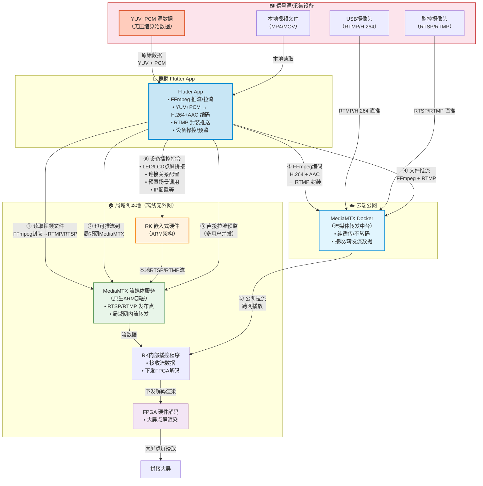
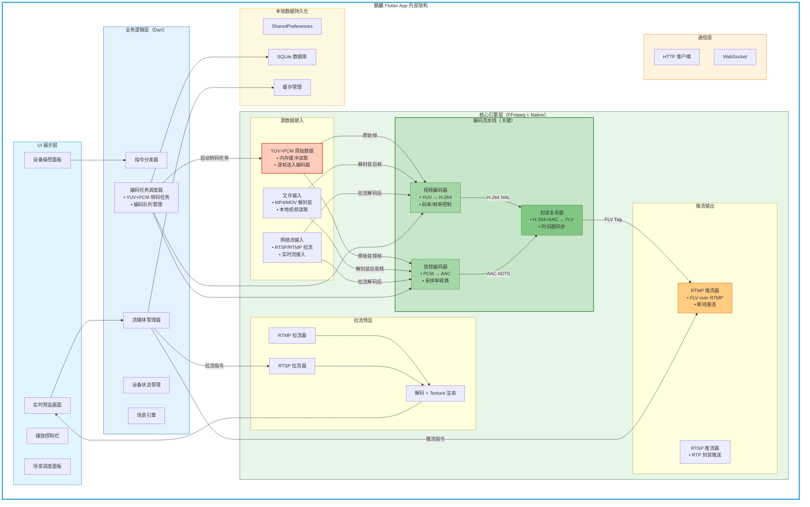

# 麒麟架构

## 系统外部通信架构图

```mermaid
graph TB
    subgraph 用户端["📱 麒麟 Flutter App"]
        FlutterApp["Flutter App<br/>• FFmpeg 推流/拉流<br/>• YUV+PCM → H.264+AAC 编码<br/>• RTMP 封装推送<br/>• 设备操控/预监"]
    end

    subgraph 局域网["🏠 局域网本地（离线无外网）"]
        RK_Device["RK 嵌入式硬件<br/>（ARM架构）"]
        MediaMTX_Local["MediaMTX 流媒体服务<br/>（原生ARM部署）<br/>• RTSP/RTMP 发布点<br/>• 局域网内流转发"]
        播控程序["RK内部播控程序<br/>• 接收流数据<br/>• 下发FPGA解码"]
        FPGA["FPGA 硬件解码<br/>• 大屏点屏渲染"]
    end

    subgraph 云端["☁️ 云端公网"]
        MediaMTX_Cloud["MediaMTX Docker<br/>（流媒体转发中台）<br/>• 纯透传/不转码<br/>• 接收/转发流数据"]
    end

    subgraph 采集端["📷 信号源/采集设备"]
        USB摄像头["USB摄像头<br/>（RTMP/H.264）"]
        监控摄像头["监控摄像头<br/>（RTSP/RTMP）"]
        视频文件["本地视频文件<br/>（MP4/MOV）"]
        YUV_PCM["YUV+PCM 源数据<br/>（无压缩原始数据）"]
    end

    %% ===== 局域网本地链路 =====
    FlutterApp -->|"① 读取视频文件<br/>FFmpeg封装→RTMP/RTSP"| MediaMTX_Local
    MediaMTX_Local -->|"流数据"| 播控程序
    播控程序 -->|"下发解码渲染"| FPGA
    FPGA -->|"大屏点屏播放"| 大屏["拼接大屏"]

    %% ===== YUV+PCM 编码推流（关键修正）=====
    YUV_PCM -->|"原始数据<br/>YUV + PCM"| FlutterApp
    FlutterApp -->|"② FFmpeg编码<br/>H.264 + AAC<br/>→ RTMP 封装"| MediaMTX_Cloud
    FlutterApp -->|"② 也可推流到<br/>局域网MediaMTX"| MediaMTX_Local

    %% ===== 实时预监链路 =====
    RK_Device -->|"本地RTSP/RTMP流"| MediaMTX_Local
    FlutterApp -->|"③ 直接拉流预监<br/>（多用户并发）"| MediaMTX_Local

    %% ===== 文件/摄像头推流到云端 =====
    USB摄像头 -->|"RTMP/H.264 直推"| MediaMTX_Cloud
    监控摄像头 -->|"RTSP/RTMP 直推"| MediaMTX_Cloud
    视频文件 -->|"本地读取"| FlutterApp
    FlutterApp -->|"④ 文件推流<br/>FFmpeg + RTMP"| MediaMTX_Cloud

    %% ===== 云端到RK（跨网远程播放）=====
    MediaMTX_Cloud -->|"⑤ 公网拉流<br/>跨网播放"| 播控程序

    %% ===== 设备操控链路 =====
    FlutterApp -->|"⑥ 设备操控指令<br/>• LED/LCD点屏拼接<br/>• 连接关系配置<br/>• 预置场景调用<br/>• IP配置等"| RK_Device

    %% 样式
    style FlutterApp fill:#c8e6f5,stroke:#0288d1,stroke-width:3px
    style RK_Device fill:#fff3e0,stroke:#f57c00,stroke-width:2px
    style MediaMTX_Local fill:#e8f5e9,stroke:#2e7d32
    style MediaMTX_Cloud fill:#e1f5fe,stroke:#0288d1,stroke-width:2px
    style FPGA fill:#f3e5f5,stroke:#7b1fa2
    style YUV_PCM fill:#ffccbc,stroke:#d84315,stroke-width:2px
    style 采集端 fill:#fce4ec,stroke:#c62828
```

## 架构图

```mermaid
graph TB
    subgraph 麒麟FlutterApp["麒麟 Flutter App 内部架构"]
        
        subgraph UI层["UI 展示层"]
            设备操控面板["设备操控面板"]
            预监画面["实时预监画面"]
            播放控制["播放控制栏"]
            场景调度["场景调度面板"]
        end

        subgraph 业务逻辑层["业务逻辑层（Dart）"]
            指令分发器["指令分发器"]
            流媒体管理器["流媒体管理器"]
            设备状态管理["设备状态管理"]
            场景引擎["场景引擎"]
            编码任务调度["编码任务调度器<br/>• YUV+PCM 转码任务<br/>• 编码队列管理"]
        end

        subgraph 核心引擎层["核心引擎层（FFmpeg + Native）"]
            
            subgraph 源数据接入["源数据接入"]
                YUV_PCM_Input["YUV+PCM 原始数据<br/>• 内存缓冲读取<br/>• 逐帧送入编码器"]
                文件输入["文件输入<br/>• MP4/MOV 解封装<br/>• 本地视频读取"]
                网络流输入["网络流输入<br/>• RTSP/RTMP 拉流<br/>• 实时流接入"]
            end

            subgraph 编码流水线["编码流水线（关键）"]
                视频编码["视频编码器<br/>• YUV → H.264<br/>• 码率/帧率控制"]
                音频编码["音频编码器<br/>• PCM → AAC<br/>• 采样率转换"]
                封装复用["封装复用器<br/>• H.264+AAC → FLV<br/>• 时间戳同步"]
            end

            subgraph 推流输出["推流输出"]
                RTMP推流["RTMP 推流器<br/>• FLV over RTMP<br/>• 断线重连"]
                RTSP推流["RTSP 推流器<br/>• RTP 封装推送"]
            end

            subgraph 拉流预监["拉流预监"]
                RTMP拉流["RTMP 拉流器"]
                RTSP拉流["RTSP 拉流器"]
                解码渲染["解码 + Texture 渲染"]
            end
        end

        subgraph 通信层["通信层"]
            HTTP客户端["HTTP 客户端"]
            WebSocket["WebSocket"]
        end

        subgraph 数据持久化层["本地数据持久化"]
            SharedPreferences["SharedPreferences"]
            SQLite["SQLite 数据库"]
            缓存管理["缓存管理"]
        end

    end

    %% ===== YUV+PCM 编码推流主链路 =====
    YUV_PCM_Input -->|"原始帧"| 视频编码
    YUV_PCM_Input -->|"原始音频帧"| 音频编码
    视频编码 -->|"H.264 NAL"| 封装复用
    音频编码 -->|"AAC ADTS"| 封装复用
    封装复用 -->|"FLV Tag"| RTMP推流

    %% ===== 文件/网络流编码链路 =====
    文件输入 -->|"解封装后帧"| 视频编码
    文件输入 -->|"解封装后音频"| 音频编码
    网络流输入 -->|"拉流解码后"| 视频编码
    网络流输入 -->|"拉流解码后"| 音频编码

    %% ===== UI → 业务逻辑 =====
    设备操控面板 --> 指令分发器
    预监画面 --> 流媒体管理器
    编码任务调度 -->|"启动转码任务"| YUV_PCM_Input

    %% ===== 业务逻辑 → 核心引擎 =====
    流媒体管理器 -->|"推流指令"| RTMP推流
    流媒体管理器 -->|"拉流指令"| RTSP拉流
    编码任务调度 --> 视频编码
    编码任务调度 --> 音频编码

    %% ===== 拉流预监链路 =====
    RTMP拉流 --> 解码渲染
    RTSP拉流 --> 解码渲染
    解码渲染 --> 预监画面

    %% ===== 数据持久化 =====
    编码任务调度 --> SQLite
    流媒体管理器 --> 缓存管理

    %% 样式
    style 麒麟FlutterApp fill:#ffffff,stroke:#0288d1,stroke-width:3px
    style UI层 fill:#e1f5fe,stroke:#0288d1
    style 业务逻辑层 fill:#e3f2fd,stroke:#1565c0
    style 核心引擎层 fill:#e8f5e9,stroke:#2e7d32
    style 编码流水线 fill:#c8e6c9,stroke:#2e7d32,stroke-width:2px
    style YUV_PCM_Input fill:#ffccbc,stroke:#d84315,stroke-width:2px
    style 视频编码 fill:#a5d6a7,stroke:#388e3c
    style 音频编码 fill:#a5d6a7,stroke:#388e3c
    style 封装复用 fill:#81c784,stroke:#2e7d32
    style RTMP推流 fill:#ffcc80,stroke:#e65100
    style 通信层 fill:#fff3e0,stroke:#f57c00
    style 数据持久化层 fill:#fff8e1,stroke:#f9a825
```

