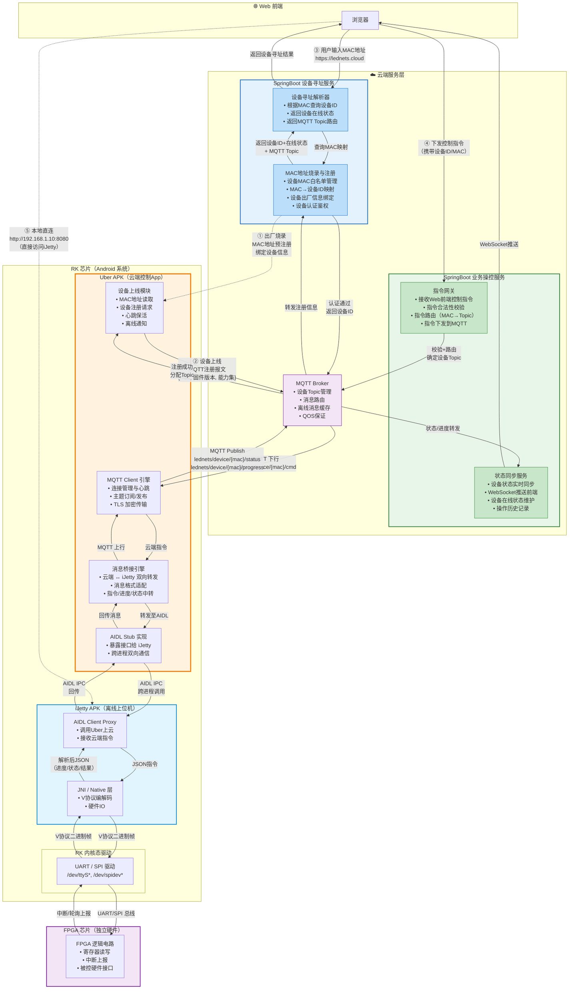
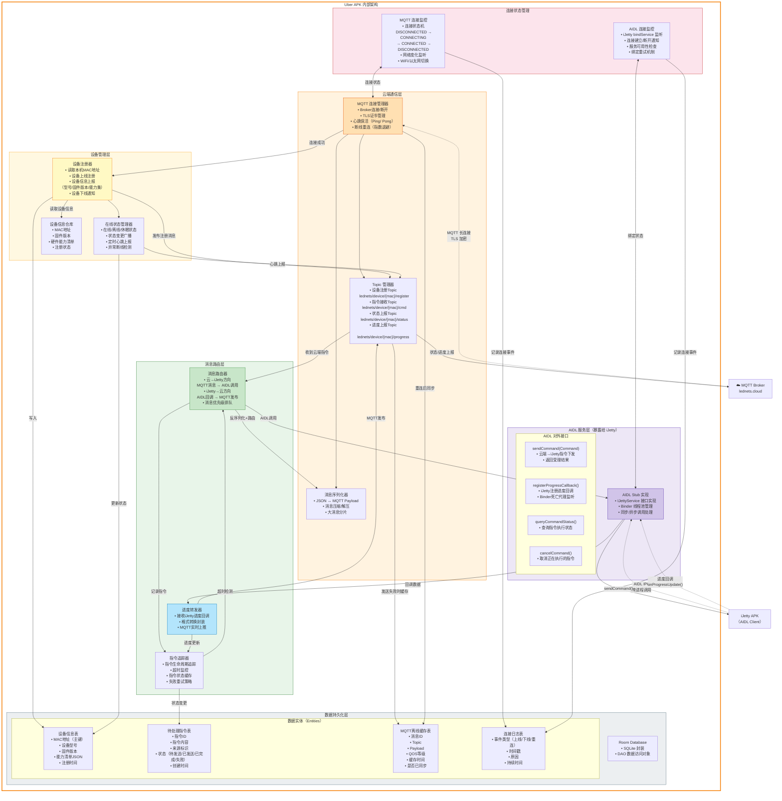

# Uber上云架构

## 系统外部通信架构图

```mermaid
graph TB
    subgraph Web前端["🌐 Web 前端"]
        Browser["浏览器"]
    end

    subgraph 云端服务["☁️ 云端服务层"]

        subgraph 设备寻址服务["SpringBoot 设备寻址服务"]
            MACRegistrar["MAC地址烧录与注册<br/>• 设备MAC白名单管理<br/>• MAC→设备ID映射<br/>• 设备出厂信息绑定<br/>• 设备认证鉴权"]
            AddrResolver["设备寻址解析器<br/>• 根据MAC查询设备ID<br/>• 返回设备在线状态<br/>• 返回MQTT Topic路由"]
        end

        subgraph 业务操控服务["SpringBoot 业务操控服务"]
            CmdGateway["指令网关<br/>• 接收Web前端控制指令<br/>• 指令合法性校验<br/>• 指令路由（MAC→Topic）<br/>• 指令下发到MQTT"]
            StatusSync["状态同步服务<br/>• 设备状态实时同步<br/>• WebSocket推送前端<br/>• 设备在线状态维护<br/>• 操作历史记录"]
        end

        MQTTBroker["MQTT Broker<br/>• 设备Topic管理<br/>• 消息路由<br/>• 离线消息缓存<br/>• QOS保证"]
    end

    subgraph RK芯片["RK 芯片（Android 系统）"]

        subgraph Uber_APK["Uber APK（云端控制App）"]
            direction TB
            MQTT引擎["MQTT Client 引擎<br/>• 连接管理与心跳<br/>• 主题订阅/发布<br/>• TLS 加密传输"]
            DeviceOnline["设备上线模块<br/>• MAC地址读取<br/>• 设备注册请求<br/>• 心跳保活<br/>• 离线通知"]
            AIDL服务端["AIDL Stub 实现<br/>• 暴露接口给 iJetty<br/>• 跨进程双向通信"]
            消息桥接["消息桥接引擎<br/>• 云端 ↔ iJetty 双向转发<br/>• 消息格式适配<br/>• 指令/进度/状态中转"]
        end

        subgraph iJetty_APK["iJetty APK（离线上位机）"]
            AIDL客户端["AIDL Client Proxy<br/>• 调用Uber上云<br/>• 接收云端指令"]
            JNI_Native["JNI / Native 层<br/>• V协议编解码<br/>• 硬件IO"]
        end

        subgraph RK内核["RK 内核态驱动"]
            硬件驱动["UART / SPI 驱动<br/>/dev/ttyS*, /dev/spidev*"]
        end
    end

    subgraph FPGA芯片["FPGA 芯片（独立硬件）"]
        FPGA逻辑["FPGA 逻辑电路<br/>• 寄存器读写<br/>• 中断上报<br/>• 被控硬件接口"]
    end

%% ===== 阶段0：设备MAC烧录（出厂/初始化） =====
    MACRegistrar -.->|"① 出厂烧录<br/>MAC地址预注册<br/>绑定设备信息"| DeviceOnline

%% ===== 阶段1：设备上线注册 =====
    DeviceOnline -->|"② 设备上线<br/>MQTT注册报文<br/>{mac, 固件版本, 能力集}"| MQTTBroker
    MQTTBroker -->|"转发注册信息"| MACRegistrar
    MACRegistrar -->|"认证通过<br/>返回设备ID"| MQTTBroker
    MQTTBroker -->|"注册成功<br/>分配Topic"| DeviceOnline

%% ===== 路径1：Web → 设备寻址服务 → 业务操控服务 =====
    Browser -->|"③ 用户输入MAC地址<br/>https://lednets.cloud"| AddrResolver
    AddrResolver -->|"查询MAC映射"| MACRegistrar
    MACRegistrar -->|"返回设备ID+在线状态<br/>+ MQTT Topic"| AddrResolver
    AddrResolver -->|"返回设备寻址结果"| Browser

%% ===== 路径2：Web → 业务操控服务 → MQTT → Uber =====
    Browser -->|"④ 下发控制指令<br/>（携带设备ID/MAC）"| CmdGateway
    CmdGateway -->|"校验+路由<br/>确定设备Topic"| MQTTBroker
    MQTTBroker -->|"MQTT 下行<br/>lednets/device/{mac}/cmd"| MQTT引擎

%% ===== 路径3：Web本地直连（绕过云端） =====
    Browser -.->|"⑤ 本地直连<br/>http://192.168.1.10:8080<br/>（直接访问iJetty）"| iJetty_APK

%% ===== Uber 内部流转 =====
    MQTT引擎 -->|"云端指令"| 消息桥接
    消息桥接 -->|"转发至AIDL"| AIDL服务端
    AIDL服务端 -->|"AIDL IPC<br/>跨进程调用"| AIDL客户端

%% ===== iJetty → JNI → 硬件 → FPGA =====
    AIDL客户端 -->|"JSON指令"| JNI_Native
    JNI_Native -->|"V协议二进制帧"| 硬件驱动
    硬件驱动 -->|"UART/SPI 总线"| FPGA逻辑

%% ===== FPGA 上报链路 =====
    FPGA逻辑 -->|"中断/轮询上报"| 硬件驱动
    硬件驱动 -->|"V协议二进制帧"| JNI_Native
    JNI_Native -->|"解析后JSON<br/>（进度/状态/结果）"| AIDL客户端
    AIDL客户端 -->|"AIDL IPC<br/>回传"| AIDL服务端
    AIDL服务端 -->|"回传消息"| 消息桥接
    消息桥接 -->|"MQTT 上行"| MQTT引擎
    MQTT引擎 -->|"MQTT Publish<br/>lednets/device/{mac}/status<br/>lednets/device/{mac}/progress"| MQTTBroker
    MQTTBroker -->|"状态/进度转发"| StatusSync
    StatusSync -->|"WebSocket推送"| Browser

%% 样式
    style 设备寻址服务 fill:#e3f2fd,stroke:#1565c0,stroke-width:2px
    style 业务操控服务 fill:#e8f5e9,stroke:#2e7d32,stroke-width:2px
    style Uber_APK fill:#fff3e0,stroke:#f57c00,stroke-width:3px
    style iJetty_APK fill:#e1f5fe,stroke:#0288d1,stroke-width:2px
    style MQTTBroker fill:#f3e5f5,stroke:#7b1fa2
    style FPGA芯片 fill:#f3e5f5,stroke:#7b1fa2,stroke-width:2px
    style MACRegistrar fill:#bbdefb,stroke:#1976d2
    style AddrResolver fill:#bbdefb,stroke:#1976d2
    style CmdGateway fill:#c8e6c9,stroke:#388e3c
    style StatusSync fill:#c8e6c9,stroke:#388e3c
```

## 架构图

```mermaid
graph TB
    subgraph Uber["Uber APK 内部架构"]
        
        subgraph 云端通信层["云端通信层"]
            MQTTManager["MQTT 连接管理器<br/>• Broker连接/断开<br/>• TLS证书管理<br/>• 心跳保活（Ping/ Pong）<br/>• 断线重连（指数退避）"]
            TopicManager["Topic 管理器<br/>• 设备注册Topic<br/>  lednets/device/{mac}/register<br/>• 指令接收Topic<br/>  lednets/device/{mac}/cmd<br/>• 状态上报Topic<br/>  lednets/device/{mac}/status<br/>• 进度上报Topic<br/>  lednets/device/{mac}/progress"]
            MsgSerializer["消息序列化器<br/>• JSON ↔ MQTT Payload<br/>• 消息压缩/解压<br/>• 大消息分片"]
        end

        subgraph 设备管理层["设备管理层"]
            DeviceRegistrar["设备注册器<br/>• 读取本机MAC地址<br/>• 设备上线注册<br/>• 设备信息上报<br/>  （型号/固件版本/能力集）<br/>• 设备下线通知"]
            OnlineStateMgr["在线状态管理器<br/>• 在线/离线/休眠状态<br/>• 状态变更广播<br/>• 定时心跳上报<br/>• 异常断线检测"]
            DeviceInfoRepo["设备信息仓库<br/>• MAC地址<br/>• 固件版本<br/>• 硬件能力清单<br/>• 注册状态"]
        end

        subgraph AIDL服务层["AIDL 服务层（暴露给 iJetty）"]
            AIDLStubImpl["AIDL Stub 实现<br/>• IJettyService 接口实现<br/>• Binder 线程池管理<br/>• 同步/异步调用处理"]
            
            subgraph AIDL接口["AIDL 对外接口"]
                SendCmd["sendCommand(Command)<br/>• 云端→iJetty指令下发<br/>• 返回受理结果"]
                RegCallback["registerProgressCallback()<br/>• iJetty注册进度回调<br/>• Binder死亡代理监听"]
                QueryStatus["queryCommandStatus()<br/>• 查询指令执行状态"]
                CancelCmd["cancelCommand()<br/>• 取消正在执行的指令"]
            end
        end

        subgraph 消息路由层["消息路由层"]
            MsgRouter["消息路由器<br/>• 云→iJetty方向<br/>  MQTT消息 → AIDL调用<br/>• iJetty→云方向<br/>  AIDL回调 → MQTT发布<br/>• 消息优先级排队"]
            
            ProgressForwarder["进度转发器<br/>• 接收iJetty进度回调<br/>• 格式转换封装<br/>• MQTT实时上推"]
            
            CmdTracker["指令追踪器<br/>• 指令生命周期追踪<br/>• 超时监控<br/>• 指令状态缓存<br/>• 失败重试策略"]
        end

        subgraph 连接管理["连接状态管理"]
            AIDLConnMonitor["AIDL 连接监控<br/>• iJetty bindService 监听<br/>• 连接建立/断开通知<br/>• 服务可用性检查<br/>• 绑定重试机制"]
            MQTTConnMonitor["MQTT 连接监控<br/>• 连接状态机<br/>  DISCONNECTED → CONNECTING<br/>  → CONNECTED → DISCONNECTED<br/>• 网络变化监听<br/>• WiFi/以太网切换"]
        end

        subgraph 数据持久化层["数据持久化层"]
            RoomDB["Room Database<br/>• SQLite 封装<br/>• DAO 数据访问对象"]
            
            subgraph 数据实体["数据实体（Entities）"]
                DeviceEntity["设备信息表<br/>• MAC地址（主键）<br/>• 设备型号<br/>• 固件版本<br/>• 能力清单JSON<br/>• 注册时间"]
                PendingCmd["待处理指令表<br/>• 指令ID<br/>• 指令内容<br/>• 来源标识<br/>• 状态（待发送/已发送/已完成/失败）<br/>• 创建时间"]
                MQTTOfflineCache["MQTT离线缓存表<br/>• 消息ID<br/>• Topic<br/>• Payload<br/>• QOS等级<br/>• 缓存时间<br/>• 是否已同步"]
                ConnLog["连接日志表<br/>• 事件类型（上线/下线/重连）<br/>• 时间戳<br/>• 原因<br/>• 持续时间"]
            end
        end

    end

    %% ===== 外部入口 =====
    CloudMQTT["☁️ MQTT Broker<br/>lednets.cloud"] -.->|"MQTT 长连接<br/>TLS 加密"| MQTTManager
    iJettyEntry["iJetty APK<br/>（AIDL Client）"] -.->|"AIDL IPC<br/>跨进程调用"| AIDLStubImpl

    %% ===== 云端通信层内部 =====
    MQTTManager --> TopicManager
    MQTTManager --> MsgSerializer

    %% ===== 设备管理层 =====
    MQTTManager -->|"连接成功"| DeviceRegistrar
    DeviceRegistrar -->|"读取设备信息"| DeviceInfoRepo
    DeviceRegistrar -->|"发布注册消息"| TopicManager
    DeviceRegistrar --> OnlineStateMgr
    OnlineStateMgr -->|"心跳上报"| TopicManager

    %% ===== 云端下行：MQTT → AIDL → iJetty =====
    TopicManager -->|"收到云端指令"| MsgRouter
    MsgRouter -->|"反序列化+路由"| MsgSerializer
    MsgRouter -->|"记录指令"| CmdTracker
    MsgRouter -->|"AIDL调用"| AIDLStubImpl
    AIDLStubImpl -->|"sendCommand()"| iJettyEntry

    %% ===== iJetty上行：AIDL回调 → MQTT =====
    iJettyEntry -.->|"进度回调<br/>onProgressUpdate()"| AIDLStubImpl
    AIDLStubImpl -->|"回调数据"| ProgressForwarder
    ProgressForwarder -->|"进度更新"| CmdTracker
    ProgressForwarder -->|"MQTT发布"| TopicManager
    TopicManager -->|"状态/进度上报"| CloudMQTT

    %% ===== 指令追踪 → 持久化 =====
    CmdTracker -->|"状态变更"| PendingCmd
    CmdTracker -->|"超时检测"| MsgRouter

    %% ===== 连接监控 =====
    AIDLConnMonitor <-->|"绑定状态"| AIDLStubImpl
    MQTTConnMonitor <-->|"连接状态"| MQTTManager
    
    %% ===== 连接事件日志 =====
    MQTTConnMonitor -->|"记录连接事件"| ConnLog
    AIDLConnMonitor -->|"记录连接事件"| ConnLog

    %% ===== 离线缓存 =====
    TopicManager -->|"发送失败时缓存"| MQTTOfflineCache
    MQTTManager -->|"重连后同步"| MQTTOfflineCache

    %% ===== 设备信息持久化 =====
    DeviceRegistrar -->|"写入"| DeviceEntity
    OnlineStateMgr -->|"更新状态"| DeviceEntity

    %% 样式
    style Uber fill:#ffffff,stroke:#f57c00,stroke-width:3px
    style 云端通信层 fill:#fff3e0,stroke:#f57c00
    style 设备管理层 fill:#fff8e1,stroke:#f9a825
    style AIDL服务层 fill:#ede7f6,stroke:#5e35b1
    style 消息路由层 fill:#e8f5e9,stroke:#2e7d32
    style 连接管理 fill:#fce4ec,stroke:#c62828
    style 数据持久化层 fill:#eceff1,stroke:#546e7a
    style MQTTManager fill:#ffe0b2,stroke:#e65100
    style AIDLStubImpl fill:#d1c4e9,stroke:#512da8
    style MsgRouter fill:#c8e6c9,stroke:#388e3c
    style ProgressForwarder fill:#b3e5fc,stroke:#0277bd
    style DeviceRegistrar fill:#fff9c4,stroke:#f57f17
```

