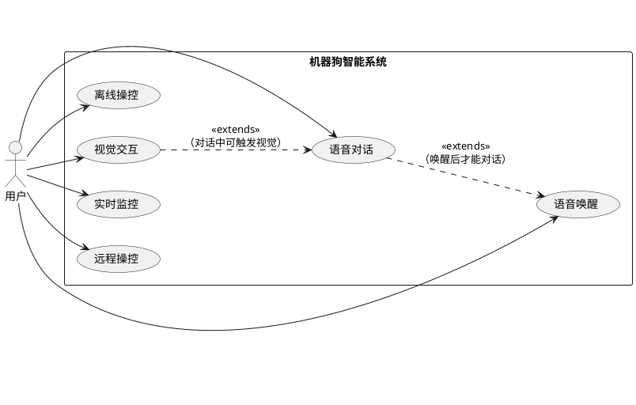

# 01 软件工程方法与需求

## 1. 软件过程模型

`Vector` 机器狗采用“迭代增量 + 里程碑验收”模式，而不是一次性瀑布：

- **硬件与AI耦合高**：舵机控制、音视频链路、模型效果都需要边做边调。
- **需求波动大**：交互体验类需求（表情、动作风格、语气）无法一次定义完全。
- **风险前置**：优先打通 `Wakeup -> STT/VL -> LLM -> Act` 主链路，尽早暴露系统瓶颈。

阶段划分：

1. `M1` 链路打通（可跑）
2. `M2` 体验可用（可演示）
3. `M3` 稳定可运维（可上线）
4. `M4` 持续演进（可扩展）

## 2. 需求分析与用例建模

### 2.1 角色与目标

- 用户：唤醒机器狗、下达语音或远程指令、查看历史与实时画面。
- 运维开发者：观察系统状态、回放问题、灰度升级。
- AI服务：提供 STT、VL、LLM、TTS 推理能力。

### 2.2 高价值用例

- **UC-01 语音对话**：用户唤醒后提问，机器狗语音回复并伴随动作。
- **UC-02 视觉理解**：机器狗识别当前环境并给出反馈。
- **UC-03 远程操控**：Flutter 端低时延下发动作指令。
- **UC-04 离线操控**：局域网/BLE 条件下完成基本控制。

## 3. 系统架构选型与设计原则

设计原则：

- **分层解耦**：设备执行、云端智能、客户端展示分层。
- **协议按场景选型**：视频与控制分离，避免单协议过载。
- **可退化运行**：云端不可用时保留离线控制最小能力。
- **可观测优先**：链路必须可追踪、可定位、可回放。

## 4. 测试用例设计与验证方案

### 4.1 测试金字塔

- 单元测试：运动指令解析、协议编解码、缓存策略。
- 集成测试：Core Apk 与 JNI/AIDL、SpringBoot 与模型服务。
- 端到端测试：唤醒到执行全链路时延和成功率。

### 4.2 关键验收指标

- 语音唤醒成功率 `>= 98%`
- 指令执行成功率 `>= 99%`
- 远程控制 P95 延迟 `< 300ms`
- 崩溃率 `< 0.5%/day`

## 5. 软件质量与可维护性设计

- **可扩展性**：动作策略、表情模板、Prompt 模板配置化。
- **可维护性**：模块边界清晰，接口版本化。
- **可测试性**：引入仿真器，支持“无硬件回归”。
- **可运维性**：统一日志规范，链路 TraceID 贯穿端云。

## 6. 面试高频问答（本章）

- 问：为什么不用瀑布模型？
  - 答：机器人系统软硬件耦合且不确定性高，迭代能更快识别风险并控制返工成本。
- 问：如何定义需求完成？
  - 答：采用“功能完成 + SLO 达标 + 回归通过”三维验收，不只看功能点。
- 问：可维护性怎么落地？
  - 答：模块化分层、接口契约化、配置中心化、可观测标准化四件套。
