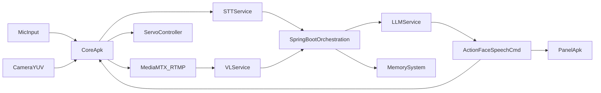

# 02 结构化分析与模块设计

## 1. 数据流图设计（DFD）

## 2. 数据字典设计（核心对象）

- `WakeupEvent`: 唤醒词、时间戳、设备ID、环境噪声等级。
- `SttResult`: 文本、置信度、分词、语言标签。
- `VlResult`: 场景标签、目标对象、动作建议。
- `ActionCommand`: 动作ID、关节角度序列、速度、持续时间。
- `FaceCommand`: 表情ID、过渡时间、优先级。
- `DialogueRecord`: 用户输入、模型输出、动作与表情回放索引。

## 3. 系统体系结构设计（结构化视角）

- **输入模块**：语音采集、视频采集。
- **预处理模块**：编码、降噪、切片、缓存。
- **推理编排模块**：聚合 STT + VL，上下文构造，调用 LLM。
- **执行模块**：动作控制、语音播报、表情渲染。
- **记录模块**：会话日志、向量索引、图谱关系。

## 4. 模块设计（职责与边界）

| 模块 | 输入 | 输出 | 职责 |
|---|---|---|---|
| CaptureModule | Mic/Camera | AudioChunk/VideoFrame | 设备采集与缓冲 |
| InferenceGateway | Audio/Video | STT/VL result | AI 服务调用与重试 |
| DecisionEngine | STT+VL+Memory | Commands | 策略决策与冲突仲裁 |
| MotionRuntime | ActionCommand | GPIO Signal | 舵机轨迹执行 |
| EmotionRuntime | FaceCommand | MIPI Frame | 表情渲染调度 |
| SessionStore | Events | Queryable records | 会话持久化与检索 |

## 5. 结构化风险与降级

- STT 慢：启用“先视觉反馈后语义回复”策略。
- VL 超时：仅语音链路回复并标记视觉降级。
- 指令冲突：动作命令优先级高于表情命令，表情可中断。

## 6. 面试高频问答（本章）

- 问：结构化设计里模块如何划分？
  - 答：按输入处理、决策、执行、存储四个稳定职责域划分，减少跨域耦合。
- 问：数据字典的价值是什么？
  - 答：统一语义边界，避免团队对同一字段含义理解不一致，降低联调成本。
