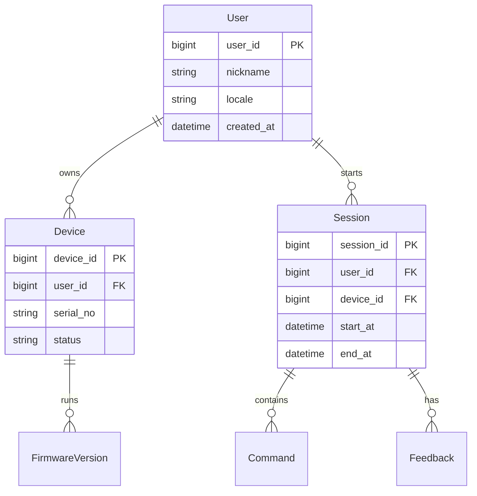

# 03 数据库与记忆系统设计

## 1. 数据库需求分析

记忆系统需要同时满足：

- **事务一致性**：设备、用户、会话元数据。
- **高吞吐写入**：实时会话日志与指令流水。
- **关系推理**：实体关系、长期偏好图谱。
- **语义检索**：历史对话与知识向量召回。

## 2. 概念结构设计策略与方法

采用“多模型协同存储”：

- `MySQL`：主数据与强一致关系。
- `MongoDB`：JSON 会话与事件流水。
- `Neo4j`：用户偏好、实体关系图。
- `Milvus`：文本与多模态向量索引。

## 3. E-R 概念模型（MySQL）

## 4. 逻辑结构设计

### 4.1 MySQL（核心表）

- `t_user`, `t_device`, `t_session`, `t_command`, `t_feedback`, `t_firmware`
- 索引策略：
  - `t_session(user_id, start_at desc)`
  - `t_command(session_id, created_at)`

### 4.2 MongoDB（会话文档）

- `conversation_event`：按 `device_id + day` 分桶。
- 文档字段：原始 STT、VL、LLM 输入输出、上下文快照、耗时。

### 4.3 Neo4j（知识图谱）

- 节点：`User`, `Habit`, `Object`, `Place`, `Emotion`
- 关系：`PREFERS`, `MENTIONED_IN`, `SEEN_AT`, `TRIGGERS`

### 4.4 Milvus（向量）

- Collection：`dialogue_embedding`, `vision_embedding`
- 分区：按 `user_id hash` 或 `device_group`。

## 5. 物理设计、分库分表与冷热分层

- MySQL：按用户量级做水平分库；按会话时间做分区。
- MongoDB：TTL 索引清理中间态日志，长期记录归档对象存储。
- Milvus：热向量保留最近 30 天，冷向量降采样保留摘要。

## 6. 缓存与文件存储设计

- `Redis`：
  - 会话上下文缓存（短 TTL）
  - 设备在线状态缓存
  - 幂等键与限流桶
- 文件存储：
  - 音频片段与关键帧归档对象存储（按天分层）

## 7. 实施与维护

- Schema 版本化迁移（Flyway/Liquibase）
- 备份策略：全量 + 增量 + 跨区副本
- 演练策略：季度恢复演练，恢复时间目标 `RTO < 30min`

## 8. 面试高频问答（本章）

- 问：为什么用多数据库？
  - 答：不同负载类型在一致性、查询模式和扩展性上诉求冲突，多模型是成本与性能平衡解。
- 问：如何做冷热分层？
  - 答：按访问频次和时效性切分，热数据保障低延迟，冷数据降本并支持离线分析。
