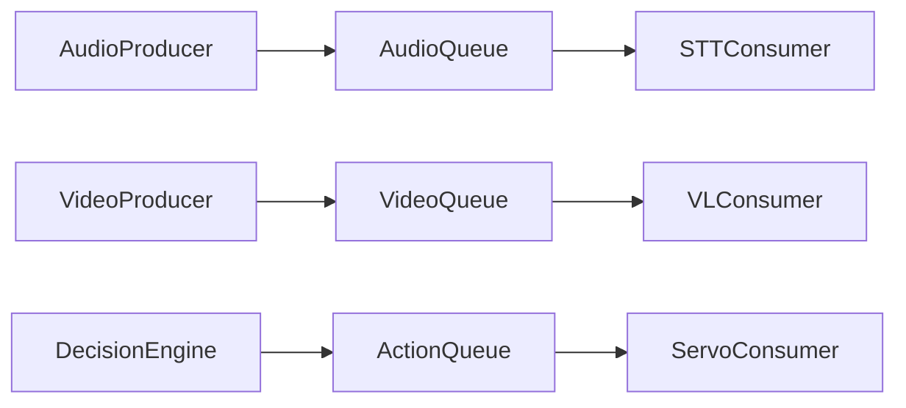

# 04 并发线程与任务调度设计

## 1. 耗时任务分析拆解

设备端耗时任务：

- 音频采集与编码（持续 IO）
- 视频采集、编码、推流（高带宽 IO）
- 舵机轨迹控制（实时控制）
- AIDL 表情渲染（UI/IPC）

云端耗时任务：

- 多模型调用（网络 IO + 外部依赖）
- 记忆检索（向量检索 + 图查询）
- 策略编排（CPU + IO 混合）

## 2. 同步异步设计与甘特图

```mermaid
gantt
  title VoiceVisionActionTimeline
  dateFormat  X
  axisFormat %L
  section Device
  WakeupDetect        :a1, 0, 80
  AudioUpload         :a2, 80, 300
  RtmpPush            :a3, 80, 500
  section Cloud
  STTInference        :b1, 120, 250
  VLInference         :b2, 150, 280
  LLMDecision         :b3, 300, 350
  section Execute
  MotionExecute       :c1, 650, 250
  TTSPlay             :c2, 650, 400
  FaceRender          :c3, 650, 220
```

## 3. 进程与跨进程通信设计

- `Core Apk <-> Panel Apk`：AIDL
- `Core Apk <-> Native C++`：JNI
- `SpringBoot <-> Core`：MQTT/HTTP

IPC 设计要点：

- 接口幂等（同一命令重复下发不重复执行）
- 限时响应（防止跨进程堵塞）
- 异常隔离（Panel 崩溃不拖垮 Core）

## 4. CPU密集与IO密集线程设计

- IO 线程池：音视频采集、推流、网络请求
- CPU 线程池：指令解析、轨迹插值、策略计算
- 主线程仅负责状态编排与轻量事件分发

## 5. 线程间通信与锁设计

- 采用无锁队列或 `BlockingQueue` 做音视频事件通道。
- 舵机资源使用细粒度锁（按关节组）。
- 关键共享变量使用原子类型 + 可见性语义。

## 6. 生产者消费者模型

## 7. 线程池设计与场景化配置

- `pool_io_capture`：核心数 * 2，队列有界，拒绝策略丢弃最旧视频帧。
- `pool_ai_gateway`：固定线程，外部调用带超时。
- `pool_motion_rt`：单线程高优先级，保证动作顺序。

## 8. 守护线程

- 心跳线程：上报设备在线状态。
- 监控线程：检测关键队列积压与时延异常。
- 自愈线程：检测卡死任务并触发重启策略。

## 9. 面试高频问答（本章）

- 问：如何避免线程池把内存打爆？
  - 答：有界队列 + 反压 + 拒绝策略 + 按业务优先级丢弃低价值任务。
- 问：实时控制为什么建议单线程？
  - 答：动作顺序强依赖，单线程可降低锁竞争和乱序风险。
