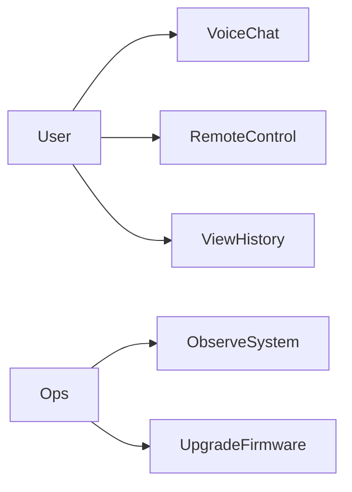
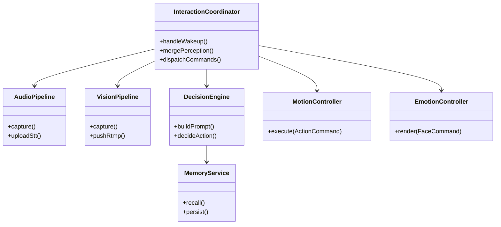
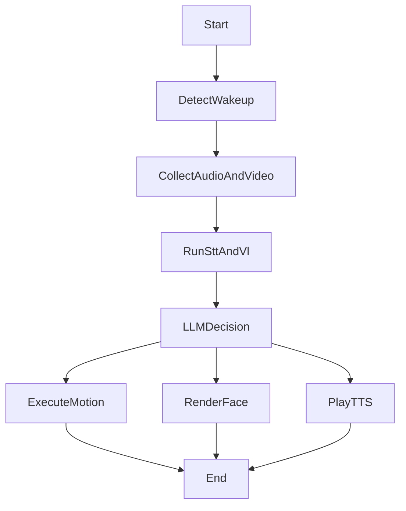
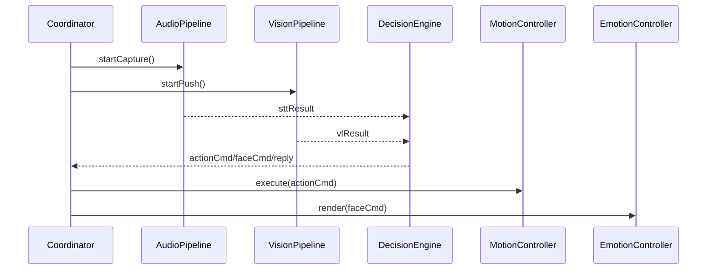
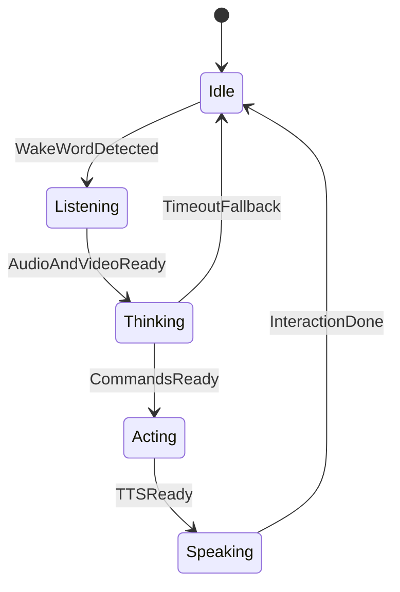

# 05 OOAD与UML建模

## 1. 面向对象分析与设计步骤

1. 识别参与者与用例
2. 提炼领域对象与边界对象
3. 建立对象协作关系
4. 定义状态与生命周期
5. 归纳设计模式并固化接口

## 2. 用例图设计

## 3. 类图设计

## 4. 活动图设计（核心交互）

## 5. 时序图设计（对象交互）

## 6. 对象状态设计（机器人会话态）

## 7. 设计模式应用

- 策略模式：动作策略、表情策略可插拔。
- 观察者模式：事件总线解耦采集、推理、执行。
- 命令模式：动作指令标准化、可回放、可撤销。
- 工厂模式：不同协议客户端统一创建。

## 8. 面试高频问答（本章）

- 问：类图和时序图分别解决什么问题？
  - 答：类图看静态结构，时序图看动态协作，二者组合才能完整描述系统。
- 问：为何使用命令模式？
  - 答：动作请求天然是“可排队、可重放、可审计”的命令对象。
