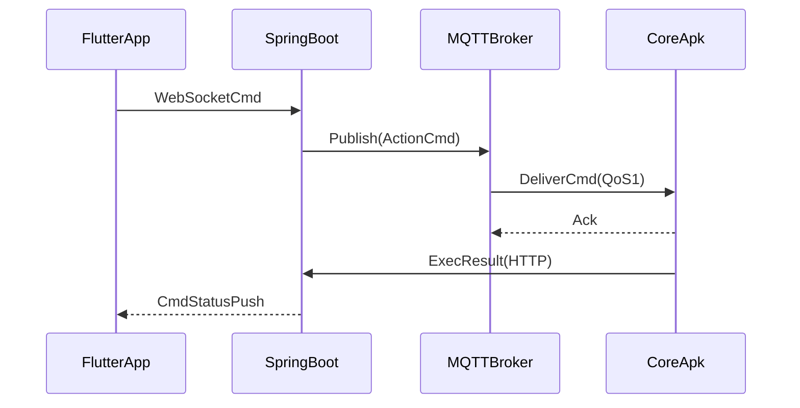

# 07 网络协议与传输可靠性设计

## 1. 业务场景协议选型设计

- **RTMP**：设备端视频上行推流（持续高吞吐）。
- **MQTT**：云到设备动作指令下发（低带宽、低时延、QoS）。
- **HTTP**：配置、查询、任务管理与结果上报。
- **WebSocket**：Flutter 与云端实时双向交互。
- **UDP/BLE**：离线近场控制与低成本数据传输。

## 2. TCP/UDP 场景适配与取舍

- TCP 适合：可靠命令、管理接口、业务日志。
- UDP 适合：局域网实时画面和短指令（可容忍少量丢包）。
- BLE 适合：弱网或无网下的基础控制信道。

## 3. 协议设计（现有协议 + 自定义帧）

### 3.1 自定义控制帧（UDP）

```text
| Magic(2B) | Version(1B) | MsgType(1B) | Seq(4B) | DeviceId(8B) | PayloadLen(4B) | Payload(N) | CRC32(4B) |
```

设计目标：

- 快速校验、乱序重排、重放检测、向后兼容。

### 3.2 文件分片与断点续传

- 固件包分片：固定 chunk 大小 + 分片哈希校验。
- 断点续传：记录 `fileId + offset + checksum`。

## 4. 传输加密与数据校验

- 外网通道：TLS1.2+，服务端证书轮换。
- MQTT：双向认证（设备证书/Token）。
- UDP：帧级签名 + CRC 双重校验。

## 5. 超时、重传、乱序处理

- 超时：分层超时（网络连接、服务响应、业务执行）。
- 重传：指数退避 + 最大重试次数。
- 乱序：基于 `Seq` 的窗口重排，超窗丢弃。

## 6. 跨域、网关、内外网穿透

- 外部请求统一走 API Gateway，统一鉴权与限流。
- 设备连接使用 MQTT Broker 集群，支持内网出口统一接入。
- 远程调试链路通过受控跳板，避免直连设备。

## 7. 协议时序图（远程操控）



## 8. 面试高频问答（本章）

- 问：为什么控制不用纯 HTTP？
  - 答：HTTP 更适合请求响应，持续控制和实时下发在连接保持、时延、状态推送上不如 MQTT/WebSocket。
- 问：UDP 怎么保证可靠性？
  - 答：用序号、窗口、重传、校验和幂等处理在应用层补齐可靠性。
