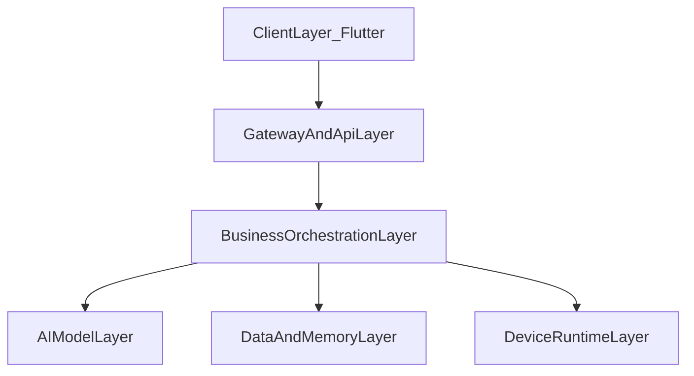

# 08 系统架构与高可用设计

## 1. 系统架构概述

系统采用“端-云-端”闭环架构：

- 设备端负责感知与执行。
- 云端负责推理编排与记忆系统。
- 客户端负责交互与运维可视化。

## 2. 高可用、高可靠、可扩展设计

### 2.1 高可用

- SpringBoot 多实例部署 + 负载均衡。
- MQTT Broker 集群化与会话持久化。
- MediaMTX 主备或集群部署。

### 2.2 高可靠

- 指令幂等、消息去重、结果回执。
- 关键数据多副本与周期备份。
- 失败降级：视觉超时回退语音链路。

### 2.3 可扩展

- 模型网关化，支持替换 STT/VL/LLM/TTS 提供方。
- 动作与表情策略插件化。
- 多租户与多设备分域扩展。

## 3. 分层架构

## 4. C/S 与 B/S 架构设计

- **C/S（设备控制）**：Flutter App 类客户端直接感知实时交互。
- **B/S（管理平台）**：运维后台可采用 Web 管理界面，便于跨端访问。

## 5. 微服务架构建议

建议拆分：

- `orchestration-service`
- `memory-service`
- `device-gateway-service`
- `ops-observability-service`

拆分原则：按业务边界和伸缩特征拆，不按技术层盲目拆。

## 6. 系统维护与升级

- 设备端升级：A/B 分区 + 灰度发布 + 回滚开关。
- 服务端升级：蓝绿/金丝雀发布。
- 配置变更：配置中心 + 审计。

## 7. Linux 升级脚本设计要点

- 升级前：备份当前包和配置，校验磁盘空间。
- 升级中：校验包哈希，分步替换，可中断恢复。
- 升级后：健康检查失败自动回滚。

## 8. 面试高频问答（本章）

- 问：高可用和高可靠区别？
  - 答：高可用关注“服务是否在线”，高可靠关注“结果是否正确且可恢复”。
- 问：微服务一定更好吗？
  - 答：不是，复杂度会升高；只有在团队规模、独立伸缩、边界清晰时才值得拆。
