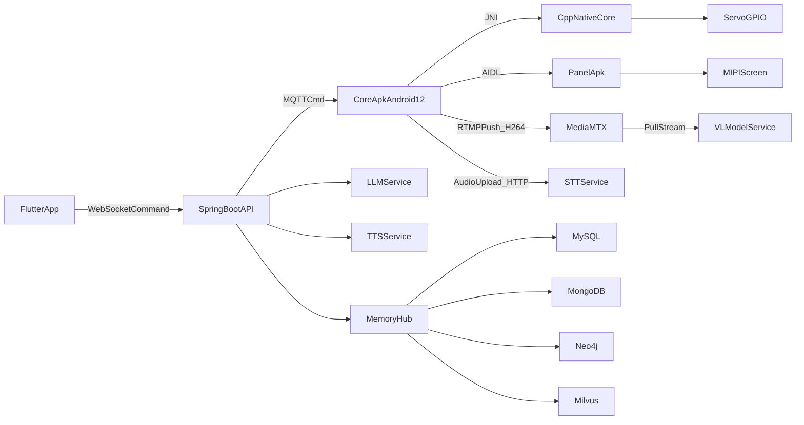
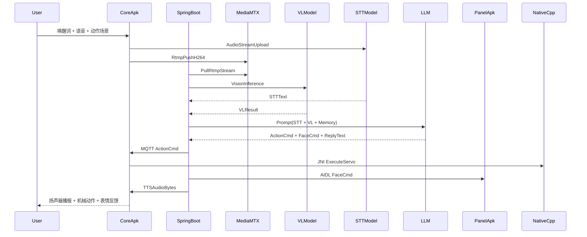

# Vector机器狗设计文档

## 1. 文档目标

本文档用于同时服务两个目标：

- 项目落地：给出可实现、可演进、可运维的 `Vector` 机器狗系统设计。
- 面试复习：把软件系统分析与设计高频知识点映射到本项目的真实场景，形成“能讲清取舍”的回答素材。

## 2. 设计范围

本设计覆盖三大域：

- **设备端（RK3588 + Android12）**：语音唤醒、音视频采集、JNI 运动控制、前面板表情控制。
- **云端（SpringBoot + AI服务）**：多模态推理编排、记忆系统、策略与指令下发。
- **客户端（Flutter）**：远程监控、历史回看、实时与离线操控。

## 3. 约束与非功能目标

### 3.1 关键约束

- 硬件：`RK3588`，8 路舵机 GPIO，摄像头、麦克风、扬声器、MIPI 屏。
- 系统：`Android 12` 系统应用形态，`Core Apk` 与 `Panel Apk` 分离。
- 协议：RTMP、MQTT、HTTP、WebSocket、UDP、BLE 并存。
- 模型：语音唤醒离线，STT/VL/LLM/TTS 主要依赖云端。

### 3.2 非功能目标（SLO）

- 语音唤醒到首帧回复：`P95 < 2.5s`
- 远程操控指令下发到执行：`P95 < 300ms`（公网）/ `P95 < 120ms`（局域网）
- 设备日常可用性：`>= 99.5%`
- 关键链路可观测性：日志、指标、追踪三件套齐备

## 4. 系统总体架构

## 5. 核心业务主链路（语音+视觉+动作）

## 6. 逻辑分层

- **设备感知层**：音频采集、视频采集、传感器数据。
- **设备执行层**：JNI/C++ 舵机控制、AIDL 前面板控制。
- **云端智能层**：STT、VL、LLM、TTS 编排与策略控制。
- **记忆与知识层**：关系数据、会话日志、图谱、向量检索。
- **交互与运维层**：Flutter 控制台、监控、告警、灰度发布。

## 7. 文档导航（主文档 + 子文档）

### 7.1 主文档阅读建议

- 第一步：阅读本文档，建立全局架构与链路认知。
- 第二步：按面试主题进入对应子文档深挖。
- 第三步：回到本文档“面试速记总表”进行冲刺复习。

### 7.2 子文档索引

- [01-软件工程方法与需求](./01-软件工程方法与需求.md)
- [02-结构化分析与模块设计](./02-结构化分析与模块设计.md)
- [03-数据库与记忆系统设计](./03-数据库与记忆系统设计.md)
- [04-并发线程与任务调度设计](./04-并发线程与任务调度设计.md)
- [05-OOAD与UML建模](./05-OOAD与UML建模.md)
- [06-数据结构算法与性能设计](./06-数据结构算法与性能设计.md)
- [07-网络协议与传输可靠性设计](./07-网络协议与传输可靠性设计.md)
- [08-系统架构与高可用设计](./08-系统架构与高可用设计.md)
- [09-接口设计与安全治理](./09-接口设计与安全治理.md)

## 8. 面试知识点映射索引

- 软件工程设计方法论 -> `01`
- 结构化分析与设计 -> `02`
- 数据库分析与设计 -> `03`
- 进程与线程设计 -> `04`
- 面向对象分析与设计 -> `05`
- 数据结构与算法设计 -> `06`
- 网络架构设计 -> `07`
- 系统架构设计 -> `08`
- 系统接口设计 -> `09`

## 9. 里程碑与交付策略

- `M1`: 设备链路打通（唤醒->识别->回复->动作）
- `M2`: 记忆系统上线（多存储协同）
- `M3`: 远程监控与操控稳定化
- `M4`: 高可用、灰度、运维体系完善

## 10. 面试速记总表（每章高频问答）

### 10.1 软件工程

- 问：为什么选迭代增量而不是一次性瀑布？
  - 答：设备端与 AI 服务耦合度高，需求不确定性大，迭代可降低一次性集成风险。

### 10.2 架构与协议

- 问：为什么 RTMP + MQTT + HTTP/WebSocket 混合？
  - 答：视频流需要持续吞吐，控制指令需要低时延可靠投递，管理接口需要标准化可维护性。

### 10.3 数据与记忆

- 问：为什么不是单库？
  - 答：关系查询、文档日志、图关联、向量检索负载模型不同，单库会导致性能与表达力同时受限。

### 10.4 并发与稳定性

- 问：怎样避免音视频与舵机控制互相抢资源？
  - 答：分线程池 + 优先级 + 限流 + 背压，控制链路独立于推流链路并设置超时熔断。