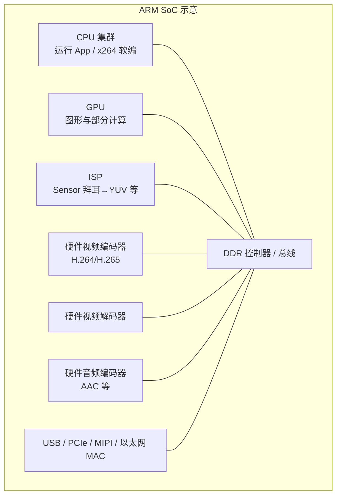

# 计算机组成原理

> 本篇按经典教材结构梳理计算机硬件体系，便于理解 **SoC 上的 CPU、专用加速器与流媒体硬编** 的关系。参考思路对齐常见课程脉络：信息的表示 → 运算 → 存储 → 指令与 CPU → I/O → 存储层次 → 并行。

---

## 1. 计算机系统的抽象层次

```text
应用软件（播放器、编码器 App）
    ↓ 系统调用 / JNI / Binder
操作系统（进程调度、内存管理、驱动框架）
    ↓ 驱动（Camera HAL、Codec、GPU）
硬件（CPU + 内存 + I/O + 片上加速器）
```

---

## 2. 冯·诺依曼结构与五大部件

```text
┌─────────┐     地址/数据/控制      ┌─────────┐
│   CPU   │◄──────────────────────►│ 主存储器 │
└────┬────┘                        └────┬────┘
     │                                   │
     └───────────────┬───────────────────┘
                     │ I/O 总线
              ┌──────▼──────┐
              │ 输入/输出设备 │
              └─────────────┘
```

- **运算器（ALU）**：算术与逻辑运算  
- **控制器**：取指、译码、发出控制信号  
- **存储器**：指令与数据（冯·诺依曼：同一地址空间；哈佛结构缓存常见）  
- **输入设备 / 输出设备**：相机传感器、显示屏、网卡等  

**指令执行（简化）**：取指 → 译码 → 取数 → 执行 → 写回。

---

## 3. 存储层次结构（与流媒体强相关）

```text
寄存器 ─► Cache(L1/L2/L3) ─► 主存(DRAM) ─► 外部存储 / 网络缓冲
   ↑快小贵                           ↑慢大便宜
```

大分辨率 YUV 帧、编码环形缓冲区都落在 **DRAM + Cache**；带宽不足时 CPU 会忙于搬运数据。

---

## 4. 指令集与 ISA（以 ARM 为重点）

- **ISA**：指令编码、寄存器约定、访存模型  
- **ARMv8-A**：64 位通用寄存器，NEON SIMD（可做部分像素运算加速）  
- **特权级**：EL0（应用）→ EL1（内核）→ … 驱动与硬件交互在内核/厂商 HAL  

Android **MediaCodec** 最终由厂商实现把任务交给 **硬件视频编码器 IP**（不同芯片命名不同：Video Codec Engine、VPU 等），应用侧只看到 Binder + Codec2/MediaCodec API。

---

## 5. 现代 SoC 粗略架构（ARM + 专用模块）

以下示意图强调「通用 CPU」与「专用音视频硬件」并存（细节因芯片而异）。



说明：

- **软编（x264 / FAAC）**：主要在 **CPU** 上跑，占 CPU 时间高、耗电大。  
- **硬编（MediaCodec）**：工作主要由 **VENC/AENC 硬件 + 驱动/DMA** 完成，CPU 负责配置与搬运缓冲，通常 **CPU 占用显著更低**（具体倍数与分辨率、码率、机型相关，不宜写死单一数字；常见观察是同档位手机硬编视频编码 CPU 占用可低于软编数倍）。  
- **ISP**：负责把 Sensor 原始数据变成 YUV 等；部分平台预览可走 GPU/Overlay，不一定经过 Java 层逐字节拷 YUV。

---

## 6. “DSP” 与 Android 硬编的关系（概念对齐）

口语里常说「DSP 硬编」，严格区分：

| 说法 | 更精确的含义 |
|------|----------------|
| DSP | 数字信号处理器，常见于基带/音频（如部分高通 Hexagon） |
| 视频硬编 | 多为独立 **Video Encoder IP**，由 Codec2/OMX 驱动调度 |
| NEON | CPU 上的 SIMD 单元，可做 YUV 处理加速但不是“硬编”本身 |

学习路径：**组成原理（数据搬运与并行） → OS（调度与缓冲） → MediaCodec（API 到 HAL） → 厂商编码器**。

---

## 7. MediaCodec 在体系结构视角下的位置

```text
App(Java/Kotlin)
  MediaCodec.configure/start
       ↓ Binder
framework MediaCodec / Codec2
       ↓ HAL
Vendor Codec Component（OMX / Codec2）
       ↓ 寄存器/DMA
硬件编码器 ←→ DDR 中的输入输出缓冲
```

---

## 8. 与本仓库流媒体文档的关系

理解本章有助于回答：

- 为什么软编发热、占 CPU？  
- 为什么硬编省 CPU？瓶颈转移到哪里（内存带宽、编码器队列）？  
- 为什么弱网要降分辨率/帧率（减少像素吞吐与码率）？

详见项目笔记：`../Media/Media.md` 中与 MediaCodec、采集、性能策略交叉引用。
