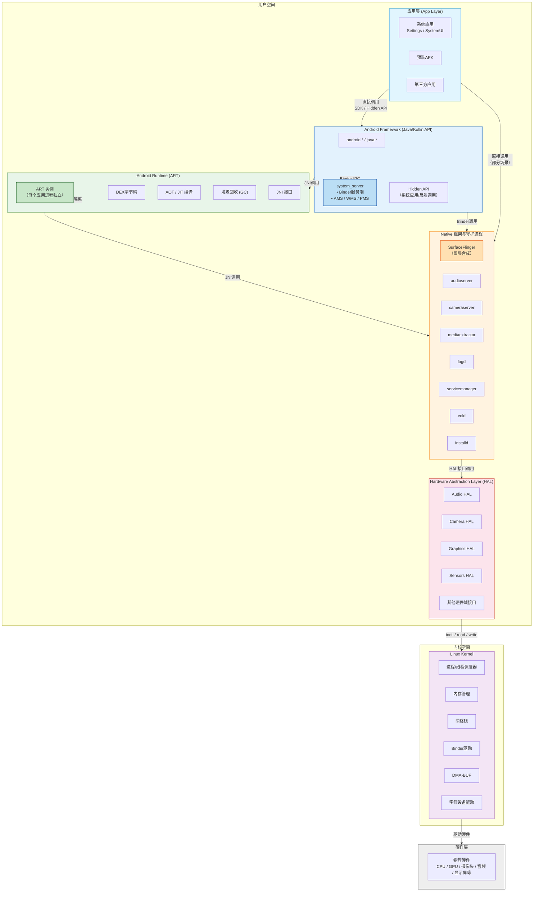

# Android Framework

> 官方架构入口：[Android Open Source Project — Architecture](https://source.android.com/docs/core/architecture)。

## 目录


---

## AOSP 软件栈（自顶向下）

```text
App（APK）
   ↓（直接调用）
Framework（Java，AOSP 的一部分）
   ↓（JNI 调用）
Native（C/C++，AOSP 的一部分）
   ↓
HAL（硬件抽象层，AOSP 的一部分）
   ↓
Kernel（Linux 内核，不属于 AOSP 源码包）
```




**应用层**：系统应用（Settings、SystemUI）、预装 APK、第三方应用；使用 SDK / 部分 **hidden API**（系统应用或反射，受限制）。

**Android Framework（Java/Kotlin API）**：`android.*`、`java.*`；应用进程通过 Binder 调用 **system_server** 中的服务实现。

**Android Runtime（ART）**：DEX、AOT/JIT、GC、JNI；每个应用进程独立 ART。

**Native 框架与守护进程**：`SurfaceFlinger`（合成）、`logd`、`servicemanager`、`vold`、`installd`、`audioserver`、`cameraserver`、`mediaextractor` 等（随版本调整）。

**Hardware Abstraction Layer（HAL）**：按硬件域划分接口（Audio、Camera、Graphics…），实现通常在 **vendor** 分区，对接内核驱动。

**Linux Kernel**：进程/线程调度、内存管理、网络栈、Binder 驱动、驱动模型（字符设备、DMA-BUF 等）。

## 启动流程（简化链路）

**Boot ROM → Bootloader → Kernel → init（pid 1）**

**init**：解析 `.rc` 脚本（`init.rc`、片段、`vendor`/`odm` 等），挂载分区、`selinux` 初始化、启动核心守护进程。

**Zygote**：VM 预初始化；监听请求 fork **应用进程**与 **system_server**（按版本启动顺序略有差异，常见描述：`start zygote` → `start system_server`）。

**system_server**：Java 层 **SystemServer**，拉起 **ActivityManagerService、WindowManagerService、PackageManagerService、PowerManagerService** 等大量 **XXXService**，注册到 **ServiceManager**。

**SystemUI / Launcher**：随后进入交互界面；自动开机 APK、不息屏等定制常改 **AMS/PMS/SystemUI/Power**（见本文末节备忘）。

---

## init 与 *.rc

- **触发器**：`on boot`、`on property:`、`service` 定义。
- **重要属性**：`sys.boot_completed`、`service.*` 状态；定制开机任务常 **等待属性** 再启动脚本或 APK（比硬改 Java 更稳的场景也存在）。
- **分区挂载**：`fstab`、动态分区 **super**、**AVB** 校验。

---

## Zygote

- **socket 通信**：`zygote` 接收 `ActivityThread` 创建请求。
- **预加载**：类与资源预加载列表影响内存与启动速度。
- **架构**：32/64 位可有独立 Zygote（`zygote64`）。

---

## System Server 与系统服务（Framework 核心）

**进程**：`system`（常见进程名 `system_server`），单进程内多线程服务。

**代表性服务（名称随版本迁移，路径多在 `frameworks/base/services`）**

- **ActivityManagerService（AMS）**：Activity 栈、进程生命周期、任务调度。
- **WindowManagerService（WMS）**：窗口层级、焦点、输入分发与 Surface 协作。
- **PackageManagerService（PMS）**：安装、权限、组件解析。
- **PowerManagerService**：休眠、唤醒锁、屏幕超时。
- **InputManager**：按键、触摸路由。
- **AlarmManager、JobScheduler、NotificationManager** 等。

**阅读源码入口**：`frameworks/base/services/java/com/android/server/SystemServer.java`（启动链路与服务注册）。

---

## Binder 与 ServiceManager

- **应用 → 系统服务**：通过 **ServiceManager** / **ServiceLocator**（新版本）查找 Binder 代理。
- **native servicemanager**：名字服务；`hwservicemanager` / `vndservicemanager`（Vendor HAL）。
- **调试**：`service list`、`dumpsys`。

---

## HAL 与 Project Treble

**动机**：系统镜像（Google / OEM）与 **Vendor** 驱动解耦，加快升级。

**HIDL（历史）→ AIDL HAL（演进）**：接口定义从 HIDL 逐步迁移到 **稳定 AIDL**（依芯片与 Android 大版本）。

**VINTF manifest**：设备声明提供的 HAL 版本；**VTS** 验证供应商实现。

**日常分工**：App 开发很少直接写 HAL；嵌入式 **BSP / 驱动 / HAL 实现** 在 vendor 团队。

---

## 分区与镜像（嵌入式设计必知）

常见分区：`boot`、`system`、`vendor`、`product`、`system_ext`、`userdata`、`cache`、`metadata`；**A/B 无缝更新**；**动态分区 super**。

**APEX**：模块化系统组件（运行时、Conscrypt 等）可独立更新。

**GSI（Generic System Image）**：验证 Treble 兼容性的通用 system 镜像。

---

## SELinux（强制访问控制）

- **策略**：`sepolicy` 编译进镜像；**域（domain）** 标记每个进程；**类型 enforcement**。
- **定制系统**：新增守护进程 / Socket / Binder 必须 **补策略**，否则 **avc denied**。
- **调试**：`dmesg`、`audit.log`、`setenforce 0` **仅调试**（量产需正规规则）。

---

## Native 显示与图形栈（提要）

**SurfaceFlinger**：合成 Layer、VSYNC、HWComposer 交互；理解 **Surface / BufferQueue** 有助于音视频与相机类 App，Framework 改显示栈属于深度定制。

**Input**：InputReader / InputDispatcher；事件从内核到焦点窗口。

---

## 音频 / 媒体 / 相机（Framework ↔ HAL）

**典型进程**：`audioserver`、`cameraserver`、`mediaserver`（历史拆分变化查对应版本）。

**策略**：策略路由（Strategy）、焦点、流类型；硬编解码走 **Codec2 / OMX** 栈（版本差异大，查对应 Release）。

---

## 编译 AOSP 与开发环境（入门）

**依赖**：Linux 主机推荐；OpenJDK、repo 工具。

**流程梗概**：`repo init` / `repo sync` → `lunch` 选目标 → `m` / `m SystemUI` 等模块。

**产物**：`system.img`、`vendor.img`、刷机或模拟器镜像。

**Soong / Blueprint**：`Android.bp` 取代部分 `Android.mk`。

---

## Framework 定制常见入口（不含具体业务代码）

- **权限与白名单**：`frameworks/base/core/res/AndroidManifest.xml`、`PermissionManagerService`。
- **系统签名**：`platform.pk8` / `platform.x509.pem`；**priv-app** 与 **sharedUserId**（谨慎，现代收紧）。
- **覆盖资源**：**RRO**（Runtime Resource Overlay）优于直接改 Framework 资源。
- **禁止 API**：`hiddenapi`、greylist（版本差异）。

---

## 调试与日志

- **logcat**：`adb logcat -b system`、`events`、`radio`。
- **dumpsys**：`activity`、`window`、`package`、`input`。
- **systrace / Perfetto**：系统级延迟。
- **调试版本**：`userdebug` / `eng`，可 root、`adb root`、`adb remount`（依镜像）。

---

## 与 JNI / Native 的交界

系统侧 JNI、HAL C++、厂商闭源 `.so`；应用 JNI 见 [JNI.md](../Android/JNI.md)。

---
## 场景
### 定制场景与源码修改备忘（示例）

以下为 **示例思路**，ROM 版本路径可能变化；合并前请在你的分支 **检索符号** 核对。

**开机自动启动指定 APK**

- 常见检索：`ActivityManagerService`、`systemReady`。
- 典型路径（仅供参考）：`frameworks/base/services/core/java/com/android/server/am/ActivityManagerService.java`
- 思路：`systemReady()` 末尾构造 `Intent`（`ACTION_MAIN` + `CATEGORY_LAUNCHER`），`FLAG_ACTIVITY_NEW_TASK`，`startActivity`；异常捕获并打日志。

**待机不息屏 / 屏蔽超时（极端定制）**

- 电源策略：`PowerManagerService` 中与 **user activity timeout**、**goToSleep** 相关逻辑。
- 典型路径（仅供参考）：`frameworks/base/services/core/java/com/android/server/power/PowerManagerService.java`
- 思路：评估 **WakeLock**、**屏幕超时设置**、**充电状态** 耦合；量产常见 **Kiosk / 设备所有者策略** 替代硬改 Framework。

**禁止下拉状态栏 / 限制 SystemUI**

- SystemUI：`packages/SystemUI/...`，检索 **expandNotificationsPanel**、**QS** 展开。
- 思路：系统应用层 policy、锁任务模式、`STATUS_BAR` 禁用等有时优于改源码。

**屏蔽指定前台应用的返回键**

- 输入路径：`PhoneWindowManager` / `InputDispatcher`；或应用层 **onBackPressed**（优先）。
- **KeyEvent** 分发链改动影响面大，需评估 **所有应用**。

---

### 参考代码片段（历史笔记 · ROM 路径务必自行检索核对）

**开机自启 APK（在 `ActivityManagerService` `systemReady()` 末尾一类位置）**

```java
// 在systemReady()方法末尾添加
try {
// 替换为你的APK包名+主Activity
String pkgName = "com.vector.frontpanel";
        String clsName = "com.vector.frontpanel.MainActivity";
        Intent intent = new Intent(Intent.ACTION_MAIN);
    intent.addCategory(Intent.CATEGORY_LAUNCHER);
    intent.setComponent(new ComponentName(pkgName, clsName));
        intent.setFlags(Intent.FLAG_ACTIVITY_NEW_TASK);
    mContext.startActivity(intent);
} catch (Exception e) {
    Slog.e("AutoStart", "启动前面板APK失败：" + e.getMessage());
}
```

### 待机不息屏（禁用休眠 / 屏幕超时）
修改 Framework 电源管理（彻底禁用）
* 找到源码路径：
```text
frameworks/base/services/core/java/com/android/server/power/PowerManagerService.java
```
* 定位屏幕超时方法：updateUserActivityTimeout()
* 修改超时时间为永久（禁用休眠）：
```java
// 找到以下代码，替换超时值为0（0表示永不超时）
private long getUserActivityTimeout(int reason) {
    // 原代码：return mScreenOffTimeoutSetting;
    return 0; // 禁用屏幕自动关闭
}
```
* 同时禁用休眠：在PowerManagerService.java的systemReady()中添加
```java
// 禁用休眠
mWakeLock = new WakeLock(WakeLock.PARTIAL_WAKE_LOCK, "NoSleepLock");
mWakeLock.acquire(); // 永久持有唤醒锁，禁止系统休眠
```

### 禁止下拉状态栏 + 返回键锁死 APK
* 源码路径：
```text
frameworks/base/packages/SystemUI/src/com/android/systemui/statusbar/phone/PhoneStatusBar.java
```
* 定位下拉触发方法：expandNotificationsPanel()
1. 注释 / 禁用下拉逻辑：
    ```java
    // 原方法：
    public void expandNotificationsPanel() {
        // 新增判断：直接返回，禁用下拉
        return;
        // 原逻辑注释掉...
    }
    // 同时禁用快速设置下拉
    public void expandSettingsPanel() {
        return;
    }
    ```
2. 返回键锁死 APK（仅目标 APK 屏蔽返回键）
   1. 源码路径：frameworks/base/core/java/android/view/KeyEvent.java
   2. 定位返回键事件：KEYCODE_BACK（键值为 4）
   3. 修改事件分发逻辑：在dispatchKeyEvent()方法中添加判断，屏蔽目标 APK 的返回键：
   ```java
    // 找到dispatchKeyEvent()方法，新增判断
    if (keyCode == KeyEvent.KEYCODE_BACK) {
        // 获取当前前台应用包名
        String pkgName = getTopActivityPackageName();
        // 替换为你的APK包名
        if ("com.xxx.frontpanel".equals(pkgName)) {
            // 消费事件，不向下传递（屏蔽返回键）
            return true;
        }
    }
      ```

---

## 延伸阅读

- [IPC.md](../Android/IPC.md)
- [Android.md](../Android/Android.md)
- AOSP 文档：[Core Topics](https://source.android.com/docs/core)
