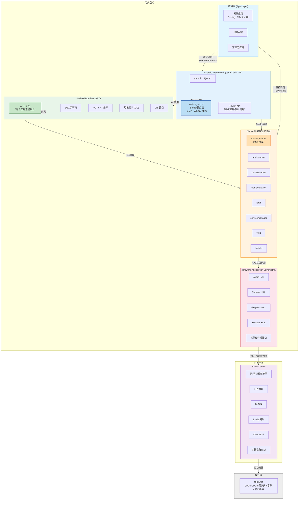

# AOSP

> 官方架构入口：[Android Open Source Project — Architecture](https://source.android.com/docs/core/architecture)。

## 目录


---

## AOSP 软件栈（自顶向下）

```text
App（APK）
   ↓（直接调用）
Framework（Java，AOSP 的一部分）
   ↓（JNI 调用）
Native（C/C++，AOSP 的一部分）
   ↓
HAL（硬件抽象层，AOSP 的一部分）
   ↓
Kernel（Linux 内核，不属于 AOSP 源码包）
```




**应用层**：系统应用（Settings、SystemUI）、预装 APK、第三方应用；使用 SDK / 部分 **hidden API**（系统应用或反射，受限制）。

**Android Framework（Java/Kotlin API）**：`android.*`、`java.*`；应用进程通过 Binder 调用 **system_server** 中的服务实现。

**Android Runtime（ART）**：DEX、AOT/JIT、GC、JNI；每个应用进程独立 ART。

**Native 框架与守护进程**：`SurfaceFlinger`（合成）、`logd`、`servicemanager`、`vold`、`installd`、`audioserver`、`cameraserver`、`mediaextractor` 等（随版本调整）。

**Hardware Abstraction Layer（HAL）**：按硬件域划分接口（Audio、Camera、Graphics…），实现通常在 **vendor** 分区，对接内核驱动。

**Linux Kernel**：进程/线程调度、内存管理、网络栈、Binder 驱动、驱动模型（字符设备、DMA-BUF 等）。

## 启动流程（简化链路）

**Boot ROM → Bootloader → Kernel → init（pid 1）**

**init**：解析 `.rc` 脚本（`init.rc`、片段、`vendor`/`odm` 等），挂载分区、`selinux` 初始化、启动核心守护进程。

**Zygote**：VM 预初始化；监听请求 fork **应用进程**与 **system_server**（按版本启动顺序略有差异，常见描述：`start zygote` → `start system_server`）。

**system_server**：Java 层 **SystemServer**，拉起 **ActivityManagerService、WindowManagerService、PackageManagerService、PowerManagerService** 等大量 **XXXService**，注册到 **ServiceManager**。

**SystemUI / Launcher**：随后进入交互界面；自动开机 APK、不息屏等定制常改 **AMS/PMS/SystemUI/Power**（见本文末节备忘）。

---

## init 与 *.rc

- **触发器**：`on boot`、`on property:`、`service` 定义。
- **重要属性**：`sys.boot_completed`、`service.*` 状态；定制开机任务常 **等待属性** 再启动脚本或 APK（比硬改 Java 更稳的场景也存在）。
- **分区挂载**：`fstab`、动态分区 **super**、**AVB** 校验。

---

## Zygote

- **socket 通信**：`zygote` 接收 `ActivityThread` 创建请求。
- **预加载**：类与资源预加载列表影响内存与启动速度。
- **架构**：32/64 位可有独立 Zygote（`zygote64`）。

---

## System Server 与系统服务（Framework 核心）

**进程**：`system`（常见进程名 `system_server`），单进程内多线程服务。

**代表性服务（名称随版本迁移，路径多在 `frameworks/base/services`）**

- **ActivityManagerService（AMS）**：Activity 栈、进程生命周期、任务调度。
- **WindowManagerService（WMS）**：窗口层级、焦点、输入分发与 Surface 协作。
- **PackageManagerService（PMS）**：安装、权限、组件解析。
- **PowerManagerService**：休眠、唤醒锁、屏幕超时。
- **InputManager**：按键、触摸路由。
- **AlarmManager、JobScheduler、NotificationManager** 等。

**阅读源码入口**：`frameworks/base/services/java/com/android/server/SystemServer.java`（启动链路与服务注册）。

---

## Binder 与 ServiceManager

- **应用 → 系统服务**：通过 **ServiceManager** / **ServiceLocator**（新版本）查找 Binder 代理。
- **native servicemanager**：名字服务；`hwservicemanager` / `vndservicemanager`（Vendor HAL）。
- **调试**：`service list`、`dumpsys`。

---

## HAL 与 Project Treble

**动机**：系统镜像（Google / OEM）与 **Vendor** 驱动解耦，加快升级。

**HIDL（历史）→ AIDL HAL（演进）**：接口定义从 HIDL 逐步迁移到 **稳定 AIDL**（依芯片与 Android 大版本）。

**VINTF manifest**：设备声明提供的 HAL 版本；**VTS** 验证供应商实现。

**日常分工**：App 开发很少直接写 HAL；嵌入式 **BSP / 驱动 / HAL 实现** 在 vendor 团队。

---

## 分区与镜像（嵌入式设计必知）

常见分区：`boot`、`system`、`vendor`、`product`、`system_ext`、`userdata`、`cache`、`metadata`；**A/B 无缝更新**；**动态分区 super**。

**APEX**：模块化系统组件（运行时、Conscrypt 等）可独立更新。

**GSI（Generic System Image）**：验证 Treble 兼容性的通用 system 镜像。

---

## SELinux（强制访问控制）

- **策略**：`sepolicy` 编译进镜像；**域（domain）** 标记每个进程；**类型 enforcement**。
- **定制系统**：新增守护进程 / Socket / Binder 必须 **补策略**，否则 **avc denied**。
- **调试**：`dmesg`、`audit.log`、`setenforce 0` **仅调试**（量产需正规规则）。

---

## Native 显示与图形栈（提要）

**SurfaceFlinger**：合成 Layer、VSYNC、HWComposer 交互；理解 **Surface / BufferQueue** 有助于音视频与相机类 App，Framework 改显示栈属于深度定制。

**Input**：InputReader / InputDispatcher；事件从内核到焦点窗口。

---

## 音频 / 媒体 / 相机（Framework ↔ HAL）

**典型进程**：`audioserver`、`cameraserver`、`mediaserver`（历史拆分变化查对应版本）。

**策略**：策略路由（Strategy）、焦点、流类型；硬编解码走 **Codec2 / OMX** 栈（版本差异大，查对应 Release）。

---

## 编译 AOSP 与开发环境（入门）

**依赖**：Linux 主机推荐；OpenJDK、repo 工具。

**流程梗概**：`repo init` / `repo sync` → `lunch` 选目标 → `m` / `m SystemUI` 等模块。

**产物**：`system.img`、`vendor.img`、刷机或模拟器镜像。

**Soong / Blueprint**：`Android.bp` 取代部分 `Android.mk`。

---

## Framework 定制常见入口（不含具体业务代码）

- **权限与白名单**：`frameworks/base/core/res/AndroidManifest.xml`、`PermissionManagerService`。
- **系统签名**：`platform.pk8` / `platform.x509.pem`；**priv-app** 与 **sharedUserId**（谨慎，现代收紧）。
- **覆盖资源**：**RRO**（Runtime Resource Overlay）优于直接改 Framework 资源。
- **禁止 API**：`hiddenapi`、greylist（版本差异）。

---

## 调试与日志

- **logcat**：`adb logcat -b system`、`events`、`radio`。
- **dumpsys**：`activity`、`window`、`package`、`input`。
- **systrace / Perfetto**：系统级延迟。
- **调试版本**：`userdebug` / `eng`，可 root、`adb root`、`adb remount`（依镜像）。

---

## 与 JNI / Native 的交界

系统侧 JNI、HAL C++、厂商闭源 `.so`；应用 JNI 见 [JNI.md](../Android/JNI.md)。


## Android Framework

### 大致介绍

**一、四大核心系统服务（最关键）**
AMS（ActivityManagerService）：Activity/Service/ 进程 / 任务栈管理、应用生命周期、系统进程调度
PMS（PackageManagerService）：APK 安装 / 卸载 / 解析、权限管理、应用信息查询、组件注册
WMS（WindowManagerService）：窗口管理、界面布局、Surface 管理、View 渲染、输入事件分发
Binder IPC：跨进程通信核心（Framework 底层通信基石，AMS/PMS/WMS 都靠它）

**二、四大组件框架**
Activity：界面交互、生命周期、UI 容器
Service：后台服务、长任务、进程保活
BroadcastReceiver：跨进程消息、系统事件监听（开机、网络、电量）
ContentProvider：跨进程数据共享、数据访问封装

**三、基础通信与跳转**
Intent / IntentFilter：组件跳转、消息路由、跨进程行为触发、隐式匹配

**四、UI 体系**
View 体系：View/ViewGroup、事件分发、UI 绘制、渲染流程、自定义 View
ResourceManager：资源管理（布局、图片、字符串、颜色、尺寸）

**五、系统能力服务**
NotificationManager：通知管理、状态栏消息、悬浮通知
PowerManager：电源管理、休眠、亮灭屏、唤醒锁、省电策略
AlarmManager：定时任务、闹钟、定时唤醒
ConnectivityManager：网络管理、Wi-Fi / 移动数据、网络状态监听
TelephonyManager：电话管理、SIM 卡、通话状态、信号
LocationManager：定位服务、GPS / 网络定位、位置更新
AudioManager：音频管理、音量、铃声、音频焦点、音频路由


### 四大核心系统服务
```java
import android.app.ActivityManager;
import android.content.pm.PackageManager;
import android.view.WindowManager;
```

ActivityManagerService (AMS) 、WindowManagerService (WMS) 和 PackageManagerService (PMS) 是三个最核心的系统服务，它们分别管理着应用的生命周期、窗口显示和应用包管理。
这些服务并不是独立进程，而是运行在同一个系统进程 `system_server` 中

**system_server 是什么？**

由 Zygote 进程孵化（Android 所有进程的父进程）。
在系统启动时初始化，运行几乎所有核心系统服务。
通过 Binder IPC 向 App 进程提供跨进程调用（如 IActivityManager）。

#### AMS（ActivityManagerService）
ActivityManagerService (AMS) ------ 应用生命周期管理者
AMS 主要负责管理应用的生命周期和任务栈。它处理应用的启动、暂停、恢复、停止等状态。
它还负责调度系统中的活动（Activity），处理任务切换和多任务管理。
* 启动/管理 Activity （如 startActivity() 的底层实现）
* 管理应用进程 （通过 ProcessList 分配进程优先级）
* 处理 ANR（Application Not Responding）
* 管理任务栈（TaskStack）（决定 Activity 如何回退）

AMS在Activity中
```java
// 示例：在 Activity 中处理生命周期
public class MainActivity extends AppCompatActivity {
    
    @Override
    protected void onCreate(Bundle savedInstanceState) {
        super.onCreate(savedInstanceState);
        setContentView(R.layout.activity_main);
        // 初始化代码
    }

    @Override
    protected void onResume() {
        super.onResume();
        // Activity 恢复到前台
    }

    @Override
    protected void onPause() {
        super.onPause();
        // Activity 被置于后台
    }

    @Override
    protected void onDestroy() {
        super.onDestroy();
        // Activity 被销毁
    }
}
```

#### PMS（PackageManagerService）
PackageManagerService (PMS) ------ 包管理专家
PMS 负责管理应用程序的安装、卸载、查询及其权限。
提供了关于已安装应用的信息，如包名、权限、组件等。
* 解析 AndroidManifest.xml（获取四大组件信息）
* 管理应用权限 （如运行时权限 checkSelfPermission()）
* 处理 APK 安装/卸载 （调用 installd 守护进程）

安装一个 App 时，PMS 会校验签名、分配 UID，并更新 /data/system/packages.xml

```java
private void checkApk(){
    // 示例：使用 PackageManager 查询已安装应用
    PackageManager packageManager = getPackageManager();
    List<ApplicationInfo> apps = packageManager.getInstalledApplications(PackageManager.GET_META_DATA);

    for (ApplicationInfo app : apps) {
        Log.d("AppInfo", "App: " + app.packageName);
    }

    // 获取应用权限
    try {
        PackageInfo packageInfo = packageManager.getPackageInfo("com.example.myapp", PackageManager.GET_PERMISSIONS);
        String[] requestedPermissions = packageInfo.requestedPermissions;
        if (requestedPermissions != null) {
            for (String permission : requestedPermissions) {
                Log.d("Permission", "Permission: " + permission);
            }
        }
    } catch (PackageManager.NameNotFoundException e) {
        Log.e("Package", "checkApk error: ", e);
    }
}
```

#### WMS（WindowManagerService）
WindowManagerService (WMS) ------ 窗口管理者
* 管理窗口层级（Window层级，如 Dialog、Toast、StatusBar）
* 处理触摸事件分发（决定哪个窗口接收事件）
* 与 SurfaceFlinger 协作（控制 Surface 的合成与渲染）

WMS 负责窗口的显示和管理，包括布局、动画和用户交互。
管理系统中的所有窗口，包括活动窗口、对话框、系统提示等。

当滑动屏幕时，WMS 会计算触摸事件应该分发给哪个 App 的哪个窗口。


通过 WindowManager 类来进行窗口的管理，比如设置窗口属性、添加自定义窗口等。
通过 Window 和 View 进行界面的布局和交互。


```java
private void setWindowsParam(){
    // 示例：使用 WindowManager 添加自定义窗口
    WindowManager windowManager = (WindowManager) getSystemService(Context.WINDOW_SERVICE);
    WindowManager.LayoutParams params = new WindowManager.LayoutParams(
            WindowManager.LayoutParams.WRAP_CONTENT,
            WindowManager.LayoutParams.WRAP_CONTENT,
            WindowManager.LayoutParams.TYPE_APPLICATION_OVERLAY,
            WindowManager.LayoutParams.FLAG_NOT_FOCUSABLE,
            PixelFormat.TRANSLUCENT);

    TextView textView = new TextView(this);
    textView.setText("This is a custom window");
    textView.setBackgroundColor(Color.GREEN);

    windowManager.addView(textView, params);
}
```


#### Binder IPC


## 场景
### 需要修改AOSP

#### 移除桌面应用，锁定单一App


**文件路径**：`device/rockchip/rk3588/device.mk`

**操作**：注释或删除 Launcher3、Launcher2QuickStep 等桌面应用

```makefile
# 注释掉桌面应用
# PRODUCT_PACKAGES += Launcher3
# PRODUCT_PACKAGES += Launcher2QuickStep
# PRODUCT_PACKAGES += Trebuchet
```

同时：在 frontboard.apk 的 AndroidManifest.xml 中声明为 Home 程序

```xml
<activity android:name=".MainActivity">
    <intent-filter>
        <action android:name="android.intent.action.MAIN" />
        <category android:name="android.intent.category.HOME" />
        <category android:name="android.intent.category.DEFAULT" />
    </intent-filter>
</activity>
```


#### 全局拦截返回键和Home键

文件路径：`frameworks/base/services/core/java/com/android/server/policy/PhoneWindowManager.java`

方法：`interceptKeyBeforeDispatching()`

思路：在方法开头拦截 KEYCODE_BACK 和 KEYCODE_HOME，直接返回 -1

```java
@Override
public long interceptKeyBeforeDispatching(KeyEvent event, int policyFlags) {
    // 新增：全局拦截返回键和Home键
    if (event.getKeyCode() == KeyEvent.KEYCODE_BACK 
        || event.getKeyCode() == KeyEvent.KEYCODE_HOME) {
        return -1; // -1 表示事件已被消费，不再向下分发
    }
    
    // 原有逻辑继续...
}
```

注意：KeyEvent.java 是系统类，不应在此处修改业务逻辑。按键拦截的正确位置是 PhoneWindowManager，
不是 KeyEvent.java。原方案中在 KeyEvent.java 里获取前台应用包名的方式不合理，
因为 KeyEvent 是通用事件类，不应耦合应用层判断。


#### 彻底禁用下拉状态栏

文件路径：`frameworks/base/packages/SystemUI/src/com/android/systemui/statusbar/phone/`

核心文件：PhoneStatusBarView.java 或 StatusBarWindowView.java（Android 12+）

思路：在触摸事件处理中，拦截顶部下滑手势

```java
@Override
public boolean onTouchEvent(MotionEvent event) {
    // 新增：完全禁用下拉
    return true; // 消费所有触摸事件，不触发下拉面板
    // 原有逻辑注释掉...
}
```

补充说明：原方案中注释 expandNotificationsPanel() 和 expandSettingsPanel() 的思路可行，但不够彻底。
部分ROM中，面板展开的入口可能在父类或触摸事件处理器中。拦截触摸事件是更根本的做法。


### 无需修改AOSP

#### 开机自动启动指定 APK

- 常见检索：`ActivityManagerService`、`systemReady`。
- 典型路径（仅供参考）：`frameworks/base/services/core/java/com/android/server/am/ActivityManagerService.java`
- 思路：`systemReady()` 末尾构造 `Intent`（`ACTION_MAIN` + `CATEGORY_LAUNCHER`），`FLAG_ACTIVITY_NEW_TASK`，`startActivity`；异常捕获并打日志。

* 在Manifest中标记为系统应用：
  `android.uid.system`
  让这个 App 共享系统进程的 UID
  拥有后，App 直接获得系统级权限，可以调用普通第三方 App 完全无法使用的系统 API
  ```xml
  <?xml version="1.0" encoding="utf-8"?>
  <manifest xmlns:android="http://schemas.android.com/apk/res/android"
            package="org.xxx.packagename>"
            android:sharedUserId="android.uid.system">
  </manifest>
  ```

*  系统签名 打包
   系统签名 = 手机厂商 / ROM 内置的签名文件: platform.keystore
   使用AOSP（安卓原生系统）自带的系统签名文件

* 必须放在系统分区
  路径：`/system/app/`，`/system/priv-app/`
  普通应用在：第三方 App 安装在 `/data/app`，无法成为系统应用

* 其他配置:
  ```xml
  <?xml version="1.0" encoding="utf-8"?>
  <manifest xmlns:android="http://schemas.android.com/apk/res/android"
            package="org.xxx.packagename>"
            android:sharedUserId="android.uid.system">
    <application
        android:persistent="true">
        <service android:name="com.color.webserver.app.HttpService" android:exported="true"/>
        <service android:name="com.color.webserver.app.WebSocketService" android:exported="true"/>
        <receiver android:name="com.color.webserver.app.BootCompleteReceiver">
            <intent-filter android:priority="1000">
                <action android:name="android.intent.action.BOOT_COMPLETED" />
            </intent-filter>
            <intent-filter>
                <action android:name="com.color.intent.action.RESTART_SERVICE" />
            </intent-filter>
        </receiver>
    </application>
  </manifest>
  ```

   - 常驻进程: `android:persistent="true"`
      - 系统进程级别常驻
      - 意外杀死会自动重启
      - 只有系统应用才能生效，普通 App 设置无效

   - 监听系统开机成功广播: 开机自启（最高优先级）
      - 监听 Android 系统开机启动完成的信号
      - 系统开机 → 发出 BOOT_COMPLETED 广播 → App 收到 → 自动启动服务
  ```xml
    <intent-filter android:priority="1000">
       <action android:name="android.intent.action.BOOT_COMPLETED" />
    </intent-filter>
  ```
   - 优先级 1000 = 系统最高
   - 开机第一时间启动服务
   - 普通第三方 App 无法做到这种稳定自启

*  监听系统开机成功广播
```java
package com.color.webserver.app;

import android.content.BroadcastReceiver;
import android.content.Context;
import android.content.Intent;
import android.os.Environment;
import android.util.Log;

import java.io.DataOutputStream;
import java.io.File;
import java.io.IOException;

import java.io.File;

/**
 * Android广播接收器，用于设备上电启动时自动启动http服务和ws服务，以及处理服务重启
 * @author Reed
 * @since 2025-12-24 14:23:10
 */
public class BootCompleteReceiver extends BroadcastReceiver {
    private final static String TAG = "BootCompleteReceiver";
    private static final boolean DBG = true;

    /**
     * 停止HTTP和WebSocket服务
     * @param context 上下文
     */
    public static void stopService(Context context) {
        Intent intent1 = new Intent(context, HttpService.class);
        context.stopService(intent1);

        Intent intent2 = new Intent(context, WebSocketService.class);
        context.stopService(intent2);
    }

    /**
     * 启动HTTP和WebSocket服务
     * @param context 上下文
     */
    public static void startService(Context context) {
        if (DBG) Log.d(TAG, "startService. HttpService");
        Intent intent1 = new Intent(context, HttpService.class);
        context.startService(intent1);

        if (DBG) Log.d(TAG, "startService. WebSocketService");
        Intent intent2 = new Intent(context, WebSocketService.class);
        context.startService(intent2);
    }

    @Override
    public void onReceive(Context context, Intent intent) {
        if (DBG) Log.d(TAG, "consoleWeb boot complete ....");
        clearCacheDir(context); // 清理缓存目录

        if (DBG) Log.d(TAG, "onReceive. [intent=" + intent);
        String action = intent.getAction();
        // 处理自定义重启服务广播
        if ("com.color.intent.action.RESTART_SERVICE".equals(action)) {
            if (DBG) Log.d(TAG, "onReceive. [RESTART service.");
            stopService(context);
            startService(context);
        } else {
            // 开机完成后启动服务
            startService(context);
        }
    }

    /**
     * 设备上电启动时清理临时缓存文件
     * @param context 上下文
     */
    private void clearCacheDir(Context context) {
        File cacheDir;
        // 优先使用外部存储缓存目录，否则使用内部缓存
        if (Environment.MEDIA_MOUNTED.equals(Environment.getExternalStorageState())) {
            cacheDir = context.getExternalCacheDir();
        } else {
            cacheDir = context.getCacheDir();
        }
        if (DBG) Log.d(TAG, "clearDir. cacheDir absolutePath= " + cacheDir.getAbsolutePath());

        // 清空缓存目录下所有文件（root权限执行rm -rf）
        if (cacheDir.isDirectory() && cacheDir.listFiles().length > 0) {
            String cmd1 = "rm -rf " + cacheDir.getAbsolutePath() + "/*";
            runAsRoot(new String[]{cmd1});
        }
    }
}

public static Process runAsRoot(String[] cmds) {
    Process p = null;
    try {
        p = Runtime.getRuntime().exec("su");

        DataOutputStream os = new DataOutputStream(p.getOutputStream());
        // 临时修改权限掩码
        os.writeBytes("umask 000\n");
        for (String tmpCmd : cmds) {
            os.writeBytes(tmpCmd + "\n");
        }
        os.writeBytes("exit\n");
        os.close();
    } catch (IOException e) {
        Log.e(TAG, "runAsRoot: ", e);
    }
    return p;
}
```


#### 待机不息屏

* 修改AOSP
文件路径：`frameworks/base/services/core/java/com/android/server/power/PowerManagerService.java`

思路：设置屏幕超时为永久

```java
// 方案A：修改超时时间为永久
private long getUserActivityTimeout(int reason) {
   return 0; // 0 表示永不超时
}
```

* 不修改AOSP
emoji.apk 中获取 WakeLock，无需修改 Framework

```java
private void onCreate() {
    super.onCreate();
   // 在 emoji.apk 的 MainActivity 中
   PowerManager pm = (PowerManager) getSystemService(POWER_SERVICE);
   WakeLock wakeLock = pm.newWakeLock(
           PowerManager.SCREEN_BRIGHT_WAKE_LOCK | PowerManager.ON_AFTER_RELEASE,
           "EmojiApp::WakeLock");
   wakeLock.acquire(); // 永久持有，禁止息屏
}
```


#### 移除系统App

文件路径：device/rockchip/rk3588/device.mk

```makefile
# 注释掉不需要的系统应用
# PRODUCT_PACKAGES += Settings
# PRODUCT_PACKAGES += FileManager
# PRODUCT_PACKAGES += Browser
```


## 延伸阅读

- [IPC.md](../Android/IPC.md)
- [Android.md](../Android/Android.md)
- AOSP 文档：[Core Topics](https://source.android.com/docs/core)
