# Media

## 408 理论基础（交叉引用）

阅读流媒体笔记时，可与下列梳理对照，便于理解 **硬编、缓冲队列、网络协议与抓包**：

- [计算机组成原理](../408/计算机组成原理.md)（冯·诺依曼结构、ARM SoC、CPU 与硬件编码器关系）
- [操作系统](../408/操作系统.md)（进程/线程/协程、线程池、Android 后台策略）
- [计算机网络](../408/计算机网络.md)（分层模型、Wireshark、RTMP/RTSP/HLS 承载）
- [数据结构与算法分析](../408/数据结构与算法分析.md)（队列、缓冲与流媒体中的典型用法）

---

## 目录


## 知识梳理

### Android 音视频采集
Android 设备分为两类：普通手机 App、RK3588 等瑞芯微工控板 / 开发板系统 Apk，二者音视频采集 API 完全通用，仅硬件外设接入方式有区别。

Android App 音视频采集：
- 视频采集
  - 基础老式 API：Camera（已废弃，适配老旧设备）
  - 底层原生 API：Camera2（支持手动参数调节、多摄、高帧率、RAW 数据）
  - 官方推荐封装：CameraX（兼容适配强、自动管理生命周期、开发最简）

- 音频采集
  - 高层封装：MediaRecorder（直接录制生成音频 / 视频文件，简单易用）
  - 底层裸流采集：AudioRecord（获取原始 PCM 音频流，适合实时处理、推流、AI 语音分析）
  - 高阶自定义方案：MediaCodec 音视频硬编码 + 自定义采集流程；或集成 FFmpeg 实现跨平台统一音视频采集、编码、推流方案。

RK3588 外接摄像头
- 视频采集
  - 外接 MIPI 摄像头
    - RK3588 开发板原生支持 MIPI-CSI 接口摄像头，硬件接入后内核自动识别为 V4L2 设备；
    - Android 系统层已做 HAL 适配，App 无需特殊适配，可直接使用 Camera/Camera2/CameraX 标准 API 调用；
    - 预览依赖 TextureView + TextureView.SurfaceTextureListener 生命周期回调，遵循「纹理就绪打开相机、页面销毁释放相机」流程；
  - 外接 USB 摄像头（UVC 免驱）
    - 即插即用，无需安装驱动，插入 RK3588 USB 口安卓自动识别；
    - 同标准相机 API 一致，App 代码无需修改，直接预览、拍照、录制；
- 外接麦克风小喇叭
  - USB 免驱麦克风：即插即用，Android 自动识别为默认音频输入设备，App 通过 MediaRecorder/AudioRecord 可直接采集音频，无接线、无杂音；
  - 3.5mm 有源小音箱（自带功放、USB 供电），直接插开发板 3.5mm 音频孔即可正常发声

#### 音频采集

**AudioRecord**

从麦克风硬件 实时抓取 原始 PCM 裸音频流，给到你 App 字节数组，自己拿去做降噪、编码、保存、推流

麦克风硬件 → 音频芯片 → 安卓音频框架 → 缓冲区Buffer → AudioRecord → 读byte[]/short[]

参数解析:
- 音频源：MIC (麦克风)
- 采样率 44000Hz (每秒钟对声音采样 44000 次)
  - 8000Hz：电话音质
    16000Hz：语音识别、对讲常用
    44000Hz：标准 CD 音质、通用录音
    48000Hz：高清录音
    采样率越高，声音越清晰，占用流量 / 内存越大。
- 声道 channelConfig
  - CHANNEL_IN_MONO 单声道
  - CHANNEL_IN_STEREO 立体声
  - Android 日常采集、RK3588 开发板一律用：CHANNEL_IN_MONO
- 采样点 AudioFormat.ENCODING_PCM_16BIT
  - 采样率是「一秒采多少次」
  - 16BIT 是每一个采样点用 16bit (2 字节) 存储声音大小
- 音频一帧的字节大小 frameBytes
- 缓冲区 bufferSize
  - 没有缓冲区的话采集的音频也无法立即播放会丢失, 所以需要一个缓冲区来存储音频数据
  - 计算公式: 每秒字节数 = 采样率 × 声道数 × 每采样点字节数 (44000 × 1 × 2 = 88000)
  - 缓冲区大小 = 最小缓冲区大小 = 采样率 × 声道数 × 位深度字节数 × 系统最小缓冲时间（秒）
  - 大多数手机 / RK3588 安卓 = 20ms（0.02 秒）
  - 20ms 字节数 = 88200 × 0.02 = 1764 字节
  - minBufferSize = 1764 × 2 = 3528 字节
  - AudioRecord.getMinBufferSize(44100, MONO, 16BIT) ≈ 3528 字节

##### 核心代码片段

```java
// 配置AudioRecord
private AudioCaptureTask(LivePusherBridge bridge) {
    int channelConfig = AUDIO_CHANNELS == 2
            ? AudioFormat.CHANNEL_IN_STEREO
            : AudioFormat.CHANNEL_IN_MONO;
    frameBytes = Math.max(bridge.getAudioInputByteCount(), 2048);
    int minBufferSize = AudioRecord.getMinBufferSize(
            AUDIO_SAMPLE_RATE, channelConfig, AudioFormat.ENCODING_PCM_16BIT);
    int bufferSize = Math.max(minBufferSize, frameBytes);
    audioRecord = new AudioRecord(
            MediaRecorder.AudioSource.MIC,
            AUDIO_SAMPLE_RATE,
            channelConfig,
            AudioFormat.ENCODING_PCM_16BIT,
            bufferSize);
}

// 启动AudioRecord并将数据发送给JNI
@Override
public void run() {
    byte[] buffer = new byte[frameBytes];
    audioRecord.startRecording();
    while (running && pushing) {
        int len = audioRecord.read(buffer, 0, buffer.length);
        if (len <= 0) continue;
        if (len == buffer.length) {
            bridge.pushAudioFrame(buffer.clone());
        } else {
            byte[] exact = new byte[len];
            System.arraycopy(buffer, 0, exact, 0, len);
            bridge.pushAudioFrame(exact);
        }
    }
}

/**
 * 推送一帧 PCM 音频数据到 native 编码与发送链路。
 */
public void pushAudioFrame(byte[] data) {
  ensureStarted();
  if (mute || data == null || data.length == 0) {
    return;
  }
  native_pushAudio(data);
}
```

#### Android 视频采集

**1) 设备从哪来**

CameraManager 获取 Camera
```java
CameraManager cameraManager = (CameraManager) context.getSystemService(Context.CAMERA_SERVICE);
```

CameraDevice 状态回调 (获取相机实例)

```java
private final CameraDevice.StateCallback mDeviceStateCallback = new CameraDevice.StateCallback() {
  /**
   * 相机硬件【打开成功】
   * 系统已成功获取相机硬件权限，准备就绪
   */
  @Override
  public void onOpened(@NonNull CameraDevice cameraDevice) {
    // 保存相机设备实例（后续创建会话、预览都靠它）
    mCameraDevice = cameraDevice;
  }
};
```


**2) 矩阵变换**
相机预览天生有 3 个问题
* 相机输出图像是横的（宽 > 高）
* 手机 / 开发板屏幕是竖的（高 > 宽）
* 相机图像方向和屏幕方向不一致（旋转 90/270 度）
所以要对相机的画面进行矩阵变换, 这过程中会有画面裁剪

其中: 变换由 GPU 硬件执行，不处理 YUV 数据，几乎不占 CPU
``mTextureView.setTransform(matrix);``

**3) 打开相机**

打开相机时机: 
需要等待TextureView纹理可用后才 openCamera
取决于: **TextureView.SurfaceTextureListener**
```java
private final TextureView.SurfaceTextureListener mSurfaceTextureListener =
        new TextureView.SurfaceTextureListener() {
          @Override
          public void onSurfaceTextureAvailable(SurfaceTexture texture, int width, int height) {
            openCamera();
          }
          // onSurfaceTextureSizeChanged → configureTransform：TextureView 矩阵，校正预览方向/比例
        };
```

打开相机:

```java
/**
 * 创建后台线程用于 Camera2 回调处理。
 */
private void startBackgroundThread() {
  mBackgroundThread = new HandlerThread("CameraBackground");
  mBackgroundThread.start();
  mBackgroundHandler = new Handler(mBackgroundThread.getLooper());
}

/**
 * 申请并打开 camera 设备。
 */
private void openCamera() {
    cameraManager.openCamera(mCameraId, mDeviceStateCallback, mBackgroundHandler);
}
```
1. cameraId：从cameraManager获取的CameraId, 一般来说:（后置0/前置1）。
2. StateCallback：相机状态异步回调，接收相机打开成功、失败、断开的事件，是Camera2的核心通信接口。
3. Handler：指定相机回调运行在后台线程，避免相机耗时操作阻塞UI主线程。

**4) 如何获取数据**

预览与编码**共用同一套** `CaptureSession`，但 **target 不同**：一路进 **TextureView 的 Surface**（屏幕预览），一路进 **ImageReader 的 Surface**（取 YUV 字节）。

创建【预览请求构造器】 CaptureRequest.Builder 并请求预览
```java
/**
 * 创建预览会话并把输出绑定到 TextureView + ImageReader。
 */
private void createCameraPreviewSession() {
    // 4. 创建【预览请求构造器】，类型为预览模式 TEMPLATE_PREVIEW
    mPreviewRequestBuilder = mCameraDevice.createCaptureRequest(CameraDevice.TEMPLATE_PREVIEW);

    // 5. 设置自动对焦模式：连续图片对焦（相机预览最常用）
    mPreviewRequestBuilder.set(
      CaptureRequest.CONTROL_AF_MODE,
      CaptureRequest.CONTROL_AF_MODE_CONTINUOUS_PICTURE);
}
```

将数据源给到需要的地方: TextureView(显示) + ImageReader(数据回调)

TextureView(显示)
```java
/**
 * 创建预览会话并把输出绑定到 TextureView + ImageReader。
 */
private void createCameraPreviewSession() {
    // 0. UI获取 TextureView
    texturePreview = findViewById(R.id.texturePreview);
    // 1. 从 TextureView 获取 SurfaceTexture（GPU纹理载体）
    SurfaceTexture texture = mTextureView.getSurfaceTexture();
    // 2. 设置纹理缓冲区大小 = 相机预览分辨率（必须匹配，否则画面变形）
    texture.setDefaultBufferSize(mPreviewSize.getWidth(), mPreviewSize.getHeight());

    // 3. 通过 SurfaceTexture 创建 Surface（相机输出的渲染目标）
    Surface surface = new Surface(texture);
    // 6. 添加第一个输出目标：Surface → 渲染到 TextureView 给人看
    mPreviewRequestBuilder.addTarget(surface);
}
```

ImageReader(数据回调)
- 宽度 + 高度: 分辨率
- 数据格式：ImageFormat.YUV_420_888 Android的标准格式
  - YUV：亮度 + 色度（视频编码专用）
  - 420：色度二次采样（压缩率高、体积小）
  - 888：每个通道 8 位
- maxImages = 2: 内部缓冲区最多缓存 2 帧图像
```java
// 创建 ImageReader 实例：相机原始数据获取器（推流/编码专用）
ImageReader mImageReader = ImageReader.newInstance(
                mPreviewSize.getWidth(),    // 参数1：图像宽度（和预览分辨率一致）
                mPreviewSize.getHeight(),   // 参数2：图像高度（和预览分辨率一致）
                ImageFormat.YUV_420_888,    // 参数3：图像数据格式（安卓标准YUV）
                2                           // 参数4：缓冲区最大帧数（2~3帧最稳定）
        );

/**
 * 按 cameraId 读取分辨率、ImageReader、方向等关键参数。
 */
private boolean configCameraParams(CameraManager manager, String cameraId) throws CameraAccessException {
    // 创建 ImageReader 帧可用监听器
    mImageReader.setOnImageAvailableListener(new OnImageAvailableListenerImpl(), mBackgroundHandler);
    // 7. 添加第二个输出目标：ImageReader → 获取YUV原始数据给推流/编码用
    mPreviewRequestBuilder.addTarget(mImageReader.getSurface());
}
```

创建相机捕获会话
```java
/**
 * 会话配置成功（相机已经准备好，可以开始预览）
 */
@Override
public void onConfigured(@NonNull CameraCaptureSession cameraCaptureSession) {
    // 8. 创建相机捕获会话（Camera2 真正开始预览的关键）
    // 传入两个输出目标：预览显示 + 数据采集
    // mCaptureStateCallback：会话状态回调
    // mBackgroundHandler：在后台线程执行，不卡UI
    mCameraDevice.createCaptureSession(
            Arrays.asList(surface, mImageReader.getSurface()),
            mCaptureStateCallback,
            mBackgroundHandler);

    // Camera2Helper：会话就绪后连续请求 PREVIEW 帧
    mCaptureSession.setRepeatingRequest(
            mPreviewRequestBuilder.build(),
            new CameraCaptureSession.CaptureCallback() {
            },
            mBackgroundHandler);
}
```

**5) YUV数据处理**

- Camera2 使用 `ImageReader`，格式为 **`ImageFormat.YUV_420_888`**（Android 抽象 YUV420，三平面布局随设备可能不同）。
- `ImageReader.OnImageAvailableListener` 获取数据: `Image image = reader.acquireNextImage();` 获取一帧图像
- 后台线程 `CameraBackground` 上执行 `OnImageAvailableListener`，避免阻塞主线程。

* 为什么转换数据?
- ImageReader 拿到 Android 专用的 YUV_420_888 数据
- `YUV_420_888` 的 U/V 平面可能 **交错（类似 NV21/NV12）** 或 **独立平面**，且存在 **rowStride / pixelStride**。项目里用双重循环按 stride 把 UV 填进连续缓冲区，得到上层可用的 **I420 风格** 布局：
- 推流/编码需要用的 I420(YUV420P) 数据 
- 根据屏幕方向旋转画面 → 交给推流引擎
代码参考: ``public void onImageAvailable(ImageReader reader)``

* 旋转（YUV420pRotate）算不算矩阵变换？吃不吃 CPU？
- `configureTransform` 里对 **TextureView** 使用的是 **`Matrix`（二维仿射变换）**，用于 **预览画面** 与屏幕方向对齐，主要影响 GPU 纹理映射，**不等于对整帧 YUV 做线性代数矩阵乘法**。
- 对 **编码用 YUV** 的旋转在 `YuvUtil.YUV420pRotate90/180`：本质是 **像素重排**，复杂度约 **O(宽×高)**，**确实消耗 CPU**；仅在 `rotateDegree` 为 90°/180° 时走这段路径。

* 是否有必要？
- 若编码器、显示器与 Sensor 方向不一致，不旋转会导致 **画面横竖颠倒或 sideways**，且 x264 输入平面与「所见」不一致。
- 优化方向：**降低预览分辨率、减少旋转频率、换用支持横向输出的采集尺寸、或改为在 GPU/OEM 支持的路径处理**（需更大改动）。硬编码器也可结合 **旋转元数据**（若全流程支持），本项目走 CPU 旋转以保证与现有 x264 输入一致。

* YUV 是通用格式吗？嵌入式是否都是 YUV？
- **相机传感器**常见输出为 **Bayer RAW** 或经 ISP 处理后的 **YUV/RGB**；Android Camera2 对应用暴露 **`YUV_420_888`** 或 **JPEG** 等。
- **不是全世界都是 YUV**：HDMI、部分管线可能是 RGB；但 **视频编码器标准输入多为 YUV420**（人眼对亮度敏感，色度可下采样），故 **ISP → YUV → 编码** 是移动端极常见路径。
- **嵌入式/Linux V4L2** 常见 `YUYV`、`NV12`、`MJPEG` 等，需按设备与驱动逐个适配。

* JNI 层 `camera_type`（NV21 vs I420）是什么?
`VideoStream::encodeVideo` 中：
- `camera_type == 1`：按 **NV21**（V 在前的交错 UV）拆成 I420 三平面。  
- `camera_type == 2`：已是 **I420/YV12** 平面，直接 `memcpy`。

两者差异在 **色度平面排列与 UV 顺序**，必须分支处理，否则会偏色或花屏。

但是代码中实际使用的是`livePusherBridge.pushVideoFrame(yuvData, LiveFrameFormat.I420);`实际上的2: I420, 是可以直接拷贝的.

#### Android Camera预览

**1) YUV 回调与屏幕预览是两条路**

- **预览**：`CaptureRequest` 同时 `addTarget(SurfaceTexture)`，相机硬件把图像送给 **TextureView 的 Surface**，系统/GPU 合成显示，用户看到的是「流畅预览」，**不经过** `onPreviewFrame` 的那套字节数组（除非你再读回）。
- **编码**：`addTarget(ImageReader.getSurface())` 得到 **YUV_420_888**，经 Java 层整理后 `onPreviewFrame` → JNI → x264。

**2) TextureView vs SurfaceView**

| 对比项                | SurfaceView                                      | TextureView                                          |
|-----------------------|--------------------------------------------------|------------------------------------------------------|
| 底层渲染原理          | 拥有**独立Surface、独立渲染图层**，脱离View树绘制；单独Surface缓冲区，由系统直接合成到屏幕，不参与主线程View绘制流程。 | 继承自View，**纳入标准View树层级**；基于SurfaceTexture，渲染走GPU纹理管线，和普通View一起窗口合成。 |
| 渲染线程              | 自带**独立渲染线程**，不卡UI主线程                | 依附UI主线程渲染调度，硬件加速下GPU合成               |
| 性能延迟              | 性能更高、渲染延迟更低、CPU/GPU占用更少           | 性能略低一丢丢，多一层View树合成；现代硬件差距可忽略 |
| 矩阵变换Matrix        | 不支持 setTransform，无法做旋转/缩放/居中纹理变换 | 原生支持 Matrix 矩阵变换，可任意旋转、缩放、居中、裁剪、镜像 |
| UI层级关系            | 独立顶层/底层窗口，**不遵守View层级**，无法叠加普通控件、无法嵌套布局 | 完全遵守View层级，可嵌套布局、叠加UI、设置圆角、做动画、透明度渐变 |
| 屏幕旋转适配          | 无矩阵支持，需手动计算角度、裁剪适配，开发成本高  | 配合configureTransform矩阵自动校正画面方向、全屏适配、自动处理90/180/270旋转 |
| 页面切换/弹窗表现     | 独立Surface生命周期不同步，易黑屏、闪烁、穿透     | 跟随Activity/View生命周期，页面切换、弹窗无闪烁黑屏    |
| 画面裁剪与全屏适配    | 难以实现无黑边全屏等比例预览                      | 支持FILL/FIT模式，轻松实现全屏无黑边、自动裁剪边缘画面 |
| 相机预览适配难度      | 难度大，画面易倒立、旋转90度、拉伸变形             | 难度低，矩阵一键校正方向与比例                       |
| 适用场景              | 1. 游戏、短视频播放器；<br>2. 纯全屏无UI直播推流；<br>3. 低延迟硬解码播放；<br>4. 不需要UI叠加、不需要画面旋转适配的场景 | 1. 相机预览（Camera1/Camera2）；<br>2. 需要UI叠加、带控制按钮的直播；<br>3. 横竖屏自动适配、需要画面旋转缩放；<br>4. 布局嵌套、圆角预览、动画特效场景 |

SurfaceView：独立Surface独立图层，绕开View树，性能强、延迟低，但UI层级差、不支持矩阵变换，相机预览适配极麻烦。
TextureView：融入View树+SurfaceTexture GPU纹理渲染，支持矩阵任意变换、UI层级自由叠加，开发适配简单，现代硬件性能损耗可忽略。

**哪个性能更好？** 纯全屏相机预览、追求极限帧率时 **SurfaceView（或 Surface）更常见**；需要 **与界面动画深度混排** 时 **TextureView 更合适**。本项目 `Camera2Helper` **写死 `TextureView`**（Builder 校验 `previewOn(textureView)`），与 RK3588 文档里「预览依赖 TextureView」一致。

**能否改成 SurfaceView？** 可以：需把 `SurfaceTexture` 换成 **`SurfaceHolder.getSurface()`**，并调整 **生命周期与旋转**；你要求不改代码，此处仅作说明。


##### 视频核心代码摘录

```java
/**
 * 初始化 Camera2 预览组件（仅初始化一次）。
 */
private void initCameraPreview() {
  if (camera2Helper != null) {
    return;
  }
  // 获取当前的手机旋转情况
  int rotation = getWindowManager().getDefaultDisplay().getRotation();
  camera2Helper = new Camera2Helper.Builder()
          .context(getApplicationContext())                // 绑定上下文
          .cameraListener(this)                             // 相机数据回调（接收预览/图像数据）
          .previewOn(texturePreview)                       // 指定用于预览显示的 TextureView
          .previewViewSize(new Point(640, 480))             // 设置相机预览分辨率 640x480
          .specificCameraId(Camera2Helper.CAMERA_ID_BACK)  // 指定使用后置摄像头
          .rotation(rotation)                              // 传入屏幕旋转方向，用于画面校正
          .rotateDegree(getPreviewDegree(rotation))        // 计算并设置相机最终需要旋转的角度
          .build();                                        // 创建并启动相机
  Log.i(TAG, "initCameraPreview, rotation=" + rotation);
  camera2Helper.start();
  updateStatus("相机初始化中");
}

/**
 * Camera2 采集回调接口：
 * 把相机生命周期和 YUV 预览帧回调给上层页面。
 */
public interface Camera2Listener {
  /**
   * 相机打开回调。
   *
   * @param previewSize        相机输出尺寸
   * @param displayOrientation 预览方向
   */
  void onCameraOpened(Size previewSize, int displayOrientation);

  /**
   * 预览帧回调，输出 I420 数据。
   *
   * @param yuvData I420 帧数据
   */
  void onPreviewFrame(byte[] yuvData);

  /**
   * 相机关闭回调。
   */
  void onCameraClosed();

  /**
   * 相机异常回调。
   *
   * @param e 异常对象
   */
  void onCameraError(Exception e);
}

/**
 * Camera2 帧回调：相机回调 I420 → 仅推流时送入 SDK（经 JNI 到 x264/RTMP）
 *
 * @param yuvData I420 视频帧
 */
@Override
public void onPreviewFrame(byte[] yuvData) {
  if (!pushing || livePusherBridge == null) {
    return;
  }
  livePusherBridge.pushVideoFrame(yuvData, LiveFrameFormat.I420);
}

/**
 * 开始推流
 * <p>
 * 视频流是onPreviewFrame一直往JNI层丢的, 此处只不过是开始将数据处理推送到网络
 */
private void startLivePush() {
    // ... 校验 previewSize、URL ...
    LivePushConfig config = new LivePushConfig(width, height, VIDEO_BITRATE, VIDEO_FRAME_RATE,
            AUDIO_SAMPLE_RATE, AUDIO_CHANNELS);
    livePusherBridge = new LivePusherBridge(config, this);
    livePusherBridge.startPush(liveUrl.trim());
    audioCaptureTask = new AudioCaptureTask(livePusherBridge);
    audioCaptureTask.start();
    pushing = true;
}
```


### 编解码

由于 Android 的 Camera 采集的数据格式是 YUV，数据量大且 RTMP 不接受，所以需要编码为 H.264 或 H.265 才能封装 RTMP 包。
同样，Android 的 MIC 采集的数据格式是 PCM，数据量也很大且 RTMP 不接受，并且 RTMP 只接收 AAC 格式音频，所以也需要进行编码。

#### 音频编码

**软编**
软编指的是用 CPU 进行软件编码，一般采用的是 FAAC 库。
适合App使用, 因为不确定手机硬件是否支持硬编所以软编是用来兜底的.

```c++
private:
    /**
     * 音频编码相关成员变量
     * 用于 FAAC 软编码：PCM → AAC
     */
    faacEncHandle m_audioCodec = 0;   // FAAC 编码器句柄，保存编码器状态和配置
    u_long m_inputSamples;            // 每次编码输入的 PCM 采样数（决定了单次编码产生的 AAC 帧时长）
    u_long m_maxOutputBytes;          // 输出缓冲区最大字节数（编码后的 AAC 数据不会超过此大小）
    u_char *m_buffer = 0;             // 输出缓冲区指针，存放 FAAC 编码后的 AAC 原始帧数据

// ========== FAAC 软编码，将 PCM 编码为 AAC ==========
// faacEncEncode: 输入 PCM，输出 AAC 帧到 m_buffer，返回编码后的字节数
int byteLen = faacEncEncode(
        m_audioCodec,                              // FAAC 编码器句柄（含编码参数配置）
        reinterpret_cast<int32_t *>(data),          // 输入：PCM 采样数据（16-bit，按 32-bit 传入以匹配接口要求）
        static_cast<unsigned int>(m_inputSamples),  // 输入：每次编码的 PCM 采样数
        m_buffer,                                   // 输出：指向 AAC 编码数据缓冲区（调用前已分配 m_maxOutputBytes 大小）
        static_cast<unsigned int>(m_maxOutputBytes) // 输出缓冲区最大容量，防止编码溢出
);
```

**硬编**
硬编指的是调用设备专用 DSP（数字信号处理器）芯片进行编码。在 Android 上通过 MediaCodec API 实现。
优点是效率高、功耗低、几乎不占 CPU，适合长时间推流场景，能明显降低手机发热。
缺点是兼容性不够稳定，部分冷门机型或老旧设备的硬件编码器可能存在 Bug，导致编码失败或音质异常。

(RK3588 自研芯片优先使用硬编)

```java
/**
 * 音频硬编码器，使用 MediaCodec 将 PCM 编码为 AAC
 */
public class AudioEncoder {
    private MediaCodec codec;
    private MediaFormat format;
    private boolean running = false;

    /**
     * 初始化 AAC 硬编码器
     * @param sampleRate 采样率，如 44100
     * @param channelCount 声道数，1=单声道，2=双声道
     * @param bitRate 码率，如 64000
     */
    public void init(int sampleRate, int channelCount, int bitRate) throws IOException {
        // 1. 创建编码器，指定 MIME 类型为 AAC
        codec = MediaCodec.createEncoderByType(MediaFormat.MIME_TYPE_AUDIO_AAC);

        // 2. 配置编码参数
        format = MediaFormat.createAudioFormat(
                MediaFormat.MIME_TYPE_AUDIO_AAC,
                sampleRate,      // 采样率
                channelCount     // 声道数
        );
        format.setInteger(MediaFormat.KEY_BIT_RATE, bitRate);                // 码率
        format.setInteger(MediaFormat.KEY_AAC_PROFILE,
                MediaCodecInfo.CodecProfileLevel.AACObjectLC);               // AAC-LC
        format.setInteger(MediaFormat.KEY_MAX_INPUT_SIZE, 1024 * 10);        // 输入缓冲区上限

        // 3. 配置并启动编码器（CONFIGURE_FLAG_ENCODE 表示编码模式）
        codec.configure(format, null, null, MediaCodec.CONFIGURE_FLAG_ENCODE);
        codec.start();
        running = true;
    }

    /**
     * 送一帧 PCM 数据去编码
     * @param pcmData PCM 原始数据（16-bit）
     * @param size 数据长度（字节）
     * @param presentationTimeUs 该帧的采集时间戳（微秒）
     */
    public void encode(byte[] pcmData, int size, long presentationTimeUs) {
        if (!running) return;

        // 1. 从 MediaCodec 获取空闲输入 Buffer 的索引
        int inputBufferIndex = codec.dequeueInputBuffer(10000); // 等待 10ms
        if (inputBufferIndex >= 0) {
            // 2. 取到 Buffer，填入 PCM 数据
            ByteBuffer inputBuffer = codec.getInputBuffer(inputBufferIndex);
            if (inputBuffer != null) {
                inputBuffer.clear();
                inputBuffer.put(pcmData, 0, size);
                // 3. 送回编码器
                codec.queueInputBuffer(inputBufferIndex, 0, size, presentationTimeUs, 0);
            }
        }

        // 4. 尝试取出编码后的 AAC 数据
        drainEncoder();
    }

    /**
     * 从编码器取出 AAC 数据，回调给上层
     */
    private void drainEncoder() {
        MediaCodec.BufferInfo bufferInfo = new MediaCodec.BufferInfo();
        while (true) {
            int outputBufferIndex = codec.dequeueOutputBuffer(bufferInfo, 0);
            if (outputBufferIndex >= 0) {
                // 成功拿到一帧 AAC
                ByteBuffer outputBuffer = codec.getOutputBuffer(outputBufferIndex);
                if (outputBuffer != null && bufferInfo.size > 0) {
                    byte[] aacData = new byte[bufferInfo.size];
                    outputBuffer.get(aacData);
                    outputBuffer.position(bufferInfo.offset); // 恢复 position

                    // 回调：这里交给你的 AudioStream 封装成 RTMP 包
                    onAACFrameAvailable(aacData, bufferInfo.size, bufferInfo.presentationTimeUs);
                }
                codec.releaseOutputBuffer(outputBufferIndex, false);
            } else if (outputBufferIndex == MediaCodec.INFO_OUTPUT_FORMAT_CHANGED) {
                // 编码器输出格式变化，一般在这里获取 csd-0（AAC 序列头）
                MediaFormat newFormat = codec.getOutputFormat();
                ByteBuffer csd0 = newFormat.getByteBuffer("csd-0");
                if (csd0 != null) {
                    byte[] csd = new byte[csd0.remaining()];
                    csd0.get(csd);
                    onAACSequenceHeader(csd);
                }
            } else if (outputBufferIndex == MediaCodec.INFO_TRY_AGAIN_LATER) {
                break; // 没有更多输出
            }
        }
    }

    /**
     * AAC 序列头回调（AudioSpecificConfig），推流前必须发送一次
     */
    private void onAACSequenceHeader(byte[] config) {
        // 封装成 RTMP 音频包，m_body[1] = 0x00（序列头）
    }

    /**
     * AAC 帧数据回调
     */
    private void onAACFrameAvailable(byte[] aacData, int size, long ptsUs) {
        // 封装成 RTMP 音频包，m_body[1] = 0x01（原始帧）
        // 这里和你 FAAC 版本拿到 m_buffer 之后的逻辑完全一样
    }

    public void stop() {
        running = false;
        if (codec != null) {
            codec.stop();
            codec.release();
            codec = null;
        }
    }
}
```


#### 视频编码

**软编**
同上, 软编使用X264将视频YUV编码为H.264

```c++
  // ========== x264 软编码，将 YUV 图像编码为 H.264 NAL 单元 ==========
  x264_nal_t *pp_nal;           // 输出：NAL 单元数组指针
  int pi_nal;                   // 输出：NAL 单元个数
  x264_picture_t pic_out;       // 输出：编码后的重建图像（B 帧参考用）

  x264_encoder_encode(videoCodec,  // x264 编码器句柄
                      &pp_nal,      // 输出：指向 NAL 数组的指针
                      &pi_nal,      // 输出：NAL 单元数量
                      pic_in,       // 输入：待编码的 YUV 图像
                      &pic_out);    // 输出：编码后的图像（含重建帧）
```

**硬编**
硬编使用MediaCodec将视频YUV编码为H.264

```java
/**
 * 视频硬编码器，使用 MediaCodec 将 YUV 编码为 H.264
 *
 * 流程：
 *   YUV 数据 → 转换色彩格式 → MediaCodec 硬编码 → H.264 NAL → 封装 RTMP 包
 *
 * 编码逻辑与 x264 软编完全一致，只是把 x264_encoder_encode 替换为 MediaCodec 队列操作
 */
public class VideoEncoder {
    private static final String TAG = "VideoEncoder";
    private static final String MIME_TYPE = "video/avc";    // H.264 编码
    private static final int I_FRAME_INTERVAL = 2;          // 每2秒一个关键帧

    private MediaCodec codec;
    private int width, height, frameRate, bitRate;
    private boolean running = false;

    // 色彩格式：硬件编码器接受的 YUV 格式（通常是 NV12 或 YUV420 SemiPlanar）
    private int colorFormat;

    // 用于 NV21 → NV12 转换的临时缓冲区
    private byte[] nv12Buffer;

    /**
     * 初始化 H.264 硬编码器
     *
     * @param width     视频宽度
     * @param height    视频高度
     * @param frameRate 帧率
     * @param bitRate   码率（bps），如 2000000 表示 2Mbps
     */
    public void init(int width, int height, int frameRate, int bitRate) throws IOException {
        this.width = width;
        this.height = height;
        this.frameRate = frameRate;
        this.bitRate = bitRate;

        // 1. 创建 H.264 编码器
        codec = MediaCodec.createEncoderByType(MIME_TYPE);

        // 2. 配置编码参数
        MediaFormat format = MediaFormat.createVideoFormat(MIME_TYPE, width, height);
        format.setInteger(MediaFormat.KEY_BIT_RATE, bitRate);                    // 码率
        format.setInteger(MediaFormat.KEY_FRAME_RATE, frameRate);                // 帧率
        format.setInteger(MediaFormat.KEY_I_FRAME_INTERVAL, I_FRAME_INTERVAL);   // 关键帧间隔（秒）
        format.setInteger(MediaFormat.KEY_COLOR_FORMAT,
                MediaCodecInfo.CodecCapabilities.COLOR_FormatYUV420SemiPlanar);  // 优先 NV12
        // 码率控制模式：VBR 可变码率（画质优先），CBR 恒定码率（网络推流推荐）
        format.setInteger(MediaFormat.KEY_BITRATE_MODE,
                MediaCodecInfo.EncoderCapabilities.BITRATE_MODE_CBR);

        // 3. 配置编码器
        codec.configure(format, null, null, MediaCodec.CONFIGURE_FLAG_ENCODE);

        // 4. 获取编码器实际支持的色彩格式（可能和请求的不同）
        MediaFormat inputFormat = codec.getInputFormat();
        colorFormat = inputFormat.getInteger(MediaFormat.KEY_COLOR_FORMAT);

        // 5. 分配 NV12 转换缓冲区（只分配一次，复用）
        nv12Buffer = new byte[width * height * 3 / 2];

        // 6. 启动编码器
        codec.start();
        running = true;

        LOGI("硬编码初始化成功，实际 colorFormat=" + Integer.toHexString(colorFormat));
    }

    /**
     * 送一帧 YUV 数据去编码（对应 x264 的 pic_in 赋值 + x264_encoder_encode）
     *
     * @param nv21Data          Android Camera 默认输出的 NV21 数据
     * @param presentationTimeUs 该帧的采集时间戳（微秒），用于音视频同步
     */
    public void encode(byte[] nv21Data, long presentationTimeUs) {
        if (!running || codec == null) return;

        // ========== 第1步：NV21 → NV12 色彩格式转换 ==========
        // 对应 x264 版本中 camera_type==1 的转换逻辑
        // NV21: YYYY... + VUVU...  （V 在前）
        // NV12: YYYY... + UVUV...  （U 在前）
        nv21ToNv12(nv21Data, nv12Buffer, width, height);

        // ========== 第2步：从 MediaCodec 获取空闲输入 Buffer ==========
        int inputBufferIndex = codec.dequeueInputBuffer(10000);  // 等待 10ms
        if (inputBufferIndex >= 0) {
            ByteBuffer inputBuffer = codec.getInputBuffer(inputBufferIndex);
            if (inputBuffer != null) {
                inputBuffer.clear();
                // 填入 NV12 数据
                inputBuffer.put(nv12Buffer);
                // 送回编码器队列，硬件开始编码
                codec.queueInputBuffer(inputBufferIndex, 0, nv12Buffer.length,
                        presentationTimeUs, 0);
            }
        }

        // ========== 第3步：取出编码后的 H.264 数据 ==========
        // 对应 x264 版本的 pi_nal 循环 + sendSpsPps / sendFrame
        drainEncoder();
    }

    /**
     * NV21 → NV12 转换
     *
     * NV21 内存布局：YYYYYYYY... VUVUVU...
     * NV12 内存布局：YYYYYYYY... UVUVUV...
     *
     * @param nv21   输入 NV21 数据
     * @param nv12   输出 NV12 数据
     * @param width  图像宽度
     * @param height 图像高度
     */
    private void nv21ToNv12(byte[] nv21, byte[] nv12, int width, int height) {
        int frameSize = width * height;
        int uvSize = frameSize / 2;

        // 拷贝 Y 平面（NV21 和 NV12 的 Y 排布完全一样）
        System.arraycopy(nv21, 0, nv12, 0, frameSize);

        // 交换 UV 分量：NV21(VU) → NV12(UV)
        // NV21 中 UV 交错，V 在前 U 在后，需要把 V 和 U 顺序互换
        for (int i = 0; i < uvSize / 2; i++) {
            nv12[frameSize + i * 2] = nv21[frameSize + i * 2 + 1];      // U ← 原奇数位
            nv12[frameSize + i * 2 + 1] = nv21[frameSize + i * 2];      // V ← 原偶数位
        }
    }

    /**
     * 从编码器输出队列取出 H.264 数据
     *
     * 对应 x264 版本中遍历 pp_nal 的逻辑：
     *   - csd-0（SPS+PPS）→ sendSpsPps()
     *   - IDR/P 帧          → sendFrame()
     */
    private void drainEncoder() {
        MediaCodec.BufferInfo bufferInfo = new MediaCodec.BufferInfo();

        while (true) {
            int outputBufferIndex = codec.dequeueOutputBuffer(bufferInfo, 0);

            if (outputBufferIndex == MediaCodec.INFO_OUTPUT_FORMAT_CHANGED) {
                // ========== 编码器输出格式变化 ==========
                // 获取 SPS 和 PPS（对应 x264 的 NAL_SPS 和 NAL_PPS）
                MediaFormat newFormat = codec.getOutputFormat();
                ByteBuffer spsBuffer = newFormat.getByteBuffer("csd-0");  // SPS
                ByteBuffer ppsBuffer = newFormat.getByteBuffer("csd-1");  // PPS

                if (spsBuffer != null && ppsBuffer != null) {
                    byte[] sps = new byte[spsBuffer.remaining()];
                    spsBuffer.get(sps);
                    byte[] pps = new byte[ppsBuffer.remaining()];
                    ppsBuffer.get(pps);

                    // 回调：发送 SPS+PPS（对应 x264 的 sendSpsPps）
                    onSpsPpsAvailable(sps, pps);
                }

            } else if (outputBufferIndex >= 0) {
                // ========== 成功取到一帧编码数据 ==========
                ByteBuffer outputBuffer = codec.getOutputBuffer(outputBufferIndex);
                if (outputBuffer != null && bufferInfo.size > 0) {
                    byte[] h264Data = new byte[bufferInfo.size];
                    outputBuffer.get(h264Data);

                    // 判断关键帧（对应 x264 的 NAL_IDR）
                    boolean isKeyFrame = (bufferInfo.flags &
                            MediaCodec.BUFFER_FLAG_KEY_FRAME) != 0;

                    // 回调：发送视频帧（对应 x264 的 sendFrame）
                    onFrameAvailable(h264Data, bufferInfo.size,
                            bufferInfo.presentationTimeUs, isKeyFrame);
                }
                codec.releaseOutputBuffer(outputBufferIndex, false);

            } else if (outputBufferIndex == MediaCodec.INFO_TRY_AGAIN_LATER) {
                break;  // 没有更多输出，退出循环
            }
        }
    }

    /**
     * SPS+PPS 回调（对应 x264 版本的 sendSpsPps）
     * 封装成 FLV Video Tag：m_body[0] = 0x17(关键帧) + AVCDecoderConfigurationRecord
     */
    private void onSpsPpsAvailable(byte[] sps, byte[] pps) {
        LOGI("收到 SPS+PPS，spsLen=" + sps.length + ", ppsLen=" + pps.length);
        // TODO: 封装成 RTMPPacket，发送序列头
    }

    /**
     * 视频帧回调（对应 x264 版本的 sendFrame）
     *
     * @param h264Data      H.264 编码数据（单个 NAL 单元或 Access Unit）
     * @param size          数据长度
     * @param ptsUs         时间戳（微秒）
     * @param isKeyFrame    是否为关键帧（IDR）
     */
    private void onFrameAvailable(byte[] h264Data, int size, long ptsUs,
                                  boolean isKeyFrame) {
        LOGI("收到视频帧，size=" + size + ", pts=" + ptsUs / 1000 + "ms, keyFrame=" + isKeyFrame);
        // TODO: 封装成 RTMPPacket，发送视频帧
    }

    /**
     * 停止并释放编码器
     */
    public void stop() {
        running = false;
        if (codec != null) {
            try {
                codec.stop();
                codec.release();
            } catch (Exception e) {
                LOGE("释放编码器失败: " + e.getMessage());
            }
            codec = null;
        }
    }
}
```


#### 编解码线程管理策略

**图 A：RTMP 实时推流（本仓库 `LivePusherBridge` + JNI）**

- **并行关系**：主线程仅短任务（`init` / `startPush`）；**视频编码**在 `CameraBackground`；**音频编码**在 `live-audio-capture`；**RTMP 发送**在 native `std::thread`（与两路编码并发）。
- **PacketQueue** 连接「编码完成 → 入队」与「发送线程 → pop」，图中不单独画队列，体现为发送段在连接成功后持续与编码重叠。

```mermaid
gantt
    title 图 A — RTMP 实时推流（Live）：线程并行示意
    dateFormat X
    axisFormat %s

    section 主线程
    native_init / startPush（短）     :m1, 0, 2

    section CameraBackground（视频：YUV→x264→入队）
    帧序列编码（阻塞式 JNI）          :v1, 2, 6

    section live-audio-capture（音频：PCM→FAAC→入队）
    周期 read + 编码                  :a1, 2, 12

    section RTMP 发送线程（native）
    RTMP_Connect / ConnectStream      :s1, 1, 3
    循环 pop → RTMP_SendPacket        :s2, 3, 12
```

**图 A 对照代码（线程启动证据）**

```java
@RequiresPermission(Manifest.permission.RECORD_AUDIO)
private void startLivePush() {
    // LivePushDemoActivity.startLivePush：启动音频采集线程
    audioCaptureTask = new AudioCaptureTask(livePusherBridge);
    audioCaptureTask.start();
}
// AudioCaptureTask.start：线程名 live-audio-capture
private void start() {
    running = true;
    worker = new Thread(this, "live-audio-capture");
    worker.start();
}
```

```java
// Camera2Helper.start：先启 CameraBackground，再把回调投到该线程
public synchronized void start() {
    startBackgroundThread();
}

private void startBackgroundThread() {
    mBackgroundThread = new HandlerThread("CameraBackground");
    mBackgroundThread.start();
    mBackgroundHandler = new Handler(mBackgroundThread.getLooper());
}

/**
 * 按 cameraId 读取分辨率、ImageReader、方向等关键参数。
 */
private boolean configCameraParams(CameraManager manager, String cameraId) throws CameraAccessException {
    // ImageReader 回调明确挂在 CameraBackground 的 handler 上
    // 创建 ImageReader 帧可用监听器
    mImageReader.setOnImageAvailableListener(new OnImageAvailableListenerImpl(), mBackgroundHandler);
}
```

```c++
// RtmpPusher.native_start：拉起独立 native 发送线程
LIVE_PUSHER_FUNC(void, native_1start, jstring path_) {
    pushThread = std::thread(start, url);
}

// start(void* args)：在线程内完成 RTMP_Connect/ConnectStream + 循环发送
void *start(void *args) {
    ret = RTMP_Connect(rtmp, nullptr);
    ret = RTMP_ConnectStream(rtmp, 0);
    while (isPushing) {
        packets.pop(packet);
        RTMP_SendPacket(rtmp, packet, 1);
    }
}
```

---

**图 B：RTMP 拉流播放（典型播放器架构，与具体 App 实现略有差异）**

- **网络收包**与 **解码**常分两线程或线程池；音视频解码可各一条；**渲染**多在主线程或专有 Choreographer 节奏。
- 此处将「收流 + 解封装」合并为一段 IO/Demux 示意，将「H.264/AAC 解码」单独一条，突出 **解码相对网络线程滞后启动**（缓冲首帧后）。

```mermaid
gantt
    title 图 B — RTMP 拉流播放（典型）：解码与 IO 并行示意
    dateFormat X
    axisFormat %s

    section IO / 解封装线程
    TCP 收包 + FLV/RTMP 解包        :io1, 0, 12

    section 解码线程（MediaCodec 等）
    H.264 / AAC 解码                :dec1, 2, 11

    section 渲染 / 音频播放
    Surface / AudioTrack 输出        :ren1, 3, 10
```

**图 B 对照代码（项目 RTMP/HLS 拉流）**

```java
// LivePullDemoActivity：RTMP/HLS 走 ExoPlayer 默认 MediaSource
private void startPullPlay() {
    Uri uri = Uri.parse(pullUrl);
    if (isRtspUrl(pullUrl)) {
        // RTSP 分支见图 D
    } else {
        applyRtspPlaybackPreference(false);
        player.setMediaItem(MediaItem.fromUri(uri));
    }
    player.prepare();
    player.play();
}
```

```java
// LivePullDemoActivity：播放状态可观察到 Buffering -> Ready（对应图里的 IO/解码/渲染阶段）
private void addListener() {
  player.addListener(new Player.Listener() {
    @Override
    public void onPlaybackStateChanged(int playbackState) {
      if (playbackState == Player.STATE_BUFFERING) {
        updateStatus("缓冲中...");
      } else if (playbackState == Player.STATE_READY) {
        updateStatus("播放中，直播延迟: ...");
      }
    }
  });
}

```

> 说明：图 B 是播放器通用线程模型示意；本项目业务代码不直接 new IO/解码线程，实际线程拆分由 ExoPlayer 内部管理。

---

**图 C：FFmpeg 转推到 RTMP 或 RTSP（`FFmpegPushBridge.pushStream` / async）**

- **整条管线单线程**：`open` → `read_frame` 循环（可选节拍 sleep）→ `interleaved_write_frame` → `close`，**无单独「编码线程」**（remux 不重编码时主要为拷贝与时间戳处理）。
- **Java `pushStreamAsync`**：上述运行在 **单线程 `Executor`**；结束后 **`Handler` 切主线程** 回调。

```mermaid
gantt
    title 图 C — FFmpeg 文件/URL 转推 RTMP 或 RTSP（单 worker）
    dateFormat X
    axisFormat %s

    section Executor 单线程（native 全链路）
    avformat_open → write_header     :f1, 0, 2
    push：读包 / 时间戳 / 写帧        :f2, 2, 12
    close / trailer                  :f3, 12, 14

    section 主线程（仅 async 结束）
    Callback.onCompleted             :ui1, 14, 15
```

**图 C 对照代码（项目 FFmpeg 单线程转推）**

```java
// FFmpegPushBridge：单线程 Executor 跑 native 全链路；结束后切主线程回调
private static final ExecutorService EXECUTOR = Executors.newSingleThreadExecutor();
private static final Handler MAIN_HANDLER = new Handler(Looper.getMainLooper());

public static void pushStreamAsync(String inputPath, String outputUrl, Callback callback) {
    EXECUTOR.execute(() -> {
        int resultCode = pushStream(inputPath, outputUrl);
        if (callback != null) {
            // 此处使用main线程主要是因为UI更新需要在主线程
            MAIN_HANDLER.post(() -> callback.onCompleted(resultCode, buildMessage(resultCode)));
        }
    });
}
```

```cpp
// ffmpeg_pusher_jni.cpp：native 同线程串行执行 open -> push -> close
auto *rtmpPusher = new FFRtmpPusher();
ret = rtmpPusher->open(input_path, output_path);
if (ret >= 0) {
    ret = rtmpPusher->push();
}
rtmpPusher->close();
delete rtmpPusher;
```

```cpp
// ff_rtmp_pusher.cpp：push() 内单循环读包并交织写包（没有额外编码线程）
while (true) {
    ret = av_read_frame(inFormatCtx, &packet);
    // ... 时间戳归一化 / 节拍等待 / rescale ...
    ret = av_interleaved_write_frame(outFormatCtx, &packet);
}
```

---

**图 D：RTSP 拉流播放（典型；协议换为 RTSP/RTP，线程划分常类似 RTMP）**

- **RTSP 信令**（DESCRIBE/SETUP/PLAY）可与 **RTP 收包** 同线程或分线程；解码与渲染与图 B 类似。
- 此处用两条：**会话与收流**、**解码与输出**，避免图过于细碎。

```mermaid
gantt
    title 图 D — RTSP 拉流（典型）：收流与解码并行示意
    dateFormat X
    axisFormat %s

    section RTSP / RTP 接收
    信令 + RTP 收包重组             :rsp1, 0, 12

    section 解码与渲染
    解封装负载 → 解码 → 显示/出声   :rd1, 2, 11
```

**图 D 对照代码（项目 RTSP 拉流）**

```java
// LivePullDemoActivity：RTSP 分支显式使用 RtspMediaSource（RTP over TCP）
@OptIn(markerClass = UnstableApi.class)
private void startPullPlay() {
    if (isRtspUrl(pullUrl)) {
        applyRtspPlaybackPreference(true);
        RtspMediaSource mediaSource = new RtspMediaSource.Factory()
                .setForceUseRtpTcp(true)
                .createMediaSource(MediaItem.fromUri(uri));
        player.setMediaSource(mediaSource);
    } else {
        applyRtspPlaybackPreference(false);
        player.setMediaItem(MediaItem.fromUri(uri));
    }
    player.prepare();
    player.play();
}
```

```java
// 项目当前 RTSP 播放策略：关闭音频轨，复用 ExoPlayer 渲染链路
private void applyRtspPlaybackPreference(boolean rtspMode) {
    TrackSelectionParameters params = player.getTrackSelectionParameters()
            .buildUpon()
            .setTrackTypeDisabled(C.TRACK_TYPE_AUDIO, rtspMode)
            .build();
    player.setTrackSelectionParameters(params);
}
```

> 说明：图 D 也是教学抽象图；项目里 RTSP 的接收/解码/渲染线程由 `RtspMediaSource + ExoPlayer` 内部完成调度。


#### MediaCodec

Android **MediaCodec** 是对底层 **硬件音视频编解码器** 的统一封装（厂家实现 OMX / Codec2），典型用法与「音频采集 AudioRecord」类似的层次结构：**创建 → configure → start → 循环 dequeueInputBuffer / queueInputBuffer → dequeueOutputBuffer → release**。

**1) API 形态**


| KEY | 含义 |
|-----|------|
| `KEY_BIT_RATE` | 目标码率 |
| `KEY_FRAME_RATE` | 期望帧率 |
| `KEY_I_FRAME_INTERVAL` | GOP 大致尺度（秒） |
| `KEY_COLOR_FORMAT` | 输入像素格式（须查询 CodecCapabilities） |
| `KEY_BITRATE_MODE` | CBR/VBR 等 |
| 音频 `KEY_AAC_PROFILE` | AAC 档位 |

```java
// 创建 H.264 编码器
MediaCodec codec = MediaCodec.createEncoderByType(MediaFormat.MIME_TYPE_VIDEO_AVC);
MediaFormat format = MediaFormat.createVideoFormat(MediaFormat.MIME_TYPE_VIDEO_AVC, width, height);
private void initCodec() {
  format.setInteger(MediaFormat.KEY_BIT_RATE, bitRate);           // 目标码率（bps）
  format.setInteger(MediaFormat.KEY_FRAME_RATE, frameRate);       // 帧率
  format.setInteger(MediaFormat.KEY_COLOR_FORMAT, colorFormat);   // 厂商支持的 YUV 格式（如 NV12）
  format.setInteger(MediaFormat.KEY_I_FRAME_INTERVAL, 2);       // 关键帧间隔（秒，语义依厂商）
  format.setInteger(MediaFormat.KEY_BITRATE_MODE,
  MediaCodecInfo.EncoderCapabilities.BITRATE_MODE_CBR);   // CBR/VBR 等

  codec.configure(format, null, null, MediaCodec.CONFIGURE_FLAG_ENCODE);
  codec.start();
}
```

```java
// 输入一帧（presentationTimeUs 与音频时间对齐）
private void encodeOneFrame(byte[] nv12OrOther, long presentationTimeUs) {
    int inIx = codec.dequeueInputBuffer(timeoutUs);
    if (inIx >= 0) {
      ByteBuffer inBuf = codec.getInputBuffer(inIx);
      inBuf.clear();
      inBuf.put(nv12OrOther); // 按协商的 colorFormat 填入
      codec.queueInputBuffer(inIx, 0, size, presentationTimeUs, 0);
    }
    // 取出编码后的压缩帧
    MediaCodec.BufferInfo info = new MediaCodec.BufferInfo();
    int outIx = codec.dequeueOutputBuffer(info, timeoutUs);
}
```

**2) 硬编与组成原理、软编的关系**

硬件编码在 SoC 上有独立流水线，CPU 主要负责 **配置与拷缓冲**；软编 x264/FAAC 则占用大量 CPU 周期。详见 [计算机组成原理](../408/计算机组成原理.md) 中的 SoC 示意图。

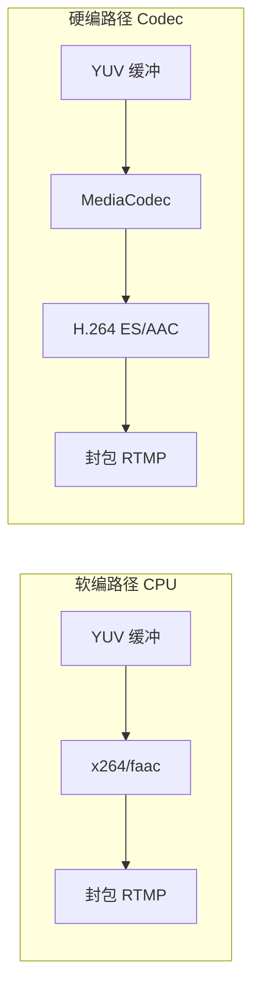

**性能量级说明**：硬编相对软编的 CPU 占用通常 **显著更低**、功耗更低；具体倍数与分辨率、帧率、机型强相关，应以 **Systrace / CPU Profiler / dumpsys media.codec** 实测为准，不宜写死倍数。

---

#### IBP帧

IBP 是 H.264/H.265 中最核心的帧间压缩机制，决定了「码率、延迟、画质、抗丢包能力」之间的平衡。

**1) I/P/B 帧分别是什么**
- **I 帧（Intra）**：完整自描述帧，不依赖其他帧，可单独解码；码率最大，但随机访问最友好。
- **P 帧（Predicted）**：只记录相对前面参考帧的差异；码率更低。
- **B 帧（Bi-predicted）**：可同时参考前后帧，压缩效率最高，但编码/解码链路更复杂，且引入重排延迟。

**2) 为什么要做 IBP**
- 传输的带宽存在上限, 使用压缩帧能在有限码率的情况下提高画质
- I 帧本身是「完整帧、无参考、细节理论最干净」, 但在带宽受限 + 频繁发 I 帧 的前提下，I 帧必须被强行高压缩，所以才变模糊、马赛克重
- 只靠 P 帧虽然省带宽，但在复杂运动场景仍不够高效。
- B 帧可进一步压缩，但要付出更高时延和更复杂时间戳管理成本。


带宽在相同 1000kbps 情况下:
- B 帧数量越多，整体压缩效率越高、占用传输比特越少，能为 I 帧和 P 帧预留更多码率空间，同等带宽下整体画质更好；
  但 B 帧采用前后双向参考，需要等待前后帧就绪才能解码渲染，帧时序需要重排，因此 B 帧越多，端到端延迟越高。
- GOP 间隔越小（I 帧越密集），观众拉流秒开、丢包恢复越快、实时延迟越低；
  但带宽总量有限，I 帧单帧体积远大于 P/B 帧，I 帧数量增多会抢占整体码率配额，编码器被迫压低每帧分配比特、加重压缩，最终整体画面细节丢失、画质下降。


码率对比:
```text
I 帧 ＞＞ P 帧 ＞ B 帧
（1000KB）（100KB）（20KB）
```

相同码率下画质排名:
```text
I+P+B ＞ I+P ＞ 全I帧
（B帧越多越清晰）
```

延迟排名:
```text
全I帧 ＜ I+P ＜ I+P+B
（B帧越多延迟越高, I帧越多GOP越短, 延迟越低）
```

抗丢包排名: 
```text
全I帧 ＞ I+P ＞ I+P+B
（B帧越多越容易花屏）
```

**3) 怎么选**
- **低延迟直播（RTMP、RTC）**：通常 `I + P`（禁用 B 帧），关键帧间隔 1~2 秒。
- **点播/HLS**：允许 `I + P + B`，换更高压缩效率。
- **网络差/终端弱**：缩短 GOP（更频繁 I 帧），提升恢复能力，但码率会上升。
- **网络稳/追求带宽效率**：拉长 GOP，并在可接受延迟内引入 B 帧。


**4) 解决了什么问题**
- 显著降低同等画质下码率，提升弱网可用性。
- 降低存储和 CDN 分发成本（尤其录播/HLS 场景）。
- 提升画质稳定性（同码率下细节保留更好）。

**5) 带来的新问题**
- 帧依赖链更长，丢包后可能出现更长时间花屏/马赛克。
- B 帧导致显示顺序与编码顺序不一致，需要 PTS/DTS 重排。
- 实时链路（RTMP/RTC）中 B 帧会提高端到端延迟。

**6) 本项目中的使用方式**
- **RTMP 实时推流（`VideoStream`）**：明确 `param.i_bframe = 0`，即只用 I/P，目标是低延迟和实现简单。
- **RTSP 文件推流（`FFRtmpPusher`）**：以 FFmpeg 重封装为主，帧类型主要沿用输入文件，不在自研层强行重编码改 GOP。
- **HLS 播放**：你当前文档定位是在线播放场景，天然更偏容忍延迟，通常可接受含 B 帧的分片流（由上游转码策略决定）。

代码摘录（项目内：RTMP 实时链路如何配置 I/P）：
```cpp
// VideoStream::setVideoEncInfo
x264_param_t param;
x264_param_default_preset(&param, "ultrafast", "zerolatency");

param.i_csp = X264_CSP_I420;    // 输入格式：I420
param.i_width = width;          // 编码宽度
param.i_height = height;        // 编码高度
param.i_bframe = 0;             // 关键：禁用 B 帧，只保留 I/P，降低实时延迟
param.i_fps_num = fps;          // 帧率分子
param.i_fps_den = 1;            // 帧率分母
param.i_keyint_max = fps * 2;   // GOP 最大长度：约 2 秒一个 I 帧
param.b_repeat_headers = 1;     // 每个关键帧前重复 SPS/PPS，便于中途入流解码

param.rc.i_rc_method = X264_RC_ABR;         // 码率控制：ABR
param.rc.i_bitrate = bitrate / 1024;        // 目标码率(kbps)
param.rc.i_vbv_max_bitrate = bitrate / 1024 * 1.2;
param.rc.i_vbv_buffer_size = bitrate / 1024;
```
解释：这段是本项目“IBP”最直接证据：`i_bframe=0` 表示直播不用 B 帧，`i_keyint_max` 控制 I 帧间隔（影响恢复速度与码率）。

代码摘录（项目外：如何显式调 I/B/P 策略）：
```cpp
// 方案A：超低延迟直播（I + P）
param.i_bframe = 0;             // 禁用 B 帧
param.i_keyint_max = fps * 1;   // 1秒一个 I 帧，恢复更快

// 方案B：均衡画质（I + P + 少量B）
param.i_bframe = 1;             // 允许 1 个 B 帧
param.i_keyint_max = fps * 2;   // 2秒一个 I 帧

// 方案C：点播优先压缩（I + P + 多B）
param.i_bframe = 2;             // 更高压缩比
param.i_keyint_max = fps * 3;   // GOP 拉长，码率更省但时延更高
```
解释：这个是常见工程调参模板；直播通常 A，点播/HLS 常见 B/C。

代码摘录（项目外：根据网络波动动态调整 IBP 的策略伪代码）：
```java
/**
 * 网络质量统计回调（自适应码率核心逻辑）
 * 每 2 秒触发一次，根据当前网络状态（带宽、RTT延迟、丢包率）动态决策编码档位
 * 目的：弱网降低画质保证流畅，强网提升画质追求体验，实现直播自适应推流
 *
 * @param bitrateKbps 当前可用带宽估算值（kbps）
 * @param rttMs 网络往返延时（ms），值越大网络越差
 * @param lossPct 丢包率（0.08 = 8%），丢包越高画面越容易卡顿
 */
void onNetStat(long bitrateKbps, int rttMs, float lossPct) {
  // ==================== 弱网环境：丢包高/延迟高/带宽极低 ====================
  // 策略：大幅降低分辨率、帧率、码率，缩短GOP提高抗丢包能力，禁用B帧保证最低延迟
  if (lossPct > 0.08f || rttMs > 300 || bitrateKbps < 600) {
    encoderProfile = "LOW_LATENCY";
    // 配置：640x360分辨率、12帧、450kbps、无B帧、GOP=12帧（1秒一个I帧）
    applyProfile(640, 360, 12, 450_000, 0, 12);
  }

  // ==================== 中等网络：一般网络环境 ====================
  // 策略：平衡流畅度与画质，中等分辨率+中等码率，保证直播稳定
  else if (lossPct > 0.03f || rttMs > 180 || bitrateKbps < 1200) {
    encoderProfile = "BALANCED";
    // 配置：960x540分辨率、18帧、800kbps、无B帧、GOP=24帧（约1.3秒一个I帧）
    applyProfile(960, 540, 18, 800_000, 0, 24);
  }

  // ==================== 优良网络：带宽充足、延迟低、无丢包 ====================
  // 策略：开启高清画质，高分辨率+高帧率+高码率，直播体验最佳
  else {
    encoderProfile = "HIGH_QUALITY";
    // 配置：720P分辨率、24帧、1500kbps、无B帧、GOP=48帧（2秒一个I帧）
    applyProfile(1280, 720, 24, 1_500_000, 0, 48);
  }
}


/**
 * 动态应用视频编码档位配置
 * 作用：根据当前网络质量，动态修改编码器的分辨率、帧率、码率、GOP、B帧策略
 * 用于弱网降档、强网升档，保证直播流畅不卡顿
 * <p>
 * 入参全部对应实时直播编码核心参数：
 * @param width        编码输出宽度
 * @param height       编码输出高度
 * @param fps          编码帧率
 * @param bitrate      目标码率（bps）
 * @param bframeCount  B帧数量（直播固定传 0，禁用B帧）
 * @param keyintSec    I帧间隔秒数（GOP = fps * 秒数）
 */
void applyProfile(int width, int height, int fps, long bitrate, int bframeCount, int keyintSec) {

  // 1. 计算实际GOP大小（I帧间隔 = 帧率 × 秒数）
  int gopSize = fps * keyintSec;

  // 2. 构建/更新编码器参数（对应你项目中的 x264_param_t）
  VideoEncParam param = new VideoEncParam();

  // 基础画面配置
  param.width        = width;         // 动态分辨率
  param.height       = height;
  param.fps          = fps;           // 动态帧率

  // 码率控制配置
  param.bitrate      = bitrate;       // 动态码率 bps
  param.vbvMaxBitrate = (long)(bitrate * 1.2);  // 峰值码率
  param.vbvBufferSize = bitrate;      // 缓冲大小

  // IBP帧核心配置
  param.bframeCount  = bframeCount;   // B帧数量（直播=0）
  param.gopSize      = gopSize;       // I帧间隔

  // 低延迟直播专用配置
  param.lowLatencyMode = true;         // 开启零延迟
  param.ultraFastPreset = true;        // 最快编码速度

  // 3. 通知编码器重新加载配置
  // 弱网/网络变好时，热更新编码配置，不中断推流
  encoder.updateParameter(param);

  // 4. 日志记录档位切换（便于调试/统计）
  log.info("动态切换编码档位：分辨率={}x{} 帧率={} 码率={}kbps B帧={} GOP={}",
          width, height, fps, bitrate / 1000, bframeCount, gopSize);
}
```
解释：直播动态调参建议优先调“分辨率/帧率/码率/GOP”，B 帧一般固定 0，减少重排延迟与复杂度。

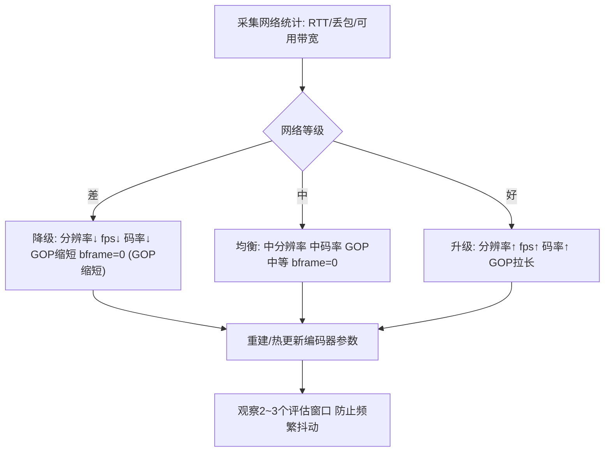

**远程操控快速下拉画面模糊、静止2秒变清晰（从IBP帧角度分析）**
- 远程桌面采用H.264 I+P帧编码，带宽固定且禁用B帧。
- 快速下拉时画面运动剧烈，P帧帧间差异极大，P帧体积变大，I帧被重度压缩，画面模糊马赛克明显。
- 画面静止后帧间差异极小，P帧占用码率大幅降低；空余码率提升画面细节，同时等待I帧完整刷新，2秒左右画质恢复清晰。

### RTMP实时推流

#### RTMP 的核心作用

RTMP 是基于 TCP 的应用层协议，本质是一个**流媒体封装** + **传输** + **同步协议**
它的核心目的之一：给每一个音视频帧打统一时间戳（timestamp，毫秒）
播放器 / 服务器根据 同一流 ID + 时间戳 来对齐音频和视频，防止音画错位、不同步

#### RTMP 封装结构（Chunk → Message → 音视频帧）
RTMP在收发数据的时候并不是以Message为单位的，⽽是把Message拆分成Chunk发送

封装链路：
```text
YUV/PCM 数据 → H.264/AAC 编码 → FLV Tag 封装 → Message → Chunk
```

网络中传输的全是chunk, 分为video chunk和audio chunk

* 最底层：Chunk（块）—— 最小传输单元
  Chunk = Chunk Header + Chunk Data，其中 Chunk Data 最大 128 字节。

Chunk Header 分 4 种（Chunk Type）：
```text
Type 0：完整头（11 字节），新流第一个包用
Type 1：无流 ID（7 字节）
Type 2：仅时间戳增量（3 字节）
Type 3：无头部（0 字节），连续同类型帧用
```

* 中层：Message（消息）
一个 Message = 一个完整音频帧 / 视频帧 / 控制命令。
Message 固定头:
```text
1B  Message Type（8=音频，9=视频）
3B  Payload Length（帧大小）
4B  Timestamp（毫秒，同步核心）
3B  Stream ID（流 ID，区分不同流）
```

* 中上层：FLV Tag（强制封装格式）
RTMP 强制要求所有音视频数据以 FLV Tag 格式封装。一个 Message 只包含一个 FLV Tag，FLV Tag 位于 Chunk Data 中。
FLV Tag = FLV Tag Header（11 字节）+ FLV Tag Body。

FLV Tag Header 结构：
```text
1B  TagType（8=音频，9=视频，18=脚本数据）
3B  DataSize（Tag Body 长度）
3B  Timestamp（低 24 位）
1B  TimestampExtended（高 8 位，组成 32 位时间戳）
3B  StreamID（固定为 0）
```

FLV Tag Body：
```text
音频 FLV Tag Body = AAC 音频数据（含 AAC 序列头或原始帧）
视频 FLV Tag Body = H.264/H.265 视频数据（含 AVCDecoderConfigurationRecord 或 NALU）
```

* 上层：音视频数据（Payload）
音频：必须 AAC-LC（RTMP 强制）
视频：必须 H.264（AVC）或 H.265（HEVC）

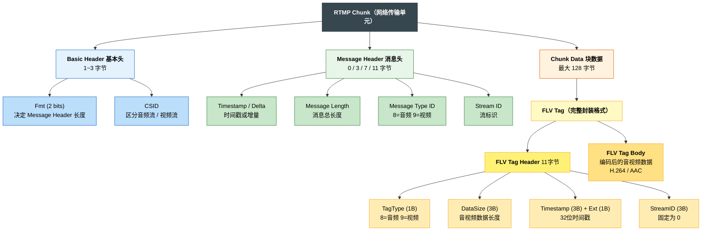

#### 组装RTMP数据包

这里重点只看**项目自研代码**（不展开 RTMP/x264/faac 源码内部）。

关键代码入口：
- Java 入口：`LivePushDemoActivity`、`LivePusherBridge`
- JNI/发送线程：`RtmpPusher.cpp`
- 音频封包：`AudioStream.cpp`
- 视频封包：`VideoStream.cpp`
- 发送队列：`PacketQueue.h`

**RTMP 音频包（AAC）组帧**
- Java 侧 `AudioCaptureTask` 用 `AudioRecord` 拉取 PCM，按 `getAudioInputByteCount()` 计算的帧长上送。
- `native_pushAudio -> AudioStream::encodeData`：
  - PCM -> FAAC 编码得到 AAC 原始帧。
  - 组 FLV Audio Tag Body：`[0xAF/0xAE][0x01][AAC Raw]`
    - 第 1 字节：音频格式/采样率/位深/声道（双声道 `0xAF`，单声道 `0xAE`）
    - 第 2 字节：`0x01` 表示 AAC 原始帧（非序列头）
  - 填 `RTMPPacket` 元信息：`m_packetType=RTMP_PACKET_TYPE_AUDIO`，`m_nChannel=0x11`。
- 开始推流后，发送线程会先调用 `audioStream->getAudioTag()` 发送 AAC Sequence Header（`m_body[1]=0x00`）。

代码摘录（Java 采集并上送 PCM）：
```java
// LivePushDemoActivity.AudioCaptureTask.run
/**
 * 采集循环：持续读取 PCM 并送入 SDK。
 */
@Override
public void run() {
    while (running && pushing) {
        int len = audioRecord.read(buffer, 0, buffer.length); // 从 MIC 读取 PCM
        if (len <= 0) continue;                                // 读失败/无数据跳过
        if (len == buffer.length) {
            bridge.pushAudioFrame(buffer.clone());             // 满帧直接送 JNI
        } else {
            byte[] exact = new byte[len];                      // 尾帧不足时裁剪
            System.arraycopy(buffer, 0, exact, 0, len);        // 避免上传脏字节
            bridge.pushAudioFrame(exact);                      // 送到 native 编码
        }
    }
}
```
解释：这段是音频入口，把麦克风 PCM 按帧喂给 `LivePusherBridge`，后续 JNI/C++ 再做 AAC 编码和 RTMP 封包。

代码摘录（C++ AAC 封包核心）：
```cpp
// AudioStream::encodeData
int byteLen = faacEncEncode(m_audioCodec,
        reinterpret_cast<int32_t *>(data),                 // PCM 输入
        static_cast<unsigned int>(m_inputSamples),         // 每帧采样数
        m_buffer,                                           // AAC 输出缓冲
        static_cast<unsigned int>(m_maxOutputBytes));
if (byteLen > 0) {
    int bodySize = 2 + byteLen;                            // FLV音频头2字节 + AAC负载
    auto *packet = new RTMPPacket();
    RTMPPacket_Alloc(packet, bodySize);                    // 申请 RTMP 包体内存
    packet->m_body[0] = (m_channels == 1) ? 0xAE : 0xAF;  // SoundFormat/SoundRate/SoundSize/SoundType
    packet->m_body[1] = 0x01;                              // AACPacketType=1 原始AAC帧
    memcpy(&packet->m_body[2], m_buffer, static_cast<size_t>(byteLen)); // 拷贝AAC载荷
    packet->m_packetType = RTMP_PACKET_TYPE_AUDIO;        // 标记音频包
    packet->m_nChannel = 0x11;                             // RTMP chunk stream id(音频)
    audioCallback(packet);                                 // 回调给统一发送队列
}
```
解释：先 FAAC 编码，再组 FLV Audio Tag（`0xAF/0xAE + 0x01 + AAC`），最后放入 RTMP 发送链路。

**RTMP 视频包（H.264）组帧**
- Java 侧 `onPreviewFrame` 把 I420 帧送到 `native_pushVideo`。
- `VideoStream::encodeVideo`：
  - 先做像素格式整理（NV21/I420 -> x264 需要的平面）。
  - x264 输出 NAL 后分三类处理：
    - `NAL_SPS`：缓存 SPS。
    - `NAL_PPS`：拿到 PPS 后与 SPS 一起调用 `sendSpsPps` 发 AVC Decoder Config 包。
    - 其他 NAL（IDR/P）：调用 `sendFrame` 发视频帧包。
- `sendSpsPps` 封装规则：
  - `m_body[0]=0x17`（关键帧 + AVC）
  - `m_body[1]=0x00`（AVC sequence header）
  - 后续写 AVCDecoderConfigurationRecord + SPS/PPS。
- `sendFrame` 封装规则：
  - IDR 用 `0x17`，非 IDR 用 `0x27`。
  - `m_body[1]=0x01`（AVC NALU）
  - 后跟 4 字节 NAL 长度 + NAL 负载。

代码摘录（Java 视频入口）：
```java
// LivePushDemoActivity.onPreviewFrame
/**
 * Camera2 帧回调：把 I420 帧送入 SDK 进行编码并推送。
 *
 * @param yuvData I420 视频帧
 */
@Override
public void onPreviewFrame(byte[] yuvData) {
    if (!pushing || livePusherBridge == null) return;    // 未推流直接丢帧
    livePusherBridge.pushVideoFrame(yuvData, LiveFrameFormat.I420); // I420 -> JNI
}
```
解释：Camera2 回调的 I420 帧进入 `LivePusherBridge`，之后由 native 侧完成编码和打包。

代码摘录（C++ SPS/PPS 与帧包封装）：
```cpp
// VideoStream::sendSpsPps
packet->m_body[i++] = 0x17; // keyframe + AVC
packet->m_body[i++] = 0x00; // AVC sequence header
...
packet->m_packetType = RTMP_PACKET_TYPE_VIDEO; // 标记视频包
packet->m_nChannel   = 0x10;                   // RTMP chunk stream id(视频)
videoCallback(packet);                         // 入统一发送队列

// VideoStream::sendFrame
packet->m_body[i++] = (type == NAL_SLICE_IDR) ? 0x17 : 0x27; // 关键帧/非关键帧
packet->m_body[i++] = 0x01; // AVCPacketType=1 普通NALU
packet->m_body[i++] = (i_payload >> 24) & 0xFF;
packet->m_body[i++] = (i_payload >> 16) & 0xFF;
packet->m_body[i++] = (i_payload >> 8) & 0xFF;
packet->m_body[i++] = (i_payload) & 0xFF;
memcpy(&packet->m_body[i], payload, static_cast<size_t>(i_payload)); // NALU 负载
videoCallback(packet); // 回调发包
```
解释：`sendSpsPps` 发解码配置头，`sendFrame` 发每帧 NALU（关键帧/非关键帧头不同）。

**时间戳与发送**
- `RtmpPusher.cpp` 中统一回调 `callback(packet)` 给每个包打相对时间戳：`RTMP_GetTime() - start_time`。
- 所有音视频包都先入 `PacketQueue`，发送线程循环 `RTMP_SendPacket`，保证串行发送与 A/V 交织。

代码摘录（统一打时间戳 + 队列发送）：
```cpp
void callback(RTMPPacket *packet) {
    if (packet) {
        packet->m_nTimeStamp = RTMP_GetTime() - start_time; // 统一相对时间戳
        packets.push(packet);                                // 音视频都进同一个队列
    }
}
...
while (isPushing) {
    packets.pop(packet);                          // 从统一队列取“下一个待发包”
    if (!packet) continue;                        // 空包跳过
    packet->m_nInfoField2 = rtmp->m_stream_id;   // 绑定 stream id
    ret = RTMP_SendPacket(rtmp, packet, 1);      // 发到网络层（librtmp）
    releasePackets(packet);                       // 发完释放内存
}
```
解释：这里是 RTMP 发送“总闸口”，把音频包和视频包统一时间基准后串行发出。

#### PacketQueue介绍

`PacketQueue<RTMPPacket*>` 的职责是“**按到达顺序缓存包，单线程串行发送**”，它不会把音频包和视频包再拼成一个大包。

- **是不是分别发出？** 是。音频包、视频包各自独立封装，分别入队，分别发送。
- **怎么同步？** 通过统一时钟生成的 `m_nTimeStamp`（相对 `start_time`）同步，接收端按时间戳对齐解码播放。
- **为什么用同一队列？** 防止多线程并发直接发包导致乱序；统一从一个出口出网，行为可控。

代码摘录（队列组织与发送）：
```cpp
// 生产者：音视频编码回调
void callback(RTMPPacket *packet) {
    if (packet) {
        packet->m_nTimeStamp = RTMP_GetTime() - start_time; // 统一主时钟
        packets.push(packet);                                // push到同一队列
    }
}

// 消费者：发送线程
while (isPushing) {
    packets.pop(packet);                 // 取下一个包（音频或视频）
    if (!packet) continue;
    packet->m_nInfoField2 = rtmp->m_stream_id;
    RTMP_SendPacket(rtmp, packet, 1);   // 逐包发送，不做音视频二次拼接
    releasePackets(packet);
}
```
解释：同步不是“拼成一个包”，而是“同一时间基准 + 顺序发送 + 播放端按时间戳同步”。

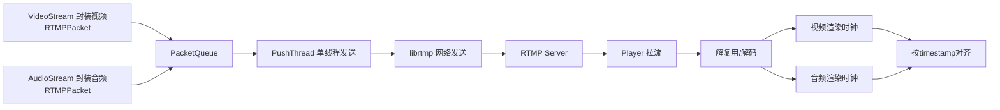

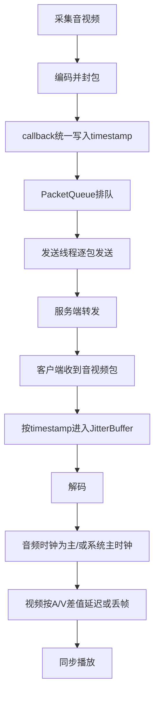

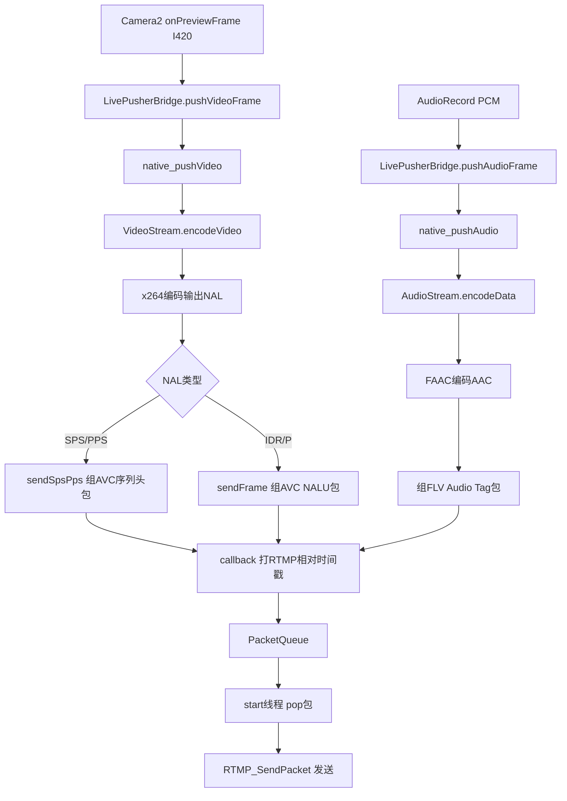

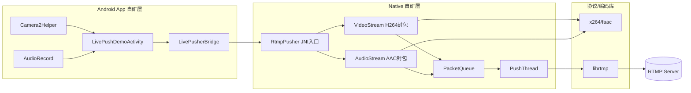


#### RTMP推流

推流端已完成编码与 FLV Tag 封装后，经 TCP **RTMP** 推送至服务器；服务端可做转发、录制、转 HLS 等（取决于模块）。

---

#### Nginx流媒体服务器

**1)本项目的 Nginx 在 RTMP + HLS 在做什么**

* Nginx做的事情：调度 / 设置 / 切片
- 配置接收客户端推流url rtmp://xxx
- 调用 FFmpeg（exec ffmpeg）
- 接收 FFmpeg 转码后的多路流
- 切成 HLS 切片（.ts + .m3u8）
- 管理多清晰度播放列表
- 提供 HTTP 访问切片

参考代码：
```yaml
rtmp {
    server {
        listen 1935;           # 接收推流
        application stream { }  # 接收入口
        application hls { }     # 播放出口
        hls on;                 # 开启切片
        hls_fragment 5;         # 切片 5 秒一片
        hls_variant ...         # 告诉播放器有哪几种清晰度
    }
}
```

* FFmpeg 负责：
- 解码原始推流
- 压缩视频
- 修改分辨率（720P/480P/360P/240P）
- 改变码率
- 编码成 h264 + aac
- 输出5 种不同清晰度的流给 Nginx

参考代码：
```yaml
#-c:a 音频编码
#-b:a 音频码率
#-c:v 视频编码
#-b:v 视频码率
#-s 分辨率
#...输出到 Nginx 的 hls 应用

exec ffmpeg -i rtmp://localhost:1935/stream/$name  # 输入流
-c:a libfdk_aac -b:a 128k -c:v libx264 -b:v 2500k -s 1280x720 ...  # 720P
-c:a libfdk_aac -b:a 128k -c:v libx264 -b:v 1000k -s 854x480 ...   # 480P
... 输出 5 档清晰度到 Nginx HLS 模块
```

* Docker 负责：
- 下载并运行带 RTMP + FFmpeg 的 Nginx 容器环境
- 启动 Nginx 服务，让 Nginx 能够监听 1935（RTMP）、80、8080 端口
- 端口映射：把宿主机的 80/8080/1935 端口转发到 Nginx 容器内部
- 文件挂载：把本地的 nginx 配置、静态页面（Html）、HLS 切片目录（nginx-hls）映射进容器
- 进程守护：保证 Nginx 异常退出时自动重启（restart: unless-stopped）

参考代码：
docker-compose.yml
```yaml
  nginx:
    image: alfg/nginx-rtmp:latest       # 自带 RTMP 模块 + FFmpeg 的官方流媒体镜像
    container_name: springboot-nginx    # 容器名称
    restart: unless-stopped              # 异常自动重启
    command: ["nginx", "-c", "/etc/nginx/nginx.conf"]  # 使用自定义配置启动
    depends_on:
      - springboot       # 依赖后端服务（WebSocket 代理需要）
      - minio            # 依赖文件存储服务
    ports:
      - "80:80"          # HTTP 主端口：MinIO 代理 + WebSocket 代理
      - "8080:8080"      # 直播专用端口：HLS 播放 + 监控页面
      - "1935:1935"      # RTMP 推流端口（主播端推流地址）
    volumes:
      # 自定义 Nginx 主配置（RTMP + HLS + 代理）
      - ../nginx-docker/conf/nginx.conf:/etc/nginx/nginx.conf
      # MIME 类型配置
      - ../nginx-docker/conf/mime.types:/etc/nginx/mime.types:ro
      # 前端静态资源、stat 监控页面
      - ../nginx-docker/html:/etc/nginx/html:ro
      # HLS 切片文件持久化存储（.ts + .m3u8）
      - nginx-hls:/tmp/hls
```
dockerFile
下载FFmpeg
```shell
RUN apt-get update && \
    apt-get install -y --no-install-recommends ffmpeg && \
    rm -rf /var/lib/apt/lists/*
```
dockerfile用于运行前的容器构建，相当于`Maven`
docker-compose.yml用于容器运行时的配置，当相遇`Nacos`或者`application.yml`

**2)核心问题**
* 直播清晰度设置是谁做？
- 分辨率、码率、编码 → FFmpeg 做
```yaml
-s 1280x720     分辨率
-b:v 2500k      视频码率
-c:v libx264    编码
```
- **`exec ffmpeg`**：可看作「服务端收到原始 RTMP 后的 **转码再分发**」，`-s`、`-b:v`、`-r` 等在 **ffmpeg 命令行**里指定 —— 这才是「分辨率/码率」的主要来源；**不是** `nginx.conf` 里单独一个叫「RTMP 分辨率」的魔法开关。


* 在线视频切片是谁做？
- HLS 切片（5 秒一片） → Nginx 做
```yaml
hls on;
hls_fragment 5;
```


* 在线视频清晰度是谁做？
- 多清晰度列表是谁做？ → Nginx 做
```yaml
hls_variant ...  告诉播放器有哪些清晰度
```
- **`hls_variant`**：生成 **多码率自适应 HLS**（不同子目录/`iframe`）。


* nginx「能实现 rtsp://」吗？
- **默认 nginx-rtmp 模块不做 RTSP 服务**。
- 本项目 **RTSP** 由 **MediaMTX**（单独容器 `:8554`）承担；不要把 RTMP 配置误以为 RTSP。


* nginx 与 RTMP「性能
- **worker_connections**：限制并发连接。
- **chunk_size**：RTMP 分块大小，影响小包聚合行为。
- 十万并发播放通常需 **CDN + 边缘**，单机 nginx 瓶颈多在 **网卡带宽与 CPU 转发**。

**3)核心nginx代码**
```yaml
# 关闭守护进程模式（Docker 中必须开启，让 Nginx 运行在前台）
daemon off;

events {
  # 每个 worker 进程最大 1024 个连接
  worker_connections 1024;
}

# RTMP 直播模块（推流 + 转码 + 分发）
rtmp {
    server {
        # 监听 RTMP 默认端口 1935
        listen 1935;
        chunk_size 4000;

        # 推流应用：客户端往这里推流
        application stream {
            live on; # 开启直播模式

            # 收到流后，自动调用 ffmpeg 转码成 5 种清晰度
            # 源：rtmp://localhost:1935/stream/流名
            exec ffmpeg -i rtmp://localhost:1935/stream/$name
              # 720P 高码率
              -c:a libfdk_aac -b:a 128k -c:v libx264 -b:v 2500k -f flv -g 30 -r 30 -s 1280x720 -preset superfast -profile:v baseline rtmp://localhost:1935/hls/$name_720p2628kbs
              # 480P
              -c:a libfdk_aac -b:a 128k -c:v libx264 -b:v 1000k -f flv -g 30 -r 30 -s 854x480 -preset superfast -profile:v baseline rtmp://localhost:1935/hls/$name_480p1128kbs
              # 360P
              -c:a libfdk_aac -b:a 128k -c:v libx264 -b:v 750k -f flv -g 30 -r 30 -s 640x360 -preset superfast -profile:v baseline rtmp://localhost:1935/hls/$name_360p878kbs
              # 240P 标准
              -c:a libfdk_aac -b:a 400k -f flv -g 30 -r 30 -s 426x240 -preset superfast -profile:v baseline rtmp://localhost:1935/hls/$name_240p528kbs
              # 240P 低码率（弱网）
              -c:a libfdk_aac -b:a 64k -c:v libx264 -b:v 200k -f flv -g 15 -r 15 -s 426x240 -preset superfast -profile:v baseline rtmp://localhost:1935/hls/$name_240p264kbs;
        }

        # HLS 播放应用：转码后的流输出成 m3u8 切片
        application hls {
            live on;
            hls on; # 开启 HLS 切片
            hls_fragment_naming system; # 切片命名方式
            hls_fragment 5; # 每个切片 5 秒
            hls_playlist_length 10; # 播放列表长度 10 秒
            hls_path /tmp/hls; # 切片文件存放目录
            hls_nested on; # 按流名创建子目录

            # 5 种清晰度的自适应码率（HLS 多码率）
            hls_variant _720p2628kbs BANDWIDTH=2628000,RESOLUTION=1280x720;
            hls_variant _480p1128kbs BANDWIDTH=1128000,RESOLUTION=854x480;
            hls_variant _360p878kbs BANDWIDTH=878000,RESOLUTION=640x360;
            hls_variant _240p528kbs BANDWIDTH=528000,RESOLUTION=426x240;
            hls_variant _240p264kbs BANDWIDTH=264000,RESOLUTION=426x240;
        }
    }
}
```

**4)Nginx, FFmpeg, Docker的作用**

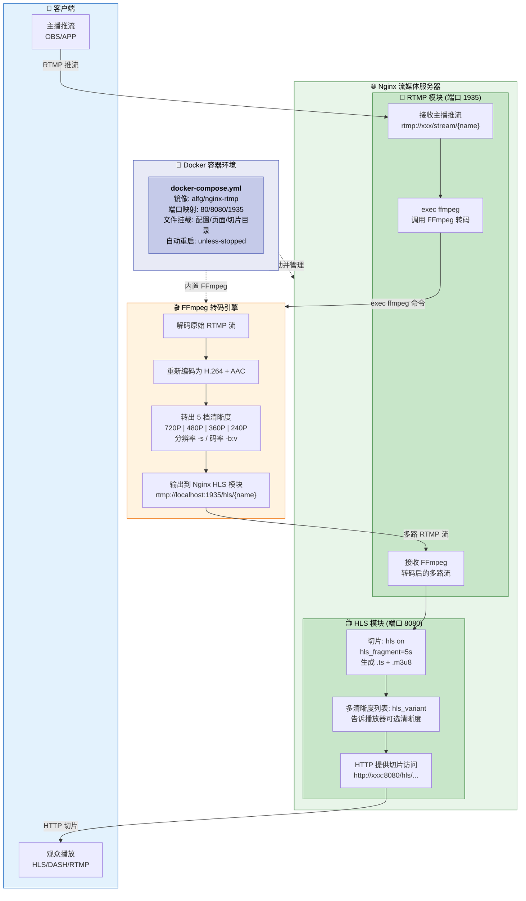

| 组件   | 在 RTMP 中做什么           | 在 HLS 中做什么                   |
|--------|-----------------------|------------------------------|
| Nginx  | 接收推流、调度 FFmpeg、收转码流   | 切片(.ts/.m3u8)、多清晰度列表、HTTP 分发 |
| FFmpeg | 解码原始流、改分辨率/码率、重新编码    | 输出多档清晰度给 Nginx               |
| Docker | 拉取镜像、端口映射、文件挂载        | 容器守护、自动重启                    |

关键结论：
清晰度设置 → FFmpeg 的 -s、-b:v、-c:v 参数
切片生成 → Nginx 的 hls on; hls_fragment 5;
多清晰度列表 → Nginx 的 hls_variant
RTSP 不在 Nginx → 本项目由 MediaMTX 容器承担

#### MediaMTX（Docker 中的 RTSP）

MediaMTX 天生就是干流媒体，完全没必要让流媒体走nginx。

**为什么 RTMP 需要大量 Nginx 配置，而 RTSP 只需要 MediaMTX？**

* Nginx 本身不支持 RTMP，需要：
  - 安装 RTMP 模块
  - 安装 FFmpeg 转码
  - 编写 RTMP + HLS 配置
  - 挂载配置、切片目录、端口映射
    属于“改装后才能支持直播”。

* MediaMTX 是原生全能流媒体服务器：
  - 内置 RTSP、RTMP、WebRTC、HLS、SRT
  - 内置转码、解封装、同步
  - 无需配置文件
  - 无需安装 FFmpeg
  - 无需模块
    启动即提供完整 RTSP 服务，支持推流、拉流、解码、播放。

MediaMTX 所做的事情：
- 启动 RTSP 服务器（端口 8554）
- 接收/转发 RTSP 流
- 解析 RTP 包、提取 H.264/AAC
- 支持多客户端同时拉流
- 支持中途入流、自动同步音视频

**MediaMTX 能干掉 Nginx 哪些活？**
MediaMTX 原生自带：
✅ RTSP 推流 / 拉流
✅ RTMP 推流 / 拉流（自带，不用 Nginx）
✅ HLS 自动生成 m3u8/ts 切片
✅ WebRTC 低延迟网页播放
✅ 自带转码、多清晰度
✅ 自带缓冲、音视频同步、SPS/PPS 补发

`docker-compose.yml` 片段：

```yaml
mediamtx:
  image: bluenviron/mediamtx:latest
  ports:
    - "8554:8554"
```

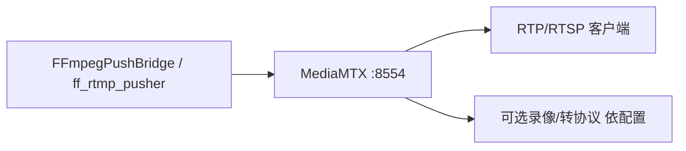

### RTSP文件推流

RTMP实时推流是需要控制GOP, IBP帧的, 而RTSP推流则沿用文件的IBP帧, 不做自定义修改.

#### 数据流和逻辑

数据流通信图：
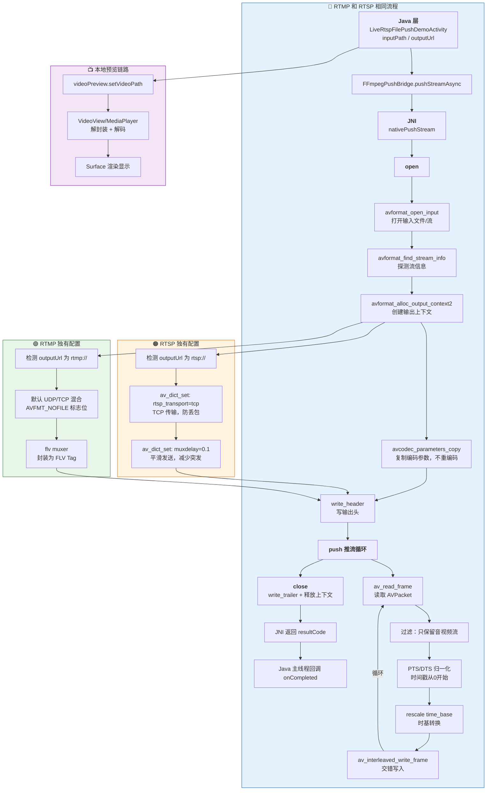

逻辑活动图
```mermaid
flowchart TD
  S["<b>开始</b><br/>点击“开始文件推流”"] --> T["校验 inputPath / outputUrl"]
T --> U{"outputUrl 协议?"}
U -->|"rtsp://"| V_rtsp["RTSP 推流<br/>pushStreamAsync"]
U -->|"rtmp://"| V_rtmp["RTMP 推流<br/>pushStreamAsync"]
U -->|"其他"| W["报错 / 返回"]

V_rtsp --> X["JNI nativePushStream"]
V_rtmp --> X

X --> Y["<b>open(input, output)</b>"]

Y --> Z["avformat_open_input<br/>打开输入文件/流"]
Z --> Z0["avformat_find_stream_info<br/>探测流信息"]

Z0 --> Z1["avformat_alloc_output_context2<br/>创建输出上下文"]
Z1 --> Z2["遍历 nb_streams<br/>avcodec_parameters_copy<br/>参数复制，不重编码"]

Z2 --> Z3{"输出协议?"}

subgraph RTSP_Branch["🟠 RTSP 分支"]
Z3_rtsp["rtsp://"] --> Z4["av_dict_set:<br/>rtsp_transport=tcp<br/>muxdelay=0.1"]
Z4 --> Z5_rtsp["rtsp muxer<br/>封装为 RTP 包"]
end

subgraph RTMP_Branch["🟢 RTMP 分支"]
Z3_rtmp["rtmp://"] --> Z5_rtmp["flv muxer<br/>封装为 FLV Tag"]
end

Z3 --> Z3_rtsp
Z3 --> Z3_rtmp

Z5_rtsp --> Z6["avformat_write_header<br/>写输出头"]
Z5_rtmp --> Z6

Z6 --> A1["<b>push 推流循环</b>"]

A1 --> A2["av_read_frame<br/>读取 AVPacket"]
A2 --> A3{"音视频包?"}
A3 -->|"否"| A2
A3 -->|"是"| A4["PTS/DTS 归一化<br/>时间戳从0开始"]
A4 --> A4a["节拍等待<br/>推流速度控制"]
A4a --> A4b["rescale time_base<br/>时基转换"]
A4b --> A5["av_interleaved_write_frame<br/>交错写入输出流"]
A5 --> A2

A2 -->|"EOF / 错误"| A6["<b>close</b><br/>av_write_trailer<br/>avio_closep<br/>释放上下文"]

A6 --> A7["JNI 返回 resultCode"]
A7 --> A8["Java 主线程回调<br/>onCompleted"]
A8 --> E["<b>结束</b>"]

%% 样式
style S fill:#37474f,stroke:#263238,color:#fff
style E fill:#37474f,stroke:#263238,color:#fff
style W fill:#ffcdd2,stroke:#c62828,color:#000

style V_rtsp fill:#ede7f6,stroke:#7b1fa2,color:#000
style V_rtmp fill:#ede7f6,stroke:#7b1fa2,color:#000
style X fill:#ede7f6,stroke:#7b1fa2,color:#000

style Y fill:#e3f2fd,stroke:#1565c0,color:#000
style Z fill:#e3f2fd,stroke:#1565c0,color:#000
style Z0 fill:#e3f2fd,stroke:#1565c0,color:#000
style Z1 fill:#e3f2fd,stroke:#1565c0,color:#000
style Z2 fill:#e3f2fd,stroke:#1565c0,color:#000
style Z6 fill:#e3f2fd,stroke:#1565c0,color:#000

style RTSP_Branch fill:#fff3e0,stroke:#ef6c00
style RTMP_Branch fill:#e8f5e9,stroke:#2e7d32

style Z4 fill:#ffe0b2,stroke:#ef6c00,color:#000
style Z5_rtsp fill:#ffcc80,stroke:#ef6c00,color:#000
style Z5_rtmp fill:#c8e6c9,stroke:#2e7d32,color:#000

style A1 fill:#e1f5fe,stroke:#0277bd,color:#000
style A2 fill:#e1f5fe,stroke:#0277bd,color:#000
style A4 fill:#e1f5fe,stroke:#0277bd,color:#000
style A5 fill:#e1f5fe,stroke:#0277bd,color:#000
style A6 fill:#e3f2fd,stroke:#1565c0,color:#000
style A7 fill:#ede7f6,stroke:#7b1fa2,color:#000
style A8 fill:#f3e5f5,stroke:#7b1fa2,color:#000
```

**1)本地预览**

```java
// 预览view
private VideoView videoPreview;
/**
 * 绑定预览源
 * @param path  源文件路径
 */
private void attachPreviewSource(String path) {
    // 绑定源
    videoPreview.setVideoPath(path);
    // 准备好播放了
    videoPreview.setOnPreparedListener(mediaPlayer -> {
    });
}
```
其中：`public void setOnPreparedListener(MediaPlayer.OnPreparedListener l)`的`OnPreparedListener`
提供接口回调：`void onPrepared(MediaPlayer mp);`
VideoView 只是界面壳子，MediaPlayer 是里面真正干活的引擎。
MediaPlayer 是 Android 系统的音视频播放核心引擎，主要功能：
- 播放：`start()`
- 暂停：`pause()`
- 停止：`stop()`
- 重置：`reset()`
- 释放资源：`release()`
- 拖动进度：`seekTo(int msec)`
- 获取总时长：`getDuration()`
- 获取当前进度：`getCurrentPosition()`
- 设置音量：`setVolume(float leftVolume, float rightVolume)`
- 准备完成：`onPrepared(MediaPlayer mp)`
- 播放完成：`onCompletion(MediaPlayer mp)`
- 拖动完成：`onSeekComplete(MediaPlayer mp)`
- 播放错误：`onError(MediaPlayer mp, int what, int extra)`
- 缓冲更新：`onBufferingUpdate(MediaPlayer mp, int percent)`

**2)推流**

FFmpeg 核心库功能说明：
- libavformat：封装与解封装，处理 MP4、FLV、HLS、RTMP、RTSP 等文件格式与协议
- libavcodec：音视频编解码，H.264、H.265、AAC 等编码和解码
- libavutil：通用工具库，提供日志、错误处理、内存管理、时间戳、数学运算
- libswresample：音频重采样，改变采样率、声道数、位深格式转换
- libswscale：视频图像转换，缩放、裁剪、颜色空间转换（如 YUV → RGB）


* 推流数据结构
```c++
/**
 * FFmpeg 文件转推器：
 * - 打开输入媒体；
 * - 初始化 RTMP(FLV)/RTSP 输出；
 * - 循环转推音视频包。
 */
class FFRtmpPusher {
private:
    AVFormatContext *inFormatCtx = nullptr;  /**< 输入容器：open_input / read_frame */
    AVFormatContext *outFormatCtx = nullptr; /**< 输出容器：write_header / interleaved_write_frame */
    AVDictionary *muxerOptions = nullptr;   /**< write_header 可选参数：如 RTSP 走 TCP */

    AVPacket packet;      /**< 栈上复用：每次 av_read_frame 填充，写完 write_frame 后 unref */
    int video_index = -1; /**< 选中的视频轨 stream_index；-1 表示无视频或未发现 */
    int audio_index = -1; /**< 选中的首条音频轨；其余音轨在 push 中丢弃 */

public:
    /** 打开输入、创建输出轨、写头部；失败返回 libav 负错误码 */
    int open(const char *inputPath, const char *outputPath);

    /** 读帧、时间戳修正、按媒体时钟节拍 sleep、写入输出；读完返回 0 或错误码 */
    int push();

    /** 写尾部、关闭 IO、释放上下文 */
    void close();
};
```

初始化推流RTSP
```c++
auto *rtmpPusher = new FFRtmpPusher();
ret = rtmpPusher->open(input_path, output_path);

/**
 * @brief 打开输入文件/URL，创建输出上下文并 write_header。
 */
int FFRtmpPusher::open(const char *inputPath, const char *outputPath) {
  // 初始化 Socket，允许 http/rtmp/rtsp 等网络协议
  avformat_network_init(); 
  // 探测容器头，建立输入上下文
  ret = avformat_open_input(&inFormatCtx, inputPath, nullptr, nullptr); 
  // 解析流、解码器参数、时长等元数据
  avformat_find_stream_info(inFormatCtx, nullptr); 
  
  // 创建输出 muxer
  const char *format_name = detect_output_format(outputPath);
  ret = avformat_alloc_output_context2(&outFormatCtx, nullptr, format_name, outputPath);
  
  
  // 遍历输入文件的所有流（视频流、音频流、字幕流等）
  for (int i = 0; i < inFormatCtx->nb_streams; ++i) {
      // 获取当前输入流
      AVStream *in_stream = inFormatCtx->streams[i];

      // 根据输入流的编码ID查找对应的编码器
      // 注意：纯封装转换(remux)场景下，这里仅需要一个编码器占位，不实际执行编码
      const auto *codec = avcodec_find_encoder(in_stream->codecpar->codec_id);

      // 为输出的媒体文件创建一个新的流，与输入流对应
      AVStream *out_stream = avformat_new_stream(outFormatCtx, codec);

      // 关键：直接拷贝编码参数，不进行重新编码，保证速度最快
      avcodec_parameters_copy(out_stream->codecpar, in_stream->codecpar);

      // 设置编码标签为0，让输出封装器自动生成合适的格式标识(FourCC)
      out_stream->codecpar->codec_tag = 0;

      // 判断当前流类型：视频流
      if (in_stream->codecpar->codec_type == AVMEDIA_TYPE_VIDEO) {
          // 记录视频流索引，采用覆盖策略：仅保留最后一个视频流（常规视频文件只有一条）
          video_index = i;
      }
      // 判断当前流类型：音频流
      else if (in_stream->codecpar->codec_type == AVMEDIA_TYPE_AUDIO) {
          // 只记录第一条音频流索引，忽略多音轨文件中的其他音轨（如解说、伴奏）
          if (audio_index == -1) {
              audio_index = i;
          }
      }
  }
  
  // 判断输出格式是否需要关联文件
  // 有些格式(如RTSP)是纯网络流，不需要文件IO
  if (!(outFormatCtx->oformat->flags & AVFMT_NOFILE)) {
      // 打开输出文件/网络IO上下文，用于写入媒体数据
      ret = avio_open2(&outFormatCtx->pb, outputPath, AVIO_FLAG_WRITE, nullptr, nullptr);
      if (ret < 0) {
          return ret;
      }
  }
  
  // 判断是否为RTSP推流输出，进行专属配置
  if (is_rtsp_output(outputPath)) {
      // RTSP 推流优先使用TCP传输，相比UDP更稳定，避免弱网丢包导致播放异常
      av_dict_set(&muxerOptions, "rtsp_transport", "tcp", 0);
      // 设置最小推流延迟，平滑RTP数据包发送，减少网络突发卡顿
      av_dict_set(&muxerOptions, "muxdelay", "0.1", 0);
  }
  
    // 写入媒体文件头信息（包含编码格式、流信息、SDP、FLV Header等）
    ret = avformat_write_header(outFormatCtx, &muxerOptions);

    // 释放参数字典，防止内存泄漏
    // avformat_write_header可能已内部清空，此处再次释放保证安全
    av_dict_free(&muxerOptions);
```

推流
```c++
/**
 * @brief 循环读取音视频压缩包 AVPacket，根据媒体时间戳进行同步休眠，再交错写入输出（RTMP/RTSP/HLS）
 * @return 成功返回0，失败返回错误码
 */
int FFRtmpPusher::push() {
    // 返回值初始化
    int ret = 0;
    // 记录推流开始的系统时间（微秒），用于控制推流速度，实现实时同步
    int64_t startTime = av_gettime();
    // 保存每个流的第一个PTS，用于将时间戳归零，从0开始
    std::vector<int64_t> firstPts(inFormatCtx->nb_streams, AV_NOPTS_VALUE);
    // 保存每个流的第一个DTS，用于将时间戳归零
    std::vector<int64_t> firstDts(inFormatCtx->nb_streams, AV_NOPTS_VALUE);
    // 保存上一次输出的DTS，用于保证DTS单调递增，防止推流出错
    std::vector<int64_t> lastOutDts(inFormatCtx->nb_streams, AV_NOPTS_VALUE);
    FFLOGI("push start");

    // 循环读取音视频数据包，直到文件结束或出错
    while (true) {
        // 从输入文件/流中读取一个音视频压缩包
        ret = av_read_frame(inFormatCtx, &packet);
        // 读取失败
        if (ret < 0) {
            // 文件读取完毕，正常结束
            if (ret == AVERROR_EOF) {
                FFLOGI("av_read_frame EOF, treat as normal finish");
                ret = 0;
            } else {
                // 读取发生错误
                FFLOGE("av_read_frame err=%d", ret);
            }
            break;
        }

        // 过滤：只保留之前选定的视频轨和音频轨，其他流（字幕等）直接丢弃
        if (packet.stream_index != video_index && packet.stream_index != audio_index) {
            // 释放数据包资源
            av_packet_unref(&packet);
            continue;
        }

        // 当前数据包所属的流索引
        int streamIndex = packet.stream_index;
        // 获取该流的时间基，用于时间戳换算
        AVRational time_base = inFormatCtx->streams[packet.stream_index]->time_base;

        // ===================== 时间戳归一化（从0开始）=====================
        // 处理PTS（显示时间戳）
        if (packet.pts != AV_NOPTS_VALUE) {
            // 记录第一个PTS，作为基准0点
            if (firstPts[streamIndex] == AV_NOPTS_VALUE) {
                firstPts[streamIndex] = packet.pts;
            }
            // 时间戳减去基准值，实现从0开始
            packet.pts -= firstPts[streamIndex];
            // 防止时间戳为负数
            if (packet.pts < 0) {
                packet.pts = 0;
            }
        }
        // 处理DTS（解码时间戳）
        if (packet.dts != AV_NOPTS_VALUE) {
            // 记录第一个DTS，作为基准0点
            if (firstDts[streamIndex] == AV_NOPTS_VALUE) {
                firstDts[streamIndex] = packet.dts;
            }
            // 时间戳减去基准值
            packet.dts -= firstDts[streamIndex];
            // 防止时间戳为负数
            if (packet.dts < 0) {
                packet.dts = 0;
            }
        }

        // 保证 PTS >= DTS，避免编码器/播放器报错
        if (packet.pts != AV_NOPTS_VALUE
            && packet.dts != AV_NOPTS_VALUE
            && packet.pts < packet.dts) {
            packet.pts = packet.dts;
        }

        // ===================== 实时推流速度控制（同步休眠）=====================
        // 用于同步的时间戳，优先使用DTS
        int64_t syncTs = packet.dts != AV_NOPTS_VALUE ? packet.dts : packet.pts;
        if (syncTs != AV_NOPTS_VALUE) {
            // 将媒体时间戳转换为微秒（真实时间）
            int64_t mediaTimeUs = av_rescale_q(syncTs, time_base, AV_TIME_BASE_Q);
            // 已经过去的系统时间
            int64_t elapsedUs = av_gettime() - startTime;
            // 计算需要休眠的时间，控制推流速度和播放速度一致
            int64_t waitUs = mediaTimeUs - elapsedUs;

            // 需要等待，防止推流过快
            if (waitUs > 0) {
                // 最大休眠200ms，避免连接超时断开
                if (waitUs > 200000) {
                    waitUs = 200000;
                }
                // 休眠等待，实现实时推流
                av_usleep(static_cast<unsigned int>(waitUs));
            }
        }

        // ===================== 时间戳单位转换 =====================
        // 将数据包的时间戳从输入流的时间基，转换为输出流的时间基
        rescale(inFormatCtx, outFormatCtx, &packet);

        // ===================== DTS 单调递增校验 =====================
        if (packet.dts != AV_NOPTS_VALUE) {
            // 如果当前DTS小于等于上一个DTS，强制+1，保证严格递增
            if (lastOutDts[streamIndex] != AV_NOPTS_VALUE
                && packet.dts <= lastOutDts[streamIndex]) {
                packet.dts = lastOutDts[streamIndex] + 1;
                // 同时保证PTS不小于DTS
                if (packet.pts != AV_NOPTS_VALUE && packet.pts < packet.dts) {
                    packet.pts = packet.dts;
                }
            }
            // 更新最后输出的DTS
            lastOutDts[streamIndex] = packet.dts;
        }

        // ===================== 写入输出流 =====================
        // 交错写入音视频包，自动维持音视频顺序，适合推流
        ret = av_interleaved_write_frame(outFormatCtx, &packet);
        if (ret < 0) {
            FFLOGE("write frame err=%d", ret);
            // 释放资源
            av_packet_unref(&packet);
            break;
        }

        // 释放当前数据包，避免内存泄漏
        av_packet_unref(&packet);
    }

    FFLOGI("push finish, ret=%d", ret);
    return ret;
}
```


结束推流：
```c++
/**
 * @brief 写文件尾部信息，关闭输出IO，释放输入/输出上下文
 * 负责推流/封装结束后的资源清理，防止内存泄漏
 */
void FFRtmpPusher::close() {
    // 打印关闭日志
    FFLOGI("close");

    // 释放推流参数字典，防止内存泄漏
    av_dict_free(&muxerOptions);

    // ==================== 释放输出上下文 ====================
    if (outFormatCtx) {
        // 写入文件尾部（如索引、结束标记），MP4/FLV等格式需要
        av_write_trailer(outFormatCtx);

        // 如果输出格式需要文件IO（不是纯网络流），并且IO上下文已打开
        if (!(outFormatCtx->oformat->flags & AVFMT_NOFILE) && outFormatCtx->pb) {
            // 关闭并释放输出文件/网络IO上下文
            avio_closep(&outFormatCtx->pb);
        }

        // 释放输出格式上下文（整个输出的核心结构体）
        avformat_free_context(outFormatCtx);
        // 指针置空，避免野指针
        outFormatCtx = nullptr;
    }

    // ==================== 释放输入上下文 ====================
    if (inFormatCtx) {
        // 关闭输入流，并自动释放输入格式上下文
        avformat_close_input(&inFormatCtx);
        // 指针置空
        inFormatCtx = nullptr;
    }
}
```


#### FFmpeg推流

RTSP 文件推流链路与 RTMP 实时采集链路不同：它是**文件/网络源读包后重封装转推**，不是 Camera+Mic 实时编码。

关键自研链路：
- 页面：`LiveRtspFilePushDemoActivity`
- Java 桥：`FFmpegPushBridge.pushStreamAsync`
- JNI 桥：`ffmpeg_pusher_jni.cpp -> nativePushStream`
- native 控制器：`FFRtmpPusher(open/push/close)`（同一套类支持 RTMP/RTSP 输出）

**核心流程（RTSP 输出）**
- `open()`：
  - `avformat_open_input` 打开输入源。
  - `detect_output_format` 识别 `rtsp://`，输出格式设为 `rtsp`。
  - 遍历输入流复制 `codecpar` 到输出流（偏重 remux，不做业务层重编码）。
  - 设置 RTSP mux 参数：`rtsp_transport=tcp`、`muxdelay=0.1`。
  - `avformat_write_header` 发起会话并写头。
- `push()`：
  - 循环 `av_read_frame` 取 AVPacket。
  - 仅保留音视频流，忽略其他流。
  - 做时间戳归一化（首包对齐到 0），并校正 `pts>=dts`。
  - `rescale()` 把输入 time_base 转为输出 time_base。
  - 按媒体时间与墙钟差 `waitUs` 做节流，模拟实时速率推送。
  - 用 `av_interleaved_write_frame` 交织写出音视频包。
- `close()`：写 trailer，关闭 IO/上下文。

> 结论：RTSP 这条链路里，H.264/AAC 的“编码细节”主要在输入源本身；项目自研重点是**时间戳整理、速率控制、协议输出选择、交织写包**。

代码摘录（Java -> JNI）：
```java
// FFmpegPushBridge
public static void pushStreamAsync(String inputPath, String outputUrl, Callback callback) {
    EXECUTOR.execute(() -> {
        int resultCode = pushStream(inputPath, outputUrl); // 后台线程执行 native 推流
        if (callback != null) {
            MAIN_HANDLER.post(() -> callback.onCompleted(resultCode, buildMessage(resultCode))); // 主线程回调UI
        }
    });
}
```
解释：Java 层异步调用 native，避免阻塞 UI 线程。

代码摘录（RTSP 输出识别与写头）：
```cpp
const char *format_name = detect_output_format(outputPath); // rtsp:// -> "rtsp"
ret = avformat_alloc_output_context2(&outFormatCtx, nullptr, format_name, outputPath); // 创建输出上下文
...
if (is_rtsp_output(outputPath)) {
    av_dict_set(&muxerOptions, "rtsp_transport", "tcp", 0); // 弱网优先TCP，降低UDP丢包风险
    av_dict_set(&muxerOptions, "muxdelay", "0.1", 0);       // 缩短复用延迟
}
ret = avformat_write_header(outFormatCtx, &muxerOptions);   // 写输出流头
```
解释：这里决定了“这是 RTSP 推流”并设置传输策略（TCP）后写流头。

代码摘录（时间戳归一化 + 节流 + 交织写包）：
```cpp
// FFRtmpPusher::push
if (packet.pts != AV_NOPTS_VALUE) {
    if (firstPts[streamIndex] == AV_NOPTS_VALUE) firstPts[streamIndex] = packet.pts; // 记录首帧时间
    packet.pts -= firstPts[streamIndex]; // 归一化到0起点
    if (packet.pts < 0) packet.pts = 0;  // 防御负值
}
...
int64_t mediaTimeUs = av_rescale_q(syncTs, time_base, AV_TIME_BASE_Q);
int64_t elapsedUs = av_gettime() - startTime;
int64_t waitUs = mediaTimeUs - elapsedUs;
if (waitUs > 0) av_usleep(static_cast<unsigned int>(waitUs > 200000 ? 200000 : waitUs)); // 按实时节奏推
...
ret = av_interleaved_write_frame(outFormatCtx, &packet); // 音视频交织写出
```
解释：核心是“把文件时间轴转换成实时推送节奏”，并确保音视频交织输出。

#### RTMP/RTSP 性能策略（弱机器 + 弱网）

**A. 机器 CPU/内存偏弱时（端侧）**
- 降分辨率：`1280x720 -> 960x540 -> 640x360`
- 降帧率：`24fps -> 18fps -> 12fps`
- 降码率：按档位回退（例如 1500k -> 800k -> 450k）
- 直播禁用 B 帧：`bframe=0`
- 队列限长：超过阈值优先丢弃过旧非关键帧，防止内存暴涨与累计延迟

代码摘录（Android Java：根据设备负载切档）：
```java
// 每2秒采样一次 cpu/mem/编码排队耗时，决定编码档位
void onDeviceLoad(float cpuUsage, float memPressure, long encodeCostMs) {
    if (cpuUsage > 0.85f || memPressure > 0.80f || encodeCostMs > 45) {
        applyProfile(640, 360, 12, 450_000);   // 降级档
    } else if (cpuUsage > 0.65f || encodeCostMs > 30) {
        applyProfile(960, 540, 18, 800_000);   // 均衡档
    } else {
        applyProfile(1280, 720, 24, 1_500_000); // 高画质档
    }
}
```

代码摘录（JNI/C++：队列拥塞保护示例，项目外扩展）：
```cpp
// 在 callback(packet) 或 push 前增加保护
const int kQueueHardLimit = 200;
if (packets.size() > kQueueHardLimit) {
    // 拥塞时优先丢视频非关键帧，尽量保留音频与关键帧
    if (packet->m_packetType == RTMP_PACKET_TYPE_VIDEO) {
        bool isKey = ((packet->m_body[0] & 0xF0) == 0x10); // 0x1? 关键帧
        if (!isKey) {
            releasePackets(packet);
            return;
        }
    }
}
packets.push(packet);
```

**B. 网络波动大时（发送侧自适应）**
- 观测指标：发送失败率、RTT、可用上行带宽、队列积压长度。
- 降级顺序：先降码率，再降 FPS，再降分辨率，最后缩短 GOP（加快错误恢复）。
- 恢复顺序：与降级反向，且采用“慢启动”逐级恢复，避免抖动来回切档。

代码摘录（Android Java：网络自适应状态机）：
```java
enum NetLevel { GOOD, MID, BAD }
NetLevel current = NetLevel.MID;
int stableWindows = 0;

void onNetMetrics(long upKbps, int rttMs, float loss, int queueSize) {
    NetLevel next;
    if (loss > 0.08f || rttMs > 300 || upKbps < 600 || queueSize > 120) next = NetLevel.BAD;
    else if (loss > 0.03f || rttMs > 180 || upKbps < 1200 || queueSize > 60) next = NetLevel.MID;
    else next = NetLevel.GOOD;

    if (next == current) {
        stableWindows++;
    } else {
        stableWindows = 0; // 切档重计
    }

    // 降级立即执行；升级需稳定3个窗口，避免抖动
    if (next.ordinal() > current.ordinal()) {
        switchDown(next);
        current = next;
    } else if (next.ordinal() < current.ordinal() && stableWindows >= 3) {
        switchUp(next);
        current = next;
    }
}
```

代码摘录（JNI：触发编码参数更新，项目外接口示例）：
```cpp
extern "C"
JNIEXPORT void JNICALL
Java_com_demo_aarlib_live_LivePusherBridge_native_1setAdaptiveProfile(
        JNIEnv*, jobject, jint width, jint height, jint fps, jint bitrate, jint gop) {
    if (!videoStream) return;
    // 重新配置编码器参数（可做串行切换，防止并发）
    videoStream->setVideoEncInfo(width, height, fps, bitrate);
    // 若扩展了GOP配置，可在setVideoEncInfo内部使用 gop 覆盖 i_keyint_max
}
```

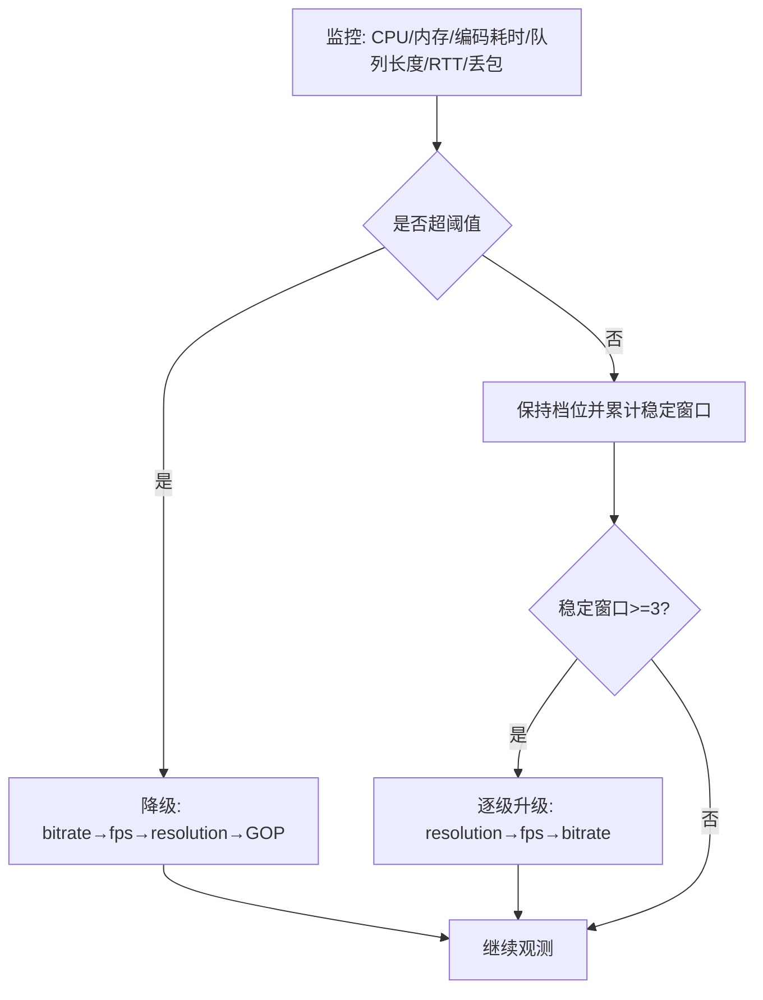


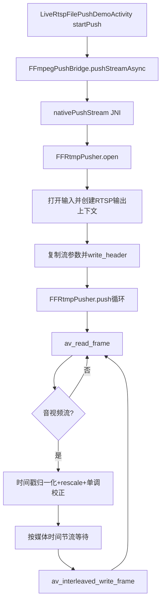

### 拉流与播放

#### Android 侧「输入 URL」背后发生了什么（概念）

1. **应用**：ExoPlayer（Media3）构造 `MediaItem.fromUri(url)`，内部选择 **DataSource**（Http、Rtsp、File…）。  
2. **框架**：建立连接 → **解复用（demux）** 得到压缩包（H.264 NAL、AAC ADTS 等）→ 送入 **MediaCodec 解码** → **AudioTrack / Surface** 输出。  
3. **同步**：按 **PTS** 将音视频帧送到渲染器；抖动由 **缓冲队列** 吸收。

#### 服务端一对多与极限瓶颈

- **一对多**：源站或边缘节点维护 **一份上行或一份文件**，对每位观众 **复制下行流量**（逻辑上「多读一份」，物理上由内核零拷贝/多路发送优化）。  
- **极限瓶颈**（常见排序）：**出口带宽** > **CPU 转封装/加密** > **磁盘 I/O** > **连接数/FD**。  
- **粗算最大并发观看人数（单边缘节点）**：

```text
最大观众数 N ≈ (边缘可用下行带宽 B) / (单路平均码率 R)
```

例：边缘 10Gbps ≈ 10×10^9 bps，单路 2Mbps，则 N ≈ 5000（未计协议开销与冗余）。**真实生产**需乘安全系数并测量 **P95 码率**。

**大规模拉流降级**：多码率 HLS、CDN 边缘缓存、限连与排队、降低默认档位、关闭高清档。

#### CDN

**CDN（Content Delivery Network 内容分发网络）** 在全国 / 全球部署很多边缘节点服务器, 把静态/准静态内容缓存到 **离用户物理最近的节点**，实现就近访问，降低网络延迟（RTT）、减轻源站压力、提升访问速度与稳定性。  
HLS、DASH、图片、API 静态资源都常见。

**CDN 系统组成**
- 源服务器（Origin Server）：存储原始视频、文件等内容，是 CDN 的数据来源。
- 边缘服务器（Edge Server）：分布在各地，负责缓存内容并响应用户请求。
- 负载均衡系统：将用户流量合理分配到最优节点，避免单点过载。
- 智能 DNS：根据用户位置、网络状态，解析到最近的 CDN 节点 IP。
- 缓存机制：将内容暂存在边缘节点，减少重复回源，提升响应速度。

**CDN 工作流程**：
- 内容存储在源站（如项目中的 MinIO + SpringBoot 服务）。
- 用户请求视频 URL，经过智能 DNS 调度，指向最近的边缘节点。
- 边缘节点若有缓存，直接返回内容；若无缓存，则回源站拉取并缓存。
- 后续相同请求直接使用缓存，无需再次访问源站。

**静态加速与动态加速**
- 静态加速：缓存 HLS/DASH 分片、图片、JS/CSS 等不变资源，直接由边缘节点响应。
- 动态加速：针对接口、实时数据等无法缓存的内容，通过最优路由回源，降低传输延迟。

**流媒体 HLS/DASH 中 CDN 的作用**
- 缓存 m3u8 索引文件与 TS 分片，避免大量用户直接冲击源站。
- 用户就近获取流媒体数据，播放更流畅、拖拽秒开、卡顿更少。
- 支撑高并发直播 / 点播场景，保证大规模用户同时观看不宕机。
- 降低源站带宽压力与服务器负载，提升系统稳定性。

**CDN加速原理**
- 负载均衡：CDN通过将用户请求分发到不同的节点，避免单一节点过载
- 缓存机制：CDN将静态资源缓存在靠近用户的节点上，当用户请求这些资源时，可直接从缓存中获取，避免了从源站获取资源的耗时

**本项目应用**
- `CloudVideoItemRow` 中的 `hlsUrl` 由 **Spring Boot 拼 baseUrl**，若不上 CDN，则所有客户端直打服务器
- 未接入 CDN：所有客户端直接请求源站（MinIO / 网关）。
- 接入 CDN：将播放域名指向 CDN 节点，用户访问就近边缘节点，源站保持不变。

**CDN用例图**
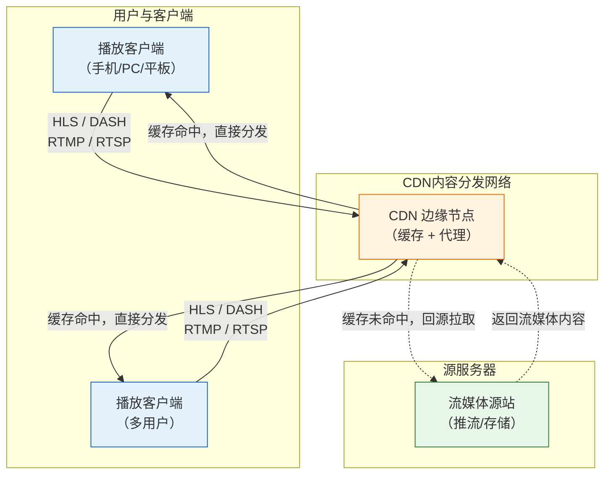

**搭建CDN要素**
1. 自己的DNS域名，且域名已完成ICP备案
2. 源服务器（SpringBoot，OSS）
3. CDN服务商


#### WebRTC

详见文末 **「WebRTC 简介」** 独立小节。

#### ExoPlayer拉流播放

| 协议 | ExoPlayer 支持思路 |
|------|----------------------|
| **HLS** | 内置 `HlsMediaSource`，拉 **m3u8** 再按序取 **ts/fMP4** |
| **RTMP** | 需依赖扩展或自行实现 DataSource（官方默认不主打 RTMP） |
| **RTSP** | Media3 对 RTSP 有实验/扩展路径，依版本与模块而定 |

本地缓存播放示例见项目 `LocalHlsPlayerActivity`（下方 HLS 小节）。

---

### HLS 与 DASH

#### HLS 本质

HLS（HTTP Live Streaming）苹果推出的基于 HTTP 的流媒体分片协议
把完整长视频 / 直播流，按固定时长切成小分片（TS/fMP4），再生成一份 m3u8 索引文件。
播放器只下载索引 → 按需逐个下载分片，不用一次性加载完整视频文件。
HLS / DASH 本质就是「分片文件点播模式」，不用自己改 IBP、不用强行改 GOP，直接沿用转码源的 IBP 结构就行。

| 协议 | 容器/索引 | 典型场景 |
|------|------------|----------|
| **HLS** | m3u8 + MPEG-TS 或 fMP4 | Apple 生态友好、CDN 成熟、点播直播皆宜 |
| **DASH** | MPD + fMP4 | Android/Web 标准化好，自适应普遍 |

#### HLS 组成结构

* index.m3u8 索引文件
文本格式，记录每个分片地址、时长、码率、序号，是播放器的 “播放清单”。
```text
index.m3u8          只有 200 字节，存的是播放列表
seg_00001.ts        6 秒视频，约 3-8 MB 的 H.264+AAC 数据
seg_00002.ts        6 秒视频，约 3-8 MB
seg_00003.ts        6 秒视频，约 3-8 MB
```

* 媒体分片.ts
  - 老式：MPEG-TS 分片（兼容性最强）
  - 新式：fMP4 分片（更省体积、适配自适应码率）

index.m3u8 和 .ts 分别存储，m3u8会记录ts的索引路径。
播放器会先从url获取m3u8，然后从url用m3u8索引逐个获得ts分片，播放。

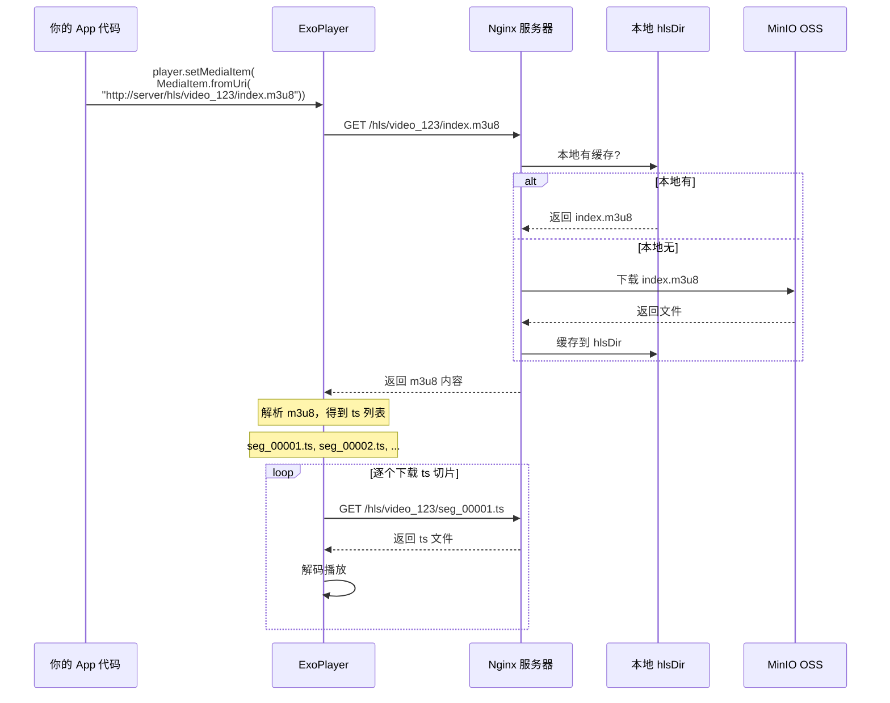


#### HLS 适合什么场景

1. 点播场景
   - 长视频点播：电影、剧集、课程视频
   - 大文件分发：不用全量下载，边下边播、支持随意拖拽进度
   - 手机 / 网页端长视频播放，防 OOM、减少初始加载时延
2. 直播场景
   - 安防监控网页 / 手机实时预览
   - 赛事直播、网课直播、直播间流媒体
   - 弱网、跨运营商、复杂网络环境下直播
3. 终端适配场景
   - 苹果全生态原生支持：iPhone、iPad、Mac、Safari 浏览器无需额外解码器
   - 安卓、小程序、H5 网页全平台兼容
   - 智能电视、机顶盒、播放器普遍内置 HLS 解析
4. CDN 分发首选场景
   - HLS 分片是准静态文件，天然适合 CDN 边缘缓存
   - 全国节点就近分发，抗高并发、省源站带宽、降低卡顿
   - 运维成熟、各大云 CDN 对 HLS 优化最完善

#### HLS 核心作用

1. 大视频分片化
   - 把几 GB 4K 大视频切成几秒小分片，播放器只加载当前需要的片段，杜绝一次性加载整文件导致 OOM、卡顿。
2. 适配任意网络
   - 基于 HTTP，穿透性极强，局域网、4G/5G、公司内网都能正常播放。
3. 支持自适应码率（多码率 HLS）
   - 同一份视频提供 1080P/720P/480P 多档分片，网络差自动切低清，网络好自动切高清。
4. 不用干预编码结构
   - 切片只做物理分割，不重新编码、不修改原流 I/P/B 帧、不强行改 GOP，转码源是什么结构，HLS 就沿用什么结构，开发成本极低。
5. 兼容全终端、免插件
   - H5 网页原生播放，无需安装播放器插件，小程序、移动端、PC 浏览器全适配。
6. 适配 CDN
   - 分片 + 索引都是静态资源，可全量缓存到 CDN 边缘节点，海量用户不压垮源站。

#### HLS 缺点

1. 有切片延迟
   - 分片一般 2~10 秒，直播延迟普遍 5~20 秒，不适合低延时实时互动场景（连麦、实时对讲）。
2. TS 分片冗余偏大
   - 传统 TS 分片头部冗余多，相比 fMP4/DASH 流量略高。

#### HLS 与 DASH对比

| 协议 | 索引文件 | 分片格式       | 生态优势                     | 典型适用场景                                   |
|------|----------|----------------|------------------------------|------------------------------------------------|
| HLS  | m3u8     | MPEG-TS / fMP4 | 苹果原生、CDN 最成熟、全平台兼容 | 点播、常规直播、苹果生态、小程序 / H5、安防网页预览 |
| DASH | MPD      | fMP4           | 国际标准、自适应更强、冗余更小 | Web 标准项目、自适应直播、追求低流量的新项目     |

#### HLS相关问题

**1) 4K / 10GB 电影会不会 OOM？**

HLS碎片接收加载, Android用ExoPlayer播放. 4K / 10GB 电影会不会 OOM?是把10G全部加载到内存吗?为什么我来回拖拽也能快速跳转指定位置 ?

* HLS 协议采用分片机制:
  - HLS 将完整大视频切分为大量2~10 秒的小型 .ts 分片，单个分片仅几百 KB 到几 MB，从协议设计上避免了一次性加载超大文件。
* ExoPlayer 流式加载，不会全量加载:
  - 播放时只下载当前播放分片和少量预加载分片，不下载全片；
  - 解码完成的分片会立即从内存释放，内存中始终只保留 2~3 个分片；
  - 内存占用稳定在几十 MB，与视频总大小无关，播放 4K / 10GB 视频也不会 OOM。
* 能够快速拖拽跳转的原因
  - HLS 的 m3u8 文件记录了时间点与分片的对应关系，支持随机定位；
  - ExoPlayer 会把已下载的分片缓存到手机外存（闪存）；
  - 拖拽时直接通过索引找到目标分片，若已缓存则本地直接读取、秒开；
  - 断网后仍然可以在已缓存的区间内自由拖拽播放。


#### 本项目中的HLS

**1) 后端生成HLS**

后端 `VideoMediaServiceImpl.ensureVideoArtifacts`

- 首先数据源来自于前端的分片上传mp4：
```java
// 分片上传
@PostMapping("/upload/chunk")
public BaseResponse<VideoUploadChunkResponse> uploadChunk(
        @RequestParam("sessionId") String sessionId,
        @RequestParam("offset") Long offset,
        @RequestParam("chunkFile") MultipartFile chunkFile
){
   return videoMediaService.uploadChunk(sessionId.trim(), offset, chunkFile);
}
// 上传完成存储minio
@PostMapping("/upload/complete")
public BaseResponse<VideoUploadCompleteResponse> completeUpload(
        @RequestParam("sessionId") String sessionId
) {
  Path sessionDir = getUploadSessionDir(sessionId);
  Path metaFile = sessionDir.resolve("meta.properties");
  Path partFile = sessionDir.resolve("upload.part");
  SessionMeta meta = readSessionMeta(metaFile);
  
  // 上传minio
  BatchUploadResult uploadResult = ossService.uploadLocalFiles(
          List.of(completedFile.toFile()),
          meta.userId,
          meta.bucketName
  );
  
  // 抽视频封面帧存储minio （参考FFmpeg章节）
  return generateCover(localVideoPath, coverPath, fileWorkDir);
}
```

上传完成后若 MinIO 尚无 HLS，则本地调用 **ffmpeg** 生成切片并上传：

```java
/**
 * 确保视频所需的所有产物已生成（封面图 + HLS 切片）
 * 逻辑：本地不存在则下载 → 封面不存在则生成并上传 → HLS 不存在则切片并上传
 *
 * @param source 视频源信息（OSS 中的文件信息）
 */
private void ensureVideoArtifacts(OssEntity source) {
  // ======================== 生成并上传 HLS 切片（m3u8 + ts） ========================
  // 构建 HLS 索引文件在 OSS 中的路径
  String hlsIndexObject = buildHlsIndexObjectName(source.getObjectName());
  // HLS 切片本地存储目录
  Path hlsDir = getHlsDir(source.getId());
  // 本地 HLS 索引文件路径
  Path localHlsIndex = hlsDir.resolve("index.m3u8");

  // 如果本地没有 HLS 索引文件，才需要处理
  if (!Files.exists(localHlsIndex)) {
    // 如果 OSS 中也没有 HLS 索引，则需要执行 FFmpeg 切片
    if (!minioUtils.isObjectExist(source.getBucketName(), hlsIndexObject)) {
      // 创建 HLS 切片目录
      Files.createDirectories(hlsDir);
      // 切片文件名格式：seg_00001.ts、seg_00002.ts ...
      Path segmentPattern = hlsDir.resolve("seg_%05d.ts");

      // ===================== FFmpeg 执行 HLS 切片 =====================
      runCommand(List.of(
              ffmpegBin,           // FFmpeg 执行程序
              "-y",                // 覆盖输出文件
              "-i",                // 输入文件
              sourcePath.toString(),
              "-c:v",              // 视频编码
              "libx264",           // 使用 H.264 编码
              "-c:a",              // 音频编码
              "aac",               // 使用 AAC 编码
              "-hls_time",         // 每个切片的时长
              "6",                 // 6 秒一个切片
              "-hls_list_size",    // m3u8 列表长度
              "0",                 // 0 = 保留所有切片
              "-hls_segment_filename", // 切片命名规则
              segmentPattern.toString(),
              localHlsIndex.toString() // 输出 m3u8 索引文件
      ), fileWorkDir);

      // 切片完成后，遍历所有切片文件（index.m3u8 + seg_xxx.ts）
      try (Stream<Path> stream = Files.list(hlsDir)) {
        for (Path path : stream.toList()) {
          // 构建切片在 OSS 中的路径
          String objectName = buildHlsSegmentObjectName(source.getObjectName(), path.getFileName().toString());
          // 逐个上传切片到 MinIO
          minioUtils.uploadLocalFile(source.getBucketName(), objectName, path.toString());
        }
      }
    } else {
      // OSS 已有 HLS 切片 → 直接从 MinIO 下载到本地缓存
      downloadHlsCacheFromMinio(source, hlsDir, localHlsIndex);
    }
  }

  // 所有视频产物处理完成 → 更新视频记录状态为 READY（就绪）
  upsertVideoRecord(source, thumbnailObject, hlsIndexObject, null, null, STATUS_READY, null);
}
```

逻辑图
```mermaid
flowchart TD
    Start(["<b>ensureVideoArtifacts 开始</b>"]) --> BuildPath["构建路径<br/>hlsIndexObject: OSS 中的 m3u8 路径<br/>hlsDir: 本地 HLS 切片目录<br/>localHlsIndex: 本地 index.m3u8 路径"]

    BuildPath --> CheckLocal{"本地 index.m3u8<br/>是否存在?"}

    CheckLocal -->|"存在"| Ready["跳过 HLS 处理<br/>本地已有切片缓存"]

    CheckLocal -->|"不存在"| CheckOSS{"OSS 中 m3u8<br/>是否存在?"}

    CheckOSS -->|"存在"| Download["从 MinIO 下载<br/>下载 HLS 缓存到本地<br/>downloadHlsCacheFromMinio()"]

    CheckOSS -->|"不存在"| CreateDir["创建本地 HLS 目录<br/>Files.createDirectories(hlsDir)"]

    CreateDir --> FFmpeg["<b>执行 FFmpeg 切片</b><br/>runCommand()"]

    subgraph FFmpegCmd["FFmpeg 命令参数"]
        direction TB
        F1["ffmpeg -y<br/>覆盖已有输出"]
        F2["-i {sourcePath}<br/>输入源视频文件"]
        F3["-c:v libx264<br/>视频编码 H.264"]
        F4["-c:a aac<br/>音频编码 AAC"]
        F5["-hls_time 6<br/>每切片 6 秒"]
        F6["-hls_list_size 0<br/>保留全部切片"]
        F7["-hls_segment_filename<br/>seg_%05d.ts"]
        F8["输出: index.m3u8"]
    end

    FFmpeg --> FFmpegCmd

    FFmpegCmd --> IterateFiles["遍历 hlsDir 目录<br/>所有切片文件<br/>index.m3u8 + seg_xxx.ts"]

    IterateFiles --> LoopStart{"还有未上传<br/>的切片文件?"}

    LoopStart -->|"是"| BuildObjName["构建 OSS 对象名<br/>buildHlsSegmentObjectName()"]
    BuildObjName --> Upload["上传到 MinIO<br/>minioUtils.uploadLocalFile()"]
    Upload --> LoopStart

    LoopStart -->|"否"| Ready

    Download --> Ready

    Ready --> Upsert["更新视频记录<br/>upsertVideoRecord()<br/>status = STATUS_READY"]

    Upsert --> End(["<b>结束</b>"])

    %% 样式
    style Start fill:#37474f,stroke:#263238,color:#fff
    style End fill:#37474f,stroke:#263238,color:#fff
    style FFmpeg fill:#fff3e0,stroke:#ef6c00,color:#000
    style FFmpegCmd fill:#fff8e1,stroke:#f9a825,color:#000
    style Upload fill:#e8f5e9,stroke:#2e7d32,color:#000
    style Download fill:#e3f2fd,stroke:#1565c0,color:#000
    style Upsert fill:#f3e5f5,stroke:#7b1fa2,color:#000
    style CheckLocal fill:#fff,stroke:#37474f,color:#000
    style CheckOSS fill:#fff,stroke:#37474f,color:#000
    style LoopStart fill:#fff,stroke:#37474f,color:#000
```


**2) HLS传输与播放**

Docker 内 Nginx管理清晰度列表
`nginx-docker/conf/nginx.conf` 中 **`exec ffmpeg`** 把 **RTMP 直播** 转成 **多档 RTMP → HLS**，与上面「点播 mp4 转 HLS」是 **不同业务入口**，但都产出 **m3u8 + ts**。


Android 本地播放 `LocalHlsPlayerActivity`

播放本地缓存
```java
private init() {
  player = new ExoPlayer.Builder(this).build();
  playerView.setPlayer(player);
  player.setMediaItem(MediaItem.fromUri(Uri.fromFile(playlistFile)));
  player.prepare();
  player.play();
}
```

播放云上
```java
private void play(String url) {
  playUrl(hlsUrl);
}
```

即用 **file://** 指向缓存目录下的 **index.m3u8**。

**3) Android将m3u8转为Mp4**


HLS 离线合并为 MP4（`convertHlsToMp4`）
将本地缓存的 `index.m3u8` **无缝封装**为单个 MP4（不重编码，速度快）：


服务器转化方案：
```java
public VideoHlsToMp4Response convertHlsToMp4(Long fileId, String baseUrl) {
  // ===================== FFmpeg 执行 HLS → MP4 合并 =====================
  runCommand(List.of(
          ffmpegBin,              // FFmpeg 可执行程序
          "-y",                   // 覆盖已存在的输出文件
          "-allowed_extensions",   // 允许加载所有文件扩展名（解决m3u8读取限制）
          "ALL",
          "-i",                   // 输入文件：本地HLS索引
          localM3u8.toString(),
          "-c",                   // 音视频编码模式：copy（直接复制流，不重新编码）
          "copy",
          outputMp4.toString()    // 输出完整MP4文件
  ), getFileWorkDir(fileId));

  // 构建响应结果
  VideoHlsToMp4Response response = new VideoHlsToMp4Response();
  // 设置前端下载地址
  response.setDownloadUrl(baseUrl + "/video/cloud/download/hls-mp4?fileId=" + fileId);
  return response;
}
```

合并后的文件上传 MinIO，供 `/video/cloud/download/hls-mp4` 下载。

Android离线转化方案： todo


### 播放原理（ExoPlayer 底层）

**1)IBP帧解码**
ExoPlayer 本身不直接解析 IBP 帧，而是通过「媒体解析器（MediaParser）+ 解码器（MediaCodec）」协同完成 IBP 帧的识别、解析与解码

**2)媒体解析器（MediaParser）**
解析流数据格式（如 HLS 的 m3u8 索引、RTMP 的 FLV 封装、RTSP 的 RTP 包），提取音视频轨道、时间戳、编码信息（如 H.264、AAC）
协议适配：根据流格式（如 FLV、TS、RTP 包）
信息提取：提取音视频轨道信息（如视频编码格式、音频采样率）、每帧的 DTS/PTS 时间戳、IBP 帧类型标识
格式标准化：将不同协议、不同封装格式的流数据，统一转换为 ExoPlayer 可识别的“样本格式”，确保后续 SampleQueue 缓存、Renderer 解码的兼容性；

| 协议 | ExoPlayer 入口 | MediaParser 处理 |
|------|----------------|------------------|
| RTMP | RtmpMediaSource 接收 FLV Tag → 解封装 | 解析 FLV 封装，提取 H.264 NALU / AAC |
| RTSP | RtspMediaSource 接收 RTP 包 → 解封装 | 解析 RTP 包，提取 H.264 NALU / AAC |
| HLS  | HlsMediaSource 下载 .m3u8 → .ts 切片 | 解析 TS 容器，提取 H.264 NALU / AAC |

RTMP → RtspMediaSource | RTSP → RtspMediaSource | HLS → HlsMediaSource

**3)样本队列（SampleQueue）**
缓存解析后的音视频“样本”（压缩帧），供渲染器按需读取，起到缓冲作用（应对网络抖动）；
HLS 延迟问题（ExoPlayer 默认缓冲）: ExoPlayer 对 HLS 有默认 30 秒缓冲
低延迟 HLS 需要：
- 服务端：Nginx hls_fragment 缩小到 1-2s，开启预加载提示
- 客户端：ExoPlayer setDefaultLoadControl 修改 min/max buffer

**4)渲染器（Renderer）**
分为 VideoRenderer（视频）和 AudioRenderer（音频）
从 SampleQueue 取出压缩样本；
调用系统 MediaCodec（硬件解码，效率高）或软件解码，将压缩帧解码为原始帧（视频：YUV 格式；音频：PCM 格式）；
将原始帧输出到对应渲染载体：视频 → Surface（如布局中的 TextureView、SurfaceView），音频 → AudioTrack（系统音频输出）
硬解码支持范围：
- H.264：全平台硬解（API 16+）
- H.265：需 API 21+，部分低端机不支持
- B 帧：部分芯片硬解码器对 B 帧支持较差，可能导致解码失败 → 降级软解

**5)DTS/PTS 时间戳实现音视频同步**
为什么需要 DTS 和 PTS 两个时间戳？
根本原因：B 帧的存在导致解码顺序 ≠ 播放顺序。
假设一段视频帧序列，播放顺序（PTS）是这样的：
- I₀：关键帧，自己就能解码
- B₁、B₂：双向参考帧，需要参考 I₀ 和 P₃ 才能解码
- P₃：前向参考帧，需要参考 I₀ 才能解码
- B₄、B₅：需要参考 P₃ 和 P₆
```text
I₀  B₁  B₂  P₃  B₄  B₅  P₆
```
解码器如果要解码 B₁，必须先解码 I₀ 和 P₃。所以解码顺序必须变成：
```text
解码顺序(DTS): I₀  P₃  B₁  B₂  P₆  B₄  B₅
播放顺序(PTS): I₀  B₁  B₂  P₃  B₄  B₅  P₆
```
- DTS（Decode Timestamp 解码时间戳）：表示该帧何时开始解码
- PTS（Presentation Timestamp 显示时间戳）：表示该帧何时开始渲染


```mermaid
flowchart TD
  subgraph PlayerControl["🎮 PlayerControl 播放控制器"]
    direction TB
    CTRL["统一管理播放状态<br/>播放 / 暂停 / 停止 / Seek<br/>缓冲控制 / 进度同步<br/>状态回调监听"]
  end

  subgraph Server["🌐 服务端"]
    S1["Nginx/MediaMTX<br/>RTMP/RTSP/HLS 推流"]
  end

  subgraph MediaParser["📦 MediaParser 解析器"]
    P1["解析协议封装<br/>FLV Tag / RTP / TS"]
    P2["提取压缩帧<br/>H.264 NALU / AAC"]
    P3["提取时间戳<br/>DTS + PTS"]
    P4["格式化样本<br/>统一 Sample 格式"]

    P1 --> P2 --> P3 --> P4
  end

  subgraph SampleQueue["📋 SampleQueue 样本队列"]
    Q1["Sample {pts=0, dts=0, data=I₀}"]
    Q2["Sample {pts=3, dts=1, data=P₃}"]
    Q3["Sample {pts=1, dts=2, data=B₁}"]
    Q4["Sample {pts=2, dts=3, data=B₂}"]
  end

  subgraph VideoRenderer["🎬 VideoRenderer 视频渲染器"]
    V1["从 SampleQueue 取样本"]
    V2["按 DTS 排序送解码<br/>I₀(0) → P₃(1) → B₁(2) → B₂(3)"]
    V3["MediaCodec 硬解码<br/>YUV 原始帧"]
    V4["按 PTS 排序渲染到 Surface<br/>I₀(0) → B₁(1) → B₂(2) → P₃(3)"]

    V1 --> V2 --> V3 --> V4
  end

  subgraph AudioRenderer["🔊 AudioRenderer 音频渲染器"]
    A1["从 SampleQueue 取样本"]
    A2["按 DTS 顺序解码<br/>AAC → PCM"]
    A3["按 PTS 输出到 AudioTrack"]
  end

  subgraph Clock["⏱️ 同步时钟"]
    C1["音频时钟为主时钟<br/>AudioTrack 播放进度"]
    C2["视频 PTS 对比音频时钟<br/>快了 → 等待<br/>慢了 → 丢帧/加速"]
  end

  PlayerControl -->|"发起播放请求"| Server
  PlayerControl -->|"控制解析流程"| MediaParser
  PlayerControl -->|"Seek 清空队列"| SampleQueue
  PlayerControl -->|"暂停/恢复渲染"| VideoRenderer
  PlayerControl -->|"暂停/恢复渲染"| AudioRenderer

  Server --> MediaParser
  P4 --> SampleQueue
  SampleQueue --> V1
  SampleQueue --> A1
  A3 --> C1
  C1 --> C2
  C2 --> V4

  style PlayerControl fill:#37474f,stroke:#263238,color:#fff
  style CTRL fill:#455a64,stroke:#263238,color:#fff
  style Server fill:#e8f5e9,stroke:#2e7d32
  style MediaParser fill:#fff3e0,stroke:#ef6c00
  style SampleQueue fill:#e3f2fd,stroke:#1565c0
  style VideoRenderer fill:#fce4ec,stroke:#c62828
  style AudioRenderer fill:#f3e5f5,stroke:#7b1fa2
  style Clock fill:#fff9c4,stroke:#f9a825
```


**6)播放控制器（PlayerControl）**
统一管理播放状态（播放/暂停/停止/seek）、缓冲控制、进度同步，是上层调用的核心入口。
播放状态回调代码：
```java
private void initPlayer() {
        player = new ExoPlayer.Builder(this).build();
        playerView.setPlayer(player);
        player.addListener(new Player.Listener() {
            @Override
            public void onPlaybackStateChanged(int playbackState) {
                if (playbackState == Player.STATE_BUFFERING) {
                    updateStatus("缓冲中...");
                } else if (playbackState == Player.STATE_READY) {
                    updateStatus("播放中");
                } else if (playbackState == Player.STATE_ENDED) {
                    updateStatus("播放结束");
                }
            }

            @Override
            public void onPlayerError(PlaybackException error) {
                updateStatus("播放失败: " + error.getMessage());
            }
        });
        // 播放hls
        playUrl(hlsUrl);
        // 当然也可以给playerView设置player
        playerView.setPlayer(player);
}
```

### FFmpeg 在本项目中的集成

**Android（flutteraar / aarlib）**

- `CMakeLists.txt` 将 **`libffmpeg.so`**、**x264**、**faac**、**librtmp** 链成 **`aar_live`**：  
  - `ff_rtmp_pusher.cpp`：文件/网络源 **推 RTMP/RTSP**。  
  - `FFmpegPushBridge.java`：`System.loadLibrary("aar_live")`。  
- **注意**：这是 **NDK 链入 FFmpeg 动态库**，并非命令行 `ffmpeg` 可执行文件。

**Spring Boot（Dockerfile）**

```dockerfile
RUN apt-get install -y --no-install-recommends ffmpeg
```

业务代码通过 **`Runtime` 调 `ffmpeg` / `ffprobe`**（见 `VideoMediaServiceImpl`）。

---

### 项目中 FFmpeg 职能清单（附代码锚点）

| 职能 | 位置 |
|------|------|
| RTSP/RTMP **文件推流** | `ff_rtmp_pusher.cpp` + `FFmpegPushBridge` |
| 上传 **MP4 抽帧封面** | `generateCover()`：`ffmpeg -ss ... -frames:v 1` |
| **MP4 → HLS** 上传 MinIO | `ensureVideoArtifacts`：`-f hls` 参数 |
| **HLS m3u8 合并为 mp4** | `VideoMediaServiceImpl` 中 `hls to mp4` 接口实现（`ffmpeg -i index.m3u8 ...`） |

---

### FFmpeg 在流媒体中的常见职能（通用）

解复用、编码、转码、缩放、切片、截图、加水印、抽帧、格式探测（ffprobe）。  
**Android**：Native API `avformat_*` / **命令行不可用时**用库；**Spring Boot**：`ProcessBuilder` 调 CLI 简单可靠。

---

### WebRTC


#### WebRTC 简介

**1) WebRTC是什么**
WebRTC（Web Real-Time Communication，网页实时通信），是谷歌主导开源、W3C 标准的浏览器 / 终端原生实时音视频通信方案

**2)为什么点对点直播用 WebRTC 不用 RTMP**

RTMP 天生不适合点对点
- RTMP 是中心化协议：必须依赖 RTMP 服务器 中转，无法终端直连；
- 延迟偏高：RTMP 直播常规 3～5 秒，做不到连麦、实时互动；

WebRTC 天生适配点对点
- 支持 P2P 点对点直连，无需流媒体服务器中转；
- 毫秒级低延迟（100～300ms），适合连麦、一对一直播、实时对讲；

| 维度 | WebRTC | RTMP | RTSP | HLS |
|------|--------|------|------|-----|
| 传输 | UDP SRTP + ICE | TCP | TCP/UDP | HTTP TCP |
| 延迟 | **极低** | 中 | 中低 | 较高 |
| 适用 | 连麦、会议 | 直播推流 | 监控/广播 | 点播/大规模分发 |

**3)WebRTC 传输协议 & 数据格式**
底层传输协议
- 基础传输：UDP 为主（追求低延迟、弱网容忍）
- 控制信令：可基于 HTTP/WebSocket/TCP
- 媒体传输承载：RTP/RTCP（跑在 UDP 上）
- 辅助穿透：
  - STUN：获取公网地址，实现内网打洞 P2P
  - TURN：打洞失败时，服务器中转兜底

传输的数据格式
- 编码格式
  - 视频：VP8 / VP9 / H.264
  - 音频：OPUS（默认标配，低延迟、弱网好、人声优化）
- 封装传输格式
  - 裸音视频帧 → 封装为 RTP 数据包 进行网络传输
  - RTCP 配套做：带宽评估、拥塞控制、丢包反馈、同步时间戳
  - 不使用 FLV/TS/MP4 这种大分片封装，是实时 RTP 小包流式传输

**4)WebRTC 大量用户拉流的劣势**
P2P 无法承载高并发: 每一个观众都和主播建立一路 P2P 连接，主播上行带宽会被瞬间打满，几十人就撑不住


**5) 协议选择**

* P2P 一对一视频
  - 选型: WebRTC
  - 一对一纯实时互动，需要毫秒级低延迟；WebRTC 支持 NAT 穿透、终端直连无需服务器中转

* 10 人小型会议
  - 选型: WebRTC（MCU/SFU 架构）
  - 人数少、要求实时互动、低延迟；用 WebRTC 搭配 SFU 中转即可，不用每个成员全互联，服务器只做媒体转发，带宽压力小、成本低

* 100 人线上课堂
  - 选型：主讲用 RTMP 推流 + 观众 HLS 拉流；互动小范围用 WebRTC
  - 100 人已不适合全 WebRTC P2P，主播上行扛不住高并发；
  - 采用主讲 RTMP 推流、HLS 分片分发，依托 CDN 稳定抗并发、弱网适配好、兼容所有终端；

* 1000 人全校会议
  - 选型：RTMP 推流 + HLS 主流播放（纯直播模式）
  - 千人级高并发场景，核心诉求是稳定、高并发、CDN 全网分发、弱网流畅；


**6)数据结构对比**

| 对比维度 | RTP 帧 | RTMP Chunk 帧 |
|---------|--------|---------------|
| 整体结构 | 固定头 12B + 可选扩展头 + 媒体负载 | 基础头 + 消息头 + 可选扩展时间戳 + 负载 |
| 头部特性 | 固定 12 字节，结构固定不可压缩 | 可变长 1~14 字节，支持头部压缩复用 |
| 头部字段 | 版本、标记位、负载类型、序列号、时间戳、SSRC | Chunk 类型、流 ID、消息类型、消息长度、时间戳 |
| 数据组成 | 直接承载 H.264 NAL/OPUS 裸编码帧 | 承载 RTMP 封装消息体，非纯裸 NAL |
| 单帧长度 | 整体大包，受 MTU 限制，通常 1400B 左右 | 分片小包，默认负载 128B，大消息拆多块 |
| 分片方式 | 超大 NAL 在 RTP 层 FU-A 分片 | 上层 Message 拆分为多个 Chunk 分片 |
| 传输基础 | UDP，单包独立 | TCP，流式有序拼接重组 |

#### WebRTC 集成


服务器集成:

**1)Docker中的 coturn（TURN）**

`demo/springboot/docker/docker-compose.yml` 中的 **coturn** 服务要点：

| 参数 | 作用 |
|------|------|
| `--lt-cred-mech` | 启用 **长期凭证** 认证（用户名+密码），与客户端 `IceServer.setUsername/setPassword` 对应。 |
| `--user=${TURN_USER:-webrtc}:${TURN_PASSWORD:-webrtc123}` | Compose 在 **启动容器前** 展开环境变量：`TURN_USER` 未设则用 `webrtc`，密码未设则用 `webrtc123`。这样 **开发环境零配置可跑**；生产应通过 `.env` 或编排密钥注入覆盖默认值。 |
| `--fingerprint` | SDP 中使用 **DTLS fingerprint** 语义，与 WebRTC 栈常见配置一致，减少与部分客户端的兼容问题。 |
| `--listening-port=3478` | 标准 STUN/TURN 端口；TCP/UDP 均映射，便于 **UDP 被禁** 时走 TCP TURN。 |
| `--min-port` ~ `--max-port` | **中继端口范围**：媒体走 TURN 时，服务端在此区间分配 **UDP 中继**；必须映射到宿主机，否则对端收不到中继流量。 |

**2)Nginx 与信令 WebSocket**


```yml
  # ----------------------
  # WebSocket 代理（你之前的 webrtc 信令）
  # 把 ws://ip/ws/ 转发到 springboot:48888/ws/
  # ----------------------
  location /ws/ {
      proxy_pass http://springboot:48888/ws/;
      proxy_http_version 1.1;
      proxy_set_header Upgrade $http_upgrade;
      proxy_set_header Connection "upgrade";
      proxy_set_header Host $host;
      proxy_set_header X-Real-IP $remote_addr;
      proxy_set_header X-Forwarded-For $proxy_add_x_forwarded_for;
      proxy_set_header X-Forwarded-Proto $scheme;
  }
```

**3) Android（flutteraar）：Gradle 与库选型**

- **版本目录** `demo/flutter/flutteraar/gradle/libs.versions.toml`：`io.github.webrtc-sdk:android:125.6422.07`（`org.webrtc.*` API 与 Google 官方栈一致，社区维护的 Maven 分发）。
- **app/build.gradle**：`implementation libs.webrtc.android` 引入通话所需 native；`implementation libs.okhttp` 用于 **WebSocket 信令**。


**4)Android：采集 → 编码 →「推流」→「拉流」→ 播放**

逻辑活动图（采集 → 推流 → 拉流 → 播放）
```mermaid
flowchart TD
    Start(["<b>开始：WebRTC 通话</b>"]) --> Init["<b>初始化</b><br/>initPeerConnectionFactory()<br/>initRenderers()<br/>initLocalTracks()"]

    Init --> CreateVideo["<b>创建视频采集器</b><br/>createVideoCapturer()<br/>Camera2Enumerator 枚举摄像头<br/>优先前置 → 兜底后置"]

    CreateVideo --> StartCapture["<b>启动采集</b><br/>videoCapturer.startCapture(640x480, 30fps)<br/>绑定 SurfaceTextureHelper"]

    StartCapture --> CreateTracks["<b>创建本地轨道</b><br/>VideoTrack + AudioTrack<br/>添加到 PeerConnection"]

    CreateTracks --> CallerCheck{"呼叫方<br/>(Caller)?"}

    CallerCheck -->|"是"| CreateOffer["<b>创建 Offer</b><br/>peerConnection.createOffer()<br/>设置 localDescription<br/>发送 OFFER 信令"]
    CallerCheck -->|"否"| WaitOffer["等待 OFFER 信令"]

    CreateOffer --> Signaling["<b>信令服务器中转</b><br/>OFFER → ANSWER<br/>ICE_CANDIDATE 交换"]

    WaitOffer --> ReceiveOffer["收到 OFFER"] --> CreateAnswer["<b>创建 Answer</b><br/>peerConnection.createAnswer()<br/>设置 localDescription<br/>发送 ANSWER 信令"] --> Signaling

    Signaling --> IceGather["<b>ICE 候选者收集</b><br/>onIceCandidate()<br/>sendIceCandidate()"]

    IceGather --> IceConnect{"ICE 穿透成功?"}
    IceConnect -->|"否"| IceFail["连接失败"]
    IceConnect -->|"是"| P2P["<b>P2P 连接建立</b><br/>RTP 传输通道就绪"]

    P2P --> PushStream["<b>推流（自动）</b><br/>编码后 YUV/PCM → RTP 包<br/>通过 ICE 通道发送到对端"]

    PushStream --> ReceiveTrack["<b>拉流（自动）</b><br/>接收 RTP 包<br/>DefaultVideoDecoderFactory 解码"]

    ReceiveTrack --> OnTrack["<b>onTrack 回调</b><br/>获取远端 VideoTrack<br/>绑定到 remoteRenderer"]

    OnTrack --> Render["<b>播放渲染</b><br/>remoteTrack.addSink(remoteRenderer)<br/>SurfaceViewRenderer + EGL/OpenGL<br/>音频自动输出 AudioTrack"]

    Render --> CallEnd{"通话结束?"}
    CallEnd -->|"否"| PushStream
    CallEnd -->|"是"| Close["<b>释放资源</b><br/>peerConnection.close()<br/>videoCapturer.stopCapture()"]

    Close --> End(["<b>结束</b>"])

    style Start fill:#37474f,stroke:#263238,color:#fff
    style End fill:#37474f,stroke:#263238,color:#fff
    style Init fill:#e3f2fd,stroke:#1565c0
    style CreateVideo fill:#e3f2fd,stroke:#1565c0
    style StartCapture fill:#e3f2fd,stroke:#1565c0
    style CreateTracks fill:#e3f2fd,stroke:#1565c0
    style CreateOffer fill:#fff3e0,stroke:#ef6c00
    style CreateAnswer fill:#fff3e0,stroke:#ef6c00
    style Signaling fill:#f3e5f5,stroke:#7b1fa2
    style IceGather fill:#e8f5e9,stroke:#2e7d32
    style P2P fill:#e8f5e9,stroke:#2e7d32
    style PushStream fill:#ffcdd2,stroke:#c62828
    style ReceiveTrack fill:#ffcdd2,stroke:#c62828
    style Render fill:#fff9c4,stroke:#f9a825
```


数据通信图:
```mermaid
flowchart TD
    subgraph VideoCapture["📷 视频采集（Camera2）"]
        Cam["Camera2 API<br/>采集 YUV420 帧<br/>640x480 @ 30fps"]
        Surface["SurfaceTextureHelper<br/>纹理帧 → I420 格式"]
        Cam -->|"YUV420 帧"| Surface
    end

    subgraph AudioCapture["🎙️ 音频采集（AudioRecord）"]
        Mic["麦克风<br/>采集 PCM 原始音频<br/>16-bit, 16kHz/48kHz, 单声道"]
        AudioFrame["AudioFrame<br/>PCM 采样数据"]
        Mic -->|"PCM 数据流"| AudioFrame
    end

    subgraph VideoEncode["🎬 视频编码器（DefaultVideoEncoderFactory）"]
        VCodecCheck{"硬件编码<br/>能力?"}
        H264["H.264 硬编码<br/>（优先）"]
        VP8["VP8 软编码<br/>（兜底）"]
        Surface --> VCodecCheck
        VCodecCheck -->|"支持"| H264
        VCodecCheck -->|"降级"| VP8
    end

    subgraph AudioEncode["🔊 音频编码器（内置 Opus/iSAC）"]
        ACodecCheck{"音频编码<br/>格式?"}
        Opus["Opus 编码<br/>（WebRTC 默认）"]
        iSAC["iSAC 编码<br/>（窄带/宽带）"]
        AudioFrame --> ACodecCheck
        ACodecCheck -->|"默认"| Opus
        ACodecCheck -->|"低码率"| iSAC
    end

    subgraph RTPVideo["📦 视频 RTP 打包"]
        V_RTP["视频 RTP 包<br/>H.264/VP8 Payload<br/>带 PTS 时间戳<br/>SSRC=视频流"]
    end

    subgraph RTPAudio["📦 音频 RTP 打包"]
        A_RTP["音频 RTP 包<br/>Opus/iSAC Payload<br/>带 PTS 时间戳<br/>SSRC=音频流"]
    end

    H264 --> V_RTP
    VP8 --> V_RTP
    Opus --> A_RTP
    iSAC --> A_RTP

    subgraph Transport["🚀 传输层（ICE 通道）"]
        UDP_V["视频 UDP"]
        UDP_A["音频 UDP"]
        RTCP["RTCP 控制包<br/>（SR/RR 质量报告）"]
        V_RTP --> UDP_V
        A_RTP --> UDP_A
        V_RTP -.-> RTCP
        A_RTP -.-> RTCP
    end

    subgraph Network["🌐 网络"]
        Net["P2P 直连 / TURN 中继<br/>音视频 RTP 独立通道"]
        UDP_V --> Net
        UDP_A --> Net
    end

    subgraph VideoReceive["📥 视频接收"]
        V_Recv["接收视频 RTP 包<br/>排序/去重/丢包"]
        V_Dec["视频解码<br/>H.264/VP8 → YUV420"]
        Net --> V_Recv --> V_Dec
    end

    subgraph AudioReceive["📥 音频接收"]
        A_Recv["接收音频 RTP 包<br/>排序/去重/丢包<br/>NetEQ 抖动缓冲"]
        A_Dec["音频解码<br/>Opus/iSAC → PCM"]
        Net --> A_Recv --> A_Dec
    end

    subgraph VideoRender["🖥️ 视频渲染"]
        SurfaceRender["SurfaceViewRenderer<br/>EGL/OpenGL 硬件渲染"]
        Screen["屏幕显示"]
        V_Dec -->|"YUV420"| SurfaceRender --> Screen
    end

    subgraph AudioRender["🔈 音频播放"]
        AudioTrack["AudioTrack<br/>系统音频输出"]
        Speaker["扬声器"]
        A_Dec -->|"PCM 16-bit"| AudioTrack --> Speaker
    end

    subgraph Sync["⏱️ 音视频同步"]
        SyncClock["SRTP 时间戳对齐<br/>视频 PTS ↔ 音频 PTS<br/>以音频时钟为主"]
        V_Dec -.-> SyncClock
        A_Dec -.-> SyncClock
        SyncClock -.->|"同步信号"| SurfaceRender
    end

    style VideoCapture fill:#e3f2fd,stroke:#1565c0
    style AudioCapture fill:#e8eaf6,stroke:#3949ab
    style VideoEncode fill:#fff3e0,stroke:#ef6c00
    style AudioEncode fill:#fff8e1,stroke:#f9a825
    style RTPVideo fill:#f3e5f5,stroke:#7b1fa2
    style RTPAudio fill:#ede7f6,stroke:#6a1b9a
    style Transport fill:#e8f5e9,stroke:#2e7d32
    style Network fill:#ffcdd2,stroke:#c62828
    style VideoReceive fill:#e8f5e9,stroke:#2e7d32
    style AudioReceive fill:#c8e6c9,stroke:#388e3c
    style VideoRender fill:#fff9c4,stroke:#f9a825
    style AudioRender fill:#fff9c4,stroke:#f9a825
    style Sync fill:#ffccbc,stroke:#d84315
```


##### 视频采集
- 核心类：VideoCapturer（WebRTC 抽象采集器）、Camera2Enumerator（Android 相机枚举器）
```java
// 创建视频采集器（优先前置摄像头，兜底后置）
private VideoCapturer createVideoCapturer() {
  Camera2Enumerator enumerator = new Camera2Enumerator(this);
  String[] deviceNames = enumerator.getDeviceNames();
  // 优先前置摄像头
  for (String deviceName : deviceNames) {
    if (enumerator.isFrontFacing(deviceName)) {
      CameraVideoCapturer capturer = enumerator.createCapturer(deviceName, null);
      if (capturer != null) return capturer;
    }
  }
  // 兜底后置摄像头
  for (String deviceName : deviceNames) {
    if (!enumerator.isFrontFacing(deviceName)) {
      CameraVideoCapturer capturer = enumerator.createCapturer(deviceName, null);
      if (capturer != null) return capturer;
    }
  }
  return null;
}

// 初始化采集器并启动采集
private void initLocalTracks() {
  videoCapturer = createVideoCapturer();
  surfaceTextureHelper = SurfaceTextureHelper.create("WebRtcCaptureThread", eglBase.getEglBaseContext());
  videoSource = peerConnectionFactory.createVideoSource(videoCapturer.isScreencast());
  // 绑定采集器与视频源
  videoCapturer.initialize(surfaceTextureHelper, getApplicationContext(), videoSource.getCapturerObserver());
  // 启动采集（分辨率640x480，帧率30）
  videoCapturer.startCapture(VIDEO_WIDTH, VIDEO_HEIGHT, VIDEO_FPS);
}
```

##### 编码（音视频数据编码）
编码器工厂初始化
```java
private void initPeerConnectionFactory() {
  // 初始化 WebRTC 工厂
  PeerConnectionFactory.initialize(
          PeerConnectionFactory.InitializationOptions.builder(this)
                  .setEnableInternalTracer(false)
                  .createInitializationOptions()
  );
  // 视频编码器/解码器工厂（基于 EGL 上下文）
  DefaultVideoEncoderFactory encoderFactory =
          new DefaultVideoEncoderFactory(eglBase.getEglBaseContext(), true, true);
  DefaultVideoDecoderFactory decoderFactory =
          new DefaultVideoDecoderFactory(eglBase.getEglBaseContext());
  // 构建 PeerConnectionFactory，绑定编解码器
  peerConnectionFactory = PeerConnectionFactory.builder()
          .setVideoEncoderFactory(encoderFactory)
          .setVideoDecoderFactory(decoderFactory)
          .createPeerConnectionFactory();
} 
```
DefaultVideoEncoderFactory：默认支持 H.264/VP8/VP9 等编码格式，自动适配设备硬件编码能力；


##### 推流（本地数据传输到对端）
WebRTC 无 “传统推流”（如 RTMP）概念，而是通过 P2P 协商 + ICE 穿透 + RTP 传输 实现数据推送，核心流程：

###### 信令协商（Offer/Answer 交换）
呼叫方（Caller）创建 Offer：
```java
private void maybeCreateOffer() {
    if (!caller || offerSent || !peerJoined || peerConnection == null || callEnded) return;
    offerSent = true;
    MediaConstraints constraints = new MediaConstraints();
    constraints.mandatory.add(new MediaConstraints.KeyValuePair("OfferToReceiveAudio", "true"));
    constraints.mandatory.add(new MediaConstraints.KeyValuePair("OfferToReceiveVideo", "true"));
    // 创建 SDP Offer（包含编码能力、媒体信息）
    peerConnection.createOffer(new SimpleSdpObserver() {
        @Override
        public void onCreateSuccess(SessionDescription sessionDescription) {
            // 设置本地 SDP
            peerConnection.setLocalDescription(new SimpleSdpObserver() {
                @Override
                public void onSetSuccess() {
                    // 通过信令服务发送 Offer 给对端
                    sendSimpleSignal(WebRtcSignalTypes.OFFER, payload);
                }
            }, sessionDescription);
        }
    }, constraints);
}
```
被叫方（Callee）回复 Answer：
```java
private void createAndSendAnswer() {
    // 创建 SDP Answer 并通过信令发送
    peerConnection.createAnswer(new SimpleSdpObserver() {
        @Override
        public void onCreateSuccess(SessionDescription sessionDescription) {
            peerConnection.setLocalDescription(new SimpleSdpObserver() {
                @Override
                public void onSetSuccess() {
                    sendSimpleSignal(WebRtcSignalTypes.ANSWER, payload);
                }
            }, sessionDescription);
        }
    }, constraints);
}
```


###### ICE 穿透（网络地址协商）
本地 ICE 候选者收集：
```java
// PeerConnection 观察者监听 ICE 候选者生成
@Override
public void onIceCandidate(IceCandidate iceCandidate) {
    // 发送 ICE 候选者给对端
    sendIceCandidate(iceCandidate);
}
```
ICE 候选者发送：
```java
private void sendIceCandidate(IceCandidate iceCandidate) {
    JSONObject payload = new JSONObject();
    payload.put("candidate", iceCandidate.sdp);
    payload.put("sdpMid", iceCandidate.sdpMid);
    payload.put("sdpMLineIndex", iceCandidate.sdpMLineIndex);
    // 通过信令服务发送 ICE 候选者
    sendSimpleSignal(WebRtcSignalTypes.ICE_CANDIDATE, payload);
}
```

###### 数据推流（RTP 传输）
- 当 SDP 协商完成 + ICE 穿透成功后，PeerConnection 建立 P2P 连接；
- 本地编码后的音视频 RTP 包通过 ICE 协商的网络通道（UDP/TCP）自动推送到对端；
- 代码中无需手动处理 RTP 发送，WebRTC 底层自动完成。


##### 拉流（接收对端音视频数据）
WebRTC 自动接收对端 RTP 包，完成解码后通过轨道（Track）暴露给应用层

###### 接收远端媒体轨道
```java
// PeerConnection 观察者监听远端轨道添加
@Override
public void onTrack(RtpTransceiver transceiver) {
    MediaStreamTrack track = transceiver.getReceiver().track();
    if (!(track instanceof VideoTrack)) return;
    VideoTrack remoteTrack = (VideoTrack) track;
    // 将远端视频轨道绑定到渲染视图
    runOnUiThread(() -> remoteTrack.addSink(remoteRenderer));
}

// 兼容旧版 onAddStream 回调
@Override
public void onAddStream(MediaStream mediaStream) {
    if (mediaStream == null || mediaStream.videoTracks.isEmpty()) return;
    VideoTrack videoTrack = mediaStream.videoTracks.get(0);
    runOnUiThread(() -> videoTrack.addSink(remoteRenderer));
}
```

###### 拉流关键逻辑
PeerConnection 底层自动接收对端 RTP 包，通过解码器工厂（DefaultVideoDecoderFactory）解码；
解码后的原始音视频数据通过 VideoTrack/AudioTrack 暴露，应用层只需将轨道绑定到渲染视图即可；
音频无需手动处理，WebRTC 自动将解码后的音频数据送入扬声器播放。

##### 播放（音视频渲染）

通过 WebRTC 提供的 SurfaceViewRenderer 实现视频渲染，音频自动播放
```java
private void initRenderers() {
    eglBase = EglBase.create();
    // 本地渲染视图初始化
    localRenderer.init(eglBase.getEglBaseContext(), null);
    localRenderer.setMirror(true); // 前置摄像头镜像
    localRenderer.setEnableHardwareScaler(true);
    // 远端渲染视图初始化
    remoteRenderer.init(eglBase.getEglBaseContext(), null);
    remoteRenderer.setMirror(false);
    remoteRenderer.setEnableHardwareScaler(true);
}
```

绑定轨道到渲染视图
```java
private void bindTrackToRenderer() {
  // 本地视频播放：绑定本地轨道到本地渲染视图
  localVideoTrack.addSink(localRenderer);

  // 远端视频播放：绑定远端轨道到远端渲染视图
  remoteTrack.addSink(remoteRenderer);
}
```

播放关键逻辑
- SurfaceViewRenderer 是 WebRTC 封装的高性能渲染控件，基于 EGL/OpenGL 实现硬件加速；
- setMirror(true) 适配前置摄像头的镜像显示；
- 音频播放：WebRTC 解码后的音频数据自动接入 Android 音频系统，无需绑定视图，只需保证 localAudioTrack/ 远端音频轨道启用即可。


### 生产问题排查（花屏、卡顿、不同步、黑屏）

**思路顺序**：**现象复现 → 区分编码/网络/解码 → 缩小范围**。

一渲染屏幕，未停止 A 源就直接切 B 源 会出现的现象

| 现象 | 优先怀疑 | 新增场景原因 |
|------|-----------|--------------|
| 花屏 | 丢包（UDP）、参考帧损坏、SPS/PPS 不匹配 | 单Surface多源未做切换互斥，A/B数据源同时抢占渲染画布 |
| 卡顿 | 码率过高、缓冲不足、CPU 过热降频 | 双源同时写入Surface，渲染缓冲区队列拥堵溢出 |
| 音画不同步 | 时间戳错误、采集时钟漂移、播放器缓冲策略 | 前数据源时间戳未清空，新数据源时间轴叠加错乱 |
| 黑屏 | 无关键帧、解码器失败、Surface 未就绪 | 未停止旧数据源直接切新源，Surface画布被抢占覆盖 |

**工具**：Android **Logcat**、`adb bugreport`、**Systrace**；网络 **Wireshark**（见 [计算机网络](../408/计算机网络.md)）；服务端 **nginx-stat**、带宽监控。

**长时间越播越卡**：查 **内存泄漏**（Handler、Context、Native 缓冲）、**队列无限增长**、**解码器未释放**。

**服务器推流内存泄漏**：`valgrind`/jemalloc 统计、对比 **连接前后 RSS**、检查 **是否每个会话释放 FFmpeg 上下文**。

#### 线程池、Service 与协程（直播工程）

- **软编（x264/faac）**：CPU 密集，宜 **单线程专用** 或 **有界线程池**，避免与 UI 抢核；队列用 **有界 + 拒绝/丢帧** 策略。  
- **硬编（MediaCodec）**：驱动异步回调较常见，仍要避免 **阻塞 MediaCodec 回调线程**。  
- **持续推流**：产品级常用 **前台 Service** 保活；**WorkManager** 适合「上传后转码」这类可延期任务，不适合超低延迟直播。  
- **Kotlin 协程**：IO 用 `Dispatchers.IO`，CPU 预处理用 `Dispatchers.Default`，勿在 `Main` 上做重计算。

系统整理见 [操作系统](../408/操作系统.md)。

---

### FFmpeg处理流媒体

#### 集成

* **Android**：NDK + `libffmpeg.so` + JNI（见 `aarlib/src/main/cpp/CMakeLists.txt`）。  
* **SpringBoot**：Docker 镜像安装 **ffmpeg 可执行文件**，Java `runCommand` 调用。

#### 基本功能


服务器注入ffmpeg：
```java
  @Value("${video.ffmpeg-bin:ffmpeg}")
  private String ffmpegBin;

  @Value("${video.ffprobe-bin:ffprobe}")
  private String ffprobeBin;

  @Value("${video.work-dir:./video-work}")
  private String videoWorkDir;
```
```yaml
video:
  ffmpeg-bin: ffmpeg
  ffprobe-bin: ffprobe
  work-dir: ./video-work
```

服务器执行指令代码（用于命令行调用ffmpeg）
```java
    private String runCommand(List<String> command, Path workingDir) {
        ProcessBuilder processBuilder = new ProcessBuilder(command);
        if (workingDir != null) {
            processBuilder.directory(workingDir.toFile());
        }
        processBuilder.redirectErrorStream(true);
        try {
            Process process = processBuilder.start();
            String output;
            try (InputStream inputStream = process.getInputStream()) {
                output = new String(inputStream.readAllBytes(), StandardCharsets.UTF_8);
            }
            int code = process.waitFor();
            if (code != 0) {
                throw new IllegalStateException("command failed(" + code + "): " + String.join(" ", command) + "\n" + output);
            }
            return output;
        } catch (IOException e) {
            throw new UncheckedIOException("command io failed: " + String.join(" ", command), e);
        } catch (InterruptedException e) {
            Thread.currentThread().interrupt();
            throw new IllegalStateException("command interrupted", e);
        }
    }
```

**1) 视频抽帧**

命令行
```shell
ffmpeg -y -ss 00:00:01 -i source.mp4 -frames:v 1 cover.jpg
```

```text
ffmpeg 
-y                    覆盖输出文件
-ss 00:00:01          定位到视频第 1 秒
-i source.mp4         输入视频文件
-frames:v 1           只输出 1 帧图像
cover.jpg             输出封面图片
```

FFmpeg 核心库
```text
1. libavformat：解封装输入视频，读取流信息、定位到指定时间戳
2. libavcodec：解码视频帧，编码输出 JPG/PNG 图像
3. libswscale：图像格式转换（YUV → RGB）
4. libavutil：工具支持（时间计算、内存管理）
```

SpringBoot服务器在上传完成视频之后会对Mp4进行抽帧
```java
    /**
     * 生成视频封面图
     * 上传 MP4 完成后，调用 FFmpeg 从视频中抽取一帧图片作为封面
     * 优先抽取第 1 秒的画面，失败则回退到第 0 秒（首帧）
     *
     * @param sourcePath 源视频路径（MP4）
     * @param coverPath  生成的封面图保存路径
     * @param workDir    FFmpeg 执行工作目录
     */
    private void generateCover(Path sourcePath, Path coverPath, Path workDir) {
        try {
            // 第一次尝试：截取视频第 1 秒作为封面（避免第 0 秒全黑）
            runCommand(List.of(
                    ffmpegBin,        // FFmpeg 可执行文件路径
                    "-y",             // 覆盖已存在的输出文件，不询问
                    "-ss",            // 指定截取时间点
                    "00:00:01",       // 截取第 1 秒的画面
                    "-i",             // 指定输入文件
                    sourcePath.toString(),
                    "-frames:v",      // 指定抽取的视频帧数
                    "1",              // 只抽取 1 帧
                    coverPath.toString()  // 输出封面图片路径
            ), workDir);
        } catch (Exception first) {
            // 第 1 秒截取失败（如视频过短），回退到截取第 0 秒（首帧）
            runCommand(List.of(
                    ffmpegBin,
                    "-y",
                    "-ss",
                    "00:00:00",      // 回退到视频起始帧
                    "-i",
                    sourcePath.toString(),
                    "-frames:v",
                    "1",
                    coverPath.toString()
            ), workDir);
        }

        // 校验：如果封面文件没有生成，直接抛出异常
        if (!Files.exists(coverPath)) {
            throw new IllegalStateException("cover file not generated");
        }
    }
```

**2) 数据解析**

命令行
```shell
ffprobe -v error -show_entries format=duration,bit_rate -of default=noprint_wrappers=1:nokey=1 source.mp4
```

FFmpeg 解析媒体文件元数据
```text
ffprobe
-v error                仅输出错误信息，屏蔽冗余日志
-show_entries format=duration,bit_rate  提取视频时长、总码率
-of default=noprint_wrappers=1:nokey=1  输出纯数值格式
source.mp4              待解析的视频文件
```

FFprobe 核心库
```text
1. libavformat：解析视频封装格式，读取文件元信息
2. libavutil：提供数值解析、字符串处理、时间管理工具
```


**3) 生成HLS**

命令行：
```shell
#!/bin/bash

# ===================== 【配置项】请根据实际情况修改 =====================
FFMPEG_BIN="ffmpeg"                  # ffmpeg 路径
SOURCE_FILE="input.mp4"              # 输入视频文件
OUTPUT_HLS_DIR="./hls"                # 切片输出目录
SEGMENT_PATTERN="$OUTPUT_HLS_DIR/seg_%05d.ts"  # 切片命名规则
HLS_INDEX="$OUTPUT_HLS_DIR/index.m3u8"          # m3u8 索引文件
HLS_TIME=6                           # 每个切片 6 秒
WORK_DIR="./"                        # 工作目录

# 创建输出目录
mkdir -p "$OUTPUT_HLS_DIR"

# ===================== FFmpeg 切片命令 =====================
$FFMPEG_BIN \
  -y \
  -i "$SOURCE_FILE" \
  -c:v libx264 \
  -c:a aac \
  -hls_time $HLS_TIME \
  -hls_list_size 0 \
  -hls_segment_filename "$SEGMENT_PATTERN" \
  "$HLS_INDEX"

echo "HLS 切片完成！生成文件：$HLS_INDEX"
```

FFmpeg 命令行说明（HLS 切片）:
```text
ffmpeg
-y                    覆盖已存在的输出文件
-i source.mp4         输入视频文件
-c:v libx264          视频编码器使用 H.264
-c:a aac              音频编码器使用 AAC
-hls_time 6           设置每个切片时长为 6 秒
-hls_list_size 0      保留所有切片，不删除旧切片
-hls_segment_filename seg_%05d.ts  切片文件命名规则
index.m3u8            输出 HLS 索引文件
```

FFmpeg 核心库（HLS 切片）:
```text
1. libavformat：解封装 MP4 视频流，封装输出 MPEG-TS 切片与 m3u8 索引
2. libavcodec：视频编码（libx264）、音频编码（AAC）
3. libswresample：音频重采样、格式适配
4. libswscale：视频图像格式转换、色彩空间处理
5. libavutil：时间戳、日志、内存管理等基础工具支持
```

**4) HLS转为Mp4**


命令行：
```shell
ffmpeg -y -allowed_extensions ALL -i index.m3u8 -c copy hls_merged.mp4
```

FFmpeg 命令行说明（HLS 转 Mp4）：
```text
ffmpeg
-y                    覆盖已存在的输出文件
-allowed_extensions ALL 允许加载所有文件类型（支持m3u8索引）
-i index.m3u8          输入HLS索引文件
-c copy                流复制模式，不重新编码，速度极快
hls_merged.mp4         输出完整MP4文件
```

FFmpeg 核心库:
```text
1. libavformat：读取m3u8索引、合并TS切片、封装输出MP4文件
2. libavcodec：音视频流解析与复制，无需编解码
3. libavutil：时间戳、文件操作、内存管理等基础支持
```


