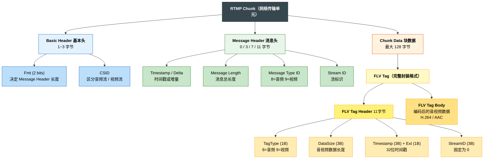

# Media


## 大体介绍

* Android音频、视频采集
* Android Camera预览（TextureView与SurfaceView）
* 实时视频流YUV数据编码H.264
* RTMP实时推流
* RTMP拉流并Media3Player实时播放
* FFmpeg + RTSP文件推流
* FFmpeg采集视频数据（基本信息，抽帧）
* FFmpeg转码：m3u8 <-> mp4 转码
* 在线HLS视频播放


## 知识梳理

### Android 音视频采集
Android 设备分为两类：普通手机 App、RK3588 等瑞芯微工控板 / 开发板系统 Apk，二者音视频采集 API 完全通用，仅硬件外设接入方式有区别。

Android App 音视频采集：
- 视频采集
  - 基础老式 API：Camera（已废弃，适配老旧设备）
  - 底层原生 API：Camera2（支持手动参数调节、多摄、高帧率、RAW 数据）
  - 官方推荐封装：CameraX（兼容适配强、自动管理生命周期、开发最简）

- 音频采集
  - 高层封装：MediaRecorder（直接录制生成音频 / 视频文件，简单易用）
  - 底层裸流采集：AudioRecord（获取原始 PCM 音频流，适合实时处理、推流、AI 语音分析）
  - 高阶自定义方案：MediaCodec 音视频硬编码 + 自定义采集流程；或集成 FFmpeg 实现跨平台统一音视频采集、编码、推流方案。

RK3588 外接摄像头
- 视频采集
  - 外接 MIPI 摄像头
    - RK3588 开发板原生支持 MIPI-CSI 接口摄像头，硬件接入后内核自动识别为 V4L2 设备；
    - Android 系统层已做 HAL 适配，App 无需特殊适配，可直接使用 Camera/Camera2/CameraX 标准 API 调用；
    - 预览依赖 TextureView + TextureView.SurfaceTextureListener 生命周期回调，遵循「纹理就绪打开相机、页面销毁释放相机」流程；
  - 外接 USB 摄像头（UVC 免驱）
    - 即插即用，无需安装驱动，插入 RK3588 USB 口安卓自动识别；
    - 同标准相机 API 一致，App 代码无需修改，直接预览、拍照、录制；
- 外接麦克风小喇叭
  - USB 免驱麦克风：即插即用，Android 自动识别为默认音频输入设备，App 通过 MediaRecorder/AudioRecord 可直接采集音频，无接线、无杂音；
  - 3.5mm 有源小音箱（自带功放、USB 供电），直接插开发板 3.5mm 音频孔即可正常发声

#### 音频采集

**AudioRecord**

从麦克风硬件 实时抓取 原始 PCM 裸音频流，给到你 App 字节数组，自己拿去做降噪、编码、保存、推流

麦克风硬件 → 音频芯片 → 安卓音频框架 → 缓冲区Buffer → AudioRecord → 读byte[]/short[]

参数解析:
- 音频源：MIC (麦克风)
- 采样率 44000Hz (每秒钟对声音采样 44000 次)
  - 8000Hz：电话音质
    16000Hz：语音识别、对讲常用
    44000Hz：标准 CD 音质、通用录音
    48000Hz：高清录音
    采样率越高，声音越清晰，占用流量 / 内存越大。
- 声道 channelConfig
  - CHANNEL_IN_MONO 单声道
  - CHANNEL_IN_STEREO 立体声
  - Android 日常采集、RK3588 开发板一律用：CHANNEL_IN_MONO
- 采样点 AudioFormat.ENCODING_PCM_16BIT
  - 采样率是「一秒采多少次」
  - 16BIT 是每一个采样点用 16bit (2 字节) 存储声音大小
- 缓冲区 bufferSize
  - 没有缓冲区的话采集的音频也无法立即播放会丢失, 所以需要一个缓冲区来存储音频数据
  - 计算公式: 每秒字节数 = 采样率 × 声道数 × 每采样点字节数 (44000 × 1 × 2 = 88000)
  - 缓冲区大小 = 最小缓冲区大小 = 采样率 × 声道数 × 位深度字节数 × 系统最小缓冲时间（秒）
  - 大多数手机 / RK3588 安卓 = 20ms（0.02 秒）
  - 20ms 字节数 = 88200 × 0.02 = 1764 字节
  - minBufferSize = 1764 × 2 = 3528 字节
  - AudioRecord.getMinBufferSize(44100, MONO, 16BIT) ≈ 3528 字节

### 编解码

由于 Android 的 Camera 采集的数据格式是 YUV，数据量大且 RTMP 不接受，所以需要编码为 H.264 或 H.265 才能封装 RTMP 包。
同样，Android 的 MIC 采集的数据格式是 PCM，数据量也很大且 RTMP 不接受，并且 RTMP 只接收 AAC 格式音频，所以也需要进行编码。

#### 音频编码

**软编**
软编指的是用 CPU 进行软件编码，一般采用的是 FAAC 库。
适合App使用, 因为不确定手机硬件是否支持硬编所以软编是用来兜底的.

```c++
private:
    /**
     * 音频编码相关成员变量
     * 用于 FAAC 软编码：PCM → AAC
     */
    faacEncHandle m_audioCodec = 0;   // FAAC 编码器句柄，保存编码器状态和配置
    u_long m_inputSamples;            // 每次编码输入的 PCM 采样数（决定了单次编码产生的 AAC 帧时长）
    u_long m_maxOutputBytes;          // 输出缓冲区最大字节数（编码后的 AAC 数据不会超过此大小）
    u_char *m_buffer = 0;             // 输出缓冲区指针，存放 FAAC 编码后的 AAC 原始帧数据

// ========== FAAC 软编码，将 PCM 编码为 AAC ==========
// faacEncEncode: 输入 PCM，输出 AAC 帧到 m_buffer，返回编码后的字节数
int byteLen = faacEncEncode(
        m_audioCodec,                              // FAAC 编码器句柄（含编码参数配置）
        reinterpret_cast<int32_t *>(data),          // 输入：PCM 采样数据（16-bit，按 32-bit 传入以匹配接口要求）
        static_cast<unsigned int>(m_inputSamples),  // 输入：每次编码的 PCM 采样数
        m_buffer,                                   // 输出：指向 AAC 编码数据缓冲区（调用前已分配 m_maxOutputBytes 大小）
        static_cast<unsigned int>(m_maxOutputBytes) // 输出缓冲区最大容量，防止编码溢出
);
```

**硬编**
硬编指的是调用设备专用 DSP（数字信号处理器）芯片进行编码。在 Android 上通过 MediaCodec API 实现。
优点是效率高、功耗低、几乎不占 CPU，适合长时间推流场景，能明显降低手机发热。
缺点是兼容性不够稳定，部分冷门机型或老旧设备的硬件编码器可能存在 Bug，导致编码失败或音质异常。

(RK3588 自研芯片优先使用硬编)

```java
/**
 * 音频硬编码器，使用 MediaCodec 将 PCM 编码为 AAC
 */
public class AudioEncoder {
    private MediaCodec codec;
    private MediaFormat format;
    private boolean running = false;

    /**
     * 初始化 AAC 硬编码器
     * @param sampleRate 采样率，如 44100
     * @param channelCount 声道数，1=单声道，2=双声道
     * @param bitRate 码率，如 64000
     */
    public void init(int sampleRate, int channelCount, int bitRate) throws IOException {
        // 1. 创建编码器，指定 MIME 类型为 AAC
        codec = MediaCodec.createEncoderByType(MediaFormat.MIME_TYPE_AUDIO_AAC);

        // 2. 配置编码参数
        format = MediaFormat.createAudioFormat(
                MediaFormat.MIME_TYPE_AUDIO_AAC,
                sampleRate,      // 采样率
                channelCount     // 声道数
        );
        format.setInteger(MediaFormat.KEY_BIT_RATE, bitRate);                // 码率
        format.setInteger(MediaFormat.KEY_AAC_PROFILE,
                MediaCodecInfo.CodecProfileLevel.AACObjectLC);               // AAC-LC
        format.setInteger(MediaFormat.KEY_MAX_INPUT_SIZE, 1024 * 10);        // 输入缓冲区上限

        // 3. 配置并启动编码器（CONFIGURE_FLAG_ENCODE 表示编码模式）
        codec.configure(format, null, null, MediaCodec.CONFIGURE_FLAG_ENCODE);
        codec.start();
        running = true;
    }

    /**
     * 送一帧 PCM 数据去编码
     * @param pcmData PCM 原始数据（16-bit）
     * @param size 数据长度（字节）
     * @param presentationTimeUs 该帧的采集时间戳（微秒）
     */
    public void encode(byte[] pcmData, int size, long presentationTimeUs) {
        if (!running) return;

        // 1. 从 MediaCodec 获取空闲输入 Buffer 的索引
        int inputBufferIndex = codec.dequeueInputBuffer(10000); // 等待 10ms
        if (inputBufferIndex >= 0) {
            // 2. 取到 Buffer，填入 PCM 数据
            ByteBuffer inputBuffer = codec.getInputBuffer(inputBufferIndex);
            if (inputBuffer != null) {
                inputBuffer.clear();
                inputBuffer.put(pcmData, 0, size);
                // 3. 送回编码器
                codec.queueInputBuffer(inputBufferIndex, 0, size, presentationTimeUs, 0);
            }
        }

        // 4. 尝试取出编码后的 AAC 数据
        drainEncoder();
    }

    /**
     * 从编码器取出 AAC 数据，回调给上层
     */
    private void drainEncoder() {
        MediaCodec.BufferInfo bufferInfo = new MediaCodec.BufferInfo();
        while (true) {
            int outputBufferIndex = codec.dequeueOutputBuffer(bufferInfo, 0);
            if (outputBufferIndex >= 0) {
                // 成功拿到一帧 AAC
                ByteBuffer outputBuffer = codec.getOutputBuffer(outputBufferIndex);
                if (outputBuffer != null && bufferInfo.size > 0) {
                    byte[] aacData = new byte[bufferInfo.size];
                    outputBuffer.get(aacData);
                    outputBuffer.position(bufferInfo.offset); // 恢复 position

                    // 回调：这里交给你的 AudioStream 封装成 RTMP 包
                    onAACFrameAvailable(aacData, bufferInfo.size, bufferInfo.presentationTimeUs);
                }
                codec.releaseOutputBuffer(outputBufferIndex, false);
            } else if (outputBufferIndex == MediaCodec.INFO_OUTPUT_FORMAT_CHANGED) {
                // 编码器输出格式变化，一般在这里获取 csd-0（AAC 序列头）
                MediaFormat newFormat = codec.getOutputFormat();
                ByteBuffer csd0 = newFormat.getByteBuffer("csd-0");
                if (csd0 != null) {
                    byte[] csd = new byte[csd0.remaining()];
                    csd0.get(csd);
                    onAACSequenceHeader(csd);
                }
            } else if (outputBufferIndex == MediaCodec.INFO_TRY_AGAIN_LATER) {
                break; // 没有更多输出
            }
        }
    }

    /**
     * AAC 序列头回调（AudioSpecificConfig），推流前必须发送一次
     */
    private void onAACSequenceHeader(byte[] config) {
        // 封装成 RTMP 音频包，m_body[1] = 0x00（序列头）
    }

    /**
     * AAC 帧数据回调
     */
    private void onAACFrameAvailable(byte[] aacData, int size, long ptsUs) {
        // 封装成 RTMP 音频包，m_body[1] = 0x01（原始帧）
        // 这里和你 FAAC 版本拿到 m_buffer 之后的逻辑完全一样
    }

    public void stop() {
        running = false;
        if (codec != null) {
            codec.stop();
            codec.release();
            codec = null;
        }
    }
}
```


### RTMP实时推流

#### RTMP 的核心作用

RTMP 是基于 TCP 的应用层协议，本质是一个**流媒体封装** + **传输** + **同步协议**
它的核心目的之一：给每一个音视频帧打统一时间戳（timestamp，毫秒）
播放器 / 服务器根据 同一流 ID + 时间戳 来对齐音频和视频，防止音画错位、不同步

#### RTMP 封装结构（Chunk → Message → 音视频帧）
RTMP在收发数据的时候并不是以Message为单位的，⽽是把Message拆分成Chunk发送

封装链路：
```text
YUV/PCM 数据 → H.264/AAC 编码 → FLV Tag 封装 → Message → Chunk
```

网络中传输的全是chunk, 分为video chunk和audio chunk

* 最底层：Chunk（块）—— 最小传输单元
  Chunk = Chunk Header + Chunk Data，其中 Chunk Data 最大 128 字节。

Chunk Header 分 4 种（Chunk Type）：
```text
Type 0：完整头（11 字节），新流第一个包用
Type 1：无流 ID（7 字节）
Type 2：仅时间戳增量（3 字节）
Type 3：无头部（0 字节），连续同类型帧用
```

* 中层：Message（消息）
一个 Message = 一个完整音频帧 / 视频帧 / 控制命令。
Message 固定头:
```text
1B  Message Type（8=音频，9=视频）
3B  Payload Length（帧大小）
4B  Timestamp（毫秒，同步核心）
3B  Stream ID（流 ID，区分不同流）
```

* 中上层：FLV Tag（强制封装格式）
RTMP 强制要求所有音视频数据以 FLV Tag 格式封装。一个 Message 只包含一个 FLV Tag，FLV Tag 位于 Chunk Data 中。
FLV Tag = FLV Tag Header（11 字节）+ FLV Tag Body。

FLV Tag Header 结构：
```text
1B  TagType（8=音频，9=视频，18=脚本数据）
3B  DataSize（Tag Body 长度）
3B  Timestamp（低 24 位）
1B  TimestampExtended（高 8 位，组成 32 位时间戳）
3B  StreamID（固定为 0）
```

FLV Tag Body：
```text
音频 FLV Tag Body = AAC 音频数据（含 AAC 序列头或原始帧）
视频 FLV Tag Body = H.264/H.265 视频数据（含 AVCDecoderConfigurationRecord 或 NALU）
```

* 上层：音视频数据（Payload）
音频：必须 AAC-LC（RTMP 强制）
视频：必须 H.264（AVC）或 H.265（HEVC）



