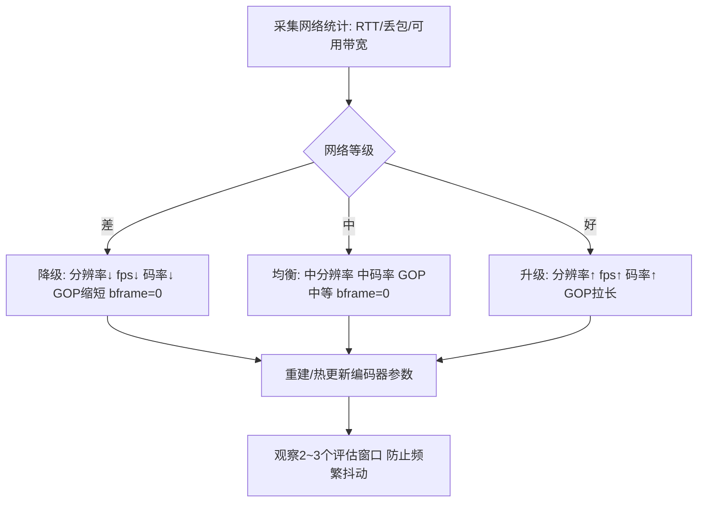
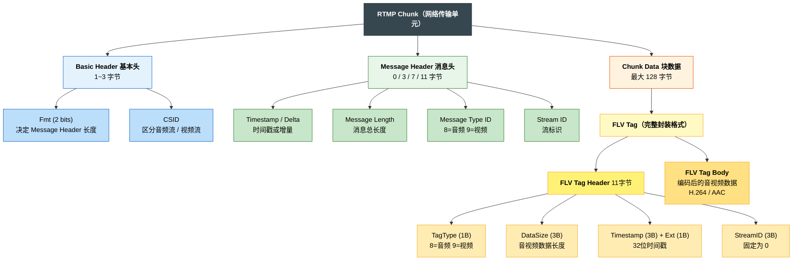
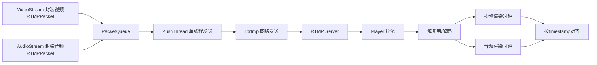
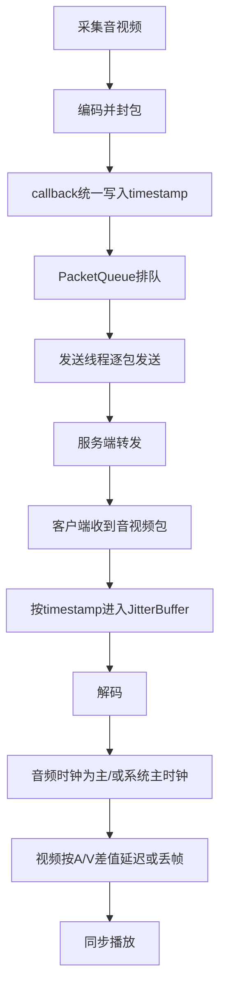
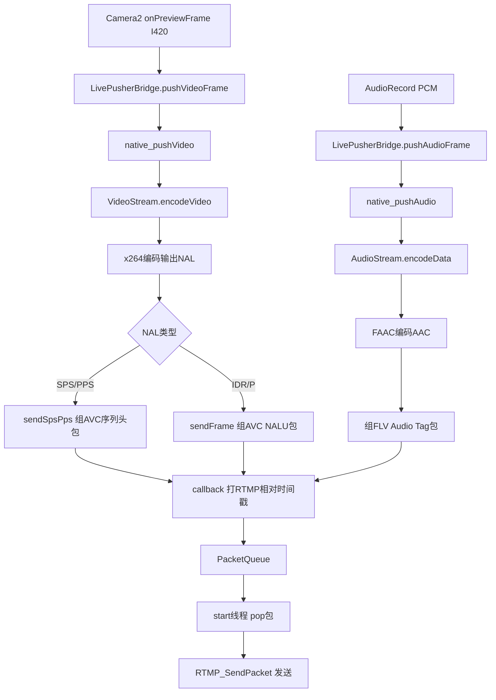
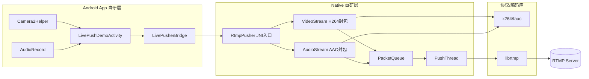
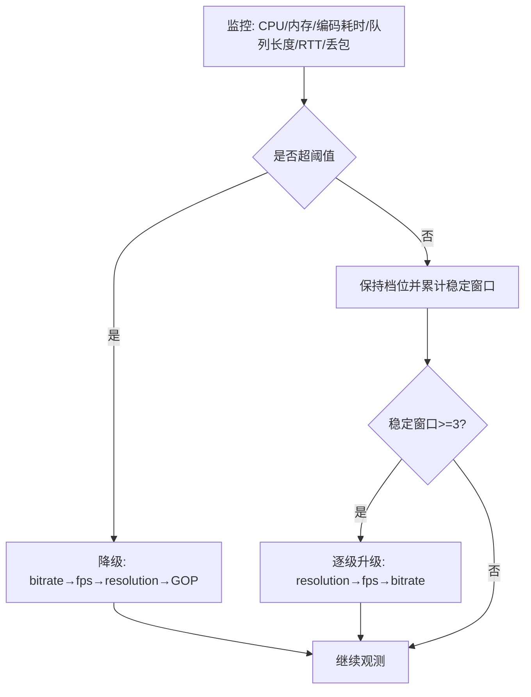
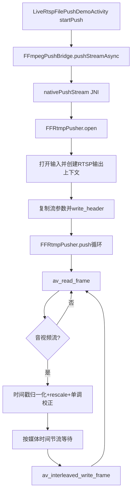

# Media


## 大体介绍

* Android音频、视频采集
* Android Camera预览（TextureView与SurfaceView）
* 实时视频流YUV数据编码H.264
* RTMP实时推流
* RTMP拉流并Media3Player实时播放
* FFmpeg + RTSP文件推流
* FFmpeg采集视频数据（基本信息，抽帧）
* FFmpeg转码：m3u8 <-> mp4 转码
* 在线HLS视频播放


## 知识梳理

### Android 音视频采集
Android 设备分为两类：普通手机 App、RK3588 等瑞芯微工控板 / 开发板系统 Apk，二者音视频采集 API 完全通用，仅硬件外设接入方式有区别。

Android App 音视频采集：
- 视频采集
  - 基础老式 API：Camera（已废弃，适配老旧设备）
  - 底层原生 API：Camera2（支持手动参数调节、多摄、高帧率、RAW 数据）
  - 官方推荐封装：CameraX（兼容适配强、自动管理生命周期、开发最简）

- 音频采集
  - 高层封装：MediaRecorder（直接录制生成音频 / 视频文件，简单易用）
  - 底层裸流采集：AudioRecord（获取原始 PCM 音频流，适合实时处理、推流、AI 语音分析）
  - 高阶自定义方案：MediaCodec 音视频硬编码 + 自定义采集流程；或集成 FFmpeg 实现跨平台统一音视频采集、编码、推流方案。

RK3588 外接摄像头
- 视频采集
  - 外接 MIPI 摄像头
    - RK3588 开发板原生支持 MIPI-CSI 接口摄像头，硬件接入后内核自动识别为 V4L2 设备；
    - Android 系统层已做 HAL 适配，App 无需特殊适配，可直接使用 Camera/Camera2/CameraX 标准 API 调用；
    - 预览依赖 TextureView + TextureView.SurfaceTextureListener 生命周期回调，遵循「纹理就绪打开相机、页面销毁释放相机」流程；
  - 外接 USB 摄像头（UVC 免驱）
    - 即插即用，无需安装驱动，插入 RK3588 USB 口安卓自动识别；
    - 同标准相机 API 一致，App 代码无需修改，直接预览、拍照、录制；
- 外接麦克风小喇叭
  - USB 免驱麦克风：即插即用，Android 自动识别为默认音频输入设备，App 通过 MediaRecorder/AudioRecord 可直接采集音频，无接线、无杂音；
  - 3.5mm 有源小音箱（自带功放、USB 供电），直接插开发板 3.5mm 音频孔即可正常发声

#### 音频采集

**AudioRecord**

从麦克风硬件 实时抓取 原始 PCM 裸音频流，给到你 App 字节数组，自己拿去做降噪、编码、保存、推流

麦克风硬件 → 音频芯片 → 安卓音频框架 → 缓冲区Buffer → AudioRecord → 读byte[]/short[]

参数解析:
- 音频源：MIC (麦克风)
- 采样率 44000Hz (每秒钟对声音采样 44000 次)
  - 8000Hz：电话音质
    16000Hz：语音识别、对讲常用
    44000Hz：标准 CD 音质、通用录音
    48000Hz：高清录音
    采样率越高，声音越清晰，占用流量 / 内存越大。
- 声道 channelConfig
  - CHANNEL_IN_MONO 单声道
  - CHANNEL_IN_STEREO 立体声
  - Android 日常采集、RK3588 开发板一律用：CHANNEL_IN_MONO
- 采样点 AudioFormat.ENCODING_PCM_16BIT
  - 采样率是「一秒采多少次」
  - 16BIT 是每一个采样点用 16bit (2 字节) 存储声音大小
- 缓冲区 bufferSize
  - 没有缓冲区的话采集的音频也无法立即播放会丢失, 所以需要一个缓冲区来存储音频数据
  - 计算公式: 每秒字节数 = 采样率 × 声道数 × 每采样点字节数 (44000 × 1 × 2 = 88000)
  - 缓冲区大小 = 最小缓冲区大小 = 采样率 × 声道数 × 位深度字节数 × 系统最小缓冲时间（秒）
  - 大多数手机 / RK3588 安卓 = 20ms（0.02 秒）
  - 20ms 字节数 = 88200 × 0.02 = 1764 字节
  - minBufferSize = 1764 × 2 = 3528 字节
  - AudioRecord.getMinBufferSize(44100, MONO, 16BIT) ≈ 3528 字节


### Android Camera预览


### 编解码

由于 Android 的 Camera 采集的数据格式是 YUV，数据量大且 RTMP 不接受，所以需要编码为 H.264 或 H.265 才能封装 RTMP 包。
同样，Android 的 MIC 采集的数据格式是 PCM，数据量也很大且 RTMP 不接受，并且 RTMP 只接收 AAC 格式音频，所以也需要进行编码。

#### 音频编码

**软编**
软编指的是用 CPU 进行软件编码，一般采用的是 FAAC 库。
适合App使用, 因为不确定手机硬件是否支持硬编所以软编是用来兜底的.

```c++
private:
    /**
     * 音频编码相关成员变量
     * 用于 FAAC 软编码：PCM → AAC
     */
    faacEncHandle m_audioCodec = 0;   // FAAC 编码器句柄，保存编码器状态和配置
    u_long m_inputSamples;            // 每次编码输入的 PCM 采样数（决定了单次编码产生的 AAC 帧时长）
    u_long m_maxOutputBytes;          // 输出缓冲区最大字节数（编码后的 AAC 数据不会超过此大小）
    u_char *m_buffer = 0;             // 输出缓冲区指针，存放 FAAC 编码后的 AAC 原始帧数据

// ========== FAAC 软编码，将 PCM 编码为 AAC ==========
// faacEncEncode: 输入 PCM，输出 AAC 帧到 m_buffer，返回编码后的字节数
int byteLen = faacEncEncode(
        m_audioCodec,                              // FAAC 编码器句柄（含编码参数配置）
        reinterpret_cast<int32_t *>(data),          // 输入：PCM 采样数据（16-bit，按 32-bit 传入以匹配接口要求）
        static_cast<unsigned int>(m_inputSamples),  // 输入：每次编码的 PCM 采样数
        m_buffer,                                   // 输出：指向 AAC 编码数据缓冲区（调用前已分配 m_maxOutputBytes 大小）
        static_cast<unsigned int>(m_maxOutputBytes) // 输出缓冲区最大容量，防止编码溢出
);
```

**硬编**
硬编指的是调用设备专用 DSP（Digital Signal Processor 数字信号处理器）芯片进行编码。在 Android 上通过 MediaCodec API 实现。
优点是效率高、功耗低、几乎不占 CPU，适合长时间推流场景，能明显降低手机发热。
缺点是兼容性不够稳定，部分冷门机型或老旧设备的硬件编码器可能存在 Bug，导致编码失败或音质异常。

(RK3588 自研芯片优先使用硬编)

```java
/**
 * 音频硬编码器，使用 MediaCodec 将 PCM 编码为 AAC
 */
public class AudioEncoder {
    private MediaCodec codec;
    private MediaFormat format;
    private boolean running = false;

    /**
     * 初始化 AAC 硬编码器
     * @param sampleRate 采样率，如 44100
     * @param channelCount 声道数，1=单声道，2=双声道
     * @param bitRate 码率，如 64000
     */
    public void init(int sampleRate, int channelCount, int bitRate) throws IOException {
        // 1. 创建编码器，指定 MIME 类型为 AAC
        codec = MediaCodec.createEncoderByType(MediaFormat.MIME_TYPE_AUDIO_AAC);

        // 2. 配置编码参数
        format = MediaFormat.createAudioFormat(
                MediaFormat.MIME_TYPE_AUDIO_AAC,
                sampleRate,      // 采样率
                channelCount     // 声道数
        );
        format.setInteger(MediaFormat.KEY_BIT_RATE, bitRate);                // 码率
        format.setInteger(MediaFormat.KEY_AAC_PROFILE,
                MediaCodecInfo.CodecProfileLevel.AACObjectLC);               // AAC-LC
        format.setInteger(MediaFormat.KEY_MAX_INPUT_SIZE, 1024 * 10);        // 输入缓冲区上限

        // 3. 配置并启动编码器（CONFIGURE_FLAG_ENCODE 表示编码模式）
        codec.configure(format, null, null, MediaCodec.CONFIGURE_FLAG_ENCODE);
        codec.start();
        running = true;
    }

    /**
     * 送一帧 PCM 数据去编码
     * @param pcmData PCM 原始数据（16-bit）
     * @param size 数据长度（字节）
     * @param presentationTimeUs 该帧的采集时间戳（微秒）
     */
    public void encode(byte[] pcmData, int size, long presentationTimeUs) {
        if (!running) return;

        // 1. 从 MediaCodec 获取空闲输入 Buffer 的索引
        int inputBufferIndex = codec.dequeueInputBuffer(10000); // 等待 10ms
        if (inputBufferIndex >= 0) {
            // 2. 取到 Buffer，填入 PCM 数据
            ByteBuffer inputBuffer = codec.getInputBuffer(inputBufferIndex);
            if (inputBuffer != null) {
                inputBuffer.clear();
                inputBuffer.put(pcmData, 0, size);
                // 3. 送回编码器
                codec.queueInputBuffer(inputBufferIndex, 0, size, presentationTimeUs, 0);
            }
        }

        // 4. 尝试取出编码后的 AAC 数据
        drainEncoder();
    }

    /**
     * 从编码器取出 AAC 数据，回调给上层
     */
    private void drainEncoder() {
        MediaCodec.BufferInfo bufferInfo = new MediaCodec.BufferInfo();
        while (true) {
            int outputBufferIndex = codec.dequeueOutputBuffer(bufferInfo, 0);
            if (outputBufferIndex >= 0) {
                // 成功拿到一帧 AAC
                ByteBuffer outputBuffer = codec.getOutputBuffer(outputBufferIndex);
                if (outputBuffer != null && bufferInfo.size > 0) {
                    byte[] aacData = new byte[bufferInfo.size];
                    outputBuffer.get(aacData);
                    outputBuffer.position(bufferInfo.offset); // 恢复 position

                    // 回调：这里交给你的 AudioStream 封装成 RTMP 包
                    onAACFrameAvailable(aacData, bufferInfo.size, bufferInfo.presentationTimeUs);
                }
                codec.releaseOutputBuffer(outputBufferIndex, false);
            } else if (outputBufferIndex == MediaCodec.INFO_OUTPUT_FORMAT_CHANGED) {
                // 编码器输出格式变化，一般在这里获取 csd-0（AAC 序列头）
                MediaFormat newFormat = codec.getOutputFormat();
                ByteBuffer csd0 = newFormat.getByteBuffer("csd-0");
                if (csd0 != null) {
                    byte[] csd = new byte[csd0.remaining()];
                    csd0.get(csd);
                    onAACSequenceHeader(csd);
                }
            } else if (outputBufferIndex == MediaCodec.INFO_TRY_AGAIN_LATER) {
                break; // 没有更多输出
            }
        }
    }

    /**
     * AAC 序列头回调（AudioSpecificConfig），推流前必须发送一次
     */
    private void onAACSequenceHeader(byte[] config) {
        // 封装成 RTMP 音频包，m_body[1] = 0x00（序列头）
    }

    /**
     * AAC 帧数据回调
     */
    private void onAACFrameAvailable(byte[] aacData, int size, long ptsUs) {
        // 封装成 RTMP 音频包，m_body[1] = 0x01（原始帧）
        // 这里和你 FAAC 版本拿到 m_buffer 之后的逻辑完全一样
    }

    public void stop() {
        running = false;
        if (codec != null) {
            codec.stop();
            codec.release();
            codec = null;
        }
    }
}
```


#### 视频编码

**软编**
同上, 软编使用X264将视频YUV编码为H.264

```c++
  // ========== x264 软编码，将 YUV 图像编码为 H.264 NAL 单元 ==========
  x264_nal_t *pp_nal;           // 输出：NAL 单元数组指针
  int pi_nal;                   // 输出：NAL 单元个数
  x264_picture_t pic_out;       // 输出：编码后的重建图像（B 帧参考用）

  x264_encoder_encode(videoCodec,  // x264 编码器句柄
                      &pp_nal,      // 输出：指向 NAL 数组的指针
                      &pi_nal,      // 输出：NAL 单元数量
                      pic_in,       // 输入：待编码的 YUV 图像
                      &pic_out);    // 输出：编码后的图像（含重建帧）
```

**硬编**
硬编使用MediaCodec将视频YUV编码为H.264

```java
/**
 * 视频硬编码器，使用 MediaCodec 将 YUV 编码为 H.264
 *
 * 流程：
 *   YUV 数据 → 转换色彩格式 → MediaCodec 硬编码 → H.264 NAL → 封装 RTMP 包
 *
 * 编码逻辑与 x264 软编完全一致，只是把 x264_encoder_encode 替换为 MediaCodec 队列操作
 */
public class VideoEncoder {
    private static final String TAG = "VideoEncoder";
    private static final String MIME_TYPE = "video/avc";    // H.264 编码
    private static final int I_FRAME_INTERVAL = 2;          // 每2秒一个关键帧

    private MediaCodec codec;
    private int width, height, frameRate, bitRate;
    private boolean running = false;

    // 色彩格式：硬件编码器接受的 YUV 格式（通常是 NV12 或 YUV420 SemiPlanar）
    private int colorFormat;

    // 用于 NV21 → NV12 转换的临时缓冲区
    private byte[] nv12Buffer;

    /**
     * 初始化 H.264 硬编码器
     *
     * @param width     视频宽度
     * @param height    视频高度
     * @param frameRate 帧率
     * @param bitRate   码率（bps），如 2000000 表示 2Mbps
     */
    public void init(int width, int height, int frameRate, int bitRate) throws IOException {
        this.width = width;
        this.height = height;
        this.frameRate = frameRate;
        this.bitRate = bitRate;

        // 1. 创建 H.264 编码器
        codec = MediaCodec.createEncoderByType(MIME_TYPE);

        // 2. 配置编码参数
        MediaFormat format = MediaFormat.createVideoFormat(MIME_TYPE, width, height);
        format.setInteger(MediaFormat.KEY_BIT_RATE, bitRate);                    // 码率
        format.setInteger(MediaFormat.KEY_FRAME_RATE, frameRate);                // 帧率
        format.setInteger(MediaFormat.KEY_I_FRAME_INTERVAL, I_FRAME_INTERVAL);   // 关键帧间隔（秒）
        format.setInteger(MediaFormat.KEY_COLOR_FORMAT,
                MediaCodecInfo.CodecCapabilities.COLOR_FormatYUV420SemiPlanar);  // 优先 NV12
        // 码率控制模式：VBR 可变码率（画质优先），CBR 恒定码率（网络推流推荐）
        format.setInteger(MediaFormat.KEY_BITRATE_MODE,
                MediaCodecInfo.EncoderCapabilities.BITRATE_MODE_CBR);

        // 3. 配置编码器
        codec.configure(format, null, null, MediaCodec.CONFIGURE_FLAG_ENCODE);

        // 4. 获取编码器实际支持的色彩格式（可能和请求的不同）
        MediaFormat inputFormat = codec.getInputFormat();
        colorFormat = inputFormat.getInteger(MediaFormat.KEY_COLOR_FORMAT);

        // 5. 分配 NV12 转换缓冲区（只分配一次，复用）
        nv12Buffer = new byte[width * height * 3 / 2];

        // 6. 启动编码器
        codec.start();
        running = true;

        LOGI("硬编码初始化成功，实际 colorFormat=" + Integer.toHexString(colorFormat));
    }

    /**
     * 送一帧 YUV 数据去编码（对应 x264 的 pic_in 赋值 + x264_encoder_encode）
     *
     * @param nv21Data          Android Camera 默认输出的 NV21 数据
     * @param presentationTimeUs 该帧的采集时间戳（微秒），用于音视频同步
     */
    public void encode(byte[] nv21Data, long presentationTimeUs) {
        if (!running || codec == null) return;

        // ========== 第1步：NV21 → NV12 色彩格式转换 ==========
        // 对应 x264 版本中 camera_type==1 的转换逻辑
        // NV21: YYYY... + VUVU...  （V 在前）
        // NV12: YYYY... + UVUV...  （U 在前）
        nv21ToNv12(nv21Data, nv12Buffer, width, height);

        // ========== 第2步：从 MediaCodec 获取空闲输入 Buffer ==========
        int inputBufferIndex = codec.dequeueInputBuffer(10000);  // 等待 10ms
        if (inputBufferIndex >= 0) {
            ByteBuffer inputBuffer = codec.getInputBuffer(inputBufferIndex);
            if (inputBuffer != null) {
                inputBuffer.clear();
                // 填入 NV12 数据
                inputBuffer.put(nv12Buffer);
                // 送回编码器队列，硬件开始编码
                codec.queueInputBuffer(inputBufferIndex, 0, nv12Buffer.length,
                        presentationTimeUs, 0);
            }
        }

        // ========== 第3步：取出编码后的 H.264 数据 ==========
        // 对应 x264 版本的 pi_nal 循环 + sendSpsPps / sendFrame
        drainEncoder();
    }

    /**
     * NV21 → NV12 转换
     *
     * NV21 内存布局：YYYYYYYY... VUVUVU...
     * NV12 内存布局：YYYYYYYY... UVUVUV...
     *
     * @param nv21   输入 NV21 数据
     * @param nv12   输出 NV12 数据
     * @param width  图像宽度
     * @param height 图像高度
     */
    private void nv21ToNv12(byte[] nv21, byte[] nv12, int width, int height) {
        int frameSize = width * height;
        int uvSize = frameSize / 2;

        // 拷贝 Y 平面（NV21 和 NV12 的 Y 排布完全一样）
        System.arraycopy(nv21, 0, nv12, 0, frameSize);

        // 交换 UV 分量：NV21(VU) → NV12(UV)
        // NV21 中 UV 交错，V 在前 U 在后，需要把 V 和 U 顺序互换
        for (int i = 0; i < uvSize / 2; i++) {
            nv12[frameSize + i * 2] = nv21[frameSize + i * 2 + 1];      // U ← 原奇数位
            nv12[frameSize + i * 2 + 1] = nv21[frameSize + i * 2];      // V ← 原偶数位
        }
    }

    /**
     * 从编码器输出队列取出 H.264 数据
     *
     * 对应 x264 版本中遍历 pp_nal 的逻辑：
     *   - csd-0（SPS+PPS）→ sendSpsPps()
     *   - IDR/P 帧          → sendFrame()
     */
    private void drainEncoder() {
        MediaCodec.BufferInfo bufferInfo = new MediaCodec.BufferInfo();

        while (true) {
            int outputBufferIndex = codec.dequeueOutputBuffer(bufferInfo, 0);

            if (outputBufferIndex == MediaCodec.INFO_OUTPUT_FORMAT_CHANGED) {
                // ========== 编码器输出格式变化 ==========
                // 获取 SPS 和 PPS（对应 x264 的 NAL_SPS 和 NAL_PPS）
                MediaFormat newFormat = codec.getOutputFormat();
                ByteBuffer spsBuffer = newFormat.getByteBuffer("csd-0");  // SPS
                ByteBuffer ppsBuffer = newFormat.getByteBuffer("csd-1");  // PPS

                if (spsBuffer != null && ppsBuffer != null) {
                    byte[] sps = new byte[spsBuffer.remaining()];
                    spsBuffer.get(sps);
                    byte[] pps = new byte[ppsBuffer.remaining()];
                    ppsBuffer.get(pps);

                    // 回调：发送 SPS+PPS（对应 x264 的 sendSpsPps）
                    onSpsPpsAvailable(sps, pps);
                }

            } else if (outputBufferIndex >= 0) {
                // ========== 成功取到一帧编码数据 ==========
                ByteBuffer outputBuffer = codec.getOutputBuffer(outputBufferIndex);
                if (outputBuffer != null && bufferInfo.size > 0) {
                    byte[] h264Data = new byte[bufferInfo.size];
                    outputBuffer.get(h264Data);

                    // 判断关键帧（对应 x264 的 NAL_IDR）
                    boolean isKeyFrame = (bufferInfo.flags &
                            MediaCodec.BUFFER_FLAG_KEY_FRAME) != 0;

                    // 回调：发送视频帧（对应 x264 的 sendFrame）
                    onFrameAvailable(h264Data, bufferInfo.size,
                            bufferInfo.presentationTimeUs, isKeyFrame);
                }
                codec.releaseOutputBuffer(outputBufferIndex, false);

            } else if (outputBufferIndex == MediaCodec.INFO_TRY_AGAIN_LATER) {
                break;  // 没有更多输出，退出循环
            }
        }
    }

    /**
     * SPS+PPS 回调（对应 x264 版本的 sendSpsPps）
     * 封装成 FLV Video Tag：m_body[0] = 0x17(关键帧) + AVCDecoderConfigurationRecord
     */
    private void onSpsPpsAvailable(byte[] sps, byte[] pps) {
        LOGI("收到 SPS+PPS，spsLen=" + sps.length + ", ppsLen=" + pps.length);
        // TODO: 封装成 RTMPPacket，发送序列头
    }

    /**
     * 视频帧回调（对应 x264 版本的 sendFrame）
     *
     * @param h264Data      H.264 编码数据（单个 NAL 单元或 Access Unit）
     * @param size          数据长度
     * @param ptsUs         时间戳（微秒）
     * @param isKeyFrame    是否为关键帧（IDR）
     */
    private void onFrameAvailable(byte[] h264Data, int size, long ptsUs,
                                  boolean isKeyFrame) {
        LOGI("收到视频帧，size=" + size + ", pts=" + ptsUs / 1000 + "ms, keyFrame=" + isKeyFrame);
        // TODO: 封装成 RTMPPacket，发送视频帧
    }

    /**
     * 停止并释放编码器
     */
    public void stop() {
        running = false;
        if (codec != null) {
            try {
                codec.stop();
                codec.release();
            } catch (Exception e) {
                LOGE("释放编码器失败: " + e.getMessage());
            }
            codec = null;
        }
    }
}
```


#### MediaCodec


#### IBP帧

IBP 是 H.264/H.265 中最核心的帧间压缩机制，决定了「码率、延迟、画质、抗丢包能力」之间的平衡。

**1) I/P/B 帧分别是什么**
- **I 帧（Intra）**：完整自描述帧，不依赖其他帧，可单独解码；码率最大，但随机访问最友好。
- **P 帧（Predicted）**：只记录相对前面参考帧的差异；码率更低。
- **B 帧（Bi-predicted）**：可同时参考前后帧，压缩效率最高，但编码/解码链路更复杂，且引入重排延迟。

**2) 为什么要做 IBP**
- 纯 I 帧体积太大，直播带宽成本高、同带宽下画质差。
- 只靠 P 帧虽然省带宽，但在复杂运动场景仍不够高效。
- B 帧可进一步压缩，但要付出更高时延和更复杂时间戳管理成本。

**3) 解决了什么问题**
- 显著降低同等画质下码率，提升弱网可用性。
- 降低存储和 CDN 分发成本（尤其录播/HLS 场景）。
- 提升画质稳定性（同码率下细节保留更好）。

**4) 带来的新问题**
- 帧依赖链更长，丢包后可能出现更长时间花屏/马赛克。
- B 帧导致显示顺序与编码顺序不一致，需要 PTS/DTS 重排。
- 实时链路（RTMP/RTC）中 B 帧会提高端到端延迟。

**5) 怎么选**
- **低延迟直播（RTMP、RTC）**：通常 `I + P`（禁用 B 帧），关键帧间隔 1~2 秒。
- **点播/HLS**：允许 `I + P + B`，换更高压缩效率。
- **网络差/终端弱**：缩短 GOP（更频繁 I 帧），提升恢复能力，但码率会上升。
- **网络稳/追求带宽效率**：拉长 GOP，并在可接受延迟内引入 B 帧。

**6) 本项目中的使用方式**
- **RTMP 实时推流（`VideoStream`）**：明确 `param.i_bframe = 0`，即只用 I/P，目标是低延迟和实现简单。
- **RTSP 文件推流（`FFRtmpPusher`）**：以 FFmpeg 重封装为主，帧类型主要沿用输入文件，不在自研层强行重编码改 GOP。
- **HLS 播放**：你当前文档定位是在线播放场景，天然更偏容忍延迟，通常可接受含 B 帧的分片流（由上游转码策略决定）。

代码摘录（项目内：RTMP 实时链路如何配置 I/P）：
```cpp
// VideoStream::setVideoEncInfo
x264_param_t param;
x264_param_default_preset(&param, "ultrafast", "zerolatency");

param.i_csp = X264_CSP_I420;    // 输入格式：I420
param.i_width = width;          // 编码宽度
param.i_height = height;        // 编码高度
param.i_bframe = 0;             // 关键：禁用 B 帧，只保留 I/P，降低实时延迟
param.i_fps_num = fps;          // 帧率分子
param.i_fps_den = 1;            // 帧率分母
param.i_keyint_max = fps * 2;   // GOP 最大长度：约 2 秒一个 I 帧
param.b_repeat_headers = 1;     // 每个关键帧前重复 SPS/PPS，便于中途入流解码

param.rc.i_rc_method = X264_RC_ABR;         // 码率控制：ABR
param.rc.i_bitrate = bitrate / 1024;        // 目标码率(kbps)
param.rc.i_vbv_max_bitrate = bitrate / 1024 * 1.2;
param.rc.i_vbv_buffer_size = bitrate / 1024;
```
解释：这段是本项目“IBP”最直接证据：`i_bframe=0` 表示直播不用 B 帧，`i_keyint_max` 控制 I 帧间隔（影响恢复速度与码率）。

代码摘录（项目外：如何显式调 I/B/P 策略）：
```cpp
// 方案A：超低延迟直播（I + P）
param.i_bframe = 0;             // 禁用 B 帧
param.i_keyint_max = fps * 1;   // 1秒一个 I 帧，恢复更快

// 方案B：均衡画质（I + P + 少量B）
param.i_bframe = 1;             // 允许 1 个 B 帧
param.i_keyint_max = fps * 2;   // 2秒一个 I 帧

// 方案C：点播优先压缩（I + P + 多B）
param.i_bframe = 2;             // 更高压缩比
param.i_keyint_max = fps * 3;   // GOP 拉长，码率更省但时延更高
```
解释：这个是常见工程调参模板；直播通常 A，点播/HLS 常见 B/C。

代码摘录（项目外：根据网络波动动态调整 IBP 的策略伪代码）：
```java
// 每 2s 评估一次网络质量，决定编码档位（示例）
void onNetStat(long bitrateKbps, int rttMs, float lossPct) {
    if (lossPct > 0.08f || rttMs > 300 || bitrateKbps < 600) {
        // 弱网：走低延迟稳态档
        encoderProfile = "LOW_LATENCY";
        // I/P only, 较短 GOP, 降分辨率/帧率/码率
        applyProfile(640, 360, 12, 450_000, 0, 12);
    } else if (lossPct > 0.03f || rttMs > 180 || bitrateKbps < 1200) {
        // 中等网络：均衡档
        encoderProfile = "BALANCED";
        applyProfile(960, 540, 18, 800_000, 0, 24);
    } else {
        // 好网络：高画质档（直播仍建议 bframe=0）
        encoderProfile = "HIGH_QUALITY";
        applyProfile(1280, 720, 24, 1_500_000, 0, 48);
    }
}
```
解释：直播动态调参建议优先调“分辨率/帧率/码率/GOP”，B 帧一般固定 0，减少重排延迟与复杂度。




### RTMP实时推流

#### RTMP 的核心作用

RTMP 是基于 TCP 的应用层协议，本质是一个**流媒体封装** + **传输** + **同步协议**
它的核心目的之一：给每一个音视频帧打统一时间戳（timestamp，毫秒）
播放器 / 服务器根据 同一流 ID + 时间戳 来对齐音频和视频，防止音画错位、不同步

#### RTMP 封装结构（Chunk → Message → 音视频帧）
RTMP在收发数据的时候并不是以Message为单位的，⽽是把Message拆分成Chunk发送

封装链路：
```text
YUV/PCM 数据 → H.264/AAC 编码 → FLV Tag 封装 → Message → Chunk
```

网络中传输的全是chunk, 分为video chunk和audio chunk

* 最底层：Chunk（块）—— 最小传输单元
  Chunk = Chunk Header + Chunk Data，其中 Chunk Data 最大 128 字节。

Chunk Header 分 4 种（Chunk Type）：
```text
Type 0：完整头（11 字节），新流第一个包用
Type 1：无流 ID（7 字节）
Type 2：仅时间戳增量（3 字节）
Type 3：无头部（0 字节），连续同类型帧用
```

* 中层：Message（消息）
一个 Message = 一个完整音频帧 / 视频帧 / 控制命令。
Message 固定头:
```text
1B  Message Type（8=音频，9=视频）
3B  Payload Length（帧大小）
4B  Timestamp（毫秒，同步核心）
3B  Stream ID（流 ID，区分不同流）
```

* 中上层：FLV Tag（强制封装格式）
RTMP 强制要求所有音视频数据以 FLV Tag 格式封装。一个 Message 只包含一个 FLV Tag，FLV Tag 位于 Chunk Data 中。
FLV Tag = FLV Tag Header（11 字节）+ FLV Tag Body。

FLV Tag Header 结构：
```text
1B  TagType（8=音频，9=视频，18=脚本数据）
3B  DataSize（Tag Body 长度）
3B  Timestamp（低 24 位）
1B  TimestampExtended（高 8 位，组成 32 位时间戳）
3B  StreamID（固定为 0）
```

FLV Tag Body：
```text
音频 FLV Tag Body = AAC 音频数据（含 AAC 序列头或原始帧）
视频 FLV Tag Body = H.264/H.265 视频数据（含 AVCDecoderConfigurationRecord 或 NALU）
```

* 上层：音视频数据（Payload）
音频：必须 AAC-LC（RTMP 强制）
视频：必须 H.264（AVC）或 H.265（HEVC）



#### 组装RTMP数据包

这里重点只看**项目自研代码**（不展开 RTMP/x264/faac 源码内部）。

关键代码入口：
- Java 入口：`LivePushDemoActivity`、`LivePusherBridge`
- JNI/发送线程：`RtmpPusher.cpp`
- 音频封包：`AudioStream.cpp`
- 视频封包：`VideoStream.cpp`
- 发送队列：`PacketQueue.h`

**RTMP 音频包（AAC）组帧**
- Java 侧 `AudioCaptureTask` 用 `AudioRecord` 拉取 PCM，按 `getAudioInputByteCount()` 计算的帧长上送。
- `native_pushAudio -> AudioStream::encodeData`：
  - PCM -> FAAC 编码得到 AAC 原始帧。
  - 组 FLV Audio Tag Body：`[0xAF/0xAE][0x01][AAC Raw]`
    - 第 1 字节：音频格式/采样率/位深/声道（双声道 `0xAF`，单声道 `0xAE`）
    - 第 2 字节：`0x01` 表示 AAC 原始帧（非序列头）
  - 填 `RTMPPacket` 元信息：`m_packetType=RTMP_PACKET_TYPE_AUDIO`，`m_nChannel=0x11`。
- 开始推流后，发送线程会先调用 `audioStream->getAudioTag()` 发送 AAC Sequence Header（`m_body[1]=0x00`）。

代码摘录（Java 采集并上送 PCM）：
```java
// LivePushDemoActivity.AudioCaptureTask.run
while (running && pushing) {
    int len = audioRecord.read(buffer, 0, buffer.length); // 从 MIC 读取 PCM
    if (len <= 0) continue;                                // 读失败/无数据跳过
    if (len == buffer.length) {
        bridge.pushAudioFrame(buffer.clone());             // 满帧直接送 JNI
    } else {
        byte[] exact = new byte[len];                      // 尾帧不足时裁剪
        System.arraycopy(buffer, 0, exact, 0, len);        // 避免上传脏字节
        bridge.pushAudioFrame(exact);                      // 送到 native 编码
    }
}
```
解释：这段是音频入口，把麦克风 PCM 按帧喂给 `LivePusherBridge`，后续 JNI/C++ 再做 AAC 编码和 RTMP 封包。

代码摘录（C++ AAC 封包核心）：
```cpp
// AudioStream::encodeData
int byteLen = faacEncEncode(m_audioCodec,
        reinterpret_cast<int32_t *>(data),                 // PCM 输入
        static_cast<unsigned int>(m_inputSamples),         // 每帧采样数
        m_buffer,                                           // AAC 输出缓冲
        static_cast<unsigned int>(m_maxOutputBytes));
if (byteLen > 0) {
    int bodySize = 2 + byteLen;                            // FLV音频头2字节 + AAC负载
    auto *packet = new RTMPPacket();
    RTMPPacket_Alloc(packet, bodySize);                    // 申请 RTMP 包体内存
    packet->m_body[0] = (m_channels == 1) ? 0xAE : 0xAF;  // SoundFormat/SoundRate/SoundSize/SoundType
    packet->m_body[1] = 0x01;                              // AACPacketType=1 原始AAC帧
    memcpy(&packet->m_body[2], m_buffer, static_cast<size_t>(byteLen)); // 拷贝AAC载荷
    packet->m_packetType = RTMP_PACKET_TYPE_AUDIO;        // 标记音频包
    packet->m_nChannel = 0x11;                             // RTMP chunk stream id(音频)
    audioCallback(packet);                                 // 回调给统一发送队列
}
```
解释：先 FAAC 编码，再组 FLV Audio Tag（`0xAF/0xAE + 0x01 + AAC`），最后放入 RTMP 发送链路。

**RTMP 视频包（H.264）组帧**
- Java 侧 `onPreviewFrame` 把 I420 帧送到 `native_pushVideo`。
- `VideoStream::encodeVideo`：
  - 先做像素格式整理（NV21/I420 -> x264 需要的平面）。
  - x264 输出 NAL 后分三类处理：
    - `NAL_SPS`：缓存 SPS。
    - `NAL_PPS`：拿到 PPS 后与 SPS 一起调用 `sendSpsPps` 发 AVC Decoder Config 包。
    - 其他 NAL（IDR/P）：调用 `sendFrame` 发视频帧包。
- `sendSpsPps` 封装规则：
  - `m_body[0]=0x17`（关键帧 + AVC）
  - `m_body[1]=0x00`（AVC sequence header）
  - 后续写 AVCDecoderConfigurationRecord + SPS/PPS。
- `sendFrame` 封装规则：
  - IDR 用 `0x17`，非 IDR 用 `0x27`。
  - `m_body[1]=0x01`（AVC NALU）
  - 后跟 4 字节 NAL 长度 + NAL 负载。

代码摘录（Java 视频入口）：
```java
// LivePushDemoActivity.onPreviewFrame
if (!pushing || livePusherBridge == null) return;    // 未推流直接丢帧
livePusherBridge.pushVideoFrame(yuvData, LiveFrameFormat.I420); // I420 -> JNI
```
解释：Camera2 回调的 I420 帧进入 `LivePusherBridge`，之后由 native 侧完成编码和打包。

代码摘录（C++ SPS/PPS 与帧包封装）：
```cpp
// VideoStream::sendSpsPps
packet->m_body[i++] = 0x17; // keyframe + AVC
packet->m_body[i++] = 0x00; // AVC sequence header
...
packet->m_packetType = RTMP_PACKET_TYPE_VIDEO; // 标记视频包
packet->m_nChannel   = 0x10;                   // RTMP chunk stream id(视频)
videoCallback(packet);                         // 入统一发送队列

// VideoStream::sendFrame
packet->m_body[i++] = (type == NAL_SLICE_IDR) ? 0x17 : 0x27; // 关键帧/非关键帧
packet->m_body[i++] = 0x01; // AVCPacketType=1 普通NALU
packet->m_body[i++] = (i_payload >> 24) & 0xFF;
packet->m_body[i++] = (i_payload >> 16) & 0xFF;
packet->m_body[i++] = (i_payload >> 8) & 0xFF;
packet->m_body[i++] = (i_payload) & 0xFF;
memcpy(&packet->m_body[i], payload, static_cast<size_t>(i_payload)); // NALU 负载
videoCallback(packet); // 回调发包
```
解释：`sendSpsPps` 发解码配置头，`sendFrame` 发每帧 NALU（关键帧/非关键帧头不同）。

**时间戳与发送**
- `RtmpPusher.cpp` 中统一回调 `callback(packet)` 给每个包打相对时间戳：`RTMP_GetTime() - start_time`。
- 所有音视频包都先入 `PacketQueue`，发送线程循环 `RTMP_SendPacket`，保证串行发送与 A/V 交织。

代码摘录（统一打时间戳 + 队列发送）：
```cpp
void callback(RTMPPacket *packet) {
    if (packet) {
        packet->m_nTimeStamp = RTMP_GetTime() - start_time; // 统一相对时间戳
        packets.push(packet);                                // 音视频都进同一个队列
    }
}
...
while (isPushing) {
    packets.pop(packet);                          // 从统一队列取“下一个待发包”
    if (!packet) continue;                        // 空包跳过
    packet->m_nInfoField2 = rtmp->m_stream_id;   // 绑定 stream id
    ret = RTMP_SendPacket(rtmp, packet, 1);      // 发到网络层（librtmp）
    releasePackets(packet);                       // 发完释放内存
}
```
解释：这里是 RTMP 发送“总闸口”，把音频包和视频包统一时间基准后串行发出。

#### PacketQueue介绍

`PacketQueue<RTMPPacket*>` 的职责是“**按到达顺序缓存包，单线程串行发送**”，它不会把音频包和视频包再拼成一个大包。

- **是不是分别发出？** 是。音频包、视频包各自独立封装，分别入队，分别发送。
- **怎么同步？** 通过统一时钟生成的 `m_nTimeStamp`（相对 `start_time`）同步，接收端按时间戳对齐解码播放。
- **为什么用同一队列？** 防止多线程并发直接发包导致乱序；统一从一个出口出网，行为可控。

代码摘录（队列组织与发送）：
```cpp
// 生产者：音视频编码回调
void callback(RTMPPacket *packet) {
    if (packet) {
        packet->m_nTimeStamp = RTMP_GetTime() - start_time; // 统一主时钟
        packets.push(packet);                                // push到同一队列
    }
}

// 消费者：发送线程
while (isPushing) {
    packets.pop(packet);                 // 取下一个包（音频或视频）
    if (!packet) continue;
    packet->m_nInfoField2 = rtmp->m_stream_id;
    RTMP_SendPacket(rtmp, packet, 1);   // 逐包发送，不做音视频二次拼接
    releasePackets(packet);
}
```
解释：同步不是“拼成一个包”，而是“同一时间基准 + 顺序发送 + 播放端按时间戳同步”。










#### RTMP推流

#### Nginx流媒体服务器


### RTSP文件推流

#### FFmpeg推流

RTSP 文件推流链路与 RTMP 实时采集链路不同：它是**文件/网络源读包后重封装转推**，不是 Camera+Mic 实时编码。

关键自研链路：
- 页面：`LiveRtspFilePushDemoActivity`
- Java 桥：`FFmpegPushBridge.pushStreamAsync`
- JNI 桥：`ffmpeg_pusher_jni.cpp -> nativePushStream`
- native 控制器：`FFRtmpPusher(open/push/close)`（同一套类支持 RTMP/RTSP 输出）

**核心流程（RTSP 输出）**
- `open()`：
  - `avformat_open_input` 打开输入源。
  - `detect_output_format` 识别 `rtsp://`，输出格式设为 `rtsp`。
  - 遍历输入流复制 `codecpar` 到输出流（偏重 remux，不做业务层重编码）。
  - 设置 RTSP mux 参数：`rtsp_transport=tcp`、`muxdelay=0.1`。
  - `avformat_write_header` 发起会话并写头。
- `push()`：
  - 循环 `av_read_frame` 取 AVPacket。
  - 仅保留音视频流，忽略其他流。
  - 做时间戳归一化（首包对齐到 0），并校正 `pts>=dts`。
  - `rescale()` 把输入 time_base 转为输出 time_base。
  - 按媒体时间与墙钟差 `waitUs` 做节流，模拟实时速率推送。
  - 用 `av_interleaved_write_frame` 交织写出音视频包。
- `close()`：写 trailer，关闭 IO/上下文。

> 结论：RTSP 这条链路里，H.264/AAC 的“编码细节”主要在输入源本身；项目自研重点是**时间戳整理、速率控制、协议输出选择、交织写包**。

代码摘录（Java -> JNI）：
```java
// FFmpegPushBridge
public static void pushStreamAsync(String inputPath, String outputUrl, Callback callback) {
    EXECUTOR.execute(() -> {
        int resultCode = pushStream(inputPath, outputUrl); // 后台线程执行 native 推流
        if (callback != null) {
            MAIN_HANDLER.post(() -> callback.onCompleted(resultCode, buildMessage(resultCode))); // 主线程回调UI
        }
    });
}
```
解释：Java 层异步调用 native，避免阻塞 UI 线程。

代码摘录（RTSP 输出识别与写头）：
```cpp
const char *format_name = detect_output_format(outputPath); // rtsp:// -> "rtsp"
ret = avformat_alloc_output_context2(&outFormatCtx, nullptr, format_name, outputPath); // 创建输出上下文
...
if (is_rtsp_output(outputPath)) {
    av_dict_set(&muxerOptions, "rtsp_transport", "tcp", 0); // 弱网优先TCP，降低UDP丢包风险
    av_dict_set(&muxerOptions, "muxdelay", "0.1", 0);       // 缩短复用延迟
}
ret = avformat_write_header(outFormatCtx, &muxerOptions);   // 写输出流头
```
解释：这里决定了“这是 RTSP 推流”并设置传输策略（TCP）后写流头。

代码摘录（时间戳归一化 + 节流 + 交织写包）：
```cpp
// FFRtmpPusher::push
if (packet.pts != AV_NOPTS_VALUE) {
    if (firstPts[streamIndex] == AV_NOPTS_VALUE) firstPts[streamIndex] = packet.pts; // 记录首帧时间
    packet.pts -= firstPts[streamIndex]; // 归一化到0起点
    if (packet.pts < 0) packet.pts = 0;  // 防御负值
}
...
int64_t mediaTimeUs = av_rescale_q(syncTs, time_base, AV_TIME_BASE_Q);
int64_t elapsedUs = av_gettime() - startTime;
int64_t waitUs = mediaTimeUs - elapsedUs;
if (waitUs > 0) av_usleep(static_cast<unsigned int>(waitUs > 200000 ? 200000 : waitUs)); // 按实时节奏推
...
ret = av_interleaved_write_frame(outFormatCtx, &packet); // 音视频交织写出
```
解释：核心是“把文件时间轴转换成实时推送节奏”，并确保音视频交织输出。

#### RTMP/RTSP 性能策略（弱机器 + 弱网）

**A. 机器 CPU/内存偏弱时（端侧）**
- 降分辨率：`1280x720 -> 960x540 -> 640x360`
- 降帧率：`24fps -> 18fps -> 12fps`
- 降码率：按档位回退（例如 1500k -> 800k -> 450k）
- 直播禁用 B 帧：`bframe=0`
- 队列限长：超过阈值优先丢弃过旧非关键帧，防止内存暴涨与累计延迟

代码摘录（Android Java：根据设备负载切档）：
```java
// 每2秒采样一次 cpu/mem/编码排队耗时，决定编码档位
void onDeviceLoad(float cpuUsage, float memPressure, long encodeCostMs) {
    if (cpuUsage > 0.85f || memPressure > 0.80f || encodeCostMs > 45) {
        applyProfile(640, 360, 12, 450_000);   // 降级档
    } else if (cpuUsage > 0.65f || encodeCostMs > 30) {
        applyProfile(960, 540, 18, 800_000);   // 均衡档
    } else {
        applyProfile(1280, 720, 24, 1_500_000); // 高画质档
    }
}
```

代码摘录（JNI/C++：队列拥塞保护示例，项目外扩展）：
```cpp
// 在 callback(packet) 或 push 前增加保护
const int kQueueHardLimit = 200;
if (packets.size() > kQueueHardLimit) {
    // 拥塞时优先丢视频非关键帧，尽量保留音频与关键帧
    if (packet->m_packetType == RTMP_PACKET_TYPE_VIDEO) {
        bool isKey = ((packet->m_body[0] & 0xF0) == 0x10); // 0x1? 关键帧
        if (!isKey) {
            releasePackets(packet);
            return;
        }
    }
}
packets.push(packet);
```

**B. 网络波动大时（发送侧自适应）**
- 观测指标：发送失败率、RTT、可用上行带宽、队列积压长度。
- 降级顺序：先降码率，再降 FPS，再降分辨率，最后缩短 GOP（加快错误恢复）。
- 恢复顺序：与降级反向，且采用“慢启动”逐级恢复，避免抖动来回切档。

代码摘录（Android Java：网络自适应状态机）：
```java
enum NetLevel { GOOD, MID, BAD }
NetLevel current = NetLevel.MID;
int stableWindows = 0;

void onNetMetrics(long upKbps, int rttMs, float loss, int queueSize) {
    NetLevel next;
    if (loss > 0.08f || rttMs > 300 || upKbps < 600 || queueSize > 120) next = NetLevel.BAD;
    else if (loss > 0.03f || rttMs > 180 || upKbps < 1200 || queueSize > 60) next = NetLevel.MID;
    else next = NetLevel.GOOD;

    if (next == current) {
        stableWindows++;
    } else {
        stableWindows = 0; // 切档重计
    }

    // 降级立即执行；升级需稳定3个窗口，避免抖动
    if (next.ordinal() > current.ordinal()) {
        switchDown(next);
        current = next;
    } else if (next.ordinal() < current.ordinal() && stableWindows >= 3) {
        switchUp(next);
        current = next;
    }
}
```

代码摘录（JNI：触发编码参数更新，项目外接口示例）：
```cpp
extern "C"
JNIEXPORT void JNICALL
Java_com_demo_aarlib_live_LivePusherBridge_native_1setAdaptiveProfile(
        JNIEnv*, jobject, jint width, jint height, jint fps, jint bitrate, jint gop) {
    if (!videoStream) return;
    // 重新配置编码器参数（可做串行切换，防止并发）
    videoStream->setVideoEncInfo(width, height, fps, bitrate);
    // 若扩展了GOP配置，可在setVideoEncInfo内部使用 gop 覆盖 i_keyint_max
}
```






### 拉流与播放

#### CDN

#### WebRTC

#### ExoPlayer拉流播放

* RTMP 直播
* RTSP 文件流
* HLS 在线播放视频


### FFmpeg处理流媒体

#### 集成
* Android集成FFmpeg
* SpringBoot集成FFmpeg

#### 基本功能

