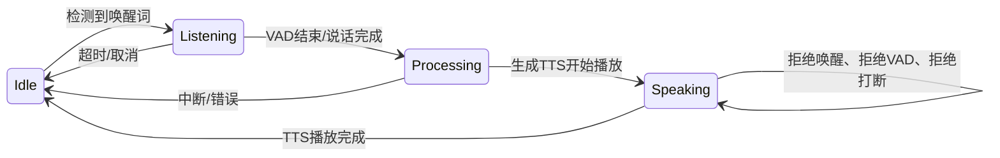
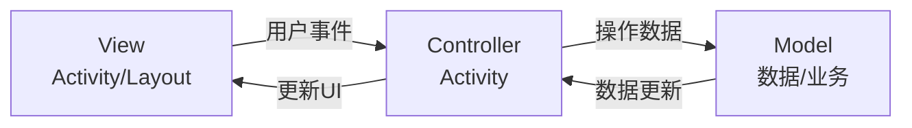
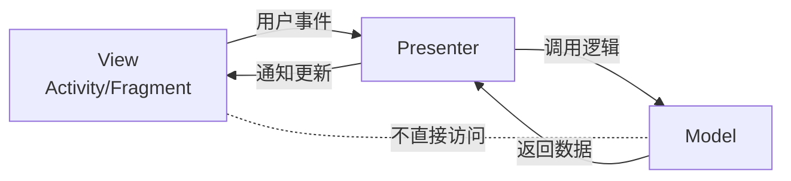
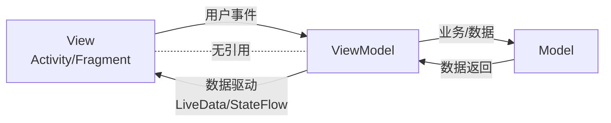
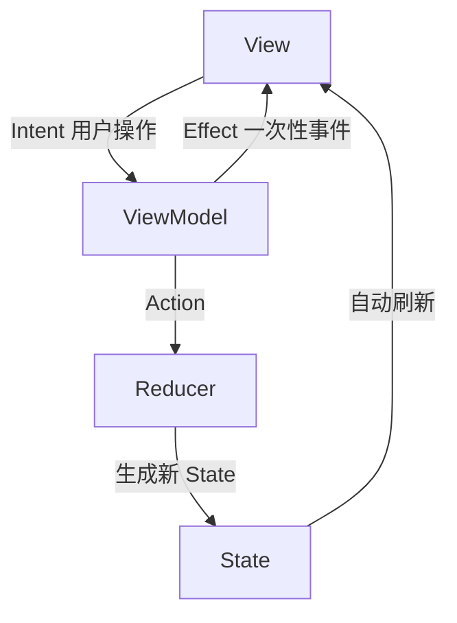

# Android Framework

## 业务

### App上架GooglePlay的业务流程是怎样的

* AAB 包：签名的key必须要合规，建议用v3签名，编译打包生成AAB包，AAB 会自动把 R8/ProGuard 的 mapping.txt 打包进去 交给Google。
* 商店素材与详情页：商品详情介绍，log 512×512 PNG；隐私政策：可访问的 HTTPS 链接
* 数据安全：高危的权限禁止；部分权限需要写原因：设备信息、位置、通讯录、相机、文件、Applist
* targetSDK版本最好是Android12以上
* 马甲包：需要对Https传递的具体内容进行加密，以防google排查（至少2025年是可行的）

### App是怎么混淆的？R8混淆的原理是什么？要注意怎么配置混淆文件？

* App 整体是怎么混淆的？
  把类 / 方法 / 字段名改成无意义短名字 + 删死代码 + 优化字节码，让别人反编译后看不懂逻辑。
  * Android(Java/Kotlin)：AGP 3.4+ 默认用 R8（替代 ProGuard）
  * KMP：common 代码编译成 JVM/JS/Native，Android 端走 R8，iOS 端靠 Xcode strip + 符号隐藏
  * Flutter：Dart 先混淆符号 → AOT 编译成机器码（libapp.so）→ Android 再用 R8 混 Java 层

* R8 混淆原理
  * Shrink（缩）：从入口点（Activity、Application、main）开始遍历，没走到的全删（摇树）Android Developers。
  * Obfuscate（混）：把类、方法、字段名重命名为最短合法标识符（MainActivity → a，login() → b）。
  * Optimize（优）：方法内联、常量折叠、死分支删除、类合并，让代码更小更快。

* R8 混淆文件
  * 反射相关
  * JNI / Native 方法
  * 四大组件（Android 系统反射调用）
  * Application（系统反射创建）
  * 自定义 View（布局反射加载）
  * 枚举（values () /valueOf () 反射调用）
  * 序列化（Parcelable / Serializable）
  * 网络相关（Retrofit + Gson）
  * Gson 泛型、注解
  * WebView JS 接口
  * Retrofit 接口 OkHttp / Retrofit 内部类
```yaml
# 反射调用的类、方法、字段 不能改名、不能删
-keep class com.xxx.xxx.** { *; }

# JNI / Native 方法
-keepclasseswithmembernames class * {
  native <methods>;
}

# 四大组件（Android 系统反射调用）
-keep public class * extends android.app.Activity
-keep public class * extends android.app.Service
-keep public class * extends android.content.BroadcastReceiver
-keep public class * extends android.content.ContentProvider

# Application（系统反射创建）
-keep public class * extends android.app.Application

# 自定义 View（布局反射加载）
-keep public class * extends android.view.View {
  public <init>(android.content.Context);
  public <init>(android.content.Context, android.util.AttributeSet);
  public <init>(android.content.Context, android.util.AttributeSet, int);
}

# 枚举（values () /valueOf () 反射调用）
-keepclassmembers enum * {
  public static **[] values();
  public static ** valueOf(java.lang.String);
}

# 序列化（Parcelable / Serializable）
-keep class * implements android.os.Parcelable {
  public static final android.os.Parcelable$Creator *;
}
-keep class * implements java.io.Serializable { *; }

# 网络相关（Retrofit + Gson）
-keep class com.xxx.app.model.** { *; }

# Gson 泛型、注解
-keepattributes Signature
-keepattributes *Annotation*

# WebView JS 接口
-keepclassmembers class * {
  @android.webkit.JavascriptInterface <methods>;
}

# Retrofit 接口 OkHttp / Retrofit 内部类
-keep interface com.xxx.app.api.** { *; }
-dontwarn retrofit2.**
-keep class retrofit2.** { *; }

-dontwarn okhttp3.**
-keep class okhttp3.** { *; }

-dontwarn okio.**
-keep class okio.** { *; }
```

### 用到的Java设计模式和Android设计模式？

#### Java设计模式

* 🔴 必掌握（每天都用）
  - 创建型：单例、建造者
  - 结构型：适配器、代理、外观
  - 行为型：观察者、模板方法、状态、策略
* 🟡 建议掌握（项目重构 / 框架开发常用）
  - 创建型：工厂方法、抽象工厂
  - 结构型：装饰器
  - 行为型：责任链、命令、中介者
* 🟢 了解即可（系统底层 / 极少手写）
  - 原型、桥接、组合、享元、迭代器、备忘录、访问者、解释器

##### 1. 创建型模式

* 单例模式 Singleton：

eg：所有的Manager，放在Application中或者作为static全局变量，依托Application声明周期或者直接依托JVM生命周期。

* 工厂方法模式 Factory Method、抽象工厂模式 Abstract Factory：

定义创建对象的抽象接口，由子类决定实例化哪一个类，一个工厂对应一种产品；

eg：RK芯片中的长连接适配器，在云上环境采用MQTT，在局域网环境使用WebSocket；
```java
// 抽象产品：长连接适配器
public interface ConnectionAdapter {
    void connect();
    void disconnect();
    void sendMessage(String msg);
}

// MQTT 适配器（云环境）
public class MqttAdapter implements ConnectionAdapter {
    @Override
    public void connect() {
        System.out.println("MQTT 连接云端服务器");
    }

    @Override
    public void disconnect() {
        System.out.println("MQTT 断开连接");
    }

    @Override
    public void sendMessage(String msg) {
        System.out.println("MQTT 发送：" + msg);
    }
}

// WebSocket 适配器（局域网环境）
public class WebSocketAdapter implements ConnectionAdapter {
    @Override
    public void connect() {
        System.out.println("WebSocket 连接局域网设备");
    }

    @Override
    public void disconnect() {
        System.out.println("WebSocket 断开连接");
    }

    @Override
    public void sendMessage(String msg) {
        System.out.println("WebSocket 发送：" + msg);
    }
}

// 抽象工厂
public interface ConnectionFactory {
    ConnectionAdapter createAdapter();
}

// 具体工厂
public class MqttFactory implements ConnectionFactory {
    @Override
    public ConnectionAdapter createAdapter() {
        return new MqttAdapter();
    }
}
public class WebSocketFactory implements ConnectionFactory {
    @Override
    public ConnectionAdapter createAdapter() {
        return new WebSocketAdapter();
    }
}
// 使用方式（环境自动切换）
public class Test {
    static void main(String[] args) {
        ConnectionFactory factory;

        // 模拟 RK 芯片环境判断
        boolean isCloudEnv = BuildConfig.Environment;

        if (isCloudEnv) {
            factory = new MqttFactory();
        } else {
            factory = new WebSocketFactory();
        }

        // 上层完全不用关心是 MQTT 还是 WebSocket
        ConnectionAdapter adapter = factory.createAdapter();
        adapter.connect();
        adapter.sendMessage("RK3588 设备数据");
    }
}
```

* 建造者模式 Builder:

Kotlin 自带 builder 风格:
```kotlin
class NetConfig private constructor(
    val baseUrl: String,
    val timeout: Long,
    val isDebug: Boolean
) {
    class Builder {
        private var baseUrl = ""
        private var timeout = 10000L
        private var isDebug = false

        fun baseUrl(url: String) = apply { baseUrl = url }
        fun timeout(t: Long) = apply { timeout = t }
        fun debug(enable: Boolean) = apply { isDebug = enable }
        fun build() = NetConfig(baseUrl, timeout, isDebug)
    }
}
// 使用
val config = NetConfig.Builder()
    .baseUrl("https://xxx.com")
    .timeout(15000)
    .debug(true)
    .build()
```

##### 2. 结构型模式

* 适配器模式 Adapter：

根据不同的对象，自动适配其不同的方法；主要基于对不同接口的实现

就比如view只需要BindView，CreateView，Count；然后创建一个适配器去适配实现数据转为view

* 代理模式 Proxy：

通过代理对象控制对原对象的访问，做前置 / 后置处理。

静态代理：权限校验、日志埋点、接口请求前置拦截；
动态代理：Retrofit 核心（动态代理生成接口实现类）、AOP 埋点、组件解耦。

##### 3. 行为型模式

* 观察者模式 Observer：

Jetpack：LiveData/StateFlow/SharedFlow；
Kotlin：Kotlin Flow
Java：RxJava

* 模板方法模式 Template Method

封装MVVM设计模式中，传入泛型给`BaseActivity<ViewBinding>`进行绑定view。
内部的模板让每个activity都实现顶部隐藏状态栏。

* 责任链模式 Chain of Responsibility：

请求沿着处理链依次传递，每个节点决定处理或转交下一个

1. 事件分发：View 事件 dispatchTouchEvent → onInterceptTouchEvent -> onTouchEvent
2. 权限逐级校验、请求拦截器（OkHttp Interceptor 链）、多级过滤器

* 状态模式 State：

对象行为依赖自身状态，状态改变则行为自动改变，消除大量状态判断。

就比如语音唤醒助手：由于有VAD语音打断，会出现AI自己的语音打断自己说话的问题，所以需要记录记录当前AI的状态：
如果是`正在回复`则用户不能`唤醒`也不能`说话`

* Idle（空闲）
  - 可唤醒、可监听
* Listening（聆听中）
  - 已唤醒，正在听用户说话
* Processing（思考中）
  - 识别完成，AI 思考回复
* Speaking（回复中）



```kotlin
// 1. 状态抽象基类
abstract class AssistantState {
    open fun onWakeUp() {}    // 唤醒
    open fun onVadEnd() {}    // 说完话
    open fun onSpeakFinish() {} // 说完回复
}

// 2. 空闲状态：可唤醒
class IdleState(private val assistant: VoiceAssistant) : AssistantState() {
    override fun onWakeUp() {
        println("→ 唤醒成功，开始聆听")
        assistant.setState(ListeningState(assistant))
    }
}

// 3. 聆听状态：等你说完
class ListeningState(private val assistant: VoiceAssistant) : AssistantState() {
    override fun onVadEnd() {
        println("→ 识别完成，AI思考中")
        assistant.setState(ProcessingState(assistant))
    }
}

// 4. 思考状态：准备回答
class ProcessingState(private val assistant: VoiceAssistant) : AssistantState() {
    init {
        // 思考完自动开始说话
        println("→ 思考完毕，开始回复")
        assistant.setState(SpeakingState(assistant))
    }
}

// 5. 说话状态：**禁止唤醒、禁止打断**
class SpeakingState(private val assistant: VoiceAssistant) : AssistantState() {
    override fun onWakeUp() {
        println("❌ 拒绝唤醒：AI正在回复")
    }

    override fun onVadEnd() {
        println("❌ 拒绝打断：AI正在回复")
    }

    override fun onSpeakFinish() {
        println("→ 回复完毕，回到空闲")
        assistant.setState(IdleState(assistant))
    }
}

// 6. 状态容器（上下文）
class VoiceAssistant {
    var currentState: AssistantState = IdleState(this)

    fun setState(state: AssistantState) {
        currentState = state
    }

    // 外部调用入口
    fun wakeUp() = currentState.onWakeUp()
    fun vadEnd() = currentState.onVadEnd()
    fun speakFinish() = currentState.onSpeakFinish()
}
```

#### Android设计模式

* Model: 实体类、网络、数据库、业务逻辑
* View: 布局 XML、控件（Button/TextView 等）
* Controller: Activity / Fragment
* Presenter（主持人 / 逻辑代理人）
* ViewModel（数据状态代理人）
* Intent（意图 / 用户操作）

##### 1. MVC

Activity 身兼两职：Controller + 间接持有 View
View 和 Controller 高度耦合（都在 Activity）



##### 2. MVP



* 所有逻辑在 Presenter;
* 通过接口回调更新 UI

##### 3. MVVM



* 双向 / 单向数据绑定
* View 不持有 ViewModel 引用
* 生命周期安全，可复用

##### 4. MVI



单向数据流 + 唯一状态

##### 比对 MVVM 和 MVI 的双向数据流和单项数据流

|对比项| MVVM（双向）               | MVI（单向）                      |
|--|------------------------|------------------------------|
|数据流| View ↔ VM 双向调用、网状      | 	View→Intent→State→View 单向闭环 |
|状态| 分散多 LiveData/Flow，易不同步 | 单一不可变 UiState，原子更新           |

eg：用户名输入框 + 实时校验
* 输入文字
* 实时判断长度是否合法
* 合法 → 按钮可点击
* 不合法 → 按钮不可点击 + 显示错误

MVVM

流转链路（原生 View + DataBinding + LiveData）
```text
网络回显
接口拿到数据 → 更新 LiveData → 双向绑定触发输入框 UI 刷新 ✅ 正常

用户手动输入
用户打字 → 输入框内容变化 → 双向绑定反向把值写回 LiveData
  → LiveData 再次变更 → 又触发输入框刷新
  → 无限循环 ⚠️
```

MVI

```text
网络加载
网络数据 → 更新 State 字段 → Compose 输入框读取 State 渲染

用户输入
输入框文本变化 → 发送 InputTextChanged Intent 到 ViewModel
  → ViewModel 接收后按需更新 State（可加防抖、校验、业务逻辑）
  → 新 State 再驱动 UI 刷新
```


##### MVI + Compose

Jetpack Compose天生适配MVI

MVI首先创建三个：
* UiState：页面唯一状态，UI 只渲染 State
* UiIntent：用户 / 系统行为意图，所有交互统一发 Intent
* UiEvent：一次性事件（Toast、弹窗、页面跳转，防页面重建重复触发）

```kotlin
/** 页面行为意图 */
sealed class InputUiIntent {
    // 用户输入文本
    data class TextInputChanged(val text: String) : InputUiIntent()
    // 触发网络加载数据
    object LoadNetData : InputUiIntent()
}

/** 页面 UI 状态 */
data class InputUiState(
  val inputText: String = "",    // 输入框文本
  val isLoading: Boolean = false// 加载中状态
)

/** 一次性事件（不进UI状态） */
sealed class InputUiEvent {
  data class ShowToast(val msg: String) : InputUiEvent()
}

/** ViewModel 层（业务逻辑、状态流转核心） */
class InputMviViewModel : ViewModel() {

  // 页面状态：只读对外暴露
  private val _uiState = MutableStateFlow(InputUiState())
  val uiState: StateFlow<InputUiState> = _uiState.asStateFlow()

  // 一次性事件流
  private val _uiEvent = MutableSharedFlow<InputUiEvent>()
  val uiEvent: SharedFlow<InputUiEvent> = _uiEvent

  /** 接收外部传来的 Intent */
  fun sendIntent(intent: InputUiIntent) {
    when (intent) {
      is InputUiIntent.TextInputChanged -> handleTextChanged(intent.text)
      InputUiIntent.LoadNetData -> handleLoadNetData()
    }
  }

  // 处理用户输入
  private fun handleTextChanged(newText: String) {
    // 直接更新状态，Compose 自动刷新，无双向循环
    _uiState.update { it.copy(inputText = newText) }
  }

  // 模拟网络请求加载数据
  private fun handleLoadNetData() {
    viewModelScope.launch {
      _uiState.update { it.copy(isLoading = true) }

      // 模拟网络耗时
      delay(1500)
      val netText = "来自网络的默认文本"

      // 网络数据回填状态
      _uiState.update {
        it.copy(
          inputText = netText,
          isLoading = false
        )
      }

      // 发送一次性 Toast 事件
      _uiEvent.emit(InputUiEvent.ShowToast("网络数据加载完成"))
    }
  }
}

/** View 层（页面 UI 渲染） */
@Composable
fun InputMviPage(
  viewModel: InputMviViewModel = viewModel()
) {
  val uiState by viewModel.uiState.collectAsStateWithLifecycle()
  val context = LocalContext.current

  // 监听一次性 Event
  LaunchedEffect(Unit) {
    viewModel.uiEvent.collectLatest { event ->
      when (event) {
        is InputUiEvent.ShowToast -> {
          android.widget.Toast.makeText(context, event.msg, android.widget.Toast.LENGTH_SHORT).show()
        }
      }
    }
  }

  Column(modifier = Modifier.padding(20.dp)) {
    // 加载中动画
    if (uiState.isLoading) {
      CircularProgressIndicator()
    }

    // 输入框：标准 Compose 写法
    OutlinedTextField(
      value = uiState.inputText,       // 只读取全局 State
      onValueChange = { newText ->
        // 只分发 Intent，绝不直接改数据
        viewModel.sendIntent(InputUiIntent.TextInputChanged(newText))
      },
      label = { Text("MVI 输入框") }
    )

    Button(
      onClick = { viewModel.sendIntent(InputUiIntent.LoadNetData) },
      modifier = Modifier.padding(top = 10.dp)
    ) {
      Text("加载网络数据")
    }
  }
}
```


**MVI模式的JetpackCompose相关问题**

* State，Intent，Event的职责分别是什么？
  * State是View的状态控制，是View的唯数据来源，对应着MVI设计模式中的单一数流向。
  * Intent是用户 / 系统产生的行为意图，可以解耦View和用户操作事件的。
  * Event是一次性副作用，如 Toast、弹窗、页面跳转，仅执行一次，不常驻 UI 状态。
* MutableStateFlow，MutableSharedFlow，StateFlow，SharedFlow分别是什么？为社么UI用StateFlow，Event用SharedFlow？
  * Mutable是可写的意思，没有则是不可写只可读
  * 对外暴露的是不可写的，印证了MVI的单向数据流，即 `intent -> Reducer -> state -> view`
  * State回保留状态，而Shared不保留、无记录。印证了一次性副作用流的`一次性`特点。
  * 内部更新可以用`_uiState.update`更新数据
  * 一次性副作用流可以在page中用`LaunchedEffect`监听
* 为什么Page中的`uiState`是用的`viewModel.uiState.collectAsStateWithLifecycle()`而不是直接从`viewModel`获取`uiState`
  * `collectAsStateWithLifecycle` 是把 `Flow` 流转的数据，转换成 `Compose` 可感知的 UI 状态，同时绑定页面生命周期；如果直接拿 `viewModel.uiState`，只是拿到原始 Flow 对象，Compose 无法自动监听、刷新界面，也不会感知页面启停