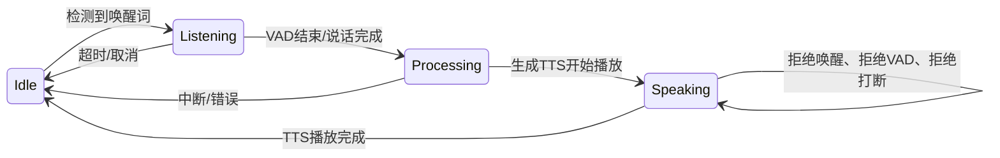
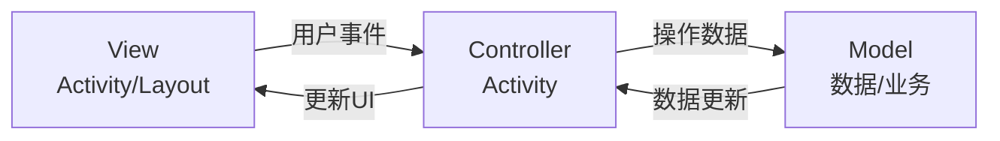
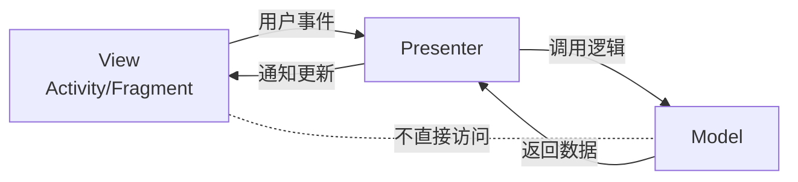
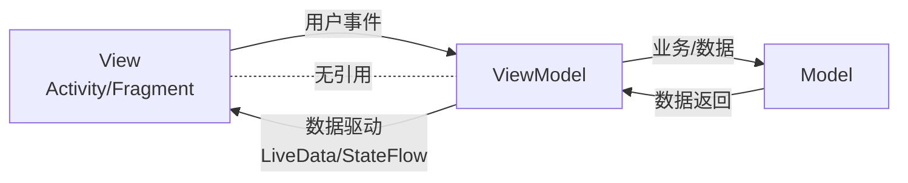
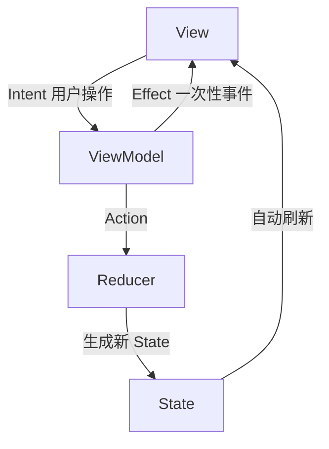
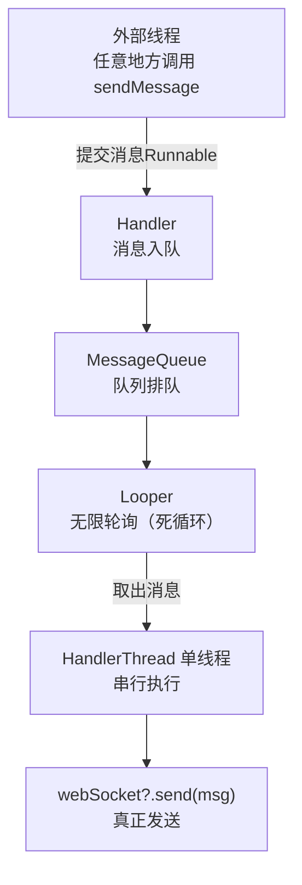

# Android Framework

## 业务

### App上架GooglePlay的业务流程是怎样的

* AAB 包：签名的key必须要合规，建议用v3签名，编译打包生成AAB包，AAB 会自动把 R8/ProGuard 的 mapping.txt 打包进去 交给Google。
* 商店素材与详情页：商品详情介绍，log 512×512 PNG；隐私政策：可访问的 HTTPS 链接
* 数据安全：高危的权限禁止；部分权限需要写原因：设备信息、位置、通讯录、相机、文件、Applist
* targetSDK版本最好是Android12以上
* 马甲包：需要对Https传递的具体内容进行加密，以防google排查（至少2025年是可行的）

### App是怎么混淆的？R8混淆的原理是什么？要注意怎么配置混淆文件？

* App 整体是怎么混淆的？
  把类 / 方法 / 字段名改成无意义短名字 + 删死代码 + 优化字节码，让别人反编译后看不懂逻辑。
  * Android(Java/Kotlin)：AGP 3.4+ 默认用 R8（替代 ProGuard）
  * KMP：common 代码编译成 JVM/JS/Native，Android 端走 R8，iOS 端靠 Xcode strip + 符号隐藏
  * Flutter：Dart 先混淆符号 → AOT 编译成机器码（libapp.so）→ Android 再用 R8 混 Java 层

* R8 混淆原理
  * Shrink（缩）：从入口点（Activity、Application、main）开始遍历，没走到的全删（摇树）Android Developers。
  * Obfuscate（混）：把类、方法、字段名重命名为最短合法标识符（MainActivity → a，login() → b）。
  * Optimize（优）：方法内联、常量折叠、死分支删除、类合并，让代码更小更快。

* R8 混淆文件
  * 反射相关
  * JNI / Native 方法
  * 四大组件（Android 系统反射调用）
  * Application（系统反射创建）
  * 自定义 View（布局反射加载）
  * 枚举（values () /valueOf () 反射调用）
  * 序列化（Parcelable / Serializable）
  * 网络相关（Retrofit + Gson）
  * Gson 泛型、注解
  * WebView JS 接口
  * Retrofit 接口 OkHttp / Retrofit 内部类
```yaml
# 反射调用的类、方法、字段 不能改名、不能删
-keep class com.xxx.xxx.** { *; }

# JNI / Native 方法
-keepclasseswithmembernames class * {
  native <methods>;
}

# 四大组件（Android 系统反射调用）
-keep public class * extends android.app.Activity
-keep public class * extends android.app.Service
-keep public class * extends android.content.BroadcastReceiver
-keep public class * extends android.content.ContentProvider

# Application（系统反射创建）
-keep public class * extends android.app.Application

# 自定义 View（布局反射加载）
-keep public class * extends android.view.View {
  public <init>(android.content.Context);
  public <init>(android.content.Context, android.util.AttributeSet);
  public <init>(android.content.Context, android.util.AttributeSet, int);
}

# 枚举（values () /valueOf () 反射调用）
-keepclassmembers enum * {
  public static **[] values();
  public static ** valueOf(java.lang.String);
}

# 序列化（Parcelable / Serializable）
-keep class * implements android.os.Parcelable {
  public static final android.os.Parcelable$Creator *;
}
-keep class * implements java.io.Serializable { *; }

# 网络相关（Retrofit + Gson）
-keep class com.xxx.app.model.** { *; }

# Gson 泛型、注解
-keepattributes Signature
-keepattributes *Annotation*

# WebView JS 接口
-keepclassmembers class * {
  @android.webkit.JavascriptInterface <methods>;
}

# Retrofit 接口 OkHttp / Retrofit 内部类
-keep interface com.xxx.app.api.** { *; }
-dontwarn retrofit2.**
-keep class retrofit2.** { *; }

-dontwarn okhttp3.**
-keep class okhttp3.** { *; }

-dontwarn okio.**
-keep class okio.** { *; }
```

### 用到的Java设计模式和Android设计模式？

#### Java设计模式

* 🔴 必掌握（每天都用）
  - 创建型：单例、建造者
  - 结构型：适配器、代理、外观
  - 行为型：观察者、模板方法、状态、策略
* 🟡 建议掌握（项目重构 / 框架开发常用）
  - 创建型：工厂方法、抽象工厂
  - 结构型：装饰器
  - 行为型：责任链、命令、中介者
* 🟢 了解即可（系统底层 / 极少手写）
  - 原型、桥接、组合、享元、迭代器、备忘录、访问者、解释器

##### 1. 创建型模式

* 单例模式 Singleton：

eg：所有的Manager，放在Application中或者作为static全局变量，依托Application声明周期或者直接依托JVM生命周期。

* 工厂方法模式 Factory Method、抽象工厂模式 Abstract Factory：

定义创建对象的抽象接口，由子类决定实例化哪一个类，一个工厂对应一种产品；

eg：RK芯片中的长连接适配器，在云上环境采用MQTT，在局域网环境使用WebSocket；
```java
// 抽象产品：长连接适配器
public interface ConnectionAdapter {
    void connect();
    void disconnect();
    void sendMessage(String msg);
}

// MQTT 适配器（云环境）
public class MqttAdapter implements ConnectionAdapter {
    @Override
    public void connect() {
        System.out.println("MQTT 连接云端服务器");
    }

    @Override
    public void disconnect() {
        System.out.println("MQTT 断开连接");
    }

    @Override
    public void sendMessage(String msg) {
        System.out.println("MQTT 发送：" + msg);
    }
}

// WebSocket 适配器（局域网环境）
public class WebSocketAdapter implements ConnectionAdapter {
    @Override
    public void connect() {
        System.out.println("WebSocket 连接局域网设备");
    }

    @Override
    public void disconnect() {
        System.out.println("WebSocket 断开连接");
    }

    @Override
    public void sendMessage(String msg) {
        System.out.println("WebSocket 发送：" + msg);
    }
}

// 抽象工厂
public interface ConnectionFactory {
    ConnectionAdapter createAdapter();
}

// 具体工厂
public class MqttFactory implements ConnectionFactory {
    @Override
    public ConnectionAdapter createAdapter() {
        return new MqttAdapter();
    }
}
public class WebSocketFactory implements ConnectionFactory {
    @Override
    public ConnectionAdapter createAdapter() {
        return new WebSocketAdapter();
    }
}
// 使用方式（环境自动切换）
public class Test {
    static void main(String[] args) {
        ConnectionFactory factory;

        // 模拟 RK 芯片环境判断
        boolean isCloudEnv = BuildConfig.Environment;

        if (isCloudEnv) {
            factory = new MqttFactory();
        } else {
            factory = new WebSocketFactory();
        }

        // 上层完全不用关心是 MQTT 还是 WebSocket
        ConnectionAdapter adapter = factory.createAdapter();
        adapter.connect();
        adapter.sendMessage("RK3588 设备数据");
    }
}
```

* 建造者模式 Builder:

Kotlin 自带 builder 风格:
```kotlin
class NetConfig private constructor(
    val baseUrl: String,
    val timeout: Long,
    val isDebug: Boolean
) {
    class Builder {
        private var baseUrl = ""
        private var timeout = 10000L
        private var isDebug = false

        fun baseUrl(url: String) = apply { baseUrl = url }
        fun timeout(t: Long) = apply { timeout = t }
        fun debug(enable: Boolean) = apply { isDebug = enable }
        fun build() = NetConfig(baseUrl, timeout, isDebug)
    }
}
// 使用
val config = NetConfig.Builder()
    .baseUrl("https://xxx.com")
    .timeout(15000)
    .debug(true)
    .build()
```

##### 2. 结构型模式

* 适配器模式 Adapter：

根据不同的对象，自动适配其不同的方法；主要基于对不同接口的实现

就比如view只需要BindView，CreateView，Count；然后创建一个适配器去适配实现数据转为view

* 代理模式 Proxy：

通过代理对象控制对原对象的访问，做前置 / 后置处理。

静态代理：权限校验、日志埋点、接口请求前置拦截；
动态代理：Retrofit 核心（动态代理生成接口实现类）、AOP 埋点、组件解耦。

##### 3. 行为型模式

* 观察者模式 Observer：

Jetpack：LiveData/StateFlow/SharedFlow；
Kotlin：Kotlin Flow
Java：RxJava

* 模板方法模式 Template Method

封装MVVM设计模式中，传入泛型给`BaseActivity<ViewBinding>`进行绑定view。
内部的模板让每个activity都实现顶部隐藏状态栏。

* 责任链模式 Chain of Responsibility：

请求沿着处理链依次传递，每个节点决定处理或转交下一个

1. 事件分发：View 事件 dispatchTouchEvent → onInterceptTouchEvent -> onTouchEvent
2. 权限逐级校验、请求拦截器（OkHttp Interceptor 链）、多级过滤器

* 状态模式 State：

对象行为依赖自身状态，状态改变则行为自动改变，消除大量状态判断。

就比如语音唤醒助手：由于有VAD语音打断，会出现AI自己的语音打断自己说话的问题，所以需要记录记录当前AI的状态：
如果是`正在回复`则用户不能`唤醒`也不能`说话`

* Idle（空闲）
  - 可唤醒、可监听
* Listening（聆听中）
  - 已唤醒，正在听用户说话
* Processing（思考中）
  - 识别完成，AI 思考回复
* Speaking（回复中）



```kotlin
// 1. 状态抽象基类
abstract class AssistantState {
    open fun onWakeUp() {}    // 唤醒
    open fun onVadEnd() {}    // 说完话
    open fun onSpeakFinish() {} // 说完回复
}

// 2. 空闲状态：可唤醒
class IdleState(private val assistant: VoiceAssistant) : AssistantState() {
    override fun onWakeUp() {
        println("→ 唤醒成功，开始聆听")
        assistant.setState(ListeningState(assistant))
    }
}

// 3. 聆听状态：等你说完
class ListeningState(private val assistant: VoiceAssistant) : AssistantState() {
    override fun onVadEnd() {
        println("→ 识别完成，AI思考中")
        assistant.setState(ProcessingState(assistant))
    }
}

// 4. 思考状态：准备回答
class ProcessingState(private val assistant: VoiceAssistant) : AssistantState() {
    init {
        // 思考完自动开始说话
        println("→ 思考完毕，开始回复")
        assistant.setState(SpeakingState(assistant))
    }
}

// 5. 说话状态：**禁止唤醒、禁止打断**
class SpeakingState(private val assistant: VoiceAssistant) : AssistantState() {
    override fun onWakeUp() {
        println("❌ 拒绝唤醒：AI正在回复")
    }

    override fun onVadEnd() {
        println("❌ 拒绝打断：AI正在回复")
    }

    override fun onSpeakFinish() {
        println("→ 回复完毕，回到空闲")
        assistant.setState(IdleState(assistant))
    }
}

// 6. 状态容器（上下文）
class VoiceAssistant {
    var currentState: AssistantState = IdleState(this)

    fun setState(state: AssistantState) {
        currentState = state
    }

    // 外部调用入口
    fun wakeUp() = currentState.onWakeUp()
    fun vadEnd() = currentState.onVadEnd()
    fun speakFinish() = currentState.onSpeakFinish()
}
```

#### Android设计模式

* Model: 实体类、网络、数据库、业务逻辑
* View: 布局 XML、控件（Button/TextView 等）
* Controller: Activity / Fragment
* Presenter（主持人 / 逻辑代理人）
* ViewModel（数据状态代理人）
* Intent（意图 / 用户操作）

##### 1. MVC

Activity 身兼两职：Controller + 间接持有 View
View 和 Controller 高度耦合（都在 Activity）



##### 2. MVP



* 所有逻辑在 Presenter;
* 通过接口回调更新 UI

##### 3. MVVM



* 双向 / 单向数据绑定
* View 不持有 ViewModel 引用
* 生命周期安全，可复用

##### 4. MVI



单向数据流 + 唯一状态

##### 比对 MVVM 和 MVI 的双向数据流和单项数据流

|对比项| MVVM（双向）               | MVI（单向）                      |
|--|------------------------|------------------------------|
|数据流| View ↔ VM 双向调用、网状      | 	View→Intent→State→View 单向闭环 |
|状态| 分散多 LiveData/Flow，易不同步 | 单一不可变 UiState，原子更新           |

eg：用户名输入框 + 实时校验
* 输入文字
* 实时判断长度是否合法
* 合法 → 按钮可点击
* 不合法 → 按钮不可点击 + 显示错误

MVVM

流转链路（原生 View + DataBinding + LiveData）
```text
网络回显
接口拿到数据 → 更新 LiveData → 双向绑定触发输入框 UI 刷新 ✅ 正常

用户手动输入
用户打字 → 输入框内容变化 → 双向绑定反向把值写回 LiveData
  → LiveData 再次变更 → 又触发输入框刷新
  → 无限循环 ⚠️
```

MVI

```text
网络加载
网络数据 → 更新 State 字段 → Compose 输入框读取 State 渲染

用户输入
输入框文本变化 → 发送 InputTextChanged Intent 到 ViewModel
  → ViewModel 接收后按需更新 State（可加防抖、校验、业务逻辑）
  → 新 State 再驱动 UI 刷新
```


##### MVI + Compose

Jetpack Compose天生适配MVI

MVI首先创建三个：
* UiState：页面唯一状态，UI 只渲染 State
* UiIntent：用户 / 系统行为意图，所有交互统一发 Intent
* UiEvent：一次性事件（Toast、弹窗、页面跳转，防页面重建重复触发）

```kotlin
/** 页面行为意图 */
sealed class InputUiIntent {
    // 用户输入文本
    data class TextInputChanged(val text: String) : InputUiIntent()
    // 触发网络加载数据
    object LoadNetData : InputUiIntent()
}

/** 页面 UI 状态 */
data class InputUiState(
  val inputText: String = "",    // 输入框文本
  val isLoading: Boolean = false// 加载中状态
)

/** 一次性事件（不进UI状态） */
sealed class InputUiEvent {
  data class ShowToast(val msg: String) : InputUiEvent()
}

/** ViewModel 层（业务逻辑、状态流转核心） */
class InputMviViewModel : ViewModel() {

  // 页面状态：只读对外暴露
  private val _uiState = MutableStateFlow(InputUiState())
  val uiState: StateFlow<InputUiState> = _uiState.asStateFlow()

  // 一次性事件流
  private val _uiEvent = MutableSharedFlow<InputUiEvent>()
  val uiEvent: SharedFlow<InputUiEvent> = _uiEvent

  /** 接收外部传来的 Intent */
  fun sendIntent(intent: InputUiIntent) {
    when (intent) {
      is InputUiIntent.TextInputChanged -> handleTextChanged(intent.text)
      InputUiIntent.LoadNetData -> handleLoadNetData()
    }
  }

  // 处理用户输入
  private fun handleTextChanged(newText: String) {
    // 直接更新状态，Compose 自动刷新，无双向循环
    _uiState.update { it.copy(inputText = newText) }
  }

  // 模拟网络请求加载数据
  private fun handleLoadNetData() {
    viewModelScope.launch {
      _uiState.update { it.copy(isLoading = true) }

      // 模拟网络耗时
      delay(1500)
      val netText = "来自网络的默认文本"

      // 网络数据回填状态
      _uiState.update {
        it.copy(
          inputText = netText,
          isLoading = false
        )
      }

      // 发送一次性 Toast 事件
      _uiEvent.emit(InputUiEvent.ShowToast("网络数据加载完成"))
    }
  }
}

/** View 层（页面 UI 渲染） */
@Composable
fun InputMviPage(
  viewModel: InputMviViewModel = viewModel()
) {
  val uiState by viewModel.uiState.collectAsStateWithLifecycle()
  val context = LocalContext.current

  // 监听一次性 Event
  LaunchedEffect(Unit) {
    viewModel.uiEvent.collectLatest { event ->
      when (event) {
        is InputUiEvent.ShowToast -> {
          android.widget.Toast.makeText(context, event.msg, android.widget.Toast.LENGTH_SHORT).show()
        }
      }
    }
  }

  Column(modifier = Modifier.padding(20.dp)) {
    // 加载中动画
    if (uiState.isLoading) {
      CircularProgressIndicator()
    }

    // 输入框：标准 Compose 写法
    OutlinedTextField(
      value = uiState.inputText,       // 只读取全局 State
      onValueChange = { newText ->
        // 只分发 Intent，绝不直接改数据
        viewModel.sendIntent(InputUiIntent.TextInputChanged(newText))
      },
      label = { Text("MVI 输入框") }
    )

    Button(
      onClick = { viewModel.sendIntent(InputUiIntent.LoadNetData) },
      modifier = Modifier.padding(top = 10.dp)
    ) {
      Text("加载网络数据")
    }
  }
}
```


**MVI模式的JetpackCompose相关问题**

* State，Intent，Event的职责分别是什么？
  * State是View的状态控制，是View的唯数据来源，对应着MVI设计模式中的单一数流向。
  * Intent是用户 / 系统产生的行为意图，可以解耦View和用户操作事件的。
  * Event是一次性副作用，如 Toast、弹窗、页面跳转，仅执行一次，不常驻 UI 状态。
* MutableStateFlow，MutableSharedFlow，StateFlow，SharedFlow分别是什么？为社么UI用StateFlow，Event用SharedFlow？
  * Mutable是可写的意思，没有则是不可写只可读
  * 对外暴露的是不可写的，印证了MVI的单向数据流，即 `intent -> Reducer -> state -> view`
  * State回保留状态，而Shared不保留、无记录。印证了一次性副作用流的`一次性`特点。
  * 内部更新可以用`_uiState.update`更新数据
  * 一次性副作用流可以在page中用`LaunchedEffect`监听
* 为什么Page中的`uiState`是用的`viewModel.uiState.collectAsStateWithLifecycle()`而不是直接从`viewModel`获取`uiState`
  * `collectAsStateWithLifecycle` 是把 `Flow` 流转的数据，转换成 `Compose` 可感知的 UI 状态，同时绑定页面生命周期；如果直接拿 `viewModel.uiState`，只是拿到原始 Flow 对象，Compose 无法自动监听、刷新界面，也不会感知页面启停


## 组件内核

### 讲一下Jetpack Compose中的单 Activity + Navigation 切换 Composable架构

* 首先全局唯一一个activity，没有必要使用任何intent跳转；与之对应的，页面跳转使用的是`NavHost + NavController`
* 页面跳转采用的是`navController.navigate`
```kotlin
class MainActivity : ComponentActivity() {
    override fun onCreate(savedInstanceState: Bundle?) {
        super.onCreate(savedInstanceState)
        setContent {
            // 根层级声明 NavController，旋转屏幕不重置栈
            val navController = rememberNavController()

            // 导航容器：定义所有页面路由
            NavHost(
                navController = navController,
                startDestination = "page_home" // 初始默认页面
            ) {
                // 注册页面 & 对应路由
                composable(route = "page_home") {
                    HomePage(navController)
                }
                composable(route = "page_detail") {
                    DetailPage(navController)
                }
            }
        }
    }
}

@Composable
fun HomePage(navController: NavController) {
  Column(
    modifier = Modifier.fillMaxSize(),
    verticalArrangement = Arrangement.Center,
    horizontalAlignment = Alignment.CenterHorizontally
  ) {
    Text(text = "首页")

    Button(
      onClick = {
        // 👉 页面跳转核心代码：跳转到详情页
        navController.navigate("page_detail")
      }
    ) {
      Text("前往详情页")
    }
  }
}
```

### Activity的生命周期？Fragment是什么？和Activity的联系？生命周期如何？讲讲在Compose和flutter中的Fragment变为了什么？

* Activity 生命周期
```text
完整主线流程
onCreate() → onStart() → onResume()（前台可交互）
页面压后台
onResume() → onPause() → onStop()
页面重回前台
onStop() → onStart() → onResume()
页面销毁
onPause() → onStop() → onDestroy()
```

* 屏幕旋转的Activity生命周期更变
```text
onPause → onStop → onDestroy → onCreate → onStart → onResume，Activity 实例重建。
onSaveInstanceState：配置变更前调用，可临时保存轻量数据。
```

* Fragment 是什么 & 与 Activity 的关系
  * Fragment 是依附于 Activity 的模块化 UI 组件，拥有独立布局、逻辑与生命周期，用来拆分页面、复用 UI、实现多区块切换，不能独立存在。
  * 在Jetpack Compose中已经无意义

* Fragment 生命周期
```text
onAttach() → onCreate() → onCreateView() → onViewCreated() → onStart() → onResume()
→ onPause() → onStop() → onDestroyView() → onDestroy() → onDetach()
```

* Compose / Flutter 中 Fragment 被替代成了什么？
  * Compose直接抛弃Fragment，直接使用Composable组合函数
  * Flutter也是直接使用Widget


### Activity的4大启动模式有哪些？singleTask 和 singleInstance 有何区別？在NavHost或者flutter的页面管理还需要关心这些吗？为什么？

```text
standard（标准模式，默认）
    规则：每次启动都新建实例，无论当前栈内是否存在该 Activity。
    入栈：新实例压入当前任务栈栈顶。
singleTop（栈顶唯一）
    仅判断栈顶
    目标 Activity 已经在栈顶 → 复用当前实例，回调 onNewIntent()，不新建
singleTask（栈内唯一）
    启动时先在当前任务栈查找已有实例；
    找到：把该 Activity 之上所有页面全部出栈销毁，让它来到栈顶，回调 onNewIntent()；
singleInstance（全局独立任务栈）
    系统专门开辟全新独立任务栈，该 Activity 是栈中唯一元素；
    全局只存在一个实例；
```

### Activity如何保存状态的？ViewModel吗？有什么用？为什么Activity旋转屏幕后ViewModel可以恢复数据？ViewModel 的实例缓存到哪儿了？

* Activity 保存状态的几种方式
  * onSaveInstanceState / onRestoreInstanceState
  ```kotlin
  override fun onSaveInstanceState(outState: Bundle) {
    super.onSaveInstanceState(outState)
    outState.putString("key_text", "临时数据")
  }
  
  override fun onCreate(savedInstanceState: Bundle?) {
    super.onCreate(savedInstanceState)
    val data = savedInstanceState?.getString("key_text")
  }
  ```
  * ViewModel
  * 持久化方案（SP / 数据库 / 文件）

* 为什么屏幕旋转后 ViewModel 还能保留数据？
  * Activity 销毁重建 ≠ ViewModel 销毁，二者生命周期不一致。

* ViewModel 实例缓存在哪里？
  * ViewModel 实例被缓存在 ViewModelStore 中
  * 每一个 ViewModelStoreOwner（Activity / Fragment / NavBackStackEntry）都会持有一个独立 ViewModelStore；
  * ViewModelStore 内部是一个 HashMap<String, ViewModel>，以 Class 为 Key 缓存实例。

### Service的生命周期是什么样的？你会在什么情况下使用Service？Service和Thread的区别？IntentService与Service的区别？Jetpack Compose中的Worker是怎样的？

* Service 两种启动方式 & 完整生命周期

Android Service 分启动方式和绑定方式，生命周期完全不同，且运行在主线程。

1. startService（启动服务，独立运行）

   * onCreate：服务首次创建时调用，只执行一次，做全局初始化。
   * onStartCommand：每次调用 startService 都会触发，接收 Intent、执行业务逻辑。
   * onDestroy：服务停止时调用，释放资源。
   * 特点：服务启动后独立于调用方，即使页面退出，服务仍可继续运行；需主动调用 stopSelf() / stopService() 停止。
    
2. bindService（绑定服务，依附组件）

   * onCreate() → onBind() → 通信中 → onUnbind() → onDestroy()
   * onBind：返回 IBinder 通信接口，实现客户端与服务交互。
   * 绑定关系解除时触发 onUnbind，随后销毁。
   * 特点：依附绑定的 Activity/Fragment，组件销毁、解绑后服务随之销毁；多用于跨组件通信、调用服务能力。

3. Service 和 Thread 的区别

    Service主线程（默认），不能做耗时操作，做后台任务，不做耗时任务。
    Thread子线程，天生用于耗时任务

4. IntentService 与 Service 的区别
   IntentService 是 Service 的子类，Android 已废弃，是早期简化后台串行任务的方案。

5. Jetpack Compose 中的 Worker（WorkManager）


```kotlin
// 定义 Worker
class MyUploadWorker(context: Context, params: WorkerParameters)
    : CoroutineWorker(context, params) {

    override suspend fun doWork(): Result {
        // 后台耗时任务：上传文件、同步数据等
        return Result.success()
    }
}
// Compose / Activity 中提交任务
// 构建一次性任务
val workRequest = OneTimeWorkRequestBuilder<MyUploadWorker>()
  .setConstraints(
    Constraints.Builder()
      .setRequiredNetworkType(NetworkType.CONNECTED)
      .build()
  )
  .build()

// 加入调度队列
WorkManager.getInstance(context).enqueue(workRequest)
```


### 请介绍Android里广播的分类？程序A能否接收到程序B的广播？请列举广播注册的方式，并简单描述其区别？你是怎么使用广播的？现在有什么可以替代广播吗？

1. 按广播类型划分
    （1）标准广播（Normal Broadcast）
    异步执行，无序传播，所有接收器几乎同时收到，无法截断、无法拦截。
    发送：sendBroadcast(Intent)
    示例：普通自定义业务广播、部分系统通知。
  
    （2）有序广播（Ordered Broadcast）
    同步执行，按优先级顺序传播，优先级高的接收器先接收。
    可通过 abortBroadcast() 截断广播，后续接收器不再收到。
    发送：sendOrderedBroadcast(Intent, 权限字符串)
    
    （3）粘性广播（Sticky Broadcast）
    广播发送后会持久保留，后续新注册的接收器也能补收到这条历史广播。
    Android 5.0 后基本废弃，系统不再推荐使用，高版本已限制。
    
    （4）本地广播（Local Broadcast）
    仅在当前应用内部传播，跨应用无法接收，安全性高、效率高。
    由 LocalBroadcastManager 实现，不会走系统全局广播机制。

2. 按来源划分
   系统广播：系统发出，如开机、网络变化、电量变化、屏幕亮灭、时区变更等。
   自定义广播：开发者自己定义 Intent Action，应用内 / 跨应用业务通信。

* 现在基本都用EventBus或者StateFlow；只有系统级别消息采用广播，比如监听系统级别的网络变化。

用StateFlow实现全局广播：
```kotlin
// 第一步：定义全局消息实体（统一消息格式）
// 全局广播消息 sealed class（分类不同事件）
sealed class GlobalEvent {
  // 事件1：用户退出登录
  object Logout : GlobalEvent()
  // 事件2：网络状态变化
  data class NetworkChange(val isConnected: Boolean) : GlobalEvent()
  // 事件3：收到新消息
  data class NewMessage(val content: String) : GlobalEvent()
}

// 第二步：全局广播管理器（单例 + SharedFlow）
/**
 * 全局事件广播管理器（替代 LocalBroadcastManager）
 * 单例 + SharedFlow 实现应用内全局事件分发
 */
object GlobalEventBus {
  // 可变事件流：内部发送使用
  private val _eventFlow = MutableSharedFlow<GlobalEvent>(
    extraBufferCapacity = 10, // 缓冲区大小，处理短时订阅延迟
    onBufferOverflow = BufferOverflow.DROP_OLDEST // 缓冲区满时丢弃旧消息
  )
  // 只读对外暴露：外部只能订阅，不能发送
  val eventFlow: SharedFlow<GlobalEvent> = _eventFlow.asSharedFlow()

  /**
   * 发送全局广播事件
   */
  fun sendEvent(event: GlobalEvent) {
    // 非协程环境调用：用 runBlocking 简单包裹（前台主线程场景）
    runBlocking {
      _eventFlow.emit(event)
    }
  }

  /**
   * 协程环境内发送（推荐）
   */
  suspend fun sendEventSuspend(event: GlobalEvent) {
    _eventFlow.emit(event)
  }
}

// 第三步：发送广播（任意位置调用）
// 示例1：发送【退出登录】广播
GlobalEventBus.sendEvent(GlobalEvent.Logout)

// 示例2：发送【网络变化】广播
GlobalEventBus.sendEvent(GlobalEvent.NetworkChange(isConnected = false))

// 协程内发送（推荐写法）
lifecycleScope.launch {
  GlobalEventBus.sendEventSuspend(GlobalEvent.NewMessage("您有一条新通知"))
}

// 第四步：订阅广播（任意位置调用）
@Composable
fun HomePage() {
  // 收集全局事件流
  LaunchedEffect(Unit) {
    GlobalEventBus.eventFlow.collect { event ->
      when (event) {
        is GlobalEvent.Logout -> {
          // 处理退出登录逻辑
        }
        is GlobalEvent.NetworkChange -> {
          // 处理网络变化
        }
        else -> {}
      }
    }
  }
}
```

### 什么是内容提供者？简单介绍下 ContentProvider 是如何实现数据共享的（原理）？
基于 Binder 跨进程通信，外部应用通过 ContentResolver + Uri 发起请求，系统根据 Uri 中的唯一标识匹配目标 ContentProvider

### SharedPreference是线程安全的吗？MMKV呢？
SP非线程安全，MMKV相对安全


## Android内核

### Binder是什么？AIDL是什么？有几种AIDL文件？是怎么为IPC跨进程通信服务的？为什么 Android 要采用 Binder 作为 IPC 机制？

* 操作系统中进程通信的机制有：
  * 管道（Pipe）& 命名管道（FIFO）
  * 消息队列（Message Queue）：内核维护消息链表，进程按格式收发消息，支持多进程读写、异步通信。
  * 共享内存（Shared Memory）：直接将同一块物理内存映射到多个进程虚拟地址空间，数据零拷贝，性能理论最优。
  * 信号、信号量：用于管理临界区域，比如两个进程都想范文打印机。


### 操作系统中线程通信的方式有哪些？Handler怎么进行线程通信，原理是什么？ThreadLocal的原理，以及在Looper是如何应用的？Handler如果没有消息处理是阻塞的还是非阻塞的？handler.post(Runnable) runnable是如何执行的？

* 线程通信方式：
  * 共享内存（全局变量 / 成员变量）：同进程线程共享地址空间，直接读写全局变量、对象成员实现数据传递
  * 锁机制（同步互斥）
  * 等待 / 唤醒机制（条件变量 Condition /wait/notify）
  * 信号 (Signal) / 信号量 (Semaphore)
  * 管道 / 队列（消息队列）

* Handler 如何实现线程通信
  对应角色（生产者 - 消费者模型）

  - 生产者线程：任意子线程，调用 `sendMessage() / post()` 发送消息 → 往队列投放任务 / 消息。
  - 消费者线程：`Looper` 所在线程（通常是主线程），`Looper.loop()` 循环取消息 → 从队列取出任务执行。
  - 缓冲区：`MessageQueue` 消息队列（单向链表实现）。

* Handler 线程通信原理、ThreadLocal、Looper 应用、post (Runnable) 执行逻辑
  核心四组件：Handler、Message、MessageQueue、Looper
  - Message：消息载体，携带数据、标识、Runnable、延迟时间等；
  - MessageQueue：消息队列，先进先出存储 Message，内部基于单向链表；
  - Looper：消息轮询器，无限循环从队列取出消息，分发到对应 Handler；
  - Handler：消息发送 + 消息处理入口，绑定 Looper，负责 sendMessage/post 和 handleMessage。

  线程通信流程（子线程 → 主线程）
  - 子线程：创建 Message，通过 Handler.sendMessage() 把消息插入主线程的 MessageQueue；
  - 主线程 Looper.loop() 死循环不断取队列头部消息；
  - 取出消息后，回调消息绑定的 Handler.dispatchMessage()；
  - 最终执行 handleMessage() / 对应 Runnable，逻辑在主线程运行。

* ThreadLocal 原理 & 在 Looper 中的应用

ThreadLocal 是 Java 提供的线程本地存储工具，作用：让数据只在当前线程内独享，线程之间互相隔离、互不干扰。
Looper是基于ThreadLocal实现的。

* Looper.prepare() 与 Looper.loop()
  * Looper.prepare()
    作用：为当前线程创建 Looper + 内置 MessageQueue（消息队列）
  * Looper.loop()
    作用：开启无限循环，不断从 MessageQueue 取出消息并分发执行；
    一旦执行，线程就会阻塞常驻，不会主动退出。

* Handler 无消息时：阻塞 / 非阻塞？Handler 无消息时：阻塞 / 非阻塞？
无新消息时，MessageQueue 会进入阻塞状态，释放 CPU，不轮询
适用场景：RK启动进度，应该用Handler将启动进度消息放入消息队列，MessageQueue自动轮询，而不是使用Thread.sleep()

* 主线程直接用 Handler，不用手动创建 Looper 的原因：Android 主线程（ActivityThread） 已帮我们提前初始化好 Looper，就是MainLooper

### Handler 内存泄漏原因 & 最佳解决方案

内存泄漏原因：消息内部持有别的变量的强引用，例如Activity等，在生命周期结束finish()销毁时，消息队列里面的消息还未执行，引用无法释放，导致无法GC回收，从而导致内存泄漏。

解决方案：使用静态内部类 + 弱引用（WeakReference）


### Handler、Thread、HandlerThread 三者差别

* Thread

普通 Java 子线程，单纯执行异步代码；无线程消息队列、Looper、Handler 能力，执行完即结束。
单纯异步执行；

```kotlin
// 普通子线程
fun testNormalThread() {
    Thread {
        // 子线程执行耗时任务
        println("普通 Thread 执行任务: ${Thread.currentThread().name}")
        // 任务执行完毕，线程自动结束
    }.start()
}
```

* Handler + 普通子线程（一般没人这么写）

手动 `Looper.prepare()` + `Looper.loop()` 构建带消息循环的线程，可通过 Handler 收发消息。
跨线程消息 / 任务调度工具；

```kotlin
fun testThreadWithLooper() {
    // 1. 开启一个普通子线程
    val workThread = Thread {
        // 为当前线程创建 Looper + 消息队列
        Looper.prepare()

        // 绑定当前线程 Looper 的 Handler（一般没人创建Looper，都是直接获取Looper）
        val threadHandler = object : Handler(Looper.myLooper()!!) {
            override fun handleMessage(msg: Message) {
                // 消息在【子线程】回调
                println("子线程 Handler 收到消息: ${msg.what}，线程：${Thread.currentThread().name}")
            }
        }

        // 主线程发消息给该子线程
        threadHandler.sendEmptyMessage(1001)

        // 开启消息死循环，线程常驻、阻塞等待消息
        Looper.loop()

        // loop() 之后代码不会执行（除非 quit 退出 Looper）
        println("Looper 已退出")
    }
    workThread.name = "Custom-Looper-Thread"
    workThread.start()
}
```

* HandlerThread

系统封装好的 带 Looper 的专用消息线程，继承自 Thread：
 - 内部自动执行 Looper.prepare() 和 Looper.loop()；
 - 对外提供 getLooper()，可直接创建 Handler 绑定该线程；
 - 适用于常驻后台、串行处理任务的工作线程（串行队列，避免并发）。
自带 Looper 的消息型工作线程，开箱即用。

```kotlin
fun testHandlerThread() {
    // 1. 创建 HandlerThread（自带 Looper）
    val handlerThread = HandlerThread("HandlerThread-Worker")
    handlerThread.start() // 启动线程，内部自动执行 Looper.prepare() + Looper.loop()

    // 2. 用该线程的 Looper 创建 Handler
    val workHandler = object : Handler(handlerThread.looper) {
        override fun handleMessage(msg: Message) {
            // 任务串行在 HandlerThread 中执行
            println("HandlerThread 处理消息: ${msg.what}，线程：${Thread.currentThread().name}")
        }
    }

    // 发送多条任务，串行执行（消息队列）
    workHandler.sendEmptyMessage(2001)
    workHandler.sendEmptyMessage(2002)
    workHandler.sendEmptyMessage(2003)

    // 不用时退出 Looper、终止线程（避免内存泄漏）
    // handlerThread.quit()
}
```

### 说说你用HandlerThread的场景，以及为什么不使用线程池

对于多数据源合并的业务，我采用线程池。数据源分别来自于IO文件，SQLite，WS更新，用户输入，Http分页请求；
如果有一个阻塞会导致后面的其他数据也卡死。这时候就要使用线程池异步执行操作。

对于临界资源需要用消息队列HandlerThread，首先比如Android主线程的UI更新，其实都是将UI更新的消息挂在主线程的Looper下的MessageQueue中，等待主线程调度。
我自己以前遇到过WebSocket并发写入导致的IO异常，这时候我就使用HandlerThread，将所有需要写入WS的数据统统先交给HandlerThread，然后WS写入成功之后在进行调度。

代码：
```kotlin
class WsSenderManager {

    // 1. 创建 HandlerThread —— 单线程串行执行所有发送任务
    private val handlerThread = HandlerThread("WsSenderThread").apply {
        start()
    }

    // 2. 工作Handler，运行在HandlerThread单线程中
    private val workerHandler = Handler(handlerThread.looper)

    // 3. WebSocket 实例（临界资源）
    private var webSocket: WebSocket? = null

    // ==============================
    // 外部调用：发送消息（异步排队）
    // ==============================
    fun sendMessage(msg: String) {
        // 关键：把发送任务抛到 单线程队列 排队
        workerHandler.post {
            // 这里永远只有一个线程在执行
            // 绝对不会并发写入！
            webSocket?.send(msg)
        }
    }

    // ==============================
    // 发送二进制（同样排队）
    // ==============================
    fun sendBytes(bytes: ByteArray) {
        workerHandler.post {
            webSocket?.send(bytes)
        }
    }

    // ==============================
    // 设置 WebSocket
    // ==============================
    fun attachWebSocket(ws: WebSocket) {
        workerHandler.post {
            this.webSocket = ws
        }
    }

    // ==============================
    // 释放资源（必须）
    // ==============================
    fun release() {
        workerHandler.post {
            webSocket = null
        }
        handlerThread.quitSafely() // 安全退出线程
    }
}
```




### MessageQueue 阻塞等待，为何不用 Java wait/notify？

* MessageQueue 等待方式

底层依靠 Linux 管道 + epoll 多路监听，通过 nativePollOnce 实现阻塞 / 唤醒，属于内核级阻塞。

* 为什么不用 Java 层 wait()/notify()？
  1. 需要精准支持延时消息
     postDelay 要求队列能定时唤醒，Java wait 只能简单阻塞，难以精准控制超时等待；native 层可设置超时时间，完美适配延时消息。
  2. 跨语言、跨底层调度
     MessageQueue 大量逻辑在 Native 层（C++）实现，Java 层 wait/notify 无法和 Native 阻塞联动。

### 更新 UI 的方式 & 四者整体关系

* UI更新方式
  - 主线程直接更新（页面生命周期、点击事件）
  - Handler + Message / post(Runnable)（跨线程更新 UI 最通用）
  - View.post() / View.postDelayed()（内部本质也是 Handler）
  - runOnUiThread()（Activity 封装的主线程切换，底层 Handler）
  - Coroutine 协程 Dispatchers.Main（Kotlin 推荐，底层依然封装 Handler）
  - Jetpack Compose 状态驱动更新（State/StateFlow 自动重组）

* Thread、Handler、Looper、MessageQueue 整体关系
```text
一个线程 → 最多一个 Looper（ThreadLocal 保证）
一个 Looper → 对应唯一 MessageQueue
一个 Looper → 可绑定多个 Handler
关系链：
Thread（载体）
  ↳ 持有 Looper
  ↳ 持有 MessageQueue（消息仓库）
  ↳ 多个 Handler（收发消息）共享同一个 Looper/Queue
```

### 多线程同时向 MessageQueue 发消息，如何保证线程安全？
MessageQueue 内部通过 Java 同步锁（synchronized） 保证多线程并发安全


## 性能优化

### ANR 产生原因、排查、sleep 引发 ANR 数量

ANR 触发条件（主线程阻塞超时）
ANR = Application Not Responding，主线程在规定时间内无法响应 UI 事件、系统回调。

四大场景超时阈值：
- 按键 / 触摸事件：5s 无响应 → ANR；
- BroadcastReceiver 前台广播：10s；
- Service 前台服务：20s；
- ContentProvider：10s。

常见产生原因
- 主线程执行耗时操作：网络请求、文件 IO、数据库、大量计算、Thread.sleep()；
- 主线程死锁、死循环；
- 视图绘制 / 布局耗时严重（布局层级深、onDraw 耗时）；
- 跨进程调用阻塞主线程；
- 内存频繁抖动、GC 耗时过长。


