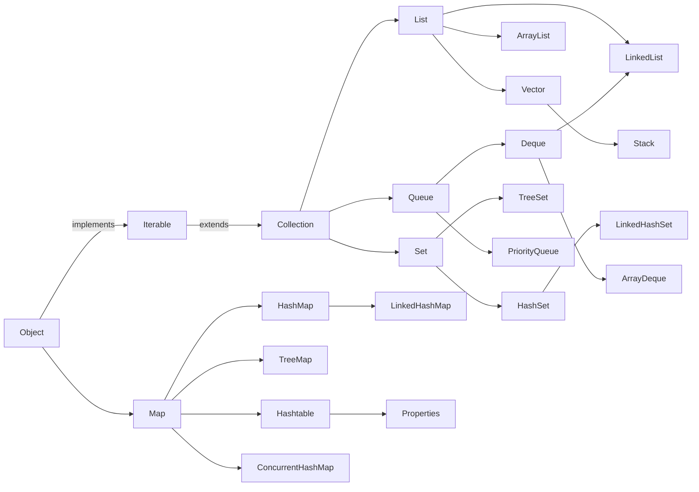

# Java、Kotlin、C++


## Java

### JVM

#### 描述一下Java创建栈变量和堆变量

栈变量：存在栈里，方法里的局部变量、基本类型、引用变量
堆变量：存在堆里，new 出来的对象、数组本身

#### StackOverFlow与OOM的区别？分别发生在什么时候，JVM栈中存储的是什么，堆存储的是什么？

StackOverflowError（栈溢出）：栈深度不够，方法调用层级太多（多出现在无线递归）
OutOfMemoryError（内存溢出）：堆 / 栈 / 方法区内存不够用，新对象分配不了内存

### Java基础

#### StringBuilder和StringBuffer的异同？

StringBuilder 快不安全，StringBuffer 慢但安全。

#### 什么是泛型？有什么作用？泛型擦除呢？

* 泛型：把类型当作参数传递，实现代码模板化

* 泛型擦除：
  * Java 泛型是伪泛型，编译阶段生效，编译后的字节码会抹去泛型信息，最终还原为原始类型（Raw Type）。
  * 目的：向前兼容 JDK5 之前无泛型的代码。
  * 带来的影响：
    * 不能用泛型类型创建实例：new T() 报错（编译后 T 变成 Object，语义不符）
    * 不能用 instanceof 判断泛型类型：obj instanceof List<String> 编译报错
    * 泛型数组受限：无法直接创建 T[] 数组
    * 重载冲突：test(List<String>) 和 test(List<Integer>) 编译报错，擦除后都是 test(List)

#### Java异常机制中，异常Exception与错误Error区别

* Error：JVM 系统级崩溃，程序处理不了，只能跑路
* Exception：代码逻辑问题，程序可以捕获、处理、修复

#### finally中的代码一定会执行吗？try里有return，finally还执行么？为什么 finally 里面绝对不能写 return？

* finally中的代码一定会执行吗？
  只有 3 种极端情况，finally 不会执行：（即便在try和catch中写return也会执行）
   - 在 try 之前就崩溃 / 返回（没进 try）
   - JVM 直接退出（System.exit(0)）
   - JVM 崩溃、断电、线程被强制杀死

* 为什么 finally 里面绝对不能写 return？

finally 里写 return，会覆盖 try /catch 里的 return，导致业务逻辑错乱、异常被吃掉！
```java
public static int test() {
    try {
        return 10;  // 本来要返回 10
    } finally {
        return 20;  // finally 强行 return，直接覆盖！
    }
}
```
结果返回：20


#### Java的泛型中super 和 extends 有什么区别？
extends 只读（取数据），super 可写（存数据）

```java
// extends
public void test_extends() {
    // 可以是 List<Animal>、List<Dog>、List<Cat>
    List<? extends Animal> list = new ArrayList<Dog>();

    // 读：可以！取出来是 Animal
    Animal a = list.get(0);

    // 写：不行！编译器报错
    list.add(new Dog());  // 报错
    list.add(new Animal()); // 报错
}

public void test_super() {
    // 可以是 List<Animal>、List<Object>
    List<? super Dog> list = new ArrayList<Animal>();

    // 写：可以！能加 Dog 及其子类
    list.add(new Dog());
    list.add(new SmallDog());

    // 读：只能用 Object 接收
    Object obj = list.get(0);
    Dog d = list.get(0); // 报错！
}
```

#### Java中有几种引用关系，它们的区别是什么？

* 强引用（Strong Reference）
* 软引用（Soft Reference）
* 弱引用（Weak Reference）: 只要发生 GC（无论内存是否充足），一定会回收弱引用关联的对象。
* 虚引用（Phantom Reference）: 和普通垃圾对象一致，GC 扫描到即可回收

```java
// 弱引用
WeakReference<Object> weakRef = new WeakReference<>(new Object());
Object obj = weakRef.get();

// 虚引用
ReferenceQueue<Object> queue = new ReferenceQueue<>();
PhantomReference<Object> ref = new PhantomReference<>(new Object(), queue);
```

#### Java IO 流了解吗？你的JNI的大JSON拷贝到Java层是怎么实现的？用什么接收JNI的数据？为什么这么做？

java.nio.DirectByteBuffer

```java
// 分配直接内存（你说的 OutBuffer）
ByteBuffer buffer = ByteBuffer.allocateDirect(1024 * 1024);

// 传给 JNI
nativeReadJson(buffer);
```

* 为什么要用 DirectByteBuffer？

  - 零拷贝 / 少拷贝（最重要）
  - 堆内存：JNI → Java 必须拷贝两次
  - DirectBuffer：JNI 直接访问内存地址，只拷贝一次


#### 讲讲OSS断点上传，断点续传，有用到Java IO吗？上传100G文件服务器内存只有16G是怎么处理避免OOM的？

##### OSS 断点上传、断点续传是什么？

断点续传 = 大文件分片上传 + 断点记录 + 失败恢复

- 把大文件切成固定大小的分片（一般 5MB、10MB）
- 每个分片独立上传
- 记录已上传成功的分片（checkpoint）
- 网络中断 / 程序重启后，跳过已上传分片，只传未完成的
- 全部传完后，OSS 服务端自动合并成完整文件

##### 有没有用到 Java IO？用到哪些？

主要用到：
* BufferedInputStream（缓冲字节流）
  - 本地文件分片读取
  - 高效、省内存
* NIO 的 ByteBuffer
  - 作为分片数据缓冲区
* FileChannel（可选）
  - 大文件随机读取

用 BIO 流式读取，用 NIO Buffer 做分片缓存，不一次性加载整个文件。

##### 上传100G文件客户端和服务器内存只有16G是怎么处理避免OOM的？

* 客户端
  - 不加载整个文件到内存，使用 Java IO 流式读取
  - 文件切成 固定大小分片（5MB/10MB）
  - 每次只读取 一个分片到内存，上传完成立即释放
  - 内存占用 永远只有一个分片大小，与文件大小无关
  - 用到：`BufferedInputStream`、`ByteBuffer`

* 服务端
  - 不把整个文件缓存到内存
  - 使用 流式接收，收到一点数据就立即写入磁盘 / OSS，不堆积
  - 服务端内存只保留 少量接收缓冲区
  - 绝对不使用字节数组 / 内存队列缓存整个大文件
  - 分片独立存储，最后合并索引，不移动真实数据
  - 用到：OutputStream、Socket 输入流、NIO Channel

客户端代码
```java
import java.io.BufferedInputStream;
import java.io.File;
import java.io.FileInputStream;
import java.nio.ByteBuffer;

public class OssUploadClient {
    public void uploadBigFile(File file) throws Exception {
        // 分片大小 10MB（关键：固定小内存）
        int partSize = 10 * 1024 * 1024;
        long fileLength = file.length();

        // 流式读取文件（不会加载整个文件）
        try (FileInputStream fis = new FileInputStream(file);
             BufferedInputStream bis = new BufferedInputStream(fis)) {

            byte[] partBytes = new byte[partSize];
            ByteBuffer buffer = ByteBuffer.wrap(partBytes);

            int readLen;
            int partNumber = 1;

            // 循环读分片（内存永远只占 10MB）
            while ((readLen = bis.read(partBytes)) != -1) {
                buffer.limit(readLen);
                // 上传当前分片到服务端/OSS
                uploadPart(partNumber, buffer);
                partNumber++;
            }
        }
    }

    private void uploadPart(int partNumber, ByteBuffer buffer) {
        // 发送分片：网络输出流写入
        // 内存只占用一个分片，用完即释放
    }
}
```

服务端：流式接收（不会 OOM）
```java
import java.io.InputStream;
import java.io.OutputStream;
import java.nio.ByteBuffer;
import java.nio.channels.FileChannel;

public class OssUploadServer {
    public void receiveBigFile(InputStream socketInput) throws Exception {
        int bufferSize = 10 * 1024 * 1024;
        byte[] buf = new byte[bufferSize];
        int len;

        // 从 Socket 流里边读边写（不缓存全文件）
        while ((len = socketInput.read(buf)) != -1) {
            // 直接写入磁盘/OSS，不存内存
            writeToDiskOrOss(buf, len);
        }
    }

    // NIO 版本（零拷贝，更高效）
    public void receiveWithNIO(InputStream input) throws Exception {
        FileChannel channel = FileChannel.open(/* 输出文件路径 */);
        ByteBuffer buffer = ByteBuffer.allocateDirect(10 * 1024 * 1024);

        while (input.read(buffer.array()) != -1) {
            channel.write(buffer);
            buffer.clear();
        }
    }

    private void writeToDiskOrOss(byte[] data, int len) {
        // 落盘 / 写入 OSS，不占用堆内存
    }
}
```

Android下载BIO
```java
// Android 断点下载 / 大文件下载 标准代码
public void downloadFile(InputStream inputStream, OutputStream outputStream) throws Exception {
    // 固定小缓冲区，永远只占 8KB ~ 10MB 内存
    byte[] buffer = new byte[8192]; 
    int length;

    // 边下载 边写入文件，绝不放内存
    // inputStream.read () 会阻塞; 没数据时，线程卡住不动，直到网络来数据
    while ((length = inputStream.read(buffer)) != -1) {
        outputStream.write(buffer, 0, length);
    }

    inputStream.close();
    outputStream.close();
}
```

Android下载NIO
```java
public void downloadWithNIO(InputStream input, OutputStream output) throws Exception {
    // 用 Channel + Buffer, 支持非阻塞、多路复用
    FileChannel inChannel = ((FileInputStream) input).getChannel();
    FileChannel outChannel = ((FileOutputStream) output).getChannel();

    ByteBuffer buffer = ByteBuffer.allocateDirect(8192);

    while (inChannel.read(buffer) != -1) {
        buffer.flip();
        outChannel.write(buffer);
        buffer.clear();
    }
}
```

#### BIO、NIO 和 AIO 的区别？

AIO: 废弃
BIO（Blocking IO）（阻塞 IO）：一个连接一个线程，等数据时线程死等、阻塞，不做别的事。
NIO（Non-blocking IO）（非阻塞 IO）：一个线程管理多个连接，不等数据，有数据才处理。


`inputStream.read(buffer)`会阻塞，`inChannel.read(buffer)`不会阻塞


### Java数据结构

#### ArrayList 和 Array（数组）的区别？
ArrayList 内部基于动态数组实现，比 Array（静态数组） 使用起来更加灵活

#### 简述ArrayList和LinkedList的区别？ArrayList 插入和删除元素的时间复杂度？LinkedList 插入和删除元素的时间复杂度？

##### 简述ArrayList和LinkedList的区别？

* 底层

ArrayList：动态数组（Object [] 数组）
LinkedList：双向链表（Node 节点）

* 访问 / 查询速度

ArrayList 快：支持随机访问，通过下标直接定位，O (1)
LinkedList 慢：必须从头 / 尾遍历查找，O (n)

* 增删效率
ArrayList 慢：中间增删需要移动元素，内存连续
LinkedList 快：只要改变节点引用，不用移动数据

* 内存占用
ArrayList：内存连续，占用少
LinkedList：每个节点多存 prev 和 next 指针，内存开销更大

##### ArrayList 插入和删除元素的时间复杂度？LinkedList 插入和删除元素的时间复杂度？

* ArrayList
头部插入：由于需要将所有元素都依次向后移动一个位置，因此时间复杂度是 O(n)。
尾部插入：当 ArrayList 的容量未达到极限时，往列表末尾插入元素的时间复杂度是 O(1)

* LinkedList
头部插入/删除：只需要修改头结点的指针即可完成插入/删除操作，因此时间复杂度为 O(1)。
尾部插入/删除：只需要修改尾结点的指针即可完成插入/删除操作，因此时间复杂度为 O(1)。

#### LinkedList 为什么不能实现 RandomAccess 接口？

RandomAccess 是一个标记接口，用来表明实现该接口的类支持随机访问（即可以通过索引快速访问元素）。
由于 LinkedList 底层数据结构是链表，内存地址不连续，只能通过指针来定位，不支持随机快速访问，
所以不能实现 RandomAccess 接口。

#### Java中怎么实现高效排序？Comparable 和 Comparator 的区别？

##### Java中怎么实现高效排序？

用 Collections.sort () / Arrays.sort ()，底层是优化的双轴快速排序（Dual-Pivot QuickSort）+ 归并排序，时间复杂度 O (n log n)，是 Java 官方最优排序。

##### Comparable 和 Comparator 的区别？

Comparable：侵入式，必须修改实体类

```java
public class User implements Comparable<User> {
    int age;
    @Override
    public int compareTo(User o) {
        return this.age - o.age; // 按年龄升序
    }
}
```

Comparator（外部比较器）
```java
public void sort() {
  Collections.sort(list, new Comparator<User>() {
    @Override
    public int compare(User o1, User o2) {
      return o1.getName().compareTo(o2.getName());
    }
  });
}
```

#### Queue 与 Deque 的区别？什么是 BlockingQueue？

Queue 是单端队列，先进先出。
Deque 是双端队列，两头都能进出，功能包含 Queue。
BlockingQueue 是阻塞队列，线程安全，满了阻塞写、空了阻塞读，主要用于并发、线程池、消息队列。

#### ArrayBlockingQueue 和 LinkedBlockingQueue 有什么区别？

* 底层结构不同
  Array：数组
  Linked：链表

* 容量不同
  Array：有界（必须指定容量，固定不变）
  Linked：有界 / 无界（不指定就是 Integer.MAX_VALUE，近似无界）

* 锁机制不同（最重要！）
  Array：一把锁，入队出队共用同一把锁，并发度低
  Linked：两把锁，put 锁、take 锁分离，并发度更高

#### HashMap 和 Hashtable 的区别？HashMap 和 HashSet 区别？HashMap 和 TreeMap 区别？HashSet 如何检查重复？

##### HashMap 和 Hashtable 的区别？

线程是否安全： HashMap 是非线程安全的，Hashtable 是线程安全的,因为 Hashtable 内部的方法基本都经过synchronized 修饰。
（如果你要保证线程安全的话就使用 ConcurrentHashMap 吧！）；效率：
因为线程安全的问题，HashMap 要比 Hashtable 效率高一点。另外，Hashtable 基本被淘汰，不要在代码中使用它；

##### HashMap 和 HashSet 区别？

看过 HashSet 源码的话就应该知道：HashSet 底层就是基于 HashMap 实现的。
（HashSet 的源码非常非常少，因为除了 clone()、writeObject()、readObject()是 HashSet 自己不得不实现之外，
其他方法都是直接调用 HashMap 中的方法。

HashSet可以去重

##### HashMap 和 TreeMap 区别？

TreeMap 和HashMap 都继承自AbstractMap ，但是需要注意的是TreeMap它还实现了NavigableMap接口和SortedMap 接口。

* HashMap
  * 查询效率：极高，平均时间复杂度 O(1)
  * 增删效率：快，O (1)
  * 排序能力：无内置排序
  * 遍历方式：无序遍历

* TreeMap
  * 查询效率：较低，时间复杂度 O(log n)
  * 增删效率：较慢，O (log n)（需维护树平衡）
  * 排序能力：天然支持排序（自然排序 / 自定义 Comparator）
  * 遍历方式：有序遍历

Key是有序是Integer

##### HashSet 如何检查重复？

HashSet 判断重复的逻辑，完全复用 HashMap 的去重规则。

* hashSet.add(Object obj) 时：
  * 第一步：调用 hashCode() 计算哈希值
    * 先执行当前对象的 hashCode() 方法，得到哈希码；
    * 根据哈希码计算出在底层 HashMap 数组中的存储下标
    * 若该下标位置没有任何元素：直接存入，判定不重复
  * 第二步：下标位置已有元素 → 调用 equals() 做内容比对
    * 哈希值相等（哈希冲突）
      * 再调用 equals() 方法，逐个比对对象内容
      * equals() == false：认为是不同对象，继续挂载；
      * equals() == true：判定元素重复，拒绝存入，add 方法返回 false。

为什么先判 hashCode 再判 equals？
- hashCode 是数字比较，效率极高；equals 往往是字段逐一对比，开销更大。
- 先通过哈希码快速过滤大部分不同元素，提升整体判断效率。

哈希冲突说明
- 不同对象也可能出现 hashCode 相同（哈希碰撞），所以不能只靠哈希码去重，必须补充 equals 校验。

```java
// 自定义实体类
class User {
    private int id;
    private String name;

    public User(int id, String name) {
        this.id = id;
        this.name = name;
    }

    // 重写 equals：按业务字段判断内容是否相同
    @Override
    public boolean equals(Object o) {
        if (this == o) return true;
        if (o == null || getClass() != o.getClass()) return false;
        User user = (User) o;
        return id == user.id && name.equals(user.name);
    }

    // 重写 hashCode：基于业务字段生成哈希码
    @Override
    public int hashCode() {
        return Objects.hash(id, name);
    }
}

// 测试去重
public class Test {
    public static void main(String[] args) {
        HashSet<User> set = new HashSet<>();
        User u1 = new User(1, "张三");
        User u2 = new User(1, "张三"); // 内容一致，新对象

        set.add(u1);
        boolean isAdd = set.add(u2); 
        // 输出 false：判定重复，添加失败
        System.out.println(isAdd);
    }
}
```

#### Java的equal重写的时候为什么要重写HashCode？

Object 默认的 hashCode 基于对象内存地址生成。
以 HashSet 为例，它的去重规则是先比较 hashCode，哈希码不同直接判定为不同对象；
哈希码相同时，再调用 equals 做内容比对。

如果只重写 equals、不重写 hashCode，会出现内容完全一致的两个对象，
内存地址不同、哈希码也不同，HashSet 会误判为两个独立对象，最终导致去重失效。

就比如HashSet的去重会先判断HashCode，冲突才会调用equal。
如果hashcode不重写，会直接导致HashSet去重失效。

#### 请解释一下HashMap的工作原理。HashMap 的底层实现？数据怎么存入Hash表，数据怎么从Hash表取出？时空复杂度是怎样的？

##### HashMap 的底层实现？

数组 + 单向链表 + 红黑树；

* 主体：哈希数组（桶数组），每个位置称为一个「桶 (bucket)」
* 链表：单个桶内元素较多时，用单向链表挂载冲突元素
* 红黑树：链表长度达到阈值，链表转为红黑树；元素减少再退化为链表

* 插入：计算哈希 → 确定桶下标 → 桶位置判断 → 链表 / 树挂载 → 树化判断 → 扩容判断
  - 首先计算 `key.hashCode()` 然后计算下标
  - 判断桶位置是否有值：
    - 没：直接插入
    - 有：发生哈希冲突，尝试挂在链表
  - 哈希冲突处理：挂载冲突元素
  - 冲突元素过多，挂在红黑树

* 获取：计算哈希 → 确定桶下标 → 桶位置判断 → 链表 / 树遍历

* 时空复杂度：
  * 正常情况（哈希分布均匀，冲突少）：put() / get() / remove()：平均 O (1)
  * 极端情况（大量哈希冲突）
    - 未树化（纯链表）：时间复杂度退化为 O(n)，需要遍历整条链表。
    - 已树化（红黑树）：时间复杂度稳定为 O(log n)，红黑树查找 / 增删效率远高于链表。
  * 空间复杂度 O(n)

* 树的查询是log n明显小于n，为什么不上来就用树，用链表干啥
  * 树要维护节点等，在n较小的时候空间复杂度较大，等到 n ≥ 8 之后树的优势才体现。

#### HashMap 的长度为什么是 2 的幂次方

为了用高效位运算替代取模运算计算数组下标，同时让元素分布更均匀、减少哈希冲突。下面分原理、推导、附加优势完整说明。

#### HashMap在多线程环境下出现死循环？在Java 7环境下，多线程操作HashMap可能导致CPU 100%，为什么？如何解决？

线程不安全，使用ConcurrentHashMap

#### ConcurrentHashMap 线程安全的具体实现方式/底层具体实现？

两层结构：Segment 数组 + 哈希桶数组 + 单向链表

把整个大哈希表拆分成 16 个独立分段（Segment）
不同分段的读写互不影响：操作哪个分段，就只给当前 Segment 加锁
最多支持 16 个线程同时并发写，并发度 = Segment 数量

#### ava中的数据结构一共有哪些？画一下继承树




## Kotlin

### 协程 vs 线程 / 协程是什么 /suspend 是什么

* 线程是 OS 层面的，由内核调度，重量级、开销大、切换成本高；
* 协程是语言 / 库层面的，由用户态调度，轻量级、开销极小
  - 协程就是 可挂起、可恢复的轻量级执行单元；

Java 启动 10 万个线程（直接 OOM）
```java
// Java 线程：重量级，几千个就崩溃
public static void main(String[] args) {
    for (int i=0; i<100000; i++) {
        new Thread(() -> {
            try { Thread.sleep(1000); } 
            catch (Exception e) {}
        }).start();
    }
}
```
Kotlin 协程 启动 10 万个协程（轻松运行）
```kotlin
// 协程：极轻量，千万个都不崩
fun main() = runBlocking {
    repeat(100_000) {
        launch { // 开启 10 万个协程
            delay(1000)
        }
    }
}
```

* 什么是 suspend 挂起函数？

suspend 是挂起函数的修饰符，只能在协程 / 其他挂起函数中调用；
挂起 = 不阻塞线程，线程被释放；

Java可以通过Runnable实现类似的功能，但是：
Runnable 只能执行完，不能中途暂停；协程可以中途暂停，之后再回来继续执行。
```java
Runnable r = new Runnable() {
    public void run() {
        // 一旦开始，必须跑完
        // 不能中途暂停
        task1();
        task2();
        task3();
    }
};
```

协程 suspend 函数（可暂停 + 可恢复）
```kotlin
suspend fun task() {
    task1()

    // 挂起！线程去干别的！
    delay(1000)

    // 恢复！继续执行
    task2()
}
```

### withContext / 异常处理 / Flow / 延迟初始化

* withContext () 用途？
  - 切换协程的调度器（线程）；
  - 必返回结果，是挂起函数；
  - 常用：
    - Dispatchers.IO → 网络、数据库
    - Dispatchers.Main → 主线程（Android）
    - Dispatchers.Default → CPU 密集、计算、FFmpeg 软解码、算法
    - Unconfined → 几乎不用

```kotlin
// IO密集型
suspend fun fetchData(): String {
    // 切换到 IO 线程
    return withContext(Dispatchers.IO) {
        // 网络请求 / 数据库
        "result"
    }
}
// CPU密集型
suspend fun decoder(): Boolean {
    return withContext(Dispatchers.Default) {
        // FFmpeg 软解码（纯计算）返回解码成功结果
        ffmpeg.decode(h264Data)
    }
}
```

* 协程如何处理异常？

  - 结构化异常处理：
    - try-catch 直接捕获
    - CoroutineExceptionHandler 全局捕获
    - launch 异常自动向上传播

  - async 必须在 await 时捕获
  - 父协程异常 → 子协程全部取消
  - 子协程异常 → 父协程取消

````kotlin
// try-catch 捕获
launch {
    try {
        fetchData()
    } catch (e: Exception) {
        // 处理异常, 协程外部无法处理
    }
}

// 全局异常捕获器：文件存储失败统一处理
val saveFileHandler = CoroutineExceptionHandler { coroutineContext, throwable ->
    // 异常处理：权限不足、磁盘满、路径错误
    Log.e("File", "保存失败：${throwable.message}")
    Toast.makeText(context, "聊天记录保存失败", Toast.LENGTH_SHORT).show()
}

// 协程：保存 SSE 收到的AI回复到文件
lifecycleScope.launch(Dispatchers.IO + saveFileHandler) {
    val content = aiTextView.text.toString()
    saveChatRecordToFile(content) // 可能崩溃
}

// 挂起函数：保存文件
suspend fun saveChatRecordToFile(content: String) {
    // 模拟异常：权限不足
    throw IOException("SD卡不可写，无权限")
}

// launch 异常自动向上传播
launch(handler) { }
````

### Kotlin 协程中的 Flow 是什么？

Flow 是协程的异步数据流，冷流、轻量、安全，专门处理连续异步数据。

eg: 处理AI的SSE流式回复；跟Flutter的Stream很像

```kotlin
// 模拟：SSE 流式接收 AI 回复（一段一段发数据）
fun aiChatSSE(message: String): Flow<String> = flow {
    // 1. 开始请求
    emit("AI思考中...")

    // 模拟SSE流式返回：来一段发一段
    val aiReplyList = listOf(
        "你", "好", "，", "我", "是", "AI",
        "，", "很", "高", "兴", "为", "你", "服", "务！"
    )

    for (word in aiReplyList) {
        delay(200) // 模拟网络流延迟
        emit(word) // 🔥 一段一段发数据
    }
}

// 使用：一段一段收数据（打字机效果）
lifecycleScope.launch {
    aiChatSSE("你好！").collect { word ->
        // 🔥 一段一段收数据，实时更新UI
        aiTextView.append(word)
    }
}
```

### Kotlin与Java中伴生对象和静态成员有什么区别？

Java static 是 JVM 级静态；Kotlin 伴生对象是单例对象，功能更强，可继承可扩展，`@JvmStatic` 可兼容 Java 静态行为。

```kotlin
class Test{
    companion object { @JvmStatic val a = 1 }
}
```

### kotlin的`==`和`===`的区别

* `==` 等于 Java 的 `equals ()`：比较内容
* `===` 等于 Java 的 `==` ：比较对象地址（引用）


