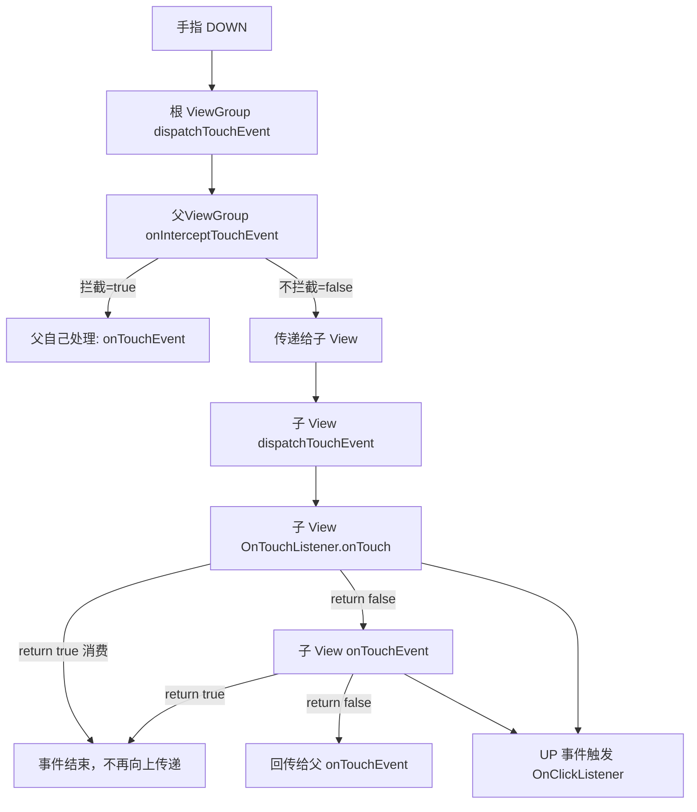
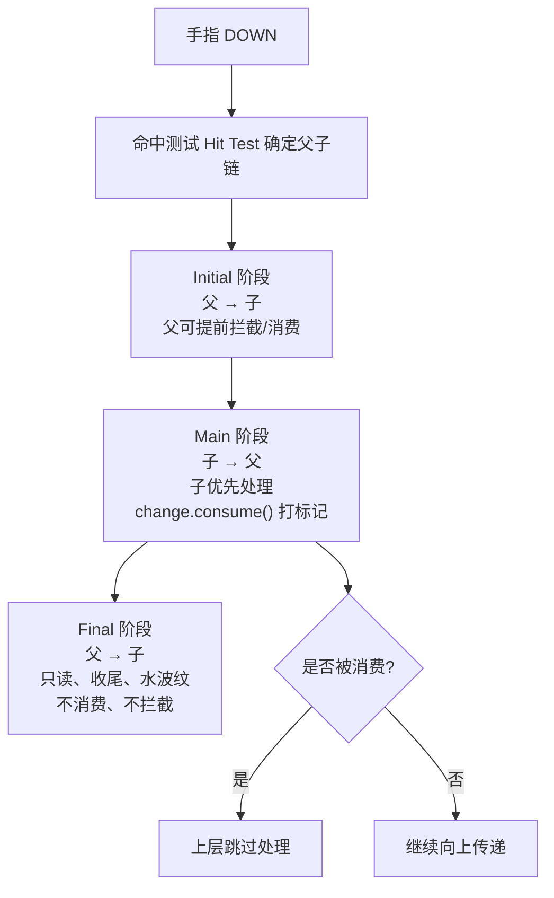

# UI：Flutter（Dart）、Jetpack Compose

## flutter

### flutter的StatefulWidget和StatelessWidget区别是什么？怎么选择？
StatelessWidget（无状态组件）：界面一旦渲染，就再也不会变
StatefulWidget（有状态组件）：界面会根据数据变化自动刷新

需要自己思考什么是不可变的，其实StatelessWidget有时候拓展性太弱了，
比如说我开发微信demo，现在如果发送消息气泡，不会变这里是合理的。
但是过两天产品说消息气泡要读了之后显示已读，并且消息要可让用户编辑，
那就只能无奈重构StatefulWidget

虽然是否已读能根据父级传递`isReed`来改变，但是要让用户编辑消息内容的话，
就会出现需要重新绘制气泡大小，这个是`StatelessWidget`无法实现的。
它只能切换，不能重绘。

真的是牛魔的这个玩意

### 怎么实现一个flutter自定义view？自定义列表呢？列表的item不同呢？

自定义view
```dart
import 'package:flutter/material.dart';

// 你要的：可编辑 + 已读状态 → 只有 Stateful
class MessageBubble extends StatefulWidget {
  final String initialText;
  final bool isMe;
  final bool isRead; // 已读状态

  const MessageBubble({
    super.key,
    required this.initialText,
    required this.isMe,
    required this.isRead,
  });

  @override
  State<MessageBubble> createState() => _MessageBubbleState();
}

class _MessageBubbleState extends State<MessageBubble> {
  late TextEditingController _controller;

  @override
  void initState() {
    super.initState();
    // 初始化编辑框文字
    _controller = TextEditingController(text: widget.initialText);
  }

  @override
  Widget build(BuildContext context) {
    return Align(
      alignment: widget.isMe ? Alignment.centerRight : Alignment.centerLeft,
      child: Container(
        margin: const EdgeInsets.symmetric(vertical: 6, horizontal: 12),
        padding: const EdgeInsets.symmetric(horizontal: 16, vertical: 12),
        decoration: BoxDecoration(
          color: widget.isMe ? Colors.green[100] : Colors.grey[200],
          borderRadius: BorderRadius.circular(18),
        ),
        child: Column(
          crossAxisAlignment: CrossAxisAlignment.end,
          children: [
            // 可编辑文本（自动换行、自动调整气泡大小）
            TextField(
              controller: _controller,
              maxLines: null,
              style: const TextStyle(fontSize: 16),
              decoration: const InputDecoration(
                isDense: true,
                border: InputBorder.none,
              ),
              onChanged: (value) {
                setState(() {}); // 实时刷新气泡大小
              },
            ),

            const SizedBox(height: 4),

            // 已读 / 未读 状态（只有自己发的才显示）
            if (widget.isMe)
              Text(
                widget.isRead ? "已读" : "未读",
                style: const TextStyle(
                  fontSize: 11,
                  color: Colors.grey,
                ),
              ),
          ],
        ),
      ),
    );
  }

  @override
  void dispose() {
    _controller.dispose();
    super.dispose();
  }
}
```
列表
```dart
ListView.builder(
  itemCount: 10,
  itemBuilder: (context, index) {
    return MessageBubble(
      initialText: "这是可编辑消息 $index",
      isMe: index % 2 == 0,
      isRead: true, // 控制已读未读
    );
  },
)
```

### Dart 的单线程模型是如何运行的？

* 主线程（一个人干活）
* MicroTask 队列（微任务队列，超级优先）
* Event 队列（事件队列，普通优先）

微队列（MicroTask）
 Future.microtask(() {})
 优先级最高，会插队

事件队列（Event）
 Future(() {})
 网络请求
 定时器 Timer
 点击、滑动等 UI 事件
 图片 IO
 所有 “异步” 操作

Dart其实就是类似Android的`HandlerThread`

#### 那 Dart 异步（async/await）是什么？

就是 Handler.post(runnable)
完全一样：把任务放进队列，等主线程空闲再执行。

```dart
// Dart
Future(() {
  print("异步任务");
});

// 等价 Android
handler.post(new Runnable() {
  @Override
  public void run() {
    System.out.println("异步任务");
  }
});
```

### 讲讲await for 与 stream流？Stream 与 Future是什么关系？Stream 有哪两种订阅模式？分别是怎么调用的？

#### Stream 与 Future 是什么关系？

```text
Future = 只会返回 1 次数据（异步单值）
1 个	网络请求、延时、一次结果	    async/await
Stream = 会返回 N 次数据（异步多值）
多个	    聊天消息、进度条、位置、事件流	await for、listen()
```

Stream = 一条管道，源源不断地流出数据

#### 什么是 await for？

监听 Stream，每来一条数据就执行一次

while + 等待 + 接收数据

```dart
// 创建一个流：每秒发射一个数字
Stream<int> counterStream() async* {
  for (int i = 1; i <= 5; i++) {
    await Future.delayed(Duration(seconds: 1));
    yield i; // 流出一个数据
  }
}

// await for 监听流
void listenStream() async {
  await for (int value in counterStream()) {
    print("收到：$value"); // 每秒执行一次
  }
  print("流关闭");
}
```

#### Stream 两种订阅模式

1) Single-subscription（单订阅）
   默认模式，一个 Stream 只能被监听 1 次
   ```dart
    // 1. 创建单订阅流
    final stream = Stream.fromIterable([1,2,3]);
    
    // 2. 监听一次 ✅
    stream.listen((data) => print(data));
    
    // 3. 再次监听 ❌ 报错！
    // stream.listen(...) → 崩溃
   ```
2) Broadcast（广播模式）
   可以被多人监听，N 个 listen () 都可以
   ```dart
    // 1. 创建广播流
    final broadcastStream = StreamController<int>.broadcast().stream;
    
    // 或者把普通流转成广播
    // final broadcast = stream.asBroadcastStream();
    
    // 2. 监听 1 ✅
    broadcastStream.listen((data) => print("监听1：$data"));
    
    // 3. 监听 2 ✅
    broadcastStream.listen((data) => print("监听2：$data"));
   ```    

#### AI开发中的使用

先定义消息模型：
```dart
class ChatMessage {
  final String content;
  final bool isMe;
  final bool isLoading; // 是否正在流式输出

  ChatMessage({
    required this.content,
    required this.isMe,
    this.isLoading = false,
  });
}
```

网络服务层（核心：Future + Stream + SSE）

```dart
import 'dart:async';
import 'dart:convert';
import 'package:http/http.dart' as http;

class ChatService {
  // ------------------------------
  // 1. Future：一次性加载历史消息
  // ------------------------------
  Future<List<ChatMessage>> getHistoryMessages() async {
    await Future.delayed(const Duration(seconds: 1)); // 模拟网络请求

    return [
      ChatMessage(content: "你好！", isMe: true),
      ChatMessage(content: "我是AI助手", isMe: false),
    ];
  }

  // ------------------------------
  // 2. Stream + SSE：流式获取AI回复
  // ------------------------------
  Stream<String> sendMessageStream(String question) async* {
    final uri = Uri.parse("http://你的SSE接口地址:8080/ai/chat");
    
    final request = http.Request("GET", uri)
      ..headers["Accept"] = "text/event-stream";

    final response = await request.send();

    // 监听SSE流（逐字返回）
    await for (final chunk in response.stream.transform(utf8.decoder)) {
      yield chunk; // 不断吐出文字
    }
  }
}
```

### Flutter中的Widget、State、Context 的核心概念？是为了解决什么问题？

* Widget = 界面配置（蓝图）
* State = 界面数据（状态）
* Context = 组件位置 / 环境（上下文）

### Widget 唯一标识Key是做什么用的？

用来确定viewTree的位置，如果没有 Key → 消息头像、文字、已读状态可能错乱

```dart
ListView.builder(
  itemCount: messages.length,
  itemBuilder: (context, index) {
    final msg = messages[index];
    return MessageBubble(
      // 👇 这就是给消息一个唯一ID
      key: ValueKey(msg.id), // 消息ID 作为唯一标识
      text: msg.text,
      isMe: msg.isMe,
    );
  },
)
```

### Flutter中没有ViewModel是怎么实现State通知UI更新变化的？你能完整的描述Flutter中怎么使用MVI设计模式吗？

#### Flutter中没有ViewModel是怎么实现State通知UI更新变化的？

不用Livedata或者Sharedflow可以使用ChangeNotifier

#### Flutter实现MVI

* UiIntent 行为意图
* UiState 页面唯一状态
* UiEvent 一次性事件（Toast / 跳转）
* MviViewModel 业务核心
* Page UI 渲染

代码实现

* UiIntent（用户意图）
```dart
/// 页面行为意图（完全对应你写的 sealed class）
sealed class InputUiIntent {
  const InputUiIntent();

  /// 输入框文字变化
  factory InputUiIntent.textChanged(String text) = TextInputChanged;

  /// 加载网络数据
  factory InputUiIntent.loadNetData() = LoadNetData;
}

class TextInputChanged extends InputUiIntent {
  final String text;
  TextInputChanged(this.text);
}

class LoadNetData extends InputUiIntent {}
```

* UiState（页面唯一状态）
```dart
/// 页面UI状态（唯一数据源）
class InputUiState {
  final String inputText;
  final bool isLoading;

  InputUiState({
    this.inputText = "",
    this.isLoading = false,
  });

  /// 对应 Kotlin copy()
  InputUiState copy({
    String? inputText,
    bool? isLoading,
  }) {
    return InputUiState(
      inputText: inputText ?? this.inputText,
      isLoading: isLoading ?? this.isLoading,
    );
  }
}
```

* UiEvent（一次性事件：Toast / 弹窗 / 跳转）
```dart
/// 一次性事件
sealed class InputUiEvent {
  const InputUiEvent();

  factory InputUiEvent.showToast(String msg) = ShowToast;
}

class ShowToast extends InputUiEvent {
  final String msg;
  ShowToast(this.msg);
}
```

* MviViewModel（核心：状态管理 + 业务逻辑）

这里用 Stream 实现 StateFlow
```dart
import 'dart:async';

class InputMviViewModel {
  // --------------------------
  // 1. 页面状态 StateStream
  // 对应：MutableStateFlow
  // 特征：有缓存、新订阅者收到最新状态、单订阅
  // --------------------------
  final _uiStateController = StreamController<InputUiState>(); // ✅ 去掉 broadcast
  InputUiState _currentState = InputUiState();

  Stream<InputUiState> get uiState => _uiStateController.stream; // 只读
  InputUiState get currentState => _currentState;

  // --------------------------
  // 2. 一次性事件 EventStream
  // 对应：MutableSharedFlow
  // 特征：无缓存、多订阅、一次性事件
  // --------------------------
  final _uiEventController = StreamController<InputUiEvent>.broadcast(); // ✅ 保留 broadcast

  Stream<InputUiEvent> get uiEvent => _uiEventController.stream; // 只读

  // --------------------------
  // 3. 接收 Intent
  // --------------------------
  void sendIntent(InputUiIntent intent) {
    switch (intent) {
      case TextInputChanged():
        _handleTextChanged(intent.text);
      case LoadNetData():
        _handleLoadNetData();
    }
  }

  // 处理输入文字
  void _handleTextChanged(String newText) {
    _currentState = _currentState.copy(inputText: newText);
    _uiStateController.add(_currentState);
  }

  // 处理网络加载
  Future<void> _handleLoadNetData() async {
    // 加载中
    _currentState = _currentState.copy(isLoading: true);
    _uiStateController.add(_currentState);

    // 模拟网络请求
    await Future.delayed(const Duration(seconds: 1));
    final netText = "来自网络的默认文本";

    // 更新状态
    _currentState = _currentState.copy(
      inputText: netText,
      isLoading: false,
    );
    _uiStateController.add(_currentState);

    // 发送一次性事件 Toast
    _uiEventController.add(InputUiEvent.showToast("网络数据加载完成"));
  }

  // 关闭流
  void dispose() {
    _uiStateController.close();
    _uiEventController.close();
  }
}
```

* Flutter UI 层（View）

```dart
import 'package:flutter/material.dart';
import 'package:flutter/services.dart';

class InputMviPage extends StatefulWidget {
  const InputMviPage({super.key});

  @override
  State<InputMviPage> createState() => _InputMviPageState();
}

class _InputMviPageState extends State<InputMviPage> {
  final InputMviViewModel viewModel = InputMviViewModel();

  @override
  void initState() {
    super.initState();
    // 监听一次性事件 UiEvent
    _listenUiEvent();
  }

  /// 监听 Toast/跳转等事件
  void _listenUiEvent() {
    viewModel.uiEvent.listen((event) {
      if (event is ShowToast) {
        ScaffoldMessenger.of(context).showSnackBar(
          SnackBar(content: Text(event.msg)),
        );
      }
    });
  }

  @override
  Widget build(BuildContext context) {
    return Scaffold(
      appBar: AppBar(title: const Text("Flutter MVI 示例")),
      body: Padding(
        padding: const EdgeInsets.all(20),
        child: StreamBuilder<InputUiState>(
          stream: viewModel.uiState,
          initialData: viewModel.currentState,
          builder: (context, snapshot) {
            final uiState = snapshot.data!;

            return Column(
              children: [
                // 加载动画
                if (uiState.isLoading)
                  const CircularProgressIndicator(),

                const SizedBox(height: 20),

                // 输入框
                TextField(
                  controller: TextEditingController.fromValue(
                    TextEditingValue(text: uiState.inputText),
                  ),
                  decoration: const InputDecoration(
                    labelText: "MVI 输入框",
                    border: OutlineInputBorder(),
                  ),
                  onChanged: (text) {
                    // 发送 Intent
                    viewModel.sendIntent(InputUiIntent.textChanged(text));
                  },
                ),

                const SizedBox(height: 10),

                // 按钮
                ElevatedButton(
                  onPressed: () {
                    viewModel.sendIntent(InputUiIntent.loadNetData());
                  },
                  child: const Text("加载网络数据"),
                ),
              ],
            );
          },
        ),
      ),
    );
  }

  @override
  void dispose() {
    viewModel.dispose();
    super.dispose();
  }
}
```


##### 核心代码解释

* StreamController是做什么用的？

用来广播InputUiState，Stream<InputUiState>就是对状态更变的不断接收，所以view能直接自动更新。
StreamController相当于MutableStateFlow是存储型（有缓存）

* 核心比对
1. `StreamController`相当于`MutableStateFlow`是存储型（有缓存）
2. `StreamController.stream`相当于`StateFlow`对外只读。相当于保证了单项数据流
3. `StreamController.broadcast()`相当于`MutableSharedFlow`。是不存储、多订阅、一次性事件
4. `broadcast.stream`相当于`SharedFlow`对外只读


`stream`流代表只读，`broadcast`广播代表不存储


## Jetpack Compose

### XML重构成Jetpack Compose和flutter你是怎么做的？

* RecyclerView → LazyColumn
* SwipeRefreshLayout → PullToRefreshBox
* 自定义view → @Composable组合函数
* Activity → 单一Activity + NavHost + NavController
* 设计模式改为MVI单项数据流

### DisposableEffect、SideEffect、LaunchedEffect之间的区别？

首先理解UI重组：
```kotlin
// 或者collectAsStateWithLifecycle
val uiState by viewModel.uiState.collectAsState()
```
只要uiState更新，就会触发UI重组

* SideEffect：同步副作用，每次重组都执行，无键值，不延迟

可以用来调试UI是否重组了
```kotlin
SideEffect {
    // 每次重组都执行
    Log.d("compose", "重组了")
}
```


* LaunchedEffect：异步副作用，启动协程，可键值重启

MVI 中收集 UiEvent
```kotlin
// 或者key不填写，直接用Unit
LaunchedEffect(key1 = viewModel) {
    // 异步
    viewModel.uiEvent.collect { event ->
        // 处理事件
    }
}
```

* DisposableEffect：需要销毁 / 释放资源的副作用，有清理回调

需要在组件离开时清理 / 释放资源的副作用

例子：播放音频，播放完成之后需要清理资源

```kotlin
@Composable
fun AudioPlayPage(viewModel: AudioViewModel = viewModel()) {
    val context = LocalContext.current

    // ======================================
    // ✅ 音频播放器：创建 + 释放 放在这里
    // ======================================
    val player = remember {
        ExoPlayer.Builder(context).build()
    }

    DisposableEffect(Unit) {
        // 进入时：什么都不做，等待播放指令

        // 退出时：必须释放！！！
        onDispose {
            player.release() // 关键：销毁资源
        }
    }

    // ======================================
    // 监听 UI State（触发播放）
    // ======================================
    val uiState by viewModel.uiState.collectAsStateWithLifecycle()

    LaunchedEffect(uiState.playUrl) {
        if (uiState.playUrl.isNotEmpty()) {
            // 开始播放
            val item = MediaItem.fromUri(uiState.playUrl)
            player.setMediaItem(item)
            player.prepare()
            player.play()
        }
    }

    // ======================================
    // UI
    // ======================================
    Column(modifier = Modifier.fillMaxSize()) {
        Button(onClick = {
            // 发送意图：开始播放
            viewModel.sendIntent(AudioIntent.PlayAudio("http://xxx.mp3"))
        }) {
            Text("播放音频")
        }
    }
}
```

### pointer事件在各个Composable function之间是如何处理的？

事件是按「命中测试 → 三阶段分发 → 消费标记」在各个 Composable 之间流转的，父子之间靠 Modifier 链传递，消费不会截断流程，只会打标记

路径上的每个组件都会收到事件，分 Initial → Main → Final 三轮：

* Initial（捕获，父→子）
简单说就是看pointer点击在哪里了，从最大的开始往小聚拢

* Main（冒泡，子→父）
就是从子到父看看应该谁消费，做标记

* Final（收尾，父→子）
收尾、观察、复盘

传统 View 消费就截断；Compose 消费不截断，只是打 “已消费” 标记，三阶段照样走完。

#### 对比XML的MotionEvent分发机制OnTouchListener & OnTouchEvent & OnClickListener

| 阶段                       | Compose Pointer 事件 | 传统 XML View (MotionEvent)                            | 对应回调         |
|--------------------------|--------------------|------------------------------------------------------|--------------|
| 1. 父优先拦截                 | Initial (父 → 子)    | ViewGroup.dispatchTouchEvent / onInterceptTouchEvent | 父亲先看，想拦就拦    |
| 2. 子优先处理                 | Main (子 → 父)       | OnTouchListener → onTouchEvent                       | 子先消费，父亲后处理   |
| 3. 事件消费                  | change.consume()   | return true                                          | 事件被吃掉，不再传递   |
| 4. 点击触发                  | clickable / tap    | OnClickListener                                      | 事件消费后最终回调    |

XML下发，父递归便利UI树


Compose下发



### 在 Android 上，当一个 Flow 被 collectAsState，应用转入后台时，如果这个 Flow 再进行更新，对应的 State 会不会更新？对应的 Composable 函数会不会更新？

* collectAsState 不感知声明周期
  应用切后台 → Flow 继续收、State 会更新、Composable 会重组（即使不可见）

* collectAsStateWithLifecycle
  - 应用切后台（Activity/Fragment STOPPED）→ 自动暂停收集
    - Flow 有新值也不会更新 State
    - 不会触发 Composable 重组
  - 切回前台（STARTED）→ 恢复收集，补发期间最新值

不过补充：`collectAsStateWithLifecycle`是Android专属，KMP跨平台必须使用`collectAsState`
