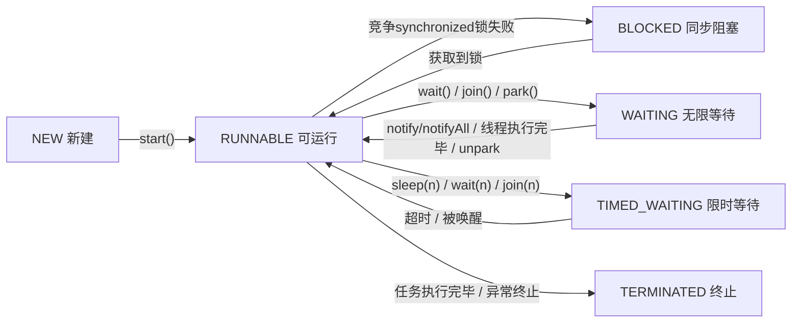
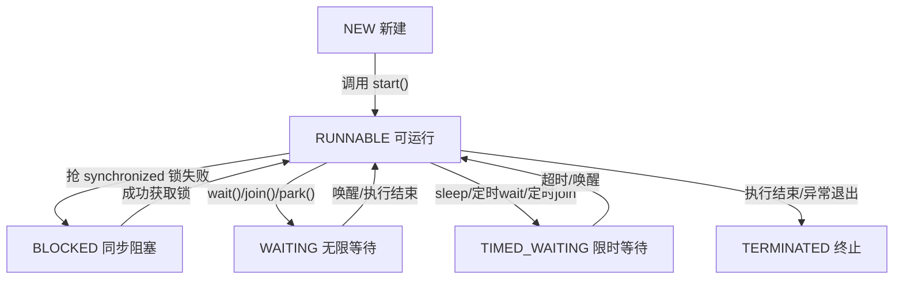

# 操作系统

#### 说说线程的生命周期和状态?

顺便一提：底层是操作系统内核线程被挂起，但 JVM 层面不感知；
即便是kotlin的suspend也是线程内部的协程级别的挂起。

#### 分段机制、分页机制描述一下

前置基础：虚拟地址 & 物理地址

分页、分段，本质都是把虚拟地址翻译成物理地址的内存管理方式，解决内存分配、碎片、权限、地址隔离问题。

* 分段机制（Segmentation）
  - 把进程的逻辑地址空间，按照程序逻辑模块划分为若干段。

* 分页机制（Paging）
  - 把虚拟地址空间和物理内存，都固定大小划分为一个个页（Page） / 页框（Page Frame，物理页）

* JNI层直接new一个100MB的空间失败，而且用largeHeap也失败:
  - 进程虚拟内存存在大量外部碎片，没有连续的 100MB 空闲地址区间，所以分配大块连续内存失败；largeHeap 只是放大堆总上限，解决不了「连续空间不足」的问题。

