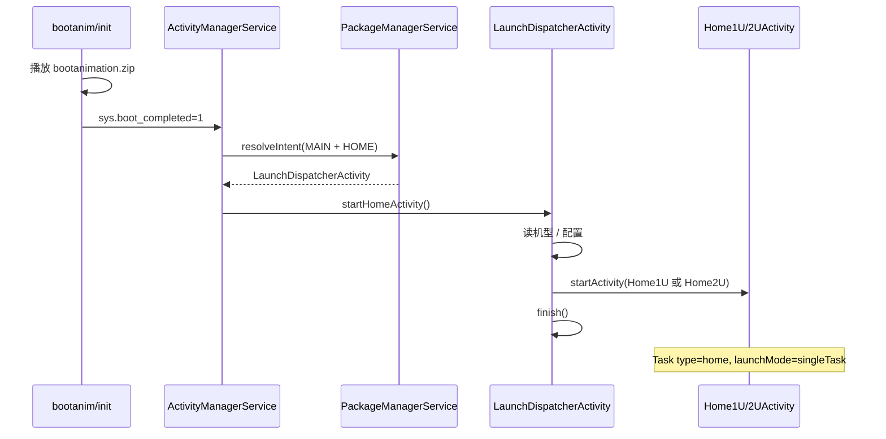

# Android Framework 定制探索 — 前面板 Kiosk 实现方案

> - **实机参考**：`192.168.1.10`（a4k_mid / Android 9 / RK，`com.clt.frontPanel` / X100Touch）  
> - **新前面板源码**：`com.clt.ca20touch`（CA20Touch，RK3588 / MIPI 目标）  
> - **架构**：香橙派 RK3588 + MIPI 屏，**core APK + panel APK**

---

## 1. 结论先行

| 能力 | X100Touch 实机（旧） | CA20Touch 源码（新） | 主要靠什么 | adb 能否持久配置 |
|------|---------------------|----------------------|------------|------------------|
| 定制开机动画 | `bootanimation.zip` | 同左（ROM 级） | **ROM 固件** | 否 |
| 开机默认进前面板 | `MainActivity` = HOME | `LaunchDispatcherActivity` = HOME | **Manifest + PMS + AMS** | 部分 |
| 禁止返回退出 | `BaseActivity` + `BACK` Intent | `StandbyActivity` + 代码层（待实现） | **应用代码** | 否 |
| 禁止下拉状态栏 | ROM 无 SystemUI | 同策略：ROM 裁剪 | **ROM 裁剪** | 部分 |

**不是**通过运行时反复 `adb shell am/wm/pm` 设置的；核心是：

1. **ROM 级**：bootanimation、裁剪 SystemUI/Launcher3  
2. **Manifest 级**：`HOME` + `android.uid.system`  
3. **应用级**：空闲回主页、屏保（`StandbyActivity`）、返回键拦截  

### 1.1 两代前面板对照

| 项目 | X100Touch（实机反编译） | CA20Touch（源码 Manifest） |
|------|------------------------|---------------------------|
| 包名 | `com.clt.frontPanel` | `com.clt.ca20touch` |
| HOME 入口 | `MainActivity`（直接主页） | `LaunchDispatcherActivity`（分发器） |
| 主页 | 单一 `MainActivity` | `Home1UActivity` / `Home2UActivity`（按机型） |
| 屏保 | `ScreenProtectActivity` | `StandbyActivity` |
| 开机广播 | `BootCompleteReceiver`（空）+ `X100StartReceiver` | **无 Receiver**，纯 HOME 启动 |
| 返回处理 | 自定义 `android.intent.action.BACK` | Manifest 未声明，靠代码 + `enableOnBackInvokedCallback` |
| 系统设置 | 内置 `SettingActivity` 等 | `SystemSettings1U/2UActivity` |
| launchMode | `singleTop` | HOME 默认 + 主页 `singleTask` |

---

## 2. 现有设备架构（192.168.1.10）

### 2.1 系统应用清单

```
/system/priv-app/
├── X100Touch/          → com.clt.frontPanel（前面板，兼 Launcher）
├── iJetty/             → org.mortbay.ijetty（Web 服务，core 角色）
├── cross/              → com.clt.cross
├── Settings/           → com.android.settings（无桌面入口）
└── （无 SystemUI、无 Launcher3）
```

### 2.2 双 APK 职责对照

| 角色 | 现网包（a4k） | 新前面板（CA20Touch） | 特征 |
|------|--------------|----------------------|------|
| **panel** | `com.clt.frontPanel` | `com.clt.ca20touch` | `HOME` Launcher、主页、屏保、系统设置 |
| **core** | `org.mortbay.ijetty` | （你的 core APK） | 仅 `Service` + `BootCompleted`，**不声明 HOME** |

### 2.3 CA20Touch Activity 结构（源码 Manifest）

```
LaunchDispatcherActivity          ← HOME / LAUNCHER 入口（AMS 开机启动）
    ├── Home1UActivity            ← 1U 机型主页（singleTask）
    ├── Home2UActivity            ← 2U 机型主页（singleTask）
    ├── SystemSettings1UActivity
    ├── SystemSettings2UActivity
    ├── StandbyActivity           ← 屏保（singleTask, noHistory, excludeFromRecents）
    └── BeaconActivity            ← 信标/辅助全屏页（同上）
```

预装建议：`/system/priv-app/CA20Touch/CA20Touch.apk`

参考 iJetty Manifest（core 不做 Launcher）：

```xml
<!-- Activity 的 LAUNCHER 被注释，仅保留 Service -->
<service android:name=".IJettyService" android:exported="true"/>
<receiver android:name="com.color.c1s.web.app.BootCompleteReceiver">
    <intent-filter>
        <action android:name="android.intent.action.BOOT_COMPLETED" />
    </intent-filter>
</receiver>
```

---

## 3. 开机动画（Boot Animation）

### 3.1 现有实现

| 项目 | 值 |
|------|-----|
| 文件 | `/system/media/bootanimation.zip`（约 13.4MB） |
| 分辨率 | `1024 x 600`（与前面板屏一致） |
| 帧率 | 60 fps，600 张 PNG |
| desc.txt | `1024 600 60` + `c 0 0 part0` |
| 启动 | `bootanim.rc` → `/system/bin/bootanimation` |

与 X100Touch **无关**，属于固件镜像资源。

### 3.2 RK3588 / MIPI 屏实施

1. 用 MIPI 屏真实分辨率制作 `bootanimation.zip`（如 `800 1280 30`）  
2. 在 ROM 编译树放入 `device/xxx/media/bootanimation.zip` 或 `PRODUCT_COPY_FILES`  
3. 验证：`adb shell getprop service.bootanim.exit`（1 表示播完）

```bash
# 查看当前动画配置
adb shell ls -la /system/media/bootanimation.zip
adb pull /system/media/bootanimation.zip
# 解压查看 desc.txt 和 part0/*.png
```

---

## 4. 开机默认启动 Panel（Launcher 机制）

### 4.1 CA20Touch Manifest（源码，RK3588 目标）

包名 `com.clt.ca20touch`，`android:sharedUserId="android.uid.system"`。

```xml
<manifest package="com.clt.ca20touch"
    android:sharedUserId="android.uid.system">

    <uses-permission android:name="android.permission.READ_EXTERNAL_STORAGE" />
    <uses-permission android:name="android.permission.WRITE_EXTERNAL_STORAGE" />
    <uses-permission android:name="android.permission.INTERNET" />
    <uses-permission android:name="android.permission.ACCESS_NETWORK_STATE" />
    <uses-permission android:name="com.clt.mediaserver.service.permission" />

    <application
        android:name=".App"
        android:enableOnBackInvokedCallback="true"
        android:usesCleartextTraffic="true"
        ...>

        <!-- ★ HOME 入口：分发器，非直接进主页 -->
        <activity android:name=".features.LaunchDispatcherActivity"
                  android:exported="true">
            <intent-filter>
                <action android:name="android.intent.action.MAIN" />
                <category android:name="android.intent.category.HOME" />
                <category android:name="android.intent.category.LAUNCHER" />
                <category android:name="android.intent.category.DEFAULT" />
            </intent-filter>
        </activity>

        <!-- 主页：按 1U / 2U 机型分流，由 LaunchDispatcher 跳转 -->
        <activity android:name=".features.home.ui.activity.Home2UActivity"
                  android:launchMode="singleTask" android:exported="true" />
        <activity android:name=".features.home.ui.activity.Home1UActivity"
                  android:launchMode="singleTask" android:exported="true" />

        <!-- 系统设置（内置，不依赖 com.android.settings 桌面入口） -->
        <activity android:name=".features.systemsettings.ui.activity.SystemSettings2UActivity" ... />
        <activity android:name=".features.systemsettings.ui.activity.SystemSettings1UActivity" ... />

        <!-- 屏保：对应旧版 ScreenProtectActivity -->
        <activity android:name=".features.standby.ui.activity.StandbyActivity"
                  android:exported="false"
                  android:excludeFromRecents="true"
                  android:launchMode="singleTask"
                  android:noHistory="true" />

        <activity android:name=".features.beacon.BeaconActivity"
                  android:exported="false"
                  android:excludeFromRecents="true"
                  android:launchMode="singleTask"
                  android:noHistory="true" />
    </application>
</manifest>
```

**与 X100Touch 的关键差异：**

| 点 | CA20Touch | 说明 |
|----|-----------|------|
| 无 `BootCompleteReceiver` | 开机只靠 HOME | 更简洁，AMS 直接 `startHomeActivity()` |
| 无 `X100StartReceiver` / `START_APP` | core 需改唤醒方式 | 可 `am start` 或显式 Intent 启动 `LaunchDispatcherActivity` |
| `LaunchDispatcherActivity` | 分发 1U/2U | 建议在分发器内读机型属性后 `startActivity(HomeXUActivity)` 并 `finish()` |
| `singleTask` 主页 | 防多实例 | 按 Home 键回到唯一主页栈 |
| `enableOnBackInvokedCallback="true"` | Android 13+ 预测性返回 | Kiosk 需在代码中禁用或拦截 `OnBackPressedCallback` |
| 无 `WRITE_SETTINGS` | 权限更少 | 调系统亮度等若需要，需补充权限或走 Settings Provider |

### 4.2 系统启动链路（AMS + PMS）



**CA20Touch 验证命令（RK3588 刷机后）：**

```bash
adb shell cmd package resolve-activity --brief \
  -a android.intent.action.MAIN -c android.intent.category.HOME
# 期望：com.clt.ca20touch/.features.LaunchDispatcherActivity

adb shell cmd package set-home-activity \
  com.clt.ca20touch/.features.LaunchDispatcherActivity
```

**X100Touch 实机（a4k 参考）：**

```bash
# → com.clt.frontPanel/com.color.frontPanel.activity.MainActivity
adb shell cmd package set-home-activity \
  com.clt.frontPanel/com.color.frontPanel.activity.MainActivity
```

### 4.3 X100Touch 广播接收器（实机反编译，CA20Touch 已无）

#### BootCompleteReceiver — **空实现**

```java
// 反编译：onReceive() 直接 return，不做任何事
public void onReceive(Context context, Intent intent) {
    return;
}
```

开机进 Panel **不依赖**此 Receiver，而是 AMS 自动启动 HOME。

#### X100StartReceiver — 唤醒 Panel

```java
// 反编译逻辑还原
public void onReceive(Context context, Intent intent) {
    if ("android.intent.action.START_APP".equals(intent.getAction())) {
        Intent i = new Intent(context, MainActivity.class);
        i.addFlags(Intent.FLAG_ACTIVITY_NEW_TASK);  // 0x10000000
        context.startActivity(i);
        // 200ms 后初始化网络广播
        new Handler().postDelayed(() ->
            BroadcastHandlerManager.getInstance().initRegister(context), 200);
    }
}
```

用途：被外部（框架/其他系统组件）广播唤醒前面板。实机测试：

```bash
adb shell am broadcast -a android.intent.action.START_APP
# ScreenProtectActivity → MainActivity
```

#### App.onCreate — 后台服务初始化

```java
// com.color.frontPanel.App.onCreate() 反编译摘要
initLog();
init();
initLifeCycle();
BroadcastHandlerManager.getInstance().initRegister(this);
startService(new Intent(this, MainServer.class));
startService(new Intent(this, LogcatService.class));
CommunicationManager.getInstance().init();
```

### 4.4 LaunchDispatcherActivity 实现要点（建议在源码中确认）

CA20Touch 把 HOME 入口从「直接主页」改为「分发器」，典型实现如下：

```kotlin
// LaunchDispatcherActivity — 建议逻辑（需在源码中对照实现）
class LaunchDispatcherActivity : Activity() {
    override fun onCreate(savedInstanceState: Bundle?) {
        super.onCreate(savedInstanceState)
        val home = if (DeviceConfig.is2U()) Home2UActivity::class.java
                   else Home1UActivity::class.java
        startActivity(Intent(this, home).apply {
            addFlags(Intent.FLAG_ACTIVITY_NEW_TASK or Intent.FLAG_ACTIVITY_CLEAR_TOP)
        })
        finish()  // 分发器不留在返回栈
    }
}
```

这样 AMS 开机启动 HOME 后，用户看到的是 `Home1U/2U`，而不是空的分发器页面。

### 4.5 core APK 唤醒 panel（CA20Touch 无 START_APP）

旧版靠 `am broadcast -a android.intent.action.START_APP`；新版可改为：

```bash
# 显式拉起 HOME 栈
adb shell am start -n com.clt.ca20touch/.features.LaunchDispatcherActivity

# 或直接进主页（调试）
adb shell am start -n com.clt.ca20touch/.features.home.ui.activity.Home2UActivity
```

core 侧可在 `BootCompleteReceiver` 初始化完成后：

```java
Intent intent = new Intent();
intent.setComponent(new ComponentName(
    "com.clt.ca20touch",
    "com.clt.ca20touch.features.LaunchDispatcherActivity"));
intent.addFlags(Intent.FLAG_ACTIVITY_NEW_TASK);
context.startActivity(intent);
```

预装路径：`/system/priv-app/CA20Touch/CA20Touch.apk`

---

## 5. 禁止返回 / 禁止下拉

### 5.1 禁止下拉 — ROM 裁剪（主因）

X100Touch 实机 **没有** `com.android.systemui`，窗口列表仅 2 个：

```
Window #0 ScreenProtectActivity
Window #1 MainActivity
```

CA20Touch 在 RK3588 上应采用相同策略：ROM 不预装 SystemUI / Launcher3。

无 StatusBar / NavigationBar 窗口 → 物理上无法下拉。

RK3588 建议（二选一）：

| 方案 | 做法 | 适用 |
|------|------|------|
| **A. ROM 裁剪**（推荐，与现网一致） | 编译时去掉 `SystemUI`、`Launcher3` | 专用设备 |
| **B. 保留 SystemUI** | 应用内 `immersive sticky` + `StatusBarManager.disable()` | 需要通知栏的调试版 |

方案 B 需 `android.uid.system`：

```java
// 需系统签名
StatusBarManager sbm = getSystemService(StatusBarManager.class);
sbm.disable(StatusBarManager.DISABLE_EXPAND | StatusBarManager.DISABLE_NOTIFICATION_ICONS);
```

或 adb（重启失效，且需 SystemUI 存在）：

```bash
adb shell settings put global policy_control immersive.full=*
```

### 5.2 禁止返回 — 应用层逻辑

#### CA20Touch（源码 Manifest + 待实现代码）

Manifest 已具备 Kiosk 相关 Activity 属性，但**未**像 X100Touch 那样声明自定义 `BACK` Intent：

| 机制 | CA20Touch 配置 | 作用 |
|------|----------------|------|
| `StandbyActivity` | `noHistory` + `excludeFromRecents` + `singleTask` | 屏保层，不在最近任务中 |
| `BeaconActivity` | 同上 | 辅助全屏，退出即销毁 |
| `Home1U/2U` | `singleTask` | 主页单实例，Home 键回到此栈 |
| `enableOnBackInvokedCallback="true"` | Application 级 | Android 13+ 启用预测性返回，**Kiosk 需在代码中拦截** |

**建议在 CA20Touch 源码中补充（对标 X100Touch `BaseActivity`）：**

```kotlin
// 1. 基类或 Home Activity：拦截返回
override fun onBackPressed() {
    // 不调用 super — 禁止退出到桌面
    // 可选：启动 StandbyActivity 或留在当前页
}

// Android 13+
onBackPressedDispatcher.addCallback(this, object : OnBackPressedCallback(true) {
    override fun handleOnBackPressed() { /* 空实现或回主页 */ }
})

// 2. 空闲超时 → StandbyActivity（对标 screenProtectRunnable）
Handler.postDelayed({ startActivity(Intent(this, StandbyActivity::class.java)) }, idleMs)

// 3. 触摸重置空闲计时器（对标 dispatchTouchEvent）
override fun dispatchTouchEvent(ev: MotionEvent): Boolean {
    resetIdleTimer()
    return super.dispatchTouchEvent(ev)
}
```

若需与旧设备 core 兼容，可**选择性**恢复 `START_APP` Receiver，但非开机必需。

#### X100Touch（实机反编译，参考实现）

核心类：`com.color.frontPanel.BaseActivity`（所有页面基类）

#### 机制 1：空闲超时回主界面

```java
// 字段
Runnable backToHomeRunnable;   // 超时后执行
long mBackToHomeTime;          // 从 MMKV "backToHomeTime" 读取，默认 300000ms

void backToHomeTimer() {
    mHandler.removeCallbacks(backToHomeRunnable);
    if (mBackToHomeTime != -1) {
        mHandler.postDelayed(backToHomeRunnable, mBackToHomeTime);
    }
}

// backToHomeRunnable 逻辑：
// if (updateStatus == 1) → 重置定时器
// else → jumpToMainActivity()
```

配置项（设置页可改）：

```
BACK_TO_HOME_30S / 1M / 2M / 3M / 4M / 5M / NEVER
MMKV key: "backToHomeTime"
```

#### 机制 2：jumpToMainActivity — 自定义 BACK Intent

```java
void jumpToMainActivity() {
    Activity current = ActivityManager.getInstance().getCurrentActivity();
    if (current instanceof MainActivity) return;
    if (current instanceof ScreenProtectActivity) return;

    Intent intent = new Intent();
    intent.setAction("android.intent.action.BACK");
    intent.addCategory("android.intent.category.BACK");
    startActivity(intent);
    finish();
}
```

#### 机制 3：屏保（X100Touch: ScreenProtectActivity → CA20Touch: StandbyActivity）

```java
// X100Touch：空闲后启动 ScreenProtectActivity，ViewPager 每 5s 翻页
Intent intent = new Intent(context, ScreenProtectActivity.class);
startActivity(intent);

// CA20Touch：Manifest 已声明 StandbyActivity
// android:noHistory="true" → 离开后销毁，不污染返回栈
// android:excludeFromRecents="true" → 不出现在任务列表
```

#### 机制 4：触摸重置定时器

```java
@Override
public boolean dispatchTouchEvent(MotionEvent ev) {
    mHandler.removeCallbacks(backToHomeRunnable);
    mHandler.removeCallbacks(screenProtectRunnable);
    showScreenProtectTimer();
    return super.dispatchTouchEvent(ev);
}
```

#### 机制 5：MainActivity 锁屏模式

```java
boolean mIsBackOrRestoreFactoryLock;  // 锁定后禁用返回相关操作
boolean mClickable;                   // 控制触摸交互
```

### 5.3 系统设置辅助

| 设置 | 值 | 作用 |
|------|-----|------|
| `lockscreen.disabled` | `1` | 禁用锁屏 |
| `device_provisioned` | `1` | 跳过设置向导 |
| `screen_off_timeout` | `2147483647` | 永不熄屏 |
| `user_setup_complete` | `1` | 用户设置完成 |

```bash
adb shell settings put secure lockscreen.disabled 1
adb shell settings put global device_provisioned 1
adb shell settings put system screen_off_timeout 2147483647
```

---

## 6. adb am / wm / pm 能力实测

### 6.1 Package Manager（pm / cmd package）

| 命令 | 作用 | 本场景 |
|------|------|--------|
| `cmd package resolve-activity -a MAIN -c HOME` | 查默认 Launcher | 验证 panel 是否为 HOME |
| `cmd package set-home-activity <component>` | 设置默认桌面 | 可动态切换，需权限 |
| `pm install -r -d <apk>` | 安装/覆盖系统应用 | OTA 升级用 |
| `pm list packages -d` | 列出禁用包 | 确认 Launcher3 已禁用 |

**实测（X100Touch）**：`set-home-activity com.clt.frontPanel/...MainActivity` → `Success`

**CA20Touch 对应命令：**

```bash
adb shell cmd package set-home-activity \
  com.clt.ca20touch/.features.LaunchDispatcherActivity
```

### 6.2 Activity Manager（am）

| 命令 | 作用 | 本场景 |
|------|------|--------|
| `am start -a MAIN -c HOME` | 手动启动桌面 | 调试 |
| `am broadcast -a START_APP` | 唤醒 Panel | **仅 X100Touch**（CA20Touch 无此 Receiver） |
| `am start -n com.clt.ca20touch/.features.LaunchDispatcherActivity` | 拉起 HOME 栈 | **CA20Touch 唤醒** |
| `am start -n com.clt.ca20touch/.features.home.ui.activity.Home2UActivity` | 直达主页 | 调试 |

**不会**用于持久化 Kiosk 配置。

### 6.3 Window Manager（wm / cmd window）

| 命令 | 作用 | 本场景 |
|------|------|--------|
| `wm size` | 查看/改分辨率 | MIPI 屏调试 |
| `wm density` | 查看/改 DPI | UI 适配 |
| `cmd window dismiss-keyguard` | 解除锁屏 | 辅助 |

**无**持久禁用状态栏的 wm 子命令。

### 6.4 StatusBar（cmd statusbar）

```bash
cmd statusbar collapse          # 收起面板
cmd statusbar expand-notifications  # 展开（需 SystemUI）
```

本设备无 SystemUI，这些命令无实际效果。

### 6.5 Settings

```bash
settings put global policy_control immersive.full=*   # 全局沉浸（需 SystemUI）
settings put secure lockscreen.disabled 1
```

---

## 7. OTA 更新包分析

### 7.1 包结构

```
/data/local/android/frontPanelBoard/
├── update.tar.gz                    # 22.8MB 分发包
│   ├── apk/frontPanel_universe_U9.apk # 31.3MB
│   └── update.sh                    # 校验脚本
└── update/
    ├── tmp/frontPanel_universe_U9.apk # 解压后的 APK
    └── apk/                         # 待安装目录（空）
```

### 7.2 版本关系

| 来源 | versionCode | 路径 |
|------|-------------|------|
| 系统预装 | 128 | `/system/priv-app/X100Touch/` |
| OTA 包 | 136 | `/data/local/android/.../tmp/` |
| 当前运行 | 136 | `/data/app/com.clt.frontPanel-xxx/` |

Android 规则：**`/data/app` 中更高 versionCode 的更新包覆盖 system 预装**。

### 7.3 update.sh 逻辑

```bash
# 仅做校验，不做实际安装
updateDir="/data/local/android/frontPanelBoard/update/apk"
# 检查目录存在、文件名匹配 frontPanel*.apk
# mount remount 被注释掉
exit 0
```

实际安装靠 **`pm install -r -d`**（实测 Success）：

```bash
adb shell pm install -r -d /data/local/android/frontPanelBoard/update/tmp/frontPanel_universe_U9.apk
```

### 7.4 OTA 实现的功能

- **仅升级 panel APK**，不改 bootanimation、不改 ROM 配置  
- 升级后 Manifest 中 `HOME` 声明保持不变 → 仍默认 Launcher  
- 包名不变 `com.clt.frontPanel` → 直接覆盖，无需重设 HOME  

### 7.5 RK3588 OTA 建议（CA20Touch）

```
升级包结构（对标 frontPanelBoard）：
/data/local/android/ca20PanelBoard/
├── update.tar.gz
│   ├── apk/CA20Touch.apk
│   └── update.sh
└── update/tmp/CA20Touch.apk
```

```bash
# update.sh 参考实现
pm install -r -d /data/local/android/ca20PanelBoard/update/tmp/CA20Touch.apk

# 包名 com.clt.ca20touch 不变 → 覆盖安装，HOME 仍指向 LaunchDispatcherActivity
# 若改了 HOME 组件类名 → 需重新 set-home-activity 或重刷 ROM
```

core 与 panel **分离升级**；panel OTA **不改** bootanimation、SystemUI 裁剪等 ROM 配置。

---

## 8. RK3588 推荐实施方案（CA20Touch）

### 8.1 总体架构

```
┌─────────────────────────────────────────────────────┐
│                    ROM (RK3588)                      │
│  bootanimation.zip (MIPI 分辨率)                     │
│  无 SystemUI / 无 Launcher3                          │
├─────────────────────────────────────────────────────┤
│  /system/priv-app/                                   │
│  ├── YourCore/YourCore.apk      (uid.system)         │
│  └── CA20Touch/CA20Touch.apk    (uid.system, HOME)   │
│       com.clt.ca20touch                              │
└─────────────────────────────────────────────────────┘
         │                              │
         ▼                              ▼
    core: Service                  panel: CA20Touch
    BOOT_COMPLETED                 LaunchDispatcher → Home1U/2U
    startActivity(Dispatcher) ───► Standby 屏保 + 禁返回
```

### 8.2 分步实施清单

#### 第一步：ROM 定制（一次性）

- [ ] 制作 MIPI 分辨率 `bootanimation.zip`  
- [ ] 从 ROM 移除 `SystemUI`、`Launcher3`（或设 `disabled`）  
- [ ] 预置 `YourCore`、`CA20Touch` 到 `priv-app`  
- [ ] 平台签名 + `android.uid.system`  
- [ ] 默认 `device_provisioned=1`、`lockscreen.disabled=1`

#### 第二步：panel APK（CA20Touch）

- [x] `LaunchDispatcherActivity` 声明 `HOME` + `LAUNCHER`（Manifest 已有）  
- [ ] 实现 `LaunchDispatcherActivity`：读机型 → 跳转 `Home1U/2U` → `finish()`  
- [ ] 主页 `singleTask`（Manifest 已有）  
- [ ] 空闲超时启动 `StandbyActivity`（Manifest 已有，需代码触发）  
- [ ] 基类拦截 `onBackPressed` / `OnBackPressedCallback`（Manifest 开了预测性返回，需处理）  
- [ ] `dispatchTouchEvent` 重置空闲计时器  
- [ ] 可选：恢复 `START_APP` Receiver 兼容旧 core

#### 第三步：core APK

- [ ] 参考 iJetty：仅 `Service` + `BootCompleteReceiver`  
- [ ] **不要**声明 `HOME`（避免与 `com.clt.ca20touch` 冲突）  
- [ ] 初始化完成后：`startActivity(LaunchDispatcherActivity)`（CA20Touch 无 START_APP）  
- [ ] 通过 `com.clt.mediaserver.service.permission` 与 mediaserver 协作（panel 已声明此权限）  
- [ ] 或 `startForegroundService` + Socket/AIDL 与 panel 通信

#### 第四步：验证（CA20Touch）

```bash
# 1. 开机动画
adb shell ls -la /system/media/bootanimation.zip

# 2. 默认 Launcher 应为 LaunchDispatcherActivity
adb shell cmd package resolve-activity --brief \
  -a android.intent.action.MAIN -c android.intent.category.HOME

# 3. 无 SystemUI
adb shell pm list packages | grep systemui   # 应无输出

# 4. 当前窗口仅 ca20touch
adb shell dumpsys window windows | grep "Window #"

# 5. 唤醒 panel（CA20Touch 方式）
adb shell am start -n com.clt.ca20touch/.features.LaunchDispatcherActivity

# 6. Activity 栈应见 Home1U 或 Home2U，而非 Dispatcher 常驻
adb shell dumpsys activity activities | head -40

# 7. 确认 Standby 屏保
adb shell am start -n com.clt.ca20touch/.features.standby.ui.activity.StandbyActivity
```

### 8.3 三种实现路径对比

| 路径 | 开机动画 | 默认 Panel | 禁返回 | 禁下拉 | 难度 |
|------|----------|------------|--------|--------|------|
| **A. 全 ROM 定制**（推荐量产） | bootanimation.zip | `LaunchDispatcher` = HOME | 代码拦截 + Standby | 无 SystemUI | 中 |
| **B. ROM 轻量 + 系统签名 APK** | 自定义或默认 | HOME Manifest | OnBackPressedCallback | immersive + disable | 低 |
| **C. 纯 adb 配置** | 不可持久 | set-home-activity | 不可 | policy_control | 不推荐 |

**推荐**：RK3588 量产用 **路径 A**；CA20Touch Manifest 已具备路径 A 骨架，需补全 LaunchDispatcher 与空闲/返回逻辑。

---

## 9. 关键类索引

### 9.1 CA20Touch（源码 Manifest）

| 类 | 职责 |
|----|------|
| `App` | Application 入口，`enableOnBackInvokedCallback` |
| `LaunchDispatcherActivity` | **HOME 入口**，分发 1U/2U 主页 |
| `Home1UActivity` / `Home2UActivity` | 主界面，`singleTask` |
| `SystemSettings1U/2UActivity` | 内置系统设置 |
| `StandbyActivity` | 屏保（对标 `ScreenProtectActivity`） |
| `BeaconActivity` | 信标/辅助全屏 |

### 9.2 X100Touch（a4k 实机反编译，参考）

| 类 | 位置（dex） | 职责 |
|----|-------------|------|
| `App` | classes19.dex | 启动 MainServer、CommunicationManager |
| `BaseActivity` | classes19.dex | 回主页定时器、屏保、触摸重置、BACK Intent |
| `MainActivity` | classes20.dex | HOME 主界面、锁屏模式 |
| `ScreenProtectActivity` | classes20.dex | 屏保轮播 |
| `BootCompleteReceiver` | classes22.dex | **空实现** |
| `X100StartReceiver` | classes22.dex | 响应 START_APP 唤醒 |

---

## 10. 常见问题

**Q: 必须用 `android.uid.system` 吗？**  
A: 不是必须，但现网用了。系统 UID 可获得 `WRITE_SECURE_SETTINGS`、`STATUS_BAR` 等权限，便于调亮度、禁状态栏。平台签名 + `priv-app` 即可。

**Q: 只有 panel 声明 HOME，core 开机怎么联动？**  
A: AMS 在 `BOOT_COMPLETED` 后自动 `startHomeActivity()` → `LaunchDispatcherActivity` → `Home1U/2U`。core 只需启动自己的 `Service`；若需确保 panel 回到前台，用 `startActivity(LaunchDispatcherActivity)`（CA20Touch），或广播 `START_APP`（仅 X100Touch 兼容）。

**Q: MIPI 屏分辨率与 bootanimation 不一致？**  
A: `desc.txt` 必须与动画帧分辨率一致；显示缩放由 SurfaceFlinger 处理，但最好做成目标分辨率。

**Q: 能否不裁剪 SystemUI？**  
A: 可以，但需应用层 `immersive` + `StatusBarManager.disable()`，且用户可能通过手势调出。专用设备建议裁剪。

---

## 附录 A：CA20Touch Manifest 完整清单（用户提供的源码）

```
包名：com.clt.ca20touch
UID：android.uid.system（sharedUserId）

权限：
  READ/WRITE_EXTERNAL_STORAGE, INTERNET, ACCESS_NETWORK_STATE
  com.clt.mediaserver.service.permission

Application 属性：
  android:name=".App"
  android:enableOnBackInvokedCallback="true"
  android:usesCleartextTraffic="true"
  android:networkSecurityConfig="@xml/network_security_config"
  android:theme="@style/Theme.CA20Touch"

Activity 清单：
  LaunchDispatcherActivity     exported=true   HOME+LAUNCHER+DEFAULT（开机入口）
  Home2UActivity               exported=true   launchMode=singleTask
  Home1UActivity               exported=true   launchMode=singleTask
  SystemSettings2UActivity     exported=true
  SystemSettings1UActivity     exported=true
  StandbyActivity              exported=false  singleTask, noHistory, excludeFromRecents
  BeaconActivity               exported=false  singleTask, noHistory, excludeFromRecents

未声明（对比 X100Touch）：
  BootCompleteReceiver, X100StartReceiver, BACK Intent-filter, WRITE_SETTINGS
  Receiver / Service（panel 侧无后台组件，逻辑在 Activity + App 内）
```

## 附录 B：X100Touch 实机采集（2026-06-08，a4k 参考）

```
设备：a4k_mid, Android 9, 1024x600, density 160
默认 HOME：com.clt.frontPanel/com.color.frontPanel.activity.MainActivity
SystemUI：未安装
当前窗口：仅 frontPanel（MainActivity + ScreenProtectActivity）
bootanimation：/system/media/bootanimation.zip (13.4MB, 600 frames)
OTA：frontPanel_universe_U9.apk v136，pm install 覆盖 v128 系统版
```
