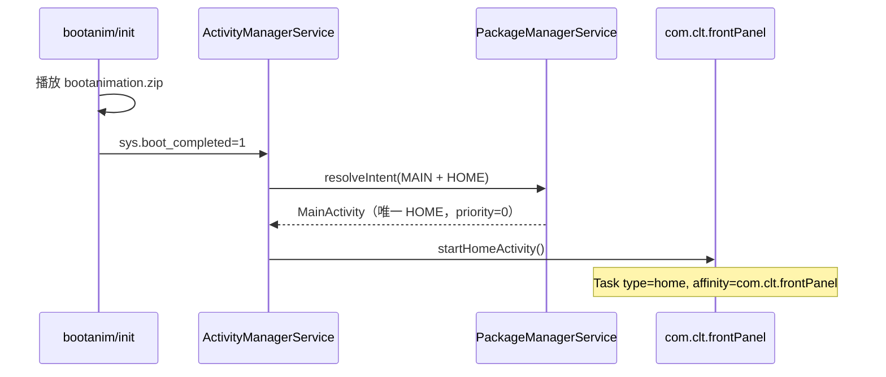

# Android Framework 定制探索 — 前面板 Kiosk 实现方案

> 基于设备 `192.168.1.10`（a4k_mid / Android 9 / RK）实机分析  
> 目标平台：香橙派 RK3588 + MIPI 屏，**core APK + panel APK** 架构

---

## 1. 结论先行

| 能力 | 现有项目怎么做的 | 主要靠什么 | 能否只靠 adb 动态配置 |
|------|------------------|------------|----------------------|
| 定制开机动画 | `/system/media/bootanimation.zip` | **ROM 固件** | 否（需 remount/重刷固件） |
| 开机默认进前面板 | `MainActivity` 声明 `HOME` Launcher | **Manifest + PMS + AMS** | 部分（`cmd package set-home-activity`） |
| 禁止返回退出 | `BaseActivity` 定时回主界面 + `BACK` Intent | **应用代码** | 否 |
| 禁止下拉状态栏 | ROM **未预装 SystemUI** | **ROM 裁剪** | 部分（`policy_control`，但无 SystemUI 时无效） |

**不是**通过运行时反复 `adb shell am/wm/pm` 设置的；核心是：

1. **ROM 级**：bootanimation、裁剪 SystemUI/Launcher3  
2. **Manifest 级**：`HOME` + `android.uid.system`  
3. **应用级**：`BaseActivity` 屏保/回主页定时器、触摸重置  

---

## 2. 现有设备架构（192.168.1.10）

### 2.1 系统应用清单

```
/system/priv-app/
├── X100Touch/          → com.clt.frontPanel（前面板，兼 Launcher）
├── iJetty/             → org.mortbay.ijetty（Web 服务，core 角色）
├── cross/              → com.clt.cross
├── Settings/           → com.android.settings（无桌面入口）
└── （无 SystemUI、无 Launcher3）
```

### 2.2 双 APK 职责对照（对标你的 core + panel）

| 角色 | 现有包 | 特征 |
|------|--------|------|
| **panel** | `com.clt.frontPanel` | `HOME` Launcher、`MainActivity`、UI、屏保 |
| **core** | `org.mortbay.ijetty` | 仅 `Service` + `BootCompleteReceiver`，Activity 注释掉 |

参考 iJetty Manifest（core 不做 Launcher）：

```xml
<!-- Activity 的 LAUNCHER 被注释，仅保留 Service -->
<service android:name=".IJettyService" android:exported="true"/>
<receiver android:name="com.color.c1s.web.app.BootCompleteReceiver">
    <intent-filter>
        <action android:name="android.intent.action.BOOT_COMPLETED" />
    </intent-filter>
</receiver>
```

---

## 3. 开机动画（Boot Animation）

### 3.1 现有实现

| 项目 | 值 |
|------|-----|
| 文件 | `/system/media/bootanimation.zip`（约 13.4MB） |
| 分辨率 | `1024 x 600`（与前面板屏一致） |
| 帧率 | 60 fps，600 张 PNG |
| desc.txt | `1024 600 60` + `c 0 0 part0` |
| 启动 | `bootanim.rc` → `/system/bin/bootanimation` |

与 X100Touch **无关**，属于固件镜像资源。

### 3.2 RK3588 / MIPI 屏实施

1. 用 MIPI 屏真实分辨率制作 `bootanimation.zip`（如 `800 1280 30`）  
2. 在 ROM 编译树放入 `device/xxx/media/bootanimation.zip` 或 `PRODUCT_COPY_FILES`  
3. 验证：`adb shell getprop service.bootanim.exit`（1 表示播完）

```bash
# 查看当前动画配置
adb shell ls -la /system/media/bootanimation.zip
adb pull /system/media/bootanimation.zip
# 解压查看 desc.txt 和 part0/*.png
```

---

## 4. 开机默认启动 Panel（Launcher 机制）

### 4.1 Manifest 配置（反编译确认）

`com.clt.frontPanel` / `MainActivity`：

```xml
<manifest android:sharedUserId="android.uid.system" package="com.clt.frontPanel">

<activity android:name="com.color.frontPanel.activity.MainActivity"
          android:launchMode="singleTop"
          android:screenOrientation="unspecified">
    <intent-filter>
        <action android:name="android.intent.action.MAIN" />
        <category android:name="android.intent.category.HOME" />
        <category android:name="android.intent.category.LAUNCHER" />
        <category android:name="android.intent.category.DEFAULT" />
    </intent-filter>
    <!-- 自定义返回处理 -->
    <intent-filter>
        <action android:name="android.intent.action.BACK" />
        <category android:name="android.intent.category.DEFAULT" />
        <category android:name="android.intent.category.BACK" />
    </intent-filter>
</activity>
```

### 4.2 系统启动链路（AMS + PMS）



实机验证：

```bash
# 当前默认 Launcher
adb shell cmd package resolve-activity --brief \
  -a android.intent.action.MAIN -c android.intent.category.HOME
# → com.clt.frontPanel/com.color.frontPanel.activity.MainActivity

# 手动设为默认 HOME（需系统权限，Android 9+ 支持）
adb shell cmd package set-home-activity \
  com.clt.frontPanel/com.color.frontPanel.activity.MainActivity
```

### 4.3 广播接收器（反编译逻辑）

#### BootCompleteReceiver — **空实现**

```java
// 反编译：onReceive() 直接 return，不做任何事
public void onReceive(Context context, Intent intent) {
    return;
}
```

开机进 Panel **不依赖**此 Receiver，而是 AMS 自动启动 HOME。

#### X100StartReceiver — 唤醒 Panel

```java
// 反编译逻辑还原
public void onReceive(Context context, Intent intent) {
    if ("android.intent.action.START_APP".equals(intent.getAction())) {
        Intent i = new Intent(context, MainActivity.class);
        i.addFlags(Intent.FLAG_ACTIVITY_NEW_TASK);  // 0x10000000
        context.startActivity(i);
        // 200ms 后初始化网络广播
        new Handler().postDelayed(() ->
            BroadcastHandlerManager.getInstance().initRegister(context), 200);
    }
}
```

用途：被外部（框架/其他系统组件）广播唤醒前面板。实机测试：

```bash
adb shell am broadcast -a android.intent.action.START_APP
# ScreenProtectActivity → MainActivity
```

#### App.onCreate — 后台服务初始化

```java
// com.color.frontPanel.App.onCreate() 反编译摘要
initLog();
init();
initLifeCycle();
BroadcastHandlerManager.getInstance().initRegister(this);
startService(new Intent(this, MainServer.class));
startService(new Intent(this, LogcatService.class));
CommunicationManager.getInstance().init();
```

### 4.4 你的 RK3588 panel APK 建议

```xml
<!-- panel/AndroidManifest.xml -->
<manifest android:sharedUserId="android.uid.system"
          package="com.your.panel">

<application android:name=".PanelApp" ...>
    <activity android:name=".PanelMainActivity"
              android:launchMode="singleTop"
              android:screenOrientation="landscape">
        <intent-filter>
            <action android:name="android.intent.action.MAIN"/>
            <category android:name="android.intent.category.HOME"/>
            <category android:name="android.intent.category.DEFAULT"/>
        </intent-filter>
    </activity>

    <!-- 可选：被 core 唤醒 -->
    <receiver android:name=".PanelStartReceiver" android:exported="true">
        <intent-filter>
            <action android:name="android.intent.action.START_APP"/>
        </intent-filter>
    </receiver>
</application>
</manifest>
```

预装路径：`/system/priv-app/YourPanel/YourPanel.apk`

---

## 5. 禁止返回 / 禁止下拉

### 5.1 禁止下拉 — ROM 裁剪（主因）

实机 **没有** `com.android.systemui`，窗口列表仅 2 个：

```
Window #0 ScreenProtectActivity
Window #1 MainActivity
```

无 StatusBar / NavigationBar 窗口 → 物理上无法下拉。

RK3588 建议（二选一）：

| 方案 | 做法 | 适用 |
|------|------|------|
| **A. ROM 裁剪**（推荐，与现网一致） | 编译时去掉 `SystemUI`、`Launcher3` | 专用设备 |
| **B. 保留 SystemUI** | 应用内 `immersive sticky` + `StatusBarManager.disable()` | 需要通知栏的调试版 |

方案 B 需 `android.uid.system`：

```java
// 需系统签名
StatusBarManager sbm = getSystemService(StatusBarManager.class);
sbm.disable(StatusBarManager.DISABLE_EXPAND | StatusBarManager.DISABLE_NOTIFICATION_ICONS);
```

或 adb（重启失效，且需 SystemUI 存在）：

```bash
adb shell settings put global policy_control immersive.full=*
```

### 5.2 禁止返回 — BaseActivity 应用逻辑（反编译）

核心类：`com.color.frontPanel.BaseActivity`（所有页面基类）

#### 机制 1：空闲超时回主界面

```java
// 字段
Runnable backToHomeRunnable;   // 超时后执行
long mBackToHomeTime;          // 从 MMKV "backToHomeTime" 读取，默认 300000ms

void backToHomeTimer() {
    mHandler.removeCallbacks(backToHomeRunnable);
    if (mBackToHomeTime != -1) {
        mHandler.postDelayed(backToHomeRunnable, mBackToHomeTime);
    }
}

// backToHomeRunnable 逻辑：
// if (updateStatus == 1) → 重置定时器
// else → jumpToMainActivity()
```

配置项（设置页可改）：

```
BACK_TO_HOME_30S / 1M / 2M / 3M / 4M / 5M / NEVER
MMKV key: "backToHomeTime"
```

#### 机制 2：jumpToMainActivity — 自定义 BACK Intent

```java
void jumpToMainActivity() {
    Activity current = ActivityManager.getInstance().getCurrentActivity();
    if (current instanceof MainActivity) return;
    if (current instanceof ScreenProtectActivity) return;

    Intent intent = new Intent();
    intent.setAction("android.intent.action.BACK");
    intent.addCategory("android.intent.category.BACK");
    startActivity(intent);
    finish();
}
```

#### 机制 3：屏保 ScreenProtectActivity

```java
// screenProtectRunnable：空闲 mScreenProtectTime 后
Intent intent = new Intent(context, ScreenProtectActivity.class);
startActivity(intent);

// ScreenProtectActivity：轮播图片 ViewPager，每 5s 翻页
// 触摸 dispatchTouchEvent → 重置屏保定时器
```

#### 机制 4：触摸重置定时器

```java
@Override
public boolean dispatchTouchEvent(MotionEvent ev) {
    mHandler.removeCallbacks(backToHomeRunnable);
    mHandler.removeCallbacks(screenProtectRunnable);
    showScreenProtectTimer();
    return super.dispatchTouchEvent(ev);
}
```

#### 机制 5：MainActivity 锁屏模式

```java
boolean mIsBackOrRestoreFactoryLock;  // 锁定后禁用返回相关操作
boolean mClickable;                   // 控制触摸交互
```

### 5.3 系统设置辅助

| 设置 | 值 | 作用 |
|------|-----|------|
| `lockscreen.disabled` | `1` | 禁用锁屏 |
| `device_provisioned` | `1` | 跳过设置向导 |
| `screen_off_timeout` | `2147483647` | 永不熄屏 |
| `user_setup_complete` | `1` | 用户设置完成 |

```bash
adb shell settings put secure lockscreen.disabled 1
adb shell settings put global device_provisioned 1
adb shell settings put system screen_off_timeout 2147483647
```

---

## 6. adb am / wm / pm 能力实测

### 6.1 Package Manager（pm / cmd package）

| 命令 | 作用 | 本场景 |
|------|------|--------|
| `cmd package resolve-activity -a MAIN -c HOME` | 查默认 Launcher | 验证 panel 是否为 HOME |
| `cmd package set-home-activity <component>` | 设置默认桌面 | 可动态切换，需权限 |
| `pm install -r -d <apk>` | 安装/覆盖系统应用 | OTA 升级用 |
| `pm list packages -d` | 列出禁用包 | 确认 Launcher3 已禁用 |

**实测**：`set-home-activity com.clt.frontPanel/...MainActivity` → `Success`

### 6.2 Activity Manager（am）

| 命令 | 作用 | 本场景 |
|------|------|--------|
| `am start -a MAIN -c HOME` | 手动启动桌面 | 调试 |
| `am broadcast -a START_APP` | 唤醒 Panel | 等同 X100StartReceiver |
| `am start -n panel/.PanelMainActivity` | 直接启动 | 调试 |

**不会**用于持久化 Kiosk 配置。

### 6.3 Window Manager（wm / cmd window）

| 命令 | 作用 | 本场景 |
|------|------|--------|
| `wm size` | 查看/改分辨率 | MIPI 屏调试 |
| `wm density` | 查看/改 DPI | UI 适配 |
| `cmd window dismiss-keyguard` | 解除锁屏 | 辅助 |

**无**持久禁用状态栏的 wm 子命令。

### 6.4 StatusBar（cmd statusbar）

```bash
cmd statusbar collapse          # 收起面板
cmd statusbar expand-notifications  # 展开（需 SystemUI）
```

本设备无 SystemUI，这些命令无实际效果。

### 6.5 Settings

```bash
settings put global policy_control immersive.full=*   # 全局沉浸（需 SystemUI）
settings put secure lockscreen.disabled 1
```

---

## 7. OTA 更新包分析

### 7.1 包结构

```
/data/local/android/frontPanelBoard/
├── update.tar.gz                    # 22.8MB 分发包
│   ├── apk/frontPanel_universe_U9.apk # 31.3MB
│   └── update.sh                    # 校验脚本
└── update/
    ├── tmp/frontPanel_universe_U9.apk # 解压后的 APK
    └── apk/                         # 待安装目录（空）
```

### 7.2 版本关系

| 来源 | versionCode | 路径 |
|------|-------------|------|
| 系统预装 | 128 | `/system/priv-app/X100Touch/` |
| OTA 包 | 136 | `/data/local/android/.../tmp/` |
| 当前运行 | 136 | `/data/app/com.clt.frontPanel-xxx/` |

Android 规则：**`/data/app` 中更高 versionCode 的更新包覆盖 system 预装**。

### 7.3 update.sh 逻辑

```bash
# 仅做校验，不做实际安装
updateDir="/data/local/android/frontPanelBoard/update/apk"
# 检查目录存在、文件名匹配 frontPanel*.apk
# mount remount 被注释掉
exit 0
```

实际安装靠 **`pm install -r -d`**（实测 Success）：

```bash
adb shell pm install -r -d /data/local/android/frontPanelBoard/update/tmp/frontPanel_universe_U9.apk
```

### 7.4 OTA 实现的功能

- **仅升级 panel APK**，不改 bootanimation、不改 ROM 配置  
- 升级后 Manifest 中 `HOME` 声明保持不变 → 仍默认 Launcher  
- 包名不变 `com.clt.frontPanel` → 直接覆盖，无需重设 HOME  

### 7.5 你的 RK3588 OTA 建议

```
升级包结构：
panel_update.tar.gz
├── panel.apk
└── update.sh          # 校验 + pm install -r -d

# core 与 panel 分离升级
core_update.tar.gz
└── core.apk
```

```bash
# update.sh 参考实现
pm install -r -d /data/local/your_panel/update/panel.apk
# 或系统分区升级（需 remount）
# mount -o rw,remount /system
# cp panel.apk /system/priv-app/YourPanel/
```

---

## 8. RK3588 推荐实施方案

### 8.1 总体架构

```
┌─────────────────────────────────────────────────────┐
│                    ROM (RK3588)                      │
│  bootanimation.zip (MIPI 分辨率)                     │
│  无 SystemUI / 无 Launcher3                          │
├─────────────────────────────────────────────────────┤
│  /system/priv-app/                                   │
│  ├── YourCore/YourCore.apk   (uid.system, Service)    │
│  └── YourPanel/YourPanel.apk (uid.system, HOME)       │
└─────────────────────────────────────────────────────┘
         │                              │
         ▼                              ▼
    core: 网络/业务               panel: UI/Launcher
    BOOT_COMPLETED               HOME + 屏保 + 禁返回
    可发 START_APP ──────────────────► 唤醒 panel
```

### 8.2 分步实施清单

#### 第一步：ROM 定制（一次性）

- [ ] 制作 MIPI 分辨率 `bootanimation.zip`  
- [ ] 从 ROM 移除 `SystemUI`、`Launcher3`（或设 `disabled`）  
- [ ] 预置 `YourCore`、`YourPanel` 到 `priv-app`  
- [ ] 平台签名 + `android.uid.system`  
- [ ] 默认 `device_provisioned=1`、`lockscreen.disabled=1`

#### 第二步：panel APK

- [ ] `MainActivity` 声明 `HOME` + `LAUNCHER`  
- [ ] 继承 `BaseActivity` 模式：  
  - `backToHomeTimer()` 空闲回主页  
  - `screenProtectRunnable` 屏保  
  - `dispatchTouchEvent` 触摸重置  
  - `jumpToMainActivity()` 用 `BACK` Intent  
- [ ] `XxxStartReceiver` 监听 `START_APP`  
- [ ] `launchMode="singleTop"`

#### 第三步：core APK

- [ ] 参考 iJetty：仅 `Service` + `BootCompleteReceiver`  
- [ ] **不要**声明 `HOME`（避免冲突）  
- [ ] 初始化完成后：`am broadcast -a android.intent.action.START_APP`  
- [ ] 或 `startForegroundService` 与 panel 通信（AIDL / Socket）

#### 第四步：验证

```bash
# 1. 开机动画
adb shell ls -la /system/media/bootanimation.zip

# 2. 默认 Launcher
adb shell cmd package resolve-activity --brief \
  -a android.intent.action.MAIN -c android.intent.category.HOME

# 3. 无 SystemUI
adb shell pm list packages | grep systemui   # 应无输出

# 4. 当前窗口仅 panel
adb shell dumpsys window windows | grep "Window #"

# 5. 唤醒 panel
adb shell am broadcast -a android.intent.action.START_APP

# 6. Activity 栈
adb shell dumpsys activity activities | head -40
```

### 8.3 三种实现路径对比

| 路径 | 开机动画 | 默认 Panel | 禁返回 | 禁下拉 | 难度 |
|------|----------|------------|--------|--------|------|
| **A. 全 ROM 定制**（现网方案） | bootanimation.zip | HOME Manifest | BaseActivity | 无 SystemUI | 中 |
| **B. ROM 轻量 + 系统签名 APK** | AOSP 默认或自定义 | HOME Manifest | BaseActivity | immersive + disable | 低 |
| **C. 纯 adb 配置** | 不可持久 | set-home-activity | 不可 | policy_control | 不推荐 |

**推荐**：RK3588 量产出货用 **路径 A**，开发调试可用 **路径 B**。

---

## 9. 反编译关键类索引

| 类 | 位置（dex） | 职责 |
|----|-------------|------|
| `App` | classes19.dex | 启动 MainServer、CommunicationManager |
| `BaseActivity` | classes19.dex | 回主页定时器、屏保、触摸重置、BACK Intent |
| `MainActivity` | classes20.dex | HOME 主界面、锁屏模式 |
| `ScreenProtectActivity` | classes20.dex | 屏保轮播 |
| `BootCompleteReceiver` | classes22.dex | **空实现** |
| `X100StartReceiver` | classes22.dex | 响应 START_APP 唤醒 |

---

## 10. 常见问题

**Q: 必须用 `android.uid.system` 吗？**  
A: 不是必须，但现网用了。系统 UID 可获得 `WRITE_SECURE_SETTINGS`、`STATUS_BAR` 等权限，便于调亮度、禁状态栏。平台签名 + `priv-app` 即可。

**Q: 只有 panel 声明 HOME，core 开机怎么联动？**  
A: AMS 自动启动 HOME（panel）；core 的 `BootCompleteReceiver` 启动 Service 后，可广播 `START_APP` 确保 panel 在前台。

**Q: MIPI 屏分辨率与 bootanimation 不一致？**  
A: `desc.txt` 必须与动画帧分辨率一致；显示缩放由 SurfaceFlinger 处理，但最好做成目标分辨率。

**Q: 能否不裁剪 SystemUI？**  
A: 可以，但需应用层 `immersive` + `StatusBarManager.disable()`，且用户可能通过手势调出。专用设备建议裁剪。

---

## 附录：实机采集数据（2026-06-08）

```
设备：a4k_mid, Android 9, 1024x600, density 160
默认 HOME：com.clt.frontPanel/com.color.frontPanel.activity.MainActivity
SystemUI：未安装
当前窗口：仅 frontPanel（MainActivity + ScreenProtectActivity）
bootanimation：/system/media/bootanimation.zip (13.4MB, 600 frames)
OTA：frontPanel_universe_U9.apk v136，pm install 覆盖 v128 系统版
```
